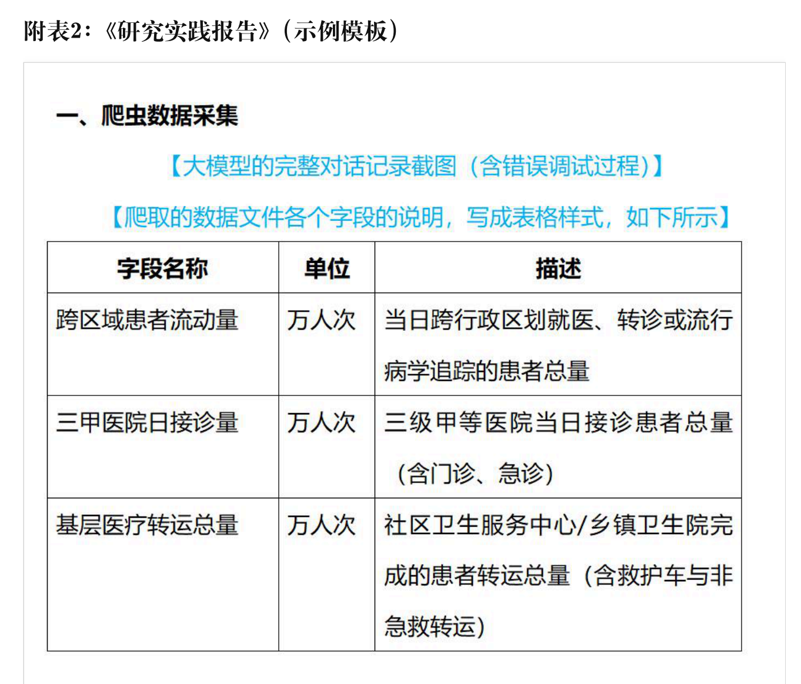

# 数据采集

- Course: 大数据
- Assignment: 数据采集
- Tool: Codex Desktop
- Source SHA256: `8107bafa1d9400d3f7adc6087deaf30fe73491280fc691d5e77f4770d3240e53`

## Summary

- events: 318
- user_prompts: 19
- assistant_replies: 119
- tool_calls: 176
- terminal_commands: 114
- file_reads: 42
- file_edits: 25
- validation_runs: 3
- failed_commands: 1
- images: 2

## Human Review

N/A

## Timeline

### #1 上下文/系统信息

Time: `2026-05-27T14:16:30.200Z`

<permissions instructions>
Filesystem sandboxing defines which files can be read or written. `sandbox_mode` is `workspace-write`: The sandbox permits reading files, and editing files in `cwd` and `writable_roots`. Editing files in other directories requires approval. Network access is enabled.
# Escalation Requests

Commands are run outside the sandbox if they are approved by the user, or match an existing rule that allows it to run unrestricted. The command string is split into independent command segments at shell control operators, including but not limited to:

- Pipes: |
- Logical operators: &&, ||
- Command separators: ;
- Subshell boundaries: (...), $(...)

Each resulting segment is evaluated independently for sandbox restrictions and approval requirements.

Example:

git pull | tee output.txt

This is treated as two command segments:

["git", "pull"]

["tee", "output.txt"]

Commands that use more advanced shell features like redirection (>, >>, <), substitutions ($(...), ...), environment variables (FOO=bar), or wildcard patterns (*, ?) will not be evaluated against rules, to limit the scope of what an approved rule allows.

## How to request escalation

IMPORTANT: To request approval to execute a command that will require escalated privileges:

- Provide the `sandbox_permissions` parameter with the value `"require_escalated"`
- Include a short question asking the user if they want to allow the action in `justification` parameter. e.g. "Do you want to download and install dependencies for this project?"
- Optionally suggest a `prefix_rule` - this will be shown to the user with an option to persist the rule approval for future sessions.

If you run a command that is important to solving the user's query, but it fails because of sandboxing or with a likely sandbox-related network error (for example DNS/host resolution, registry/index access, or dependency download failure), rerun the command with "require_escalated". ALWAYS proceed to use the `justification` parameter - do not message the user before requesting approval for the command.

## When to request escalation

While commands are running inside the sandbox, here are some scenarios that will require escalation outside the sandbox:

- You need to run a command that writes to a directory that requires it (e.g. running tests that write to /var)
- You need to run a GUI app (e.g., open/xdg-open/osascript) to open browsers or files.
- If you run a command that is important to solving the user's query, but it fails because of sandboxing or with a likely sandbox-related network error (for example DNS/host resolution, registry/index access, or dependency download failure), rerun the command with `require_escalated`. ALWAYS proceed to use the `sandbox_permissions` and `justification` parameters. do not message the user before requesting approval for the command.
- You are about to take a potentially destructive action such as an `rm` or `git reset` that the user did not explicitly ask for.
- Be judicious with escalating, but if completing the user's request requires it, you should do so - don't try and circumvent approvals by using other tools.

## prefix_rule guidance

When choosing a `prefix_rule`, request one that will allow you to fulfill similar requests from the user in the future without re-requesting escalation. It should be categorical and reasonably scoped to similar capabilities. You should rarely pass the entire command into `prefix_rule`.

### Banned prefix_rules 
Avoid requesting overly broad prefixes that the user would be ill-advised to approve. For example, do not request ["python3"], ["python", "-"], or other similar prefixes that would allow arbitrary scripting.
NEVER provide a prefix_rule argument for destructive commands like rm.
NEVER provide a prefix_rule if your command uses a heredoc or herestring. 

### Examples
Good examples of prefixes:
- ["npm", "run", "dev"]
- ["gh", "pr", "check"]
- ["cargo", "test"]


## Approved command prefixes
The following prefix rules have already been approved: - ["git", "add"]

`approvals_reviewer` is `auto_review`: Sandbox escalations with require_escalated will be reviewed for compliance with the policy. If a rejection happens, you should proceed only with a materially safer alternative, or inform the user of the risk and send a final message to ask for approval.
 The writable roots are `[HOME]/code/大数据期末实验/大模型助力大数据分析`, `/private/tmp`, `/private/var/folders/cx/qtd2qkw57mxdtrw7j1lsj_q00000gn/T`.
</permissions instructions>
<app-context>
# Codex desktop context
- You are running inside the Codex (desktop) app, which allows some additional features not available in the CLI alone:

### Images/Visuals/Files
- In the app, the model can display images and videos using standard Markdown image syntax: 
- When sending or referencing a local image or video, always use an absolute filesystem path in the Markdown image tag (e.g., ); relative paths and plain text will not render the media.
- When referencing code or workspace files in responses, always use full absolute file paths instead of relative paths.
- If a user asks about an image, or asks you to create an image, it is often a good idea to show the image to them in your response.
- Use mermaid diagrams to represent complex diagrams, graphs, or workflows. Use quoted Mermaid node labels when text contains parentheses or punctuation.
- Return web URLs as Markdown links (e.g., [label](https://example.com)).

### Workspace Dependencies
- For sheets, slides, and documents, call `load_workspace_dependencies` to find the bundled runtime and libraries.

### Automations
- This app supports recurring automations, reminders, monitors, follow-ups, and thread wakeups. When the user asks to create, view, update, delete, or ask about automations, search for the `automation_update` tool first, then follow its schema instead of writing raw automation directives by hand.

### Inline Code Comments
- Use the ::code-comment{...} directive when you need to attach feedback directly to specific code lines.
- Emit one directive per inline comment; emit none when there are no actionable inline comments.
- Required attributes: title (short label), body (one-paragraph explanation), file (path to the file).
- Optional attributes: start, end (1-based line numbers), priority (0-3).
- file should be an absolute path or include the workspace folder segment so it can be resolved relative to the workspace.
- Keep line ranges tight; end defaults to start.
- Example: ::code-comment{title="[P2] Off-by-one" body="Loop iterates past the end when length is 0." file="/path/to/foo.ts" start=10 end=11 priority=2}

### Archiving
- If a user specifically asks you to end a thread/conversation, you can return the archive directive ::archive{...} to archive the thread/conversation.
- Example: ::archive{reason="User requested to end conversation"}

### Git
- Branch prefix: `codex/`. Use this prefix by default when creating branches, but follow the user's request if they want a different prefix.
- After successfully staging files, emit `::git-stage{cwd="/absolute/path"}` on its own line in your final response.
- After successfully creating a commit, emit `::git-commit{cwd="/absolute/path"}` on its own line in your final response.
- After successfully creating or switching the thread onto a branch, emit `::git-create-branch{cwd="/absolute/path" branch="branch-name"}` on its own line in your final response.
- After successfully pushing the current branch, emit `::git-push{cwd="/absolute/path" branch="branch-name"}` on its own line in your final response.
- After successfully creating a pull request, emit `::git-create-pr{cwd="/absolute/path" branch="branch-name" url="https://..." isDraft=true}` on its own line in your final response. Include `isDraft=false` for ready PRs.
- Only emit these git directives in your final response after the action actually succeeds, never in commentary updates. Keep attributes single-line.
</app-context>
<collaboration_mode># Collaboration Mode: Default

You are now in Default mode. Any previous instructions for other modes (e.g. Plan mode) are no longer active.

Your active mode changes only when new developer instructions with a different `<collaboration_mode>...</collaboration_mode>` change it; user requests or tool descriptions do not change mode by themselves. Known mode names are Default and Plan.

## request_user_input availability

Use the `request_user_input` tool only when it is listed in the available tools for this turn.

In Default mode, strongly prefer making reasonable assumptions and executing the user's request rather than stopping to ask questions. If you absolutely must ask a question because the answer cannot be discovered from local context and a reasonable assumption would be risky, ask the user directly with a concise plain-text question. Never write a multiple choice question as a textual assistant message.
</collaboration_mode>
<skills_instructions>
## Skills
A skill is a set of local instructions to follow that is stored in a `SKILL.md` file. Below is the list of skills that can be used. Each entry includes a name, description, and file path so you can open the source for full instructions when using a specific skill.
### Available skills
- imagegen: Generate or edit raster images when the task benefits from AI-created bitmap visuals such as photos, illustrations, textures, sprites, mockups, or transparent-background cutouts. Use when Codex should create a brand-new image, transform an existing image, or derive visual variants from references, and the output should be a bitmap asset rather than repo-native code or vector. Do not use when the task is better handled by editing existing SVG/vector/code-native assets, extending an established icon or logo system, or building the visual directly in HTML/CSS/canvas. (file: [HOME]/.codex/skills/.system/imagegen/SKILL.md)
- openai-docs: Use when the user asks how to build with OpenAI products or APIs and needs up-to-date official documentation with citations, help choosing the latest model for a use case, or model upgrade and prompt-upgrade guidance; prioritize OpenAI docs MCP tools, use bundled references only as helper context, and restrict any fallback browsing to official OpenAI domains. (file: [HOME]/.codex/skills/.system/openai-docs/SKILL.md)
- plugin-creator: Create and scaffold plugin directories for Codex with a required `.codex-plugin/plugin.json`, optional plugin folders/files, valid manifest defaults, and personal-marketplace entries by default. Use when Codex needs to create a new personal plugin, add optional plugin structure, generate or update marketplace entries for plugin ordering and availability metadata, or update an existing local plugin during development with the CLI-driven cachebuster and reinstall flow. (file: [HOME]/.codex/skills/.system/plugin-creator/SKILL.md)
- skill-creator: Guide for creating effective skills. This skill should be used when users want to create a new skill (or update an existing skill) that extends Codex's capabilities with specialized knowledge, workflows, or tool integrations. (file: [HOME]/.codex/skills/.system/skill-creator/SKILL.md)
- skill-installer: Install Codex skills into $CODEX_HOME/skills from a curated list or a GitHub repo path. Use when a user asks to list installable skills, install a curated skill, or install a skill from another repo (including private repos). (file: [HOME]/.codex/skills/.system/skill-installer/SKILL.md)
- browser:browser: Browser automation for the Codex in-app browser. Use to open, navigate, inspect, test, click, type, screenshot, or verify local targets such as localhost, 127.0.0.1, ::1, file://, the current in-app browser tab, and websites shown side by side inside Codex. (file: [HOME]/.codex/plugins/cache/openai-bundled/browser/26.519.81530/skills/browser/SKILL.md)
- canva:canva-branded-presentation: Create on-brand Canva presentations from a brief, outline, existing Canva doc, or design link. Use when the user wants a branded slide deck, wants to turn notes into a presentation, or needs a presentation generated in Canva with the right brand kit and a clear slide plan. (file: [HOME]/.codex/plugins/cache/openai-curated/canva/603a6e80/skills/canva-branded-presentation/SKILL.md)
- canva:canva-resize-for-all-social-media: Resize a Canva design into standard social media formats and prepare export-ready results. Use when the user wants one Canva design adapted across multiple social platforms such as Facebook, Instagram, and LinkedIn, especially when they want all variants produced in one pass. (file: [HOME]/.codex/plugins/cache/openai-curated/canva/603a6e80/skills/canva-resize-for-all-social-media/SKILL.md)
- canva:canva-translate-design: Translate the text in a Canva design into another language while preserving the original layout as much as possible. Use when the user wants a localized or translated version of an existing Canva design and expects the original file to remain unchanged. (file: [HOME]/.codex/plugins/cache/openai-curated/canva/603a6e80/skills/canva-translate-design/SKILL.md)
- chatgpt-advisor: Use web ChatGPT at chatgpt.com as an external strategy advisor, reviewer, or decision partner while Codex performs tool-based work. Use when the user asks Codex to consult ChatGPT, have web ChatGPT direct or review Codex, use a "ChatGPT plus Codex" workflow, compare plans before implementation, get a second opinion on architecture/debugging/product decisions, preserve one ChatGPT conversation across a long project, avoid shared-browser tab conflicts, or send diffs/errors/results to ChatGPT for critique before continuing. (file: [HOME]/.codex/skills/chatgpt-advisor/SKILL.md)
- chrome:Chrome: Browser automation for the user's Chrome browser. Use for browser tasks that require the user's cookies, logged-in sessions, existing tabs, extensions, or remote authenticated sites. (file: [HOME]/.codex/plugins/cache/openai-bundled/chrome/26.519.81530/skills/chrome/SKILL.md)
- codex-local-doctor: Use when diagnosing this local Codex workspace for provider mode changes, missing or split conversation history, OAuth versus third-party endpoint history, openai_http or custom mode, reconnect loops, context compression handoff interruptions, or imagegen routing under a non-default OpenAI-compatible base URL. (file: [HOME]/.codex/skills/codex-local-doctor/SKILL.md)
- computer-use:computer-use: Control local Mac apps through Computer Use. Use for tasks that require reading or operating app UI by clicking, typing, scrolling, dragging, pressing keys, or setting values. (file: [HOME]/.codex/plugins/cache/openai-bundled/computer-use/1.0.799/skills/computer-use/SKILL.md)
- course-project-handoff-review: Use when the user asks Codex to review, pull, merge, validate, or plan fixes for a teammate handoff in a course team project, especially Chinese university projects with members A/B/C, docs, test records, branches such as develop/check/dev, and acceptance or demo requirements. (file: [HOME]/.codex/skills/course-project-handoff-review/SKILL.md)
- design-driven-implementation: Structured coding workflow for tasks that should follow a design-first execution loop: assess complexity, write a design document, embed a live TODO list in that document, implement one issue at a time while updating progress, then run a review pass and make a focused commit. Use when the user asks for a spec-first or design-doc-first workflow, wants TODO tracking inside the design doc, asks for issue-by-issue implementation, or wants work carried through review and commit. (file: [HOME]/.codex/skills/design-driven-implementation/SKILL.md)
- design-taste-frontend: Anti-slop frontend skill for landing pages, portfolios, and redesigns. The agent reads the brief, infers the right design direction, and ships interfaces that do not look templated. Real design systems when applicable, audit-first on redesigns, strict pre-flight check. (file: [HOME]/.codex/skills/taste-skill/SKILL.md)
- documents:documents: Create, edit, redline, and comment on `.docx`, Word, and Google Docs-targeted document artifacts inside the container, with a strict render-and-verify workflow. Use `render_docx.py` to generate page PNGs (and optional PDF) for visual QA, then iterate until layout is flawless before delivering the final document. (file: [HOME]/.codex/plugins/cache/openai-primary-runtime/documents/26.521.10419/skills/documents/SKILL.md)
- figma:figma-code-connect: Creates and maintains Figma Code Connect template files that map Figma components to code snippets. Use when the user mentions Code Connect, Figma component mapping, design-to-code translation, or asks to create/update .figma.ts or .figma.js files. (file: [HOME]/.codex/plugins/cache/openai-curated/figma/603a6e80/skills/figma-code-connect/SKILL.md)
- figma:figma-create-new-file: **MANDATORY prerequisite** — you MUST invoke this skill BEFORE every `create_new_file` tool call. NEVER call `create_new_file` directly without loading this skill first. Trigger whenever the user wants a new blank Figma file — a new design, FigJam, or Slides file — or when you need a fresh file before calling `use_figma`. Usage — /figma-create-new-file [editorType] [fileName] (e.g. /figma-create-new-file figjam My Whiteboard, /figma-create-new-file slides Q3 Review) (file: [HOME]/.codex/plugins/cache/openai-curated/figma/603a6e80/skills/figma-create-new-file/SKILL.md)
- figma:figma-generate-design: Use this skill alongside figma-use when the task involves translating an application page, view, or multi-section layout into Figma. Triggers: 'write to Figma', 'create in Figma from code', 'push page to Figma', 'take this app/page and build it in Figma', 'create a screen', 'build a landing page in Figma', 'update the Figma screen to match code', 'convert this modal/dialog/drawer/panel to Figma'. This is the preferred workflow skill whenever the user wants to build or update a full page, modal, dialog, drawer, sidebar, panel, or any composed multi-section view in Figma from code or a description. Discovers design system components, variables, and styles from Code Connect files, existing screens, and library search, then imports them and assembles views incrementally section-by-section using design system tokens instead of hardcoded values. (file: [HOME]/.codex/plugins/cache/openai-curated/figma/603a6e80/skills/figma-generate-design/SKILL.md)
- figma:figma-generate-diagram: MANDATORY prerequisite — load this skill BEFORE every `generate_diagram` tool call. NEVER call `generate_diagram` directly without loading this skill first. Trigger whenever the user asks to create, generate, draw, render, sketch, or build a diagram — flowchart, architecture diagram, sequence diagram, ERD or entity-relationship diagram, state diagram or state machine, gantt chart, or timeline. Also trigger when the user mentions Mermaid syntax or wants a system architecture, decision tree, dependency graph, API call flow, auth handshake, schema, or pipeline visualized in FigJam. Routes to type-specific guidance, sets universal Mermaid constraints, and tells you when to use a different diagram type or skip the tool entirely (mindmaps, pie charts, class diagrams, etc.). (file: [HOME]/.codex/plugins/cache/openai-curated/figma/603a6e80/skills/figma-generate-diagram/SKILL.md)
- figma:figma-generate-library: Build or update a professional-grade design system in Figma from a codebase. Use when the user wants to create variables/tokens, build component libraries, create individual components with proper variant sets and variable bindings, set up theming (light/dark modes), document foundations, or reconcile gaps between code and Figma. Also use when the user asks to create or generate any component in Figma — even a single one — since components require proper variable foundations, variant states, and design token bindings to be production-quality. This skill teaches WHAT to build and in WHAT ORDER — it complements the `figma-use` skill which teaches HOW to call the Plugin API. Both skills should be loaded together. (file: [HOME]/.codex/plugins/cache/openai-curated/figma/603a6e80/skills/figma-generate-library/SKILL.md)
- figma:figma-use: **MANDATORY prerequisite** — you MUST invoke this skill BEFORE every `use_figma` tool call. NEVER call `use_figma` directly without loading this skill first. Skipping it causes common, hard-to-debug failures. Trigger whenever the user wants to perform a write action or a unique read action that requires JavaScript execution in the Figma file context — e.g. create/edit/delete nodes, set up variables or tokens, build components and variants, modify auto-layout or fills, bind variables to properties, or inspect file structure programmatically. (file: [HOME]/.codex/plugins/cache/openai-curated/figma/603a6e80/skills/figma-use/SKILL.md)
- figma:figma-use-figjam: This skill helps agents use Figma's use_figma MCP tool in the FigJam context. Can be used alongside figma-use which has foundational context for using the use_figma tool. (file: [HOME]/.codex/plugins/cache/openai-curated/figma/603a6e80/skills/figma-use-figjam/SKILL.md)
- figma:figma-use-slides: This skill helps agents use Figma's use_figma MCP tool in the Slides context. Can be used alongside figma-use which has foundational context for using the use_figma tool. (file: [HOME]/.codex/plugins/cache/openai-curated/figma/603a6e80/skills/figma-use-slides/SKILL.md)
- frontend-design: Create distinctive, production-grade frontend interfaces with high design quality. Use this skill when the user asks to build web components, pages, or applications. Generates creative, polished code that avoids generic AI aesthetics. (file: [HOME]/.codex/skills/frontend-design/SKILL.md)
- github:gh-address-comments: Address actionable GitHub pull request review feedback. Use when the user wants to inspect unresolved review threads, requested changes, or inline review comments on a PR, then implement selected fixes. Use the GitHub app for PR metadata and flat comment reads, and use the bundled GraphQL script via `gh` whenever thread-level state, resolution status, or inline review context matters. (file: [HOME]/.codex/plugins/cache/openai-curated/github/603a6e80/skills/gh-address-comments/SKILL.md)
- github:gh-fix-ci: Use when a user asks to debug or fix failing GitHub PR checks that run in GitHub Actions. Use the GitHub app from this plugin for PR metadata and patch context, and use `gh` for Actions check and log inspection before implementing any approved fix. (file: [HOME]/.codex/plugins/cache/openai-curated/github/603a6e80/skills/gh-fix-ci/SKILL.md)
- github:github: Triage and orient GitHub repository, pull request, and issue work through the connected GitHub app. Use when the user asks for general GitHub help, wants PR or issue summaries, or needs repository context before choosing a more specific GitHub workflow. (file: [HOME]/.codex/plugins/cache/openai-curated/github/603a6e80/skills/github/SKILL.md)
- github:yeet: Publish local changes to GitHub by confirming scope, committing intentionally, pushing the branch, and opening a draft PR through the GitHub app from this plugin, with `gh` used only as a fallback where connector coverage is insufficient. (file: [HOME]/.codex/plugins/cache/openai-curated/github/603a6e80/skills/yeet/SKILL.md)
- hatch-pet: Create, repair, validate, visually QA, and package Codex-compatible animated pets and pet spritesheets from character art, generated images, company or prospect brand cues, or visual references. Use when a user wants a lightweight-worker Codex pet workflow, a non-pixel custom pet style, a prospect or company mascot pet, or a full 8x9 animated pet atlas with transparent unused cells, QA contact sheets, and pet.json packaging. This skill composes the installed $imagegen system skill for visual generation and uses bundled scripts for deterministic spritesheet assembly. (file: [HOME]/.codex/skills/hatch-pet/SKILL.md)
- presentations:Presentations: Build PowerPoint PPTX decks with artifact-tool presentation JSX (file: [HOME]/.codex/plugins/cache/openai-primary-runtime/presentations/26.521.10419/skills/presentations/SKILL.md)
- spreadsheets:Spreadsheets: Use this skill when a user requests to create, modify, analyze, visualize, or work with spreadsheet files (`.xlsx`, `.xls`, `.csv`, `.tsv`) or Google Sheets-targeted spreadsheet artifacts with formulas, formatting, charts, tables, and recalculation. (file: [HOME]/.codex/plugins/cache/openai-primary-runtime/spreadsheets/26.521.10419/skills/spreadsheets/SKILL.md)
- ui-ux-pro-max: UI/UX design intelligence. 67 styles, 96 palettes, 57 font pairings, 25 charts, 13 stacks (React, Next.js, Vue, Svelte, SwiftUI, React Native, Flutter, Tailwind, shadcn/ui). Actions: plan, build, create, design, implement, review, fix, improve, optimize, enhance, refactor, check UI/UX code. Projects: website, landing page, dashboard, admin panel, e-commerce, SaaS, portfolio, blog, mobile app, .html, .tsx, .vue, .svelte. Elements: button, modal, navbar, sidebar, card, table, form, chart. Styles: glassmorphism, claymorphism, minimalism, brutalism, neumorphism, bento grid, dark mode, responsive, skeuomorphism, flat design. Topics: color palette, accessibility, animation, layout, typography, font pairing, spacing, hover, shadow, gradient. Integrations: shadcn/ui MCP for component search and examples. (file: [HOME]/.agents/skills/ui-ux-pro-max/SKILL.md)
- ui-ux-pro-max: UI/UX design intelligence. 67 styles, 96 palettes, 57 font pairings, 25 charts, 13 stacks (React, Next.js, Vue, Svelte, SwiftUI, React Native, Flutter, Tailwind, shadcn/ui). Actions: plan, build, create, design, implement, review, fix, improve, optimize, enhance, refactor, check UI/UX code. Projects: website, landing page, dashboard, admin panel, e-commerce, SaaS, portfolio, blog, mobile app, .html, .tsx, .vue, .svelte. Elements: button, modal, navbar, sidebar, card, table, form, chart. Styles: glassmorphism, claymorphism, minimalism, brutalism, neumorphism, bento grid, dark mode, responsive, skeuomorphism, flat design. Topics: color palette, accessibility, animation, layout, typography, font pairing, spacing, hover, shadow, gradient. Integrations: shadcn/ui MCP for component search and examples. (file: [HOME]/.codex/skills/ui-ux-pro-max/SKILL.md)
### How to use skills
- Discovery: The list above is the skills available in this session (name + description + file path). Skill bodies live on disk at the listed paths.
- Trigger rules: If the user names a skill (with `$SkillName` or plain text) OR the task clearly matches a skill's description shown above, you must use that skill for that turn. Multiple mentions mean use them all. Do not carry skills across turns unless re-mentioned.
- Missing/blocked: If a named skill isn't in the list or the path can't be read, say so briefly and continue with the best fallback.
- How to use a skill (progressive disclosure):
  1) After deciding to use a skill, open its `SKILL.md`. Read only enough to follow the workflow.
  2) When `SKILL.md` references relative paths (e.g., `scripts/foo.py`), resolve them relative to the skill directory listed above first, and only consider other paths if needed.
  3) If `SKILL.md` points to extra folders such as `references/`, load only the specific files needed for the request; don't bulk-load everything.
  4) If `scripts/` exist, prefer running or patching them instead of retyping large code blocks.
  5) If `assets/` or templates exist, reuse them instead of recreating from scratch.
- Coordination and sequencing:
  - If multiple skills apply, choose the minimal set that covers the request and state the order you'll use them.
  - Announce which skill(s) you're using and why (one short line). If you skip an obvious skill, say why.
- Context hygiene:
  - Keep context small: summarize long sections instead of pasting them; only load extra files when needed.
  - Avoid deep reference-chasing: prefer opening only files directly linked from `SKILL.md` unless you're blocked.
  - When variants exist (frameworks, providers, domains), pick only the relevant reference file(s) and note that choice.
- Safety and fallback: If a skill can't be applied cleanly (missing files, unclear instructions), state the issue, pick the next-best approach, and continue.
</skills_instructions>
<plugins_instructions>
## Plugins
A plugin is a local bundle of skills, MCP servers, and apps. Below is the list of plugins that are enabled and available in this session.
### Available plugins
- `Browser`: Browser / browser-use plugin Aliases: @browser, @browser-use, browser-use, Browser, in-app browser. Use Browser, the Codex in-app browser, when the user asks to open, inspect, navigate, test, click, type, or screenshot local web targets such as localhost, 127.0.0.1, ::1, file:// URLs, or the current in-app browser tab. After significant frontend changes to a local app, use Browser to open the relevant local target when it is known or obvious, unless the user asks for another browser tool. For requests like "open localhost:3000" or "open to localhost:4000", navigate the in-app browser to http://localhost:3000 or http://localhost:4000. Do not satisfy explicit @browser or @browser-use requests with macOS `open`, shell commands, or generic web browsing unless the user asks for another browser tool or approves a fallback.
- `Canva`: Search, create, edit designs
- `Chrome`: Chrome automation for remote URLs, authenticated/profile-dependent pages, existing Chrome tabs, cookies, extensions, and Codex Chrome Extension setup.
- `Computer Use`: Control desktop apps on macOS from Codex through Computer Use.
- `Documents`: Create and edit document artifacts in Codex, including Word files and Google Docs.
- `Figma`: Figma workflows for design implementation, Code Connect templates, and design system rule generation.
- `GitHub`: Inspect repositories, triage pull requests and issues, debug CI, and publish changes through a hybrid GitHub connector and CLI workflow.
- `Presentations`: Create, edit, render, verify, and export presentation slide decks. Use when Codex needs to build or modify a deck, slidedeck, presentation deck, slide deck, slides, PowerPoint, Google Slides, PPT, PPTX, .ppt, or .pptx file.
- `Spreadsheets`: Create, edit, analyze, visualize, render, and export spreadsheets or Google Sheets-ready workbooks in Codex.
### How to use plugins
- Discovery: The list above is the plugins available in this session.
- Skill naming: If a plugin contributes skills, those skill entries are prefixed with `plugin_name:` in the Skills list.
- Trigger rules: If the user explicitly names a plugin, prefer capabilities associated with that plugin for that turn.
- Relationship to capabilities: Plugins are not invoked directly. Use their underlying skills, MCP tools, and app tools to help solve the task.
- Preference: When a relevant plugin is available, prefer using capabilities associated with that plugin over standalone capabilities that provide similar functionality.
- Missing/blocked: If the user requests a plugin that is not listed above, or the plugin does not have relevant callable capabilities for the task, say so briefly and continue with the best fallback.
</plugins_instructions>

### #2 上下文/系统信息

Time: `2026-05-27T14:16:30.201Z`

# AGENTS.md instructions for [HOME]/code/大数据期末实验/大模型助力大数据分析

<INSTRUCTIONS>
# Global Agent Rules

You have personal skills stored in `~/.codex/skills/`.

Before starting a task, scan available skills.

If a skill matches, read its `SKILL.md` and follow it.

Announce which skill you are using.

When you need to confirm or are unsure about certain knowledge, you can search for relevant information online.
</INSTRUCTIONS>
<environment_context>
  <cwd>[HOME]/code/大数据期末实验/大模型助力大数据分析</cwd>
  <shell>zsh</shell>
  <current_date>2026-05-27</current_date>
  <timezone>Asia/Shanghai</timezone>
</environment_context>

### #3 用户 Prompt

Time: `2026-05-27T14:16:30.204Z`


# Files mentioned by the user:

## 期末实验要求.pdf: [HOME]/code/大数据期末实验/大模型助力大数据分析/docs/期末实验要求.pdf

## My request for Codex:
请根据实验要求，综合考量，给出几个选题推荐，最好要有应用价值。


### #4 AI 回复

Time: `2026-05-27T14:17:24.978Z`

我先把实验要求读出来，看看评分点、技术约束和交付物，再按“可落地、数据能拿到、工作量适中、展示效果好”来推荐选题。

### #5 终端命令 · 成功

Time: `2026-05-27T14:17:24.986Z`

```bash
pwd
```

pwd

<details>
<summary>Raw details</summary>

```text
Chunk ID: 0c3d44
Wall time: 0.0000 seconds
Process exited with code 0
Original token count: 19
Output:
[HOME]/code/大数据期末实验/大模型助力大数据分析

```

</details>

### #6 终端命令 · 成功

Time: `2026-05-27T14:17:25.034Z`

```bash
ls -la docs
```

ls -la docs

<details>
<summary>Raw details</summary>

```text
Chunk ID: 1b0bbb
Wall time: 0.0000 seconds
Process exited with code 0
Original token count: 65
Output:
total 4672
drwxr-xr-x  4 zhoujia  staff      128 May 27 22:13 .
drwxr-xr-x  7 zhoujia  staff      224 May 27 22:12 ..
-rw-r--r--@ 1 zhoujia  staff    14076 May 27 17:42 分工指南.md
-rw-------@ 1 zhoujia  staff  2371698 May 27 16:27 期末实验要求.pdf

```

</details>

### #7 终端命令 · 成功

Time: `2026-05-27T14:17:25.035Z`

```bash
which pdftotext
```

which pdftotext

<details>
<summary>Raw details</summary>

```text
Chunk ID: 9aa596
Wall time: 0.0000 seconds
Process exited with code 0
Original token count: 7
Output:
/opt/homebrew/bin/pdftotext

```

</details>

### #8 AI 回复

Time: `2026-05-27T14:17:55.321Z`

PDF 文件在本地，`pdftotext` 也可用。我会直接提取正文；如果排版里有表格或评分细则，我会优先抓这些决定选题边界的信息。

### #9 终端命令 · 成功

Time: `2026-05-27T14:17:59.723Z`

```bash
pdftotext -layout docs/期末实验要求.pdf -
```

pdftotext -layout docs/期末实验要求.pdf -

<details>
<summary>Raw details</summary>

```text
Chunk ID: 2c5dec
Wall time: 0.0000 seconds
Process exited with code 0
Original token count: 2491
Output:
                  《大数据技术基础》课程
         关于大模型助力大数据分析案例的实施细则
 说明
 一、AI 辅助开发工具范围补充
 可以使用 Cursor、Windsurf、OpenAI Codex、Claude Code、OpenClaw、CoPaw等 AI
 辅助编程工具。
 二、Agent 与 Skills 额外加分条件
 在原有 20 分评分额度之外，鼓励学生将大模型能力用于可复用、可验证的大数据分析工
 作流。若小组或个人在项目全过程中合理使用 AI Agent，并将可复用功能封装为 Skills，
 可获得额外加分，最高不超过 5 分。该加分不替代原有评分项，缺少研究实践报告、源代
 码、数据文件等核心材料时，不得仅凭 Agent 或 Skills 获得加分。
 加分细则如下：
  Agent 工作流使用（1 分）：在数据采集、清洗入库、可视化、统计分析或报告生成等
  环节中，实际使用 AI Agent 完成多步骤任务，并提交任务目标、关键提示词或对话摘
  要、工具调用记录、命令运行结果或截图，以及人工审核说明。
  Skills 封装质量（2 分）：将项目中可复用功能封装为至少 1 个 Skill，例如网页数据爬
  取 Skill、数据清洗入库 Skill、可视化生成 Skill、统计分析 Skill、报告生成 Skill 等。
  自动化复用效果（2 分）：Skill 能在项目中被实际调用并完成可验证流程，建议覆盖
  “爬取数据—清洗入库—可视化—分析报告”中的至少两个环节，并提供运行日志、结
  果截图、生成文件或复现实验说明。
 三、提交与合规要求补充
 若申请 Agent 与 Skills 额外加分，应在原有提交材料基础上补充 AI 工具使用说明、Skills
 目录或 SKILL.md 文件、运行日志、截图或输入输出样例。

  为鼓励选课学生积极参加大模型助力大数据分析案例分享，对完成研究实践及课堂分享的小
组及个人予以加分认定，特制定本实施细则。
一、分享形式
提交研究实践报告以及源代码，并完成15 分钟以内的课堂分享（以PPT形式）。研究实践报告需
严格按照附表2 的模板书写，在报告或PPT都需要配以适当截图辅助说明，做到图文并茂。

二、分享主题
本次案例分享聚焦于医疗与金融两大领域，同学们可以围绕这些领域自由发挥，探索具体的应用
场景。通过使用Cursor、WindSurf等智能编程工具，以及与大模型交互得到对数据的文字和可
视化分析，体验大模型助力大数据分析的过程。
三、分享内容及分值额度
... [truncated 75 lines] ...
  可行性分析：可行性分析深入，考虑了技术可行性、成本效益、市场需求、数据可用性等多
  方面因素，论证充分，有具体数据或案例支持。
  整体价值：对整个项目的潜在价值进行了全面分析，能够清晰展示从爬虫到可视化的全流程
  对目标领域的贡献和意义，具有较强的说服力。
3分：
  提出了2种应用方向，但可能在创新性或实用性上略有不足。
  可行性分析：可行性分析较为全面，但论证深度不够，缺乏与前期数据爬取和分析工作的联
  系，部分因素的考虑不够充分。
  整体价值：对项目的潜在价值进行了分析，但分析不够深入，未能充分展示全流程对目标领
  域的贡献。
2分：
  只提出了1种应用方向，或提出的2种方向都缺乏创新性和实用性。
  可行性分析：可行性分析简单，未考虑关键因素或缺乏论证，整体论证不够合理。
  整体价值：对项目的潜在价值分析不足，未能清晰展示其对目标领域的贡献，整体说服力较
  弱。

四、完成方式
小组合作完成或个人独立完成。
五、额度分配及材料提交
小组合作完成：组长提交《研究实践报告+PPT》、数据文件（压缩包形式）、代码文件（压缩包
形式），组长在研究实践报告给出组内成员分工（附表1）。
  个人独立完成：个人提交《研究实践报告+PPT》、数据文件（压缩包形式）、代码文件（压
缩包形式）。

六、其他
（一）本细则于2026 年 3 月 4 日经《大数据技术基础》教学团队讨论通过，自 2026 年春季学
期起施行。
（二）本细则由《大数据技术基础》教学团队负责解释。
附表1：《组内分工表
       分享题目
 给分明细（此处不需要填写，由 爬虫数据采集（5-7分） / 数据分析（1-3分） / 数据可视化
    助教老师统一打分）   （4-6分） / 整体分析（2-4分） / 合计
分工明细
 序号 姓名          学号             负责工作            备注
  1 张三       2022xxxxxx    爬虫数据采集和数据分析         组长
  2 李四       2022xxxxxx   对采集数据进行清洗和预处理
  3 王五       2022xxxxxx       数据可视化

附表2：《研究实践报告》（示例模板）

```

</details>

### #10 AI 回复

Time: `2026-05-27T14:23:41.782Z`

我建议优先选“能爬到权威连续数据、能做交互仪表盘、能讲出真实应用场景”的题。实验评分里爬虫和可视化占比最高，所以不要做太泛的“股票预测”或“疾病科普分析”，最好做成一个可复用的数据分析系统。

**最推荐选题**

| 排名 | 选题 | 为什么适合拿分 | 应用价值 |
|---|---|---|---|
| 1 | **呼吸道传染病监测与早期预警分析系统** | 数据权威、时间序列明显，可做趋势、季节性、异常检测、地区对比、预测；中疾控有全国法定传染病、流感周报等健康数据入口，且月报表格信息较完整。([chinacdc.cn](https://www.chinacdc.cn/jksj/jksj01/)) ([chinacdc.cn](https://www.chinacdc.cn/jksj/jksj04_14249/202504/t20250430_306419.html)) | 医院门急诊排班、药品/疫苗储备、校园或社区预警 |
| 2 | **公募基金风险收益画像与投资适配分析平台** | 数据量大，爬取难度适中；天天基金有基金排行、净值、基金类型、近1月/近1年/近3年收益等筛选维度。([fund.eastmoney.com](https://fund.eastmoney.com/data/fundranking.html)) | 普通投资者基金筛选、银行理财顾问辅助、风险教育 |
| 3 | **A股上市公司财务风险与公告事件预警系统** | 巨潮资讯有公告、数据搜索、公开信息等入口，适合爬公告、财报摘要、问询函、处罚信息。([cninfo.com.cn](https://www.cninfo.com.cn/new/commonUrl?url=data%2Fgongkai)) | 投资风险预警、企业信用评估、监管辅助 |
| 4 | **药品/医疗器械质量监管风险画像** | 可爬国家药监局、地方药监局的抽检、召回、处罚、注册信息；适合做企业、品类、地区、问题原因分析 | 消费安全提示、供应商质量评估、监管资源分配 |
| 5 | **LPR 利率变化对银行、地产和消费板块影响分析** | 中国人民银行官网按月发布 LPR 公告，数据稳定；可结合股票指数或行业板块行情做事件分析。([pbc.gov.cn](https://www.pbc.gov.cn/zhengcehuobisi/125207/125213/125440/3876551/index.html)) | 房贷决策参考、银行资产配置、宏观金融分析 |
| 6 | **医药上市公司研发投入与市场表现分析** | 跨医疗和金融，题目亮眼；可结合巨潮财报、公告、股价、药品审批/临床试验信息 | 医药投资研究、产业政策评估、研发效率分析 |

**我个人首推**

如果想稳妥又有应用价值：选 **呼吸道传染病监测与早期预警分析系统**。它最贴合“大数据分析案例”：数据权威、时间维度强、图表好做、应用场景清楚，而且可以自然封装 Skill，比如“传染病月报爬取 Skill”“疫情数据清洗入库 Skill”“预警图表生成 Skill”。

如果更偏金融且想降低爬虫风险：选 **公募基金风险收益画像与投资适配分析平台**。它的数据字段规整，分析指标容易做漂亮：年化收益、波动率、最大回撤、夏普比率、基金类型聚类、风险等级匹配，PPT 展示也很直观。

**不太建议**

不要只做“某只股票价格预测”或“爬几条新闻做情感分析”。这类题容易显得数据源单一、分析浅、应用价值弱。也尽量避免爬患者评论、病历、问诊内容，隐私和合规风险比较麻烦。

最终选题我会建议在 1 和 2 之间选：一个更有社会价值，一个更容易实现和展示。

### #11 用户 Prompt

Time: `2026-05-27T14:27:42.333Z`

选题确认为《呼吸道传染病监测与早期预警分析系统》，需要哪些数据？数据量要多少？


### #12 AI 回复

Time: `2026-05-27T14:29:51.897Z`

这个题已经挺清楚了：核心要做“监测 + 预警”，所以数据不只是越多越好，而是要能形成时间序列、空间对比和异常判断。我会按必需数据、增强数据和建议数据量给你一个可执行标准。

### #13 AI 回复

Time: `2026-05-27T14:32:06.625Z`

需要的数据可以分成 **核心数据 + 增强数据 + 可选数据**。这个题不需要硬凑几十万行，关键是要有“时间连续性、病原体维度、地区维度、可预警指标”。

**一、核心数据，必须采集**

| 数据 | 建议来源 | 主要字段 | 用途 |
|---|---|---|---|
| 全国法定传染病月报 | [中国疾控中心：全国法定传染病疫情情况](https://www.chinacdc.cn/jksj/jksj01/index.html)、[国家卫健委历史归档](https://www.nhc.gov.cn/wjw/yqbb/list_2.shtml) | 年月、病种、发病数、死亡数、病种类别 | 做长期趋势、季节性、同比环比、疾病对比 |
| 急性呼吸道传染病哨点监测周报 | [中国疾控中心：全国急性呼吸道传染病哨点监测情况](https://www.chinacdc.cn/jksj/jksj04_14275/) | 年周、ILI%、门急诊病原体阳性率、住院病原体阳性率、病原体名称 | 做短期监测和早期预警 |
| 流感监测周报 | [中国国家流感中心：流感周报](https://ivdc.chinacdc.cn/cnic/zyzx/lgzb/) | 年周、南北方 ILI%、流感阳性率、病毒亚型、暴发疫情数、地区 | 做流感专项分析、南北方对比、病毒亚型变化 |

重点病种建议先选这些：**流行性感冒、新型冠状病毒感染、肺结核、百日咳、麻疹、猩红热、流行性腮腺炎、流行性脑脊髓膜炎**。如果数据里部分病种缺失，可以保留 5-6 个主病种。

**二、增强数据，推荐采集**

| 数据 | 主要字段 | 价值 |
|---|---|---|
| 省级或区域疫情数据 | 省份、月份、病种、发病数、死亡数 | 支持地图、地区风险排名，视觉效果会明显加分 |
| 天气数据 | 城市/省份、日期、气温、湿度、降水 | 做相关性分析，解释呼吸道疾病季节性 |
| 人口数据 | 省份、年份、常住人口 | 把“发病数”转换成“发病率”，分析更专业 |
| 节假日/开学季数据 | 日期、节假日、开学/寒暑假标记 | 解释流感、呼吸道感染高峰 |

**三、建议数据量**

我建议按三个档次准备：

| 档次 | 数据范围 | 预计结构化记录数 | 适合目标 |
|---|---|---:|---|
| 保底版 | 近 3 年月报 + 近 1-2 年周报 | 1,000-3,000 行 | 能完成项目，但空间和预警分析偏弱 |
| 推荐版 | 2019-2026 年月报 + 2023-2026 年周报 + 部分地区数据 | 5,000-20,000 行 | 比较适合拿高分 |
| 冲高分版 | 全国月报 + 周报 + 31 省数据 + 天气/人口辅助数据 | 30,000 行以上 | 可视化和整体分析更有说服力 |

最推荐你做 **推荐版**：  
**时间范围：2019 年 1 月至 2026 年最新可获取数据**。  
这样能覆盖疫情前、疫情中、疫情后几个阶段，趋势分析会更有内容。

**四、最终数据表建议**

至少整理成这几张表：

1. `disease_monthly.csv`：法定传染病月度数据  
2. `respiratory_weekly.csv`：急性呼吸道病原体周度监测数据  
3. `influenza_weekly.csv`：流感周报数据  
4. `region_population.csv`：地区人口数据  
5. `weather_monthly.csv`：地区月度气象数据，可选  
6. `source_log.csv`：数据来源链接、爬取时间、页面标题，用于报告佐证

**结论**

数据量目标建议定为：**不少于 5,000 行，最好 1 万行以上**。  
但更重要的是数据结构要丰富：**月度 + 周度、全国 + 地区、发病数 + 阳性率 + 病原体类型**。这样后面可以自然做趋势分析、异常检测、风险等级、地图可视化和预警仪表盘。

### #14 用户 Prompt

Time: `2026-05-27T14:37:09.913Z`

数据源网站选择哪些？得选择权威且丰富，覆盖多个相关领域或多个时间维度（如多年度数据、多地区数 
据等），而且得考虑到反爬机制。


### #15 AI 回复

Time: `2026-05-27T14:37:45.538Z`

我会按“官方权威度、时间连续性、地区/病种维度、爬虫可行性”筛数据源，优先选静态页面、PDF/Excel 或公开列表页，避开登录、强 JS、频繁验证码的网站。

### #16 AI 回复

Time: `2026-05-27T14:40:47.199Z`

可以这样选：**主数据只选中国疾控/国家疾控/国家卫健委，辅助数据选统计局和气象局**。这样权威性、时间维度、反爬可控性都比较稳。

**推荐数据源组合**

| 优先级 | 数据源网站 | 采什么 | 时间/维度 | 反爬风险 | 结论 |
|---|---|---|---|---|---|
| 必选 1 | [中国疾控中心：全国法定传染病疫情情况](https://www.chinacdc.cn/jksj/jksj01/index.html) | 月度法定传染病发病数、死亡数、病种类别 | 月度、多年度、全国、病种 | 低，静态 HTML 列表页 | 最核心数据源 |
| 必选 2 | [中国疾控中心：全国急性呼吸道传染病哨点监测情况](https://www.chinacdc.cn/jksj/jksj04_14275/) | ILI%、门急诊/住院病原体阳性率、南北方差异、年龄组差异 | 周度、病原体、南北方、年龄组 | 低，静态 HTML | 最适合做预警 |
| 必选 3 | [中国疾控中心：流感监测周报](https://www.chinacdc.cn/jksj/jksj04_14249/) / [中国国家流感中心](https://ivdc.chinacdc.cn/cnic/zyzx/lgzb/) | 流感阳性率、病毒亚型、暴发疫情数、南北方趋势 | 周度、流感专项、病毒亚型 | 中低，部分 PDF | 可视化效果很好 |
| 补充 4 | [国家卫健委：全国法定传染病疫情概况历史归档](https://www.nhc.gov.cn/wjw/yqbb/list.shtml) | 2006-2022 年历史月报 | 长时间序列 | 低，静态列表 | 用来补齐历史数据 |
| 地区 5 | 省/市疾控局或卫健委，如[北京疾控局传染病信息](https://jkj.beijing.gov.cn/zwgk/zfxxgk/fdzdgknr/crbxx/)、[广东省疾控中心疫情信息](https://cdcp.gd.gov.cn/zwgk/yqxx/mindex_3.html) | 省级法定传染病月报 | 多地区、月度、病种 | 低到中，各省结构不同 | 选 3-5 个省即可 |
| 辅助 6 | [国家统计局国家数据](https://data.stats.gov.cn/easyquery.htm?cn=A01&z=) | 各省人口、年度人口 | 年度、省份 | 中，JS/XHR 较多 | 用于算发病率 |
| 辅助 7 | [中国气象数据网/国家气象信息中心](https://data.cma.cn/) | 气温、湿度、降水等 | 日/月、地区 | 中，通常需注册/下载 | 可选，提升分析深度 |

**我建议最终就选这 5 类**

1. **中国疾控中心全国法定传染病月报**  
   作为长期趋势主表。覆盖流感、肺结核、百日咳、麻疹、猩红热、流行性腮腺炎、新冠等病种。

2. **中国疾控中心急性呼吸道传染病哨点周报**  
   作为预警核心。它有新冠、流感、呼吸道合胞病毒、腺病毒、鼻病毒、肺炎支原体等病原体，且是周度数据。

3. **流感监测周报**  
   作为专项分析。它有南北方流感趋势、病毒亚型、暴发疫情数，适合做折线图、堆叠图、热力图。

4. **北京、广东、上海、浙江、江苏等省市月报，选 3-5 个即可**  
   用来满足“多地区数据”。不要一上来爬 31 省，页面结构差异很大，工作量会爆炸。建议先选北京、广东、上海，因为经济和人口规模大，疫情信息公开较稳定。

5. **国家统计局人口数据**  
   用来把“发病数”转换为“每 10 万人发病率”，分析会更专业。

**不建议作为主数据源的网站**

| 网站类型 | 原因 |
|---|---|
| 微博、百度指数、小红书等舆情平台 | 反爬强、数据不稳定、权威性不足 |
| 在线问诊、医院评论、患者社区 | 涉及隐私和伦理风险 |
| 第三方新闻聚合站 | 权威性不如疾控/卫健委，容易被质疑 |
| 商业天气 API | 可能收费或限制调用，不如气象局/公开历史数据稳 |

**反爬策略建议**

这次项目最好走“低风险爬虫路线”：

1. 只爬公开静态页面、PDF、附件，不做高频请求。
2. 请求间隔设置为 `1-3 秒`，保存原始 HTML/PDF，避免重复访问。
3. 每个页面只抓一次，后续分析读本地缓存。
4. 记录 `source_url`、`crawl_time`、`page_title`，报告里能证明来源。
5. 遇到 PDF 周报，用 `pdfplumber` 或 `tabula/camelot` 解析表格，不要用截图识别作为主流程。
6. 对 JS 很重的网站，比如国家统计局，可以优先人工下载或抓公开接口，别硬怼页面。

**最终推荐方案**

项目主数据源定为：

- 中国疾控中心：全国法定传染病疫情情况
- 中国疾控中心：全国急性呼吸道传染病哨点监测情况
- 中国疾控中心/国家流感中心：流感监测周报
- 北京、广东、上海等 3-5 个省市疾控/卫健委疫情月报
- 国家统计局人口数据

这样写进报告会很漂亮：**权威数据源 + 多年度月度数据 + 周度哨点数据 + 多病原体维度 + 多地区对比 + 人口标准化分析**。这组数据源基本能覆盖评分细则里的“权威、丰富、多时间维度、多地区数据”，同时反爬风险也比较低。

### #17 上下文/系统信息

Time: `2026-05-27T14:45:27.734Z`

<collaboration_mode># Collaboration Mode: Default

You are now in Default mode. Any previous instructions for other modes (e.g. Plan mode) are no longer active.

Your active mode changes only when new developer instructions with a different `<collaboration_mode>...</collaboration_mode>` change it; user requests or tool descriptions do not change mode by themselves. Known mode names are Default and Plan.

## request_user_input availability

Use the `request_user_input` tool only when it is listed in the available tools for this turn.

In Default mode, strongly prefer making reasonable assumptions and executing the user's request rather than stopping to ask questions. If you absolutely must ask a question because the answer cannot be discovered from local context and a reasonable assumption would be risky, ask the user directly with a concise plain-text question. Never write a multiple choice question as a textual assistant message.
</collaboration_mode>

### #18 用户 Prompt

Time: `2026-05-27T14:45:27.736Z`

ok，就按你的推荐的数据源网站来。在实际爬取前，先将主题、数据源选择、需要采集的数据、字段等整理成《数据采集方案》，写入’呼吸道传染病监测与早期预警分析‘文件夹


### #19 AI 回复

Time: `2026-05-27T14:46:11.286Z`

我会把它整理成一个可直接放进报告前期材料的 Markdown 方案，内容覆盖选题定位、数据源矩阵、采集字段、反爬策略、数据表设计和数据量目标。先看一下项目目录里是否已经有目标文件夹。

### #20 终端命令 · 成功

Time: `2026-05-27T14:46:11.375Z`

```bash
ls -la
```

ls -la

<details>
<summary>Raw details</summary>

```text
Chunk ID: 9c3c16
Wall time: 0.0000 seconds
Process exited with code 0
Original token count: 123
Output:
total 24
drwxr-xr-x   8 zhoujia  staff   256 May 27 22:45 .
drwxr-xr-x   5 zhoujia  staff   160 May 27 16:26 ..
-rw-r--r--@  1 zhoujia  staff  6148 May 27 22:13 .DS_Store
drwxr-xr-x@ 12 zhoujia  staff   384 May 27 21:49 .git
-rw-r--r--@  1 zhoujia  staff   219 May 27 18:36 .gitignore
drwxr-xr-x   4 zhoujia  staff   128 May 27 22:13 docs
drwxr-xr-x@  2 zhoujia  staff    64 May 27 22:12 skills
drwxr-xr-x@  2 zhoujia  staff    64 May 27 22:45 呼吸道传染病监测与早期预警分析

```

</details>

### #21 终端命令 · 成功

Time: `2026-05-27T14:46:11.375Z`

```bash
find . -maxdepth 2 -type d
```

find . -maxdepth 2 -type d

<details>
<summary>Raw details</summary>

```text
Chunk ID: d00d6b
Wall time: 0.0000 seconds
Process exited with code 0
Original token count: 35
Output:
.
./docs
./skills
./呼吸道传染病监测与早期预警分析
./.git
./.git/objects
./.git/info
./.git/logs
./.git/hooks
./.git/refs

```

</details>

### #22 AI 回复

Time: `2026-05-27T14:46:40.877Z`

目标文件夹已经存在。接下来我会创建《数据采集方案.md》，把字段设计写得偏实施型，后面可以直接据此写爬虫和数据库表。

### #23 文件修改 · 成功

Time: `2026-05-27T14:50:44.441Z`

修改 呼吸道传染病监测与早期预警分析/数据采集方案.md

Files:
- `呼吸道传染病监测与早期预警分析/数据采集方案.md`

<details>
<summary>Raw details</summary>

```text
Exit code: 0
Wall time: 0.1 seconds
Output:
Success. Updated the following files:
A 呼吸道传染病监测与早期预警分析/数据采集方案.md

```

</details>

### #24 AI 回复

Time: `2026-05-27T14:51:08.169Z`

方案文件已经写入。我再快速检查一下文件内容和路径，确认没有写错目录或格式断裂。

### #25 终端命令 · 成功

Time: `2026-05-27T14:51:08.177Z`

```bash
ls -la 呼吸道传染病监测与早期预警分析
```

ls -la 呼吸道传染病监测与早期预警分析

<details>
<summary>Raw details</summary>

```text
Chunk ID: 90e1df
Wall time: 0.0000 seconds
Process exited with code 0
Original token count: 46
Output:
total 32
drwxr-xr-x@ 3 zhoujia  staff     96 May 27 22:50 .
drwxr-xr-x  8 zhoujia  staff    256 May 27 22:45 ..
-rw-r--r--@ 1 zhoujia  staff  15592 May 27 22:50 数据采集方案.md

```

</details>

### #26 终端命令 · 成功

Time: `2026-05-27T14:51:08.177Z`

```bash
sed -n '1,80p' 呼吸道传染病监测与早期预警分析/数据采集方案.md
```

sed -n '1,80p' 呼吸道传染病监测与早期预警分析/数据采集方案.md

<details>
<summary>Raw details</summary>

```text
Chunk ID: c00495
Wall time: 0.0000 seconds
Process exited with code 0
Original token count: 1530
Output:
# 《呼吸道传染病监测与早期预警分析系统》数据采集方案

## 一、项目主题

本项目题目为《呼吸道传染病监测与早期预警分析系统》。项目面向公共卫生监测场景，围绕流行性感冒、新型冠状病毒感染、肺结核、百日咳、麻疹、猩红热、流行性腮腺炎、呼吸道合胞病毒、腺病毒、肺炎支原体等呼吸道相关疾病或病原体，采集公开权威数据，构建可复用的数据采集、清洗、分析与可视化流程。

项目目标包括：

1. 建立多年度、多时间粒度、多病种、多地区的呼吸道传染病数据集。
2. 分析主要呼吸道传染病的长期趋势、季节性特征和异常波动。
3. 对周度哨点监测数据进行短期风险识别，形成早期预警指标。
4. 结合人口、地区等辅助数据，构建地区风险对比和发病率标准化分析。
5. 为疾控监测、医院资源调度、校园和社区防控提供数据参考。

## 二、数据源选择原则

本项目优先选择政府部门、国家级公共卫生机构和官方统计平台公开发布的数据，确保数据权威、来源清晰、可追溯。数据源选择遵循以下原则：

1. 权威性：优先选择中国疾控中心、国家卫健委、国家统计局、省市疾控局或卫健委等官方网站。
2. 丰富性：覆盖月度数据、周度数据、病种数据、病原体数据、地区数据和人口数据。
3. 连续性：尽量选择多年度连续发布的数据源，支持趋势分析和时间序列分析。
4. 可采集性：优先选择静态 HTML 页面、公开列表页、PDF/Excel 附件等反爬压力较低的数据源。
5. 合规性：仅采集公开发布的汇总统计数据，不采集个人隐私、病例详情、问诊记录等敏感信息。

## 三、拟采集数据源

| 优先级 | 数据源名称 | 网站链接 | 数据内容 | 时间维度 | 空间/对象维度 | 反爬风险 | 采集方式 |
|---|---|---|---|---|---|---|---|
| 必选 | 中国疾控中心：全国法定传染病疫情情况 | https://www.chinacdc.cn/jksj/jksj01/index.html | 全国法定传染病月度发病数、死亡数 | 月度、多年度 | 全国、病种 | 低 | 爬取列表页和详情页 HTML |
| 必选 | 中国疾控中心：全国急性呼吸道传染病哨点监测情况 | https://www.chinacdc.cn/jksj/jksj04_14275/ | ILI%、门急诊和住院病原体阳性率、年龄组差异、南北方差异 | 周度 | 全国、南北方、年龄组、病原体 | 低 | 爬取列表页和详情页 HTML |
| 必选 | 中国疾控中心：流感监测周报 | https://www.chinacdc.cn/jksj/jksj04_14249/ | 流感样病例占比、流感阳性率、病毒亚型、暴发疫情 | 周度 | 全国、南北方、病毒亚型 | 中低 | 爬取 HTML，必要时下载 PDF 附件解析 |
| 必选 | 中国国家流感中心：流感周报 | https://ivdc.chinacdc.cn/cnic/zyzx/lgzb/ | 流感周报历史归档、流感监测指标 | 周度、多年度 | 全国、南北方、病毒亚型 | 中低 | 爬取列表页，下载 PDF/HTML 周报 |
| 补充 | 国家卫健委：全国法定传染病疫情概况历史归档 | https://www.nhc.gov.cn/wjw/yqbb/list.shtml | 较早年份法定传染病月报 | 月度、多年度 | 全国、病种 | 低 | 爬取列表页和详情页 HTML |
| 地区 | 北京市疾控局/卫健委传染病信息 | https://jkj.beijing.gov.cn/zwgk/zfxxgk/fdzdgknr/crbxx/ | 北京市法定传染病月度疫情 | 月度 | 北京、病种 | 低 | 爬取 HTML 或附件 |
| 地区 | 广东省疾控中心疫情信息 | https://cdcp.gd.gov.cn/zwgk/yqxx/mindex_3.html | 广东省法定传染病月度疫情 | 月度 | 广东、病种 | 低到中 | 爬取 HTML 或附件 |
... [truncated 5 lines] ...

## 四、采集数据范围

### 1. 时间范围

推荐采集范围为 2019 年 1 月至当前可获取的最新月份或周次。

选择该时间范围的原因：

1. 覆盖疫情前、疫情中和疫情后阶段，便于观察呼吸道传染病谱变化。
2. 能形成足够长的月度时间序列，支持趋势分析、季节性分析和异常检测。
3. 近年周度哨点监测数据较完整，适合构建短期预警指标。

如早期历史数据采集顺利，可将全国法定传染病月报扩展至 2010 年以后，以增强长期趋势分析。

### 2. 病种和病原体范围

重点采集以下疾病或病原体：

| 类别 | 采集对象 |
|---|---|
| 法定传染病 | 流行性感冒、新型冠状病毒感染、肺结核、百日咳、麻疹、猩红热、流行性腮腺炎、流行性脑脊髓膜炎 |
| 呼吸道病原体 | 流感病毒、新型冠状病毒、呼吸道合胞病毒、腺病毒、鼻病毒、偏肺病毒、副流感病毒、肺炎支原体 |
| 流感亚型 | A(H1N1)pdm09、A(H3N2)、B/Victoria 系、其他周报中出现的亚型 |

### 3. 地区范围

全国数据为必选。地区数据建议优先采集 3-5 个公开稳定、人口规模较大、疫情信息发布较规范的省市：

1. 北京
2. 广东
3. 上海
4. 浙江
5. 江苏

如后续时间允许，可扩展至更多省份。

## 五、字段设计

### 1. 法定传染病月度数据表：`disease_monthly`
```

</details>

### #27 AI 回复

Time: `2026-05-27T14:51:26.707Z`

已完成，方案已写入：

[数据采集方案.md]([HOME]/code/大数据期末实验/大模型助力大数据分析/呼吸道传染病监测与早期预警分析/数据采集方案.md)

里面已经整理了主题定位、权威数据源选择、采集范围、字段设计、预计数据量、反爬与合规策略、数据目录建议和阶段实施计划。当前建议目标是采集 **2019 年至最新可获取数据**，最终形成约 **10,000-30,000 条结构化记录**，主攻中国疾控、国家卫健委、省市疾控/卫健委、国家统计局等低反爬且权威的数据源。

### #28 用户 Prompt

Time: `2026-05-27T14:53:54.210Z`

数据量不太够，我感觉得达到10万数量级


### #29 AI 回复

Time: `2026-05-27T14:54:39.595Z`

你这个判断是对的：如果想在“数据量大、覆盖多地区”这项上更有说服力，5千到3万偏稳妥但不够“大数据味”。我会把方案改成“10万级目标版”，核心思路不是硬凑，而是把粒度扩展到 31 省、周度、年龄组、病原体、气象日度这些真实可分析维度。

### #30 终端命令 · 成功

Time: `2026-05-27T14:54:39.727Z`

```bash
rg -n "预计数据量|地区范围|阶段性实施计划|省市月报数据|最终数据量" 呼吸道传染病监测与早期预警分析/数据采集方案.md
```

rg -n "预计数据量|地区范围|阶段性实施计划|省市月报数据|最终数据量" 呼吸道传染病监测与早期预警分析/数据采集方案.md

<details>
<summary>Raw details</summary>

```text
Chunk ID: f5ba95
Wall time: 0.0000 seconds
Process exited with code 0
Original token count: 112
Output:
66:### 3. 地区范围
191:## 六、预计数据量
204:| 省市月报数据 | 2019-2026 | 3-5 个省市 x 约 8 年 x 12 月 x 多病种 | 5,000-15,000 |
208:最终数据量预计为 10,000-30,000 条结构化记录。若省市月报采集难度较高，可优先保证全国月报、呼吸道周报和流感周报的完整性。
282:## 十、阶段性实施计划
289:| 第 4 阶段 | 采集 3-5 个省市月报数据 | 地区月报数据表 |

```

</details>

### #31 终端命令 · 成功

Time: `2026-05-27T14:54:39.727Z`

```bash
sed -n '80,240p' 呼吸道传染病监测与早期预警分析/数据采集方案.md
```

sed -n '80,240p' 呼吸道传染病监测与早期预警分析/数据采集方案.md

<details>
<summary>Raw details</summary>

```text
Chunk ID: db39c8
Wall time: 0.0000 seconds
Process exited with code 0
Original token count: 1810
Output:
### 1. 法定传染病月度数据表：`disease_monthly`

| 字段名 | 字段含义 | 示例 |
|---|---|---|
| id | 记录编号 | 1 |
| source_name | 数据源名称 | 中国疾控中心全国法定传染病疫情情况 |
| source_url | 原始页面链接 | https://www.chinacdc.cn/... |
| report_title | 报告标题 | 2025年12月全国法定传染病疫情概况 |
| report_year | 报告年份 | 2025 |
| report_month | 报告月份 | 12 |
| region | 地区 | 全国 |
| disease_name | 病种名称 | 流行性感冒 |
| disease_category | 法定传染病类别 | 丙类 |
| cases | 发病数 | 123456 |
| deaths | 死亡数 | 12 |
| incidence_rate | 发病率，每10万人，可后续计算 | 8.76 |
| mortality_rate | 死亡率，每10万人，可后续计算 | 0.001 |
| crawl_time | 爬取时间 | 2026-05-27 22:00:00 |
| raw_file | 原始文件保存路径 | raw/chinacdc/2025_12.html |

### 2. 急性呼吸道传染病周度哨点监测表：`respiratory_weekly`

| 字段名 | 字段含义 | 示例 |
|---|---|---|
| id | 记录编号 | 1 |
| source_name | 数据源名称 | 中国疾控中心急性呼吸道传染病哨点监测 |
| source_url | 原始页面链接 | https://www.chinacdc.cn/... |
| report_title | 报告标题 | 全国急性呼吸道传染病哨点监测情况 |
| report_year | 报告年份 | 2026 |
| report_week | 报告周次 | 18 |
| week_start | 周开始日期 | 2026-04-27 |
| week_end | 周结束日期 | 2026-05-03 |
| region_group | 地区分组 | 全国/南方省份/北方省份 |
| age_group | 年龄组 | 0-4岁 |
| surveillance_scene | 监测场景 | 门急诊/住院 |
... [truncated 86 lines] ...
| `disease_monthly` | 2019-2026 | 约 8 年 x 12 月 x 40 种法定传染病 | 3,000-4,000 |
| `respiratory_weekly` | 2023-2026 | 约 4 年 x 52 周 x 多病原体 x 场景/年龄组 | 2,000-8,000 |
| `influenza_weekly` | 2019-2026 | 约 8 年 x 52 周 x 南北方/亚型指标 | 1,000-4,000 |
| 省市月报数据 | 2019-2026 | 3-5 个省市 x 约 8 年 x 12 月 x 多病种 | 5,000-15,000 |
| `region_population` | 2019-2025 | 5-31 个地区 x 7 年 | 35-217 |
| `weather_monthly` | 2019-2026 | 5 个地区 x 8 年 x 12 月 | 480 |

最终数据量预计为 10,000-30,000 条结构化记录。若省市月报采集难度较高，可优先保证全国月报、呼吸道周报和流感周报的完整性。

## 七、反爬与合规策略

### 1. 反爬风险判断

本项目选择的数据源主要为官方公开页面，整体反爬风险较低。可能存在的困难包括：

1. 部分页面采用分页列表，需要按页遍历。
2. 部分周报以 PDF 附件发布，需要下载后解析。
3. 不同省市网站页面结构不统一，需要分别编写解析规则。
4. 国家统计局页面存在动态加载，可优先采用公开下载或接口方式获取。

### 2. 爬取策略

1. 设置合理请求头，标明常规浏览器访问特征。
2. 设置 1-3 秒随机请求间隔，避免短时间高频访问。
3. 对每个页面进行本地缓存，保存原始 HTML、PDF 或 Excel 文件。
4. 对已缓存页面优先读取本地文件，避免重复访问源站。
5. 爬取失败时记录日志，不进行无限重试。
6. 不绕过验证码、不登录、不采集非公开数据。
7. 不采集个人身份信息、病例详情、问诊记录等隐私数据。

### 3. 数据质量控制

1. 每条记录保留 `source_url` 和 `raw_file`，确保可追溯。
2. 对数值字段统一清洗为数值类型，处理逗号、空值、单位和百分号。
3. 对疾病名称和病原体名称建立标准名称映射表。
4. 对同一月份、同一地区、同一病种的重复记录进行去重。
5. 对异常值进行标记，不直接删除，后续分析时说明处理方法。
6. 对 PDF 解析结果进行抽样人工核对，保证表格识别准确。

## 八、后续分析方向
```

</details>

### #32 AI 回复

Time: `2026-05-27T14:55:02.901Z`

我会更新两个关键点：一是地区范围从“3-5 个省市”升级为“31 省为目标、重点省份兜底”；二是增加“日度气象站点数据/周度插值特征表”，让 10 万级数据量来自真实业务粒度，而不是重复数据。

### #33 文件修改

Time: `2026-05-27T14:57:12.343Z`

修改 呼吸道传染病监测与早期预警分析/数据采集方案.md

Files:
- `呼吸道传染病监测与早期预警分析/数据采集方案.md`

<details>
<summary>Raw details</summary>

```text
apply_patch verification failed: Failed to find expected lines in [HOME]/code/大数据期末实验/大模型助力大数据分析/呼吸道传染病监测与早期预警分析/数据采集方案.md:
4. 采集 3-5 个省市月报数据 | 地区月报数据表 |
| 第 5 阶段 | 采集人口和可选气象辅助数据 | `region_population.csv`、`weather_monthly.csv` |
| 第 6 阶段 | 数据清洗、标准化、去重和质量核验 | 清洗后 CSV/SQLite 数据库 |
| 第 7 阶段 | 构建分析指标和预警标签 | 分析结果表、可视化数据集 |
```

</details>

### #34 AI 回复

Time: `2026-05-27T14:57:40.882Z`

刚才补丁在最后的阶段表匹配失败了，前面的设计思路没问题。我拆成几段小补丁来改，这样更稳。

### #35 终端命令 · 成功

Time: `2026-05-27T14:57:41.054Z`

```bash
sed -n '60,90p' 呼吸道传染病监测与早期预警分析/数据采集方案.md
```

sed -n '60,90p' 呼吸道传染病监测与早期预警分析/数据采集方案.md

<details>
<summary>Raw details</summary>

```text
Chunk ID: e7634f
Wall time: 0.0000 seconds
Process exited with code 0
Original token count: 302
Output:
| 类别 | 采集对象 |
|---|---|
| 法定传染病 | 流行性感冒、新型冠状病毒感染、肺结核、百日咳、麻疹、猩红热、流行性腮腺炎、流行性脑脊髓膜炎 |
| 呼吸道病原体 | 流感病毒、新型冠状病毒、呼吸道合胞病毒、腺病毒、鼻病毒、偏肺病毒、副流感病毒、肺炎支原体 |
| 流感亚型 | A(H1N1)pdm09、A(H3N2)、B/Victoria 系、其他周报中出现的亚型 |

### 3. 地区范围

全国数据为必选。地区数据建议优先采集 3-5 个公开稳定、人口规模较大、疫情信息发布较规范的省市：

1. 北京
2. 广东
3. 上海
4. 浙江
5. 江苏

如后续时间允许，可扩展至更多省份。

## 五、字段设计

### 1. 法定传染病月度数据表：`disease_monthly`

| 字段名 | 字段含义 | 示例 |
|---|---|---|
| id | 记录编号 | 1 |
| source_name | 数据源名称 | 中国疾控中心全国法定传染病疫情情况 |
| source_url | 原始页面链接 | https://www.chinacdc.cn/... |
| report_title | 报告标题 | 2025年12月全国法定传染病疫情概况 |
| report_year | 报告年份 | 2025 |
| report_month | 报告月份 | 12 |
| region | 地区 | 全国 |

```

</details>

### #36 终端命令 · 成功

Time: `2026-05-27T14:57:41.340Z`

```bash
sed -n '145,230p' 呼吸道传染病监测与早期预警分析/数据采集方案.md
```

sed -n '145,230p' 呼吸道传染病监测与早期预警分析/数据采集方案.md

<details>
<summary>Raw details</summary>

```text
Chunk ID: 871876
Wall time: 0.0000 seconds
Process exited with code 0
Original token count: 939
Output:

| 字段名 | 字段含义 | 示例 |
|---|---|---|
| id | 记录编号 | 1 |
| source_name | 数据源名称 | 国家统计局国家数据 |
| source_url | 原始页面链接 | https://data.stats.gov.cn/ |
| year | 年份 | 2025 |
| region | 地区 | 广东 |
| resident_population | 常住人口，万人 | 12706 |
| population_density | 人口密度，如可获取 | 706 |
| crawl_time | 爬取时间 | 2026-05-27 22:00:00 |
| raw_file | 原始文件保存路径 | raw/population/region_population_2025.xlsx |

### 5. 气象辅助数据表：`weather_monthly`

该表为可选表，用于分析气象因素与呼吸道传染病波动的相关性。

| 字段名 | 字段含义 | 示例 |
|---|---|---|
| id | 记录编号 | 1 |
| source_name | 数据源名称 | 中国气象数据网 |
| source_url | 原始页面链接 | https://data.cma.cn/ |
| year | 年份 | 2025 |
| month | 月份 | 12 |
| region | 地区 | 北京 |
| avg_temperature | 平均气温 | -1.2 |
| avg_humidity | 平均相对湿度 | 42.0 |
| precipitation | 降水量 | 3.1 |
| crawl_time | 爬取时间 | 2026-05-27 22:00:00 |
| raw_file | 原始文件保存路径 | raw/weather/beijing_2025_12.csv |

### 6. 数据来源记录表：`source_log`

| 字段名 | 字段含义 | 示例 |
|---|---|---|
... [truncated 11 lines] ...
## 六、预计数据量

### 1. 推荐目标

推荐目标为不少于 5,000 条结构化记录，尽量达到 10,000 条以上。

### 2. 数据量估算

| 数据表 | 时间范围 | 估算方式 | 预计记录数 |
|---|---|---|---:|
| `disease_monthly` | 2019-2026 | 约 8 年 x 12 月 x 40 种法定传染病 | 3,000-4,000 |
| `respiratory_weekly` | 2023-2026 | 约 4 年 x 52 周 x 多病原体 x 场景/年龄组 | 2,000-8,000 |
| `influenza_weekly` | 2019-2026 | 约 8 年 x 52 周 x 南北方/亚型指标 | 1,000-4,000 |
| 省市月报数据 | 2019-2026 | 3-5 个省市 x 约 8 年 x 12 月 x 多病种 | 5,000-15,000 |
| `region_population` | 2019-2025 | 5-31 个地区 x 7 年 | 35-217 |
| `weather_monthly` | 2019-2026 | 5 个地区 x 8 年 x 12 月 | 480 |

最终数据量预计为 10,000-30,000 条结构化记录。若省市月报采集难度较高，可优先保证全国月报、呼吸道周报和流感周报的完整性。

## 七、反爬与合规策略

### 1. 反爬风险判断

本项目选择的数据源主要为官方公开页面，整体反爬风险较低。可能存在的困难包括：

1. 部分页面采用分页列表，需要按页遍历。
2. 部分周报以 PDF 附件发布，需要下载后解析。
3. 不同省市网站页面结构不统一，需要分别编写解析规则。
4. 国家统计局页面存在动态加载，可优先采用公开下载或接口方式获取。

### 2. 爬取策略

1. 设置合理请求头，标明常规浏览器访问特征。
2. 设置 1-3 秒随机请求间隔，避免短时间高频访问。
3. 对每个页面进行本地缓存，保存原始 HTML、PDF 或 Excel 文件。
4. 对已缓存页面优先读取本地文件，避免重复访问源站。
5. 爬取失败时记录日志，不进行无限重试。
6. 不绕过验证码、不登录、不采集非公开数据。
7. 不采集个人身份信息、病例详情、问诊记录等隐私数据。

```

</details>

### #37 终端命令 · 成功

Time: `2026-05-27T14:57:41.341Z`

```bash
sed -n '270,310p' 呼吸道传染病监测与早期预警分析/数据采集方案.md
```

sed -n '270,310p' 呼吸道传染病监测与早期预警分析/数据采集方案.md

<details>
<summary>Raw details</summary>

```text
Chunk ID: d16abe
Wall time: 0.0000 seconds
Process exited with code 0
Original token count: 250
Output:
├── notebooks/
├── src/
│   ├── crawlers/
│   ├── parsers/
│   ├── cleaning/
│   └── analysis/
├── outputs/
│   ├── figures/
│   └── reports/
└── logs/
```

## 十、阶段性实施计划

| 阶段 | 任务 | 产出 |
|---|---|---|
| 第 1 阶段 | 爬取中国疾控中心全国法定传染病月报 | `disease_monthly.csv`、原始 HTML 缓存 |
| 第 2 阶段 | 爬取急性呼吸道传染病哨点周报 | `respiratory_weekly.csv`、原始 HTML/PDF 缓存 |
| 第 3 阶段 | 爬取流感监测周报 | `influenza_weekly.csv`、PDF/HTML 缓存 |
| 第 4 阶段 | 采集 3-5 个省市月报数据 | 地区月报数据表 |
| 第 5 阶段 | 采集人口和可选气象辅助数据 | `region_population.csv`、`weather_monthly.csv` |
| 第 6 阶段 | 数据清洗、标准化、去重和质量核验 | 清洗后 CSV/SQLite 数据库 |
| 第 7 阶段 | 构建分析指标和预警标签 | 分析结果表、可视化数据集 |


```

</details>

### #38 文件修改 · 成功

Time: `2026-05-27T14:58:12.798Z`

修改 呼吸道传染病监测与早期预警分析/数据采集方案.md

Files:
- `呼吸道传染病监测与早期预警分析/数据采集方案.md`

<details>
<summary>Raw details</summary>

```text
Exit code: 0
Wall time: 0.1 seconds
Output:
Success. Updated the following files:
M 呼吸道传染病监测与早期预警分析/数据采集方案.md

```

</details>

### #39 文件修改 · 成功

Time: `2026-05-27T15:00:26.976Z`

修改 呼吸道传染病监测与早期预警分析/数据采集方案.md

Files:
- `呼吸道传染病监测与早期预警分析/数据采集方案.md`

<details>
<summary>Raw details</summary>

```text
Exit code: 0
Wall time: 0.1 seconds
Output:
Success. Updated the following files:
M 呼吸道传染病监测与早期预警分析/数据采集方案.md

```

</details>

### #40 AI 回复

Time: `2026-05-27T15:00:43.281Z`

字段部分已经扩展好了。现在我把“预计数据量”和“实施阶段”改成 10 万级版本，并补上气象数据平台的采集注意事项。

### #41 文件修改 · 成功

Time: `2026-05-27T15:01:41.776Z`

修改 呼吸道传染病监测与早期预警分析/数据采集方案.md

Files:
- `呼吸道传染病监测与早期预警分析/数据采集方案.md`

<details>
<summary>Raw details</summary>

```text
Exit code: 0
Wall time: 0.1 seconds
Output:
Success. Updated the following files:
M 呼吸道传染病监测与早期预警分析/数据采集方案.md

```

</details>

### #42 文件修改 · 成功

Time: `2026-05-27T15:02:13.431Z`

修改 呼吸道传染病监测与早期预警分析/数据采集方案.md

Files:
- `呼吸道传染病监测与早期预警分析/数据采集方案.md`

<details>
<summary>Raw details</summary>

```text
Exit code: 0
Wall time: 0.1 seconds
Output:
Success. Updated the following files:
M 呼吸道传染病监测与早期预警分析/数据采集方案.md

```

</details>

### #43 AI 回复

Time: `2026-05-27T15:02:39.709Z`

我还会做一遍术语检查，避免文档里残留 `weather_monthly` 或 “3-5 个省市” 这类旧目标。

### #44 终端命令 · 成功

Time: `2026-05-27T15:02:39.717Z`

```bash
rg -n "5,000|10,000|30,000|3-5|weather_monthly|10 万|100,000|200,000|31 省|weather_daily" 呼吸道传染病监测与早期预警分析/数据采集方案.md
```

rg -n "5,000|10,000|30,000|3-5|weather_monthly|10 万|100,000|200,000|31 省|weather_daily" 呼吸道传染病监测与早期预警分析/数据采集方案.md

<details>
<summary>Raw details</summary>

```text
Chunk ID: 51993c
Wall time: 0.0000 seconds
Process exited with code 0
Original token count: 533
Output:
68:全国数据为必选。为了达到 10 万数量级，并体现多地区监测价值，地区数据采用“两级采集”策略：
172:### 5. 气象日度辅助数据表：`weather_daily`
174:该表为推荐采集表，用于分析气象因素与呼吸道传染病波动的相关性。为了达到 10 万数量级，建议优先采集日度气象数据，再按月或按周聚合生成分析特征。
208:| cases_per_100k | 每 10 万人估算病例数 | 9.83 |
240:推荐目标调整为 10 万数量级，具体目标为不少于 100,000 条结构化记录，理想范围为 100,000-200,000 条。
242:为避免“为了数量而数量”，10 万级数据主要来自三个真实分析粒度：
244:1. 多地区：从 3-5 个省市扩展到 10-31 个省级行政区。
252:| `disease_monthly` | 2010-2026 | 全国约 17 年 x 12 月 x 40 种法定传染病 | 8,000-10,000 |
254:| `respiratory_weekly` | 2023-2026 | 约 4 年 x 52 周 x 多病原体 x 场景 x 年龄组/地区组 | 5,000-15,000 |
256:| `weather_daily` | 2019-2026 | 31 省代表站点 x 8 年 x 365 天 | 90,000 左右 |
258:| `province_weekly_features` | 2019-2026 | 31 省 x 8 年 x 52 周 x 重点病种或病原体特征 | 40,000-80,000 |
260:按保守方案估算，若完成 10 个省份月报、全国月报、周报和 31 省日度气象数据，结构化记录约为 120,000 条左右。若省级月报扩展至 31 个省份，数据量可达到 200,000 条以上。
262:### 3. 10 万级数据采集优先级
268:| P1 | 31 省代表城市日度气象数据 | 数据量大，且能用于相关性和预警解释 |
269:| P2 | 全国 31 省法定传染病月报 | 提升空间分析完整性，但解析成本较高 |
272:最终报告中应区分“原始采集数据”和“清洗衍生特征数据”。推荐将原始采集数据控制在高质量、可追溯范围内，再通过合理聚合和特征工程形成 10 万级分析数据集。
355:| 第 5 阶段 | 扩展采集全国 31 省月报数据 | 全国省级疫情数据集 |
356:| 第 6 阶段 | 采集人口和日度气象辅助数据 | `region_population.csv`、`weather_daily.csv` |

```

</details>

### #45 终端命令 · 成功

Time: `2026-05-27T15:02:39.717Z`

```bash
sed -n '60,245p' 呼吸道传染病监测与早期预警分析/数据采集方案.md
```

sed -n '60,245p' 呼吸道传染病监测与早期预警分析/数据采集方案.md

<details>
<summary>Raw details</summary>

```text
Chunk ID: 3dd18f
Wall time: 0.0000 seconds
Process exited with code 0
Original token count: 2038
Output:
| 类别 | 采集对象 |
|---|---|
| 法定传染病 | 流行性感冒、新型冠状病毒感染、肺结核、百日咳、麻疹、猩红热、流行性腮腺炎、流行性脑脊髓膜炎 |
| 呼吸道病原体 | 流感病毒、新型冠状病毒、呼吸道合胞病毒、腺病毒、鼻病毒、偏肺病毒、副流感病毒、肺炎支原体 |
| 流感亚型 | A(H1N1)pdm09、A(H3N2)、B/Victoria 系、其他周报中出现的亚型 |

### 3. 地区范围

全国数据为必选。为了达到 10 万数量级，并体现多地区监测价值，地区数据采用“两级采集”策略：

1. 目标范围：尽量覆盖全国 31 个省级行政区的法定传染病月报或卫健委疫情通报。
2. 兜底范围：若部分省份页面结构复杂、历史数据缺失或采集成本过高，至少保证 10-15 个重点省市的数据完整。
3. 重点省市：优先采集人口规模较大、公开信息较稳定、代表性较强的地区。

1. 北京
2. 广东
3. 上海
4. 浙江
5. 江苏
6. 山东
7. 河南
8. 四川
9. 湖北
10. 湖南
11. 福建
12. 安徽
13. 河北
14. 重庆
15. 陕西

如后续时间允许，继续扩展至全国 31 个省级行政区。地区维度越完整，后续地图可视化、空间聚类、区域风险排名和标准化发病率分析越有说服力。

## 五、字段设计

### 1. 法定传染病月度数据表：`disease_monthly`
... [truncated 111 lines] ...
| disease_name | 病种名称 | 流行性感冒 |
| estimated_weekly_cases | 由月度数据按周分摊或结合周报估算的病例数 | 12500 |
| cases_per_100k | 每 10 万人估算病例数 | 9.83 |
| ili_percent | 流感样病例占比 | 5.8 |
| influenza_positive_rate | 流感阳性率 | 18.6 |
| main_pathogen | 主要病原体 | 流感病毒 |
| avg_temperature | 周平均气温 | 7.2 |
| avg_humidity | 周平均湿度 | 55.0 |
| precipitation | 周累计降水量 | 12.3 |
| lag_1_week_cases | 上一周病例数 | 10800 |
| rolling_4_week_mean | 近 4 周均值 | 9700 |
| yoy_change_rate | 同比变化率 | 0.35 |
| risk_score | 风险得分 | 76.5 |
| risk_level | 风险等级 | 高风险 |

### 7. 数据来源记录表：`source_log`

| 字段名 | 字段含义 | 示例 |
|---|---|---|
| id | 记录编号 | 1 |
| source_name | 数据源名称 | 中国疾控中心全国法定传染病疫情情况 |
| source_url | 原始链接 | https://www.chinacdc.cn/... |
| page_title | 页面标题 | 2025年12月全国法定传染病疫情概况 |
| data_type | 数据类型 | 月报/周报/人口/气象 |
| fetch_status | 抓取状态 | success |
| http_status | HTTP 状态码 | 200 |
| crawl_time | 爬取时间 | 2026-05-27 22:00:00 |
| raw_file | 原始文件路径 | raw/chinacdc/2025_12.html |
| note | 备注 | 表格解析成功 |

## 六、预计数据量

### 1. 推荐目标

推荐目标调整为 10 万数量级，具体目标为不少于 100,000 条结构化记录，理想范围为 100,000-200,000 条。

为避免“为了数量而数量”，10 万级数据主要来自三个真实分析粒度：

1. 多地区：从 3-5 个省市扩展到 10-31 个省级行政区。
2. 高频时间：从月度数据扩展到周度和日度辅助数据。
```

</details>

### #46 终端命令 · 成功

Time: `2026-05-27T15:02:39.717Z`

```bash
sed -n '285,315p' 呼吸道传染病监测与早期预警分析/数据采集方案.md
```

sed -n '285,315p' 呼吸道传染病监测与早期预警分析/数据采集方案.md

<details>
<summary>Raw details</summary>

```text
Chunk ID: a2d933
Wall time: 0.0000 seconds
Process exited with code 0
Original token count: 450
Output:

### 2. 爬取策略

1. 设置合理请求头，标明常规浏览器访问特征。
2. 设置 1-3 秒随机请求间隔，避免短时间高频访问。
3. 对每个页面进行本地缓存，保存原始 HTML、PDF 或 Excel 文件。
4. 对已缓存页面优先读取本地文件，避免重复访问源站。
5. 爬取失败时记录日志，不进行无限重试。
6. 不绕过验证码、不登录、不采集非公开数据。
7. 不采集个人身份信息、病例详情、问诊记录等隐私数据。

### 3. 数据质量控制

1. 每条记录保留 `source_url` 和 `raw_file`，确保可追溯。
2. 对数值字段统一清洗为数值类型，处理逗号、空值、单位和百分号。
3. 对疾病名称和病原体名称建立标准名称映射表。
4. 对同一月份、同一地区、同一病种的重复记录进行去重。
5. 对异常值进行标记，不直接删除，后续分析时说明处理方法。
6. 对 PDF 解析结果进行抽样人工核对，保证表格识别准确。

## 八、后续分析方向

基于以上数据，后续可开展以下分析：

1. 趋势分析：分析主要呼吸道传染病在 2019-2026 年的发病变化趋势。
2. 季节性分析：识别冬春季流感、新冠和其他呼吸道病原体的高发周期。
3. 同比环比分析：比较各月、各周指标相对上一周期和上一年度的变化。
4. 地区对比：比较北京、广东、上海、浙江、江苏等地区的发病水平和风险差异。
5. 病原体谱分析：分析流感病毒、呼吸道合胞病毒、肺炎支原体等病原体的占比变化。
6. 相关性分析：分析气温、湿度、人口规模与发病率之间的关系。
7. 异常检测：使用移动平均、Z-score、IQR 或 Prophet 等方法识别异常升高周次。

```

</details>

### #47 AI 回复

Time: `2026-05-27T15:03:02.583Z`

检查结果基本干净，但还有一句“从 3-5 个省市扩展”的历史表述，以及后续分析里仍写了少数省市对比。我顺手把这些改成更一致的 10 万级表达。

### #48 文件修改 · 成功

Time: `2026-05-27T15:03:09.444Z`

修改 呼吸道传染病监测与早期预警分析/数据采集方案.md

Files:
- `呼吸道传染病监测与早期预警分析/数据采集方案.md`

<details>
<summary>Raw details</summary>

```text
Exit code: 0
Wall time: 0.1 seconds
Output:
Success. Updated the following files:
M 呼吸道传染病监测与早期预警分析/数据采集方案.md

```

</details>

### #49 终端命令 · 成功

Time: `2026-05-27T15:03:34.397Z`

```bash
rg -n "3-5|weather_monthly|5,000 条|30,000 条|10,000 条以上|省市月报|可选气象" 呼吸道传染病监测与早期预警分析/数据采集方案.md
```

rg -n "3-5|weather_monthly|5,000 条|30,000 条|10,000 条以上|省市月报|可选气象" 呼吸道传染病监测与早期预警分析/数据采集方案.md

<details>
<summary>Raw details</summary>

```text
Chunk ID: bd219a
Wall time: 0.0000 seconds
Process exited with code 0
Original token count: 22
Output:
354:| 第 4 阶段 | 采集 10-15 个重点省市月报数据 | 省级月报数据表 |

```

</details>

### #50 终端命令 · 成功

Time: `2026-05-27T15:03:34.400Z`

```bash
sed -n '235,275p' 呼吸道传染病监测与早期预警分析/数据采集方案.md
```

sed -n '235,275p' 呼吸道传染病监测与早期预警分析/数据采集方案.md

<details>
<summary>Raw details</summary>

```text
Chunk ID: 609b45
Wall time: 0.0000 seconds
Process exited with code 0
Original token count: 615
Output:

## 六、预计数据量

### 1. 推荐目标

推荐目标调整为 10 万数量级，具体目标为不少于 100,000 条结构化记录，理想范围为 100,000-200,000 条。

为避免“为了数量而数量”，10 万级数据主要来自三个真实分析粒度：

1. 多地区：从少数重点省市扩展到 10-31 个省级行政区。
2. 高频时间：从月度数据扩展到周度和日度辅助数据。
3. 多指标特征：围绕病种、病原体、年龄组、南北方、气象、人口和风险特征形成可建模数据。

### 2. 数据量估算

| 数据表 | 时间范围 | 估算方式 | 预计记录数 |
|---|---|---|---:|
| `disease_monthly` | 2010-2026 | 全国约 17 年 x 12 月 x 40 种法定传染病 | 8,000-10,000 |
| 省级法定传染病月报 | 2015-2026 | 10-31 个省份 x 12 年 x 12 月 x 30-40 种病种 | 43,000-178,000 |
| `respiratory_weekly` | 2023-2026 | 约 4 年 x 52 周 x 多病原体 x 场景 x 年龄组/地区组 | 5,000-15,000 |
| `influenza_weekly` | 2015-2026 | 约 12 年 x 52 周 x 南北方/亚型/暴发指标 | 3,000-8,000 |
| `weather_daily` | 2019-2026 | 31 省代表站点 x 8 年 x 365 天 | 90,000 左右 |
| `region_population` | 2010-2025 | 31 个地区 x 16 年 | 496 |
| `province_weekly_features` | 2019-2026 | 31 省 x 8 年 x 52 周 x 重点病种或病原体特征 | 40,000-80,000 |

按保守方案估算，若完成 10 个省份月报、全国月报、周报和 31 省日度气象数据，结构化记录约为 120,000 条左右。若省级月报扩展至 31 个省份，数据量可达到 200,000 条以上。

### 3. 10 万级数据采集优先级

| 优先级 | 数据项 | 原因 |
|---|---|---|
| P0 | 全国法定传染病月报、急性呼吸道哨点周报、流感周报 | 主题核心数据，必须保证准确性 |
| P1 | 10-15 个重点省市法定传染病月报 | 快速提升地区维度和数据规模 |
| P1 | 31 省代表城市日度气象数据 | 数据量大，且能用于相关性和预警解释 |
| P2 | 全国 31 省法定传染病月报 | 提升空间分析完整性，但解析成本较高 |
| P2 | 省份周度特征表 | 用于预警模型和可视化，不作为原始爬取主证据 |

最终报告中应区分“原始采集数据”和“清洗衍生特征数据”。推荐将原始采集数据控制在高质量、可追溯范围内，再通过合理聚合和特征工程形成 10 万级分析数据集。

## 七、反爬与合规策略


```

</details>

### #51 AI 回复

Time: `2026-05-27T15:03:56.004Z`

已把 [数据采集方案.md]([HOME]/code/大数据期末实验/大模型助力大数据分析/呼吸道传染病监测与早期预警分析/数据采集方案.md) 更新为 **10 万数量级版本**。

主要调整：

- 数据量目标改为 **不少于 100,000 条结构化记录**，理想范围 **100,000-200,000 条**。
- 地区数据从原来的 3-5 个省市升级为：目标覆盖 **31 个省级行政区**，兜底至少 **10-15 个重点省市**。
- 新增 `weather_daily` 日度气象数据表，31 省代表站点 2019-2026 年约可贡献 **9 万条左右**。
- 新增 `province_weekly_features` 省份周度特征表，用于后续预警模型和可视化。
- 阶段计划也改成了先采核心数据，再扩展省级月报、日度气象和周度特征工程。

这个版本更像“大数据分析”项目了，而且数据量增长来自真实分析维度，不是为了凑数重复造记录。

### #52 用户 Prompt

Time: `2026-05-27T15:05:36.362Z`

接下来设计爬虫代码，要求代码规范性：代码逻辑清晰，注释详细，遵循编程规范，易于理解和维护。
并且要考虑到可能触发的反爬机制。先告诉我如何设计。


### #53 AI 回复

Time: `2026-05-27T15:07:14.589Z`

可以。爬虫代码建议不要写成一个大脚本，而是设计成 **“配置驱动 + 分层爬取 + 本地缓存 + 多源解析器”** 的结构。这样更规范，也更容易在报告里体现代码质量。

**总体思路**

爬虫流程分 6 层：

```text
数据源配置
  ↓
列表页发现
  ↓
详情页 / 附件下载
  ↓
原始文件缓存
  ↓
解析与字段标准化
  ↓
数据校验、去重、保存
```

核心原则是：**先保存原始 HTML/PDF/Excel，再解析成本地结构化数据**。这样即使解析代码后面要改，也不用反复访问官网，能降低反爬风险。

**推荐目录结构**

```text
呼吸道传染病监测与早期预警分析/
├── src/
│   ├── crawlers/
│   │   ├── base.py
│   │   ├── chinacdc_monthly.py
│   │   ├── respiratory_weekly.py
│   │   ├── influenza_weekly.py
│   │   ├── province_monthly.py
│   │   └── weather_daily.py
│   ├── parsers/
│   │   ├── html_parser.py
│   │   ├── pdf_parser.py
│   │   └── table_cleaner.py
│   ├── utils/
│   │   ├── http_client.py
│   │   ├── cache.py
│   │   ├── logger.py
│   │   └── date_utils.py
│   ├── config/
│   │   ├── sources.yaml
│   │   └── fields.yaml
│   └── main.py
├── data/
│   ├── raw/
│   ├── interim/
│   └── processed/
└── logs/
```

**关键模块设计**

| 模块 | 作用 |
|---|---|
| `base.py` | 定义通用爬虫基类，比如请求、缓存、重试、日志、保存 |
| `http_client.py` | 统一处理请求头、随机延迟、失败重试、超时、状态码检查 |
| `cache.py` | 根据 URL 生成缓存文件名，避免重复请求 |
| `chinacdc_monthly.py` | 爬中国疾控全国法定传染病月报 |
| `respiratory_weekly.py` | 爬急性呼吸道传染病哨点周报 |
| `influenza_weekly.py` | 爬流感周报，兼容 HTML/PDF |
| `province_monthly.py` | 爬省级卫健委/疾控月报，按省份配置解析规则 |
| `weather_daily.py` | 处理气象日度数据下载或导入 |
| `table_cleaner.py` | 统一清洗病种名、地区名、数字、百分号、日期 |
| `main.py` | 统一调度，比如 `crawl monthly`、`crawl flu`、`parse all` |

**反爬设计**

重点不是“绕过反爬”，而是 **低频、合规、可恢复**：

1. 请求间隔设置为随机 `1-3 秒`，省级网站可以设置 `2-5 秒`。
2. 每个 URL 只请求一次，成功后保存到 `data/raw/`。
3. 如果本地已有缓存，默认直接读取缓存，不再次访问网站。
4. 设置合理 `User-Agent`、`Accept-Language`、`Referer`。
5. 请求失败只重试 2-3 次，使用指数退避，不无限重试。
6. 遇到验证码、登录、403 高频限制，停止该源，不做绕过。
7. 分批运行，不一次性并发爬 31 个省。
8. 所有请求写入日志，保留 `url`、状态码、时间、缓存路径。

**数据源策略**

可以分三类写爬虫：

1. **稳定官方列表页**
   中国疾控、国家卫健委这类网站，优先写标准 HTML 列表页爬虫。

2. **PDF/附件型周报**
   流感周报可能有 PDF，先下载 PDF，再用 `pdfplumber` 解析表格。PDF 解析结果要保留人工抽样核对记录。

3. **省级网站**
   不建议一开始就为 31 个省都硬编码。建议用配置文件维护：

```yaml
provinces:
  beijing:
    name: 北京
    list_url: "..."
    page_type: html
    parser: standard_table
  guangdong:
    name: 广东
    list_url: "..."
    page_type: html
    parser: article_table
```

这样后面新增省份时，只改配置或新增解析器，不改主流程。

**代码规范建议**

每个爬虫类都保持这几个方法：

```python
discover_urls()
fetch_raw()
parse_raw()
normalize()
save()
```

这样逻辑清楚，报告里也好解释：

- `discover_urls`：发现列表页中的详情链接
- `fetch_raw`：下载 HTML/PDF/Excel
- `parse_raw`：从原始文件中提取表格或正文
- `normalize`：统一字段、日期、地区、病种名称
- `save`：保存 CSV/SQLite

**保存结果**

建议同时保存三类数据：

```text
data/raw/        原始 HTML/PDF/Excel
data/interim/    单个数据源解析后的中间 CSV
data/processed/  清洗合并后的最终数据
```

最终至少输出：

```text
disease_monthly.csv
respiratory_weekly.csv
influenza_weekly.csv
province_monthly.csv
weather_daily.csv
region_population.csv
source_log.csv
```

**我建议下一步**

先实现一个最小闭环：  
**中国疾控全国法定传染病月报爬虫**。

它适合作为模板，因为页面相对稳定、权威、反爬风险低。完成后再复制这套结构扩展到周报、省级数据和气象数据。这样代码质量会更稳，后面也方便封装成 Skill 加分。

### #54 用户 Prompt

Time: `2026-05-27T15:09:11.355Z`

但是对于十万数量级的数据采集任务，速度也是很重要的部分


### #55 AI 回复

Time: `2026-05-27T15:10:31.683Z`

对，10 万数量级时要把“速度”纳入设计，但重点是：**快在调度、缓存、解析和批处理上，不快在对单个官网高频请求上**。否则容易触发反爬，也不合规。

我的建议是这样设计：

**核心判断**

10 万条数据不等于要请求 10 万个网页。  
这个项目的数据量主要来自：

- 省份 × 年月 × 病种
- 省份 × 日期 × 气象指标
- 省份 × 周次 × 病种/病原体特征

真正需要访问的网页/附件可能只有几千个以内。速度优化应该围绕：

1. 减少重复请求
2. 多数据源并行
3. 本地解析并行
4. 增量更新
5. 批量保存

**推荐爬虫架构**

```text
任务队列
  ↓
URL 去重与缓存判断
  ↓
按域名限速并发下载
  ↓
原始文件本地缓存
  ↓
本地多进程解析 HTML/PDF/Excel
  ↓
批量清洗、去重、入库
```

**速度与反爬平衡策略**

| 环节 | 加速方式 | 反爬控制 |
|---|---|---|
| 多网站采集 | 不同域名可以并行爬 | 每个域名单独限速 |
| 单个官网 | 低并发或串行 | 间隔 1-3 秒 |
| PDF/Excel 下载 | 可小规模并发 | 限制每域名 1-2 个并发 |
| HTML/PDF 解析 | 本地多进程并行 | 不影响网站 |
| 数据保存 | 批量写 CSV/SQLite | 避免逐行写入 |
| 已爬数据 | 读取本地缓存 | 不重复请求官网 |

**建议参数**

```text
全局并发数：8-12
单域名并发数：1-2
请求间隔：1-3 秒随机
失败重试：最多 2-3 次
超时时间：10-20 秒
403/429/验证码：立即暂停该数据源
```

这样可以做到：  
**多个数据源同时推进，但不会对某一个官网造成高频访问。**

**代码设计上要加这些机制**

1. **任务状态表**

用 SQLite 记录每个 URL 的状态：

```text
url
source_name
domain
data_type
status: pending/success/failed/skipped
http_status
retry_count
raw_file
created_at
updated_at
```

这样中断后可以续爬，不会从头开始。

2. **按域名限速器**

不能只设置全局并发。比如同时爬：

- `chinacdc.cn`
- `nhc.gov.cn`
- `data.stats.gov.cn`
- 各省卫健委网站

可以并行；但同一个域名内部要慢一点。

3. **本地缓存优先**

默认逻辑应该是：

```text
如果 raw_file 已存在：
    直接解析本地文件
否则：
    访问网站并保存 raw_file
```

这是提升速度和降低反爬风险的关键。

4. **下载和解析分离**

不要边爬边复杂解析。建议两步：

```bash
python main.py crawl --source chinacdc
python main.py parse --source chinacdc
```

爬取阶段尽快稳定保存原始文件；解析阶段完全本地运行，可以开多进程。

5. **批量入库**

不要每解析一条就写一次文件。应该积累一批再写：

```text
每 500 或 1000 条记录批量写入 SQLite/CSV
```

**实际速度预期**

如果假设要下载 3000-5000 个页面或附件：

- 串行、每页 2 秒：约 1.5-3 小时
- 多数据源并行、单域限速：可能压到 30-90 分钟
- 本地解析 10 万行：通常几分钟到十几分钟

所以真正要优化的是 **任务调度和缓存复用**，不是猛加请求频率。

**最终设计建议**

爬虫应该采用：

```text
异步下载 httpx/aiohttp
+
按域名限速
+
SQLite 任务队列
+
本地缓存
+
多进程解析
+
批量保存
```

这样既能支撑 10 万数量级，又能在报告里说明：我们考虑了反爬、合规、稳定性、断点续爬和大规模数据处理效率。下一步实现代码时，我建议先搭这个通用框架，再接入第一个数据源。

### #56 用户 Prompt

Time: `2026-05-27T15:11:33.252Z`

保存的字段是用中文好还是英文好


### #57 AI 回复

Time: `2026-05-27T15:12:04.456Z`

建议 **内部数据字段用英文，展示和报告用中文**。

原因很简单：

- 英文字段更适合代码、数据库、CSV、可视化工具、机器学习建模。
- 中文字段更适合报告、PPT、图表标题和给老师看的说明。
- 以后如果接入 Python、SQL、pandas、Streamlit/v0.dev，英文字段会少很多编码、空格、符号问题。
- 中文可以放在一张“字段字典”里，不会影响可读性。

推荐做法是：

```text
原始数据/处理后数据：英文 snake_case 字段
字段说明文档：英文名 + 中文名 + 类型 + 单位 + 示例
可视化图表：显示中文标签
```

例如：

| 英文字段 | 中文含义 |
|---|---|
| `report_year` | 报告年份 |
| `report_month` | 报告月份 |
| `region` | 地区 |
| `disease_name` | 病种名称 |
| `cases` | 发病数 |
| `deaths` | 死亡数 |
| `incidence_rate` | 发病率 |
| `source_url` | 数据来源链接 |
| `crawl_time` | 爬取时间 |

也就是说，CSV 里这样：

```csv
report_year,report_month,region,disease_name,cases,deaths,source_url
2025,12,全国,流行性感冒,123456,12,https://...
```

图表和报告里显示成：

```text
2025年12月 全国 流行性感冒发病数：123456例
```

最终结论：**字段名用英文，字段值保留中文**。  
比如 `disease_name = 流行性感冒`、`region = 广东`，这是最稳的方案。

### #58 用户 Prompt

Time: `2026-05-27T15:16:52.542Z`

可以，开始构建爬虫代码。


### #59 AI 回复

Time: `2026-05-27T15:17:23.662Z`

我开始搭一个可扩展的爬虫框架：先放通用 HTTP、缓存、日志、任务状态和数据源配置，再实现第一个核心数据源“中国疾控全国法定传染病月报”的最小闭环。这样后续扩展周报、省级数据、气象数据时不用重写底座。

### #60 终端命令 · 成功

Time: `2026-05-27T15:17:23.970Z`

```bash
find . -maxdepth 3 -type f
```

find . -maxdepth 3 -type f

<details>
<summary>Raw details</summary>

```text
Chunk ID: 387a9f
Wall time: 0.0000 seconds
Process exited with code 0
Original token count: 175
Output:
./.DS_Store
./docs/期末实验要求.pdf
./docs/分工指南.md
./.gitignore
./呼吸道传染病监测与早期预警分析/数据采集方案.md
./.git/config
./.git/HEAD
./.git/info/exclude
./.git/logs/HEAD
./.git/description
./.git/hooks/commit-msg.sample
./.git/hooks/pre-rebase.sample
./.git/hooks/pre-commit.sample
./.git/hooks/applypatch-msg.sample
./.git/hooks/fsmonitor-watchman.sample
./.git/hooks/pre-receive.sample
./.git/hooks/prepare-commit-msg.sample
./.git/hooks/post-update.sample
./.git/hooks/pre-merge-commit.sample
./.git/hooks/pre-applypatch.sample
./.git/hooks/pre-push.sample
./.git/hooks/update.sample
./.git/hooks/push-to-checkout.sample
./.git/index
./.git/COMMIT_EDITMSG

```

</details>

### #61 终端命令 · 成功

Time: `2026-05-27T15:17:23.970Z`

```bash
find 呼吸道传染病监测与早期预警分析 -maxdepth 3 -type d
```

find 呼吸道传染病监测与早期预警分析 -maxdepth 3 -type d

<details>
<summary>Raw details</summary>

```text
Chunk ID: eb66f8
Wall time: 0.0000 seconds
Process exited with code 0
Original token count: 12
Output:
呼吸道传染病监测与早期预警分析

```

</details>

### #62 终端命令 · 成功

Time: `2026-05-27T15:17:24.080Z`

```bash
git status --short
```

git status --short

<details>
<summary>Raw details</summary>

```text
Chunk ID: deb53e
Wall time: 0.0000 seconds
Process exited with code 0
Original token count: 184
Output:
 D "docs/\343\200\212\345\244\247\346\225\260\346\215\256\346\212\200\346\234\257\345\237\272\347\241\200\343\200\213\350\257\276\347\250\213\345\205\263\344\272\216\345\244\247\346\250\241\345\236\213\345\212\251\345\212\233\345\244\247\346\225\260\346\215\256\345\210\206\346\236\220\346\241\210\344\276\213\347\232\204\345\256\236\346\226\275\347\273\206\345\210\231\357\274\210\346\234\237\346\234\253\345\256\236\351\252\214\357\274\211.pdf"
?? .gitignore
?? "docs/\346\234\237\346\234\253\345\256\236\351\252\214\350\246\201\346\261\202.pdf"
?? "\345\221\274\345\220\270\351\201\223\344\274\240\346\237\223\347\227\205\347\233\221\346\265\213\344\270\216\346\227\251\346\234\237\351\242\204\350\255\246\345\210\206\346\236\220/"

```

</details>

### #63 AI 回复

Time: `2026-05-27T15:18:10.766Z`

我注意到当前仓库里已经有一些未跟踪/重命名状态，尤其是 docs 里的 PDF 文件名变化。我只会新增项目目录下的爬虫代码，不碰已有文档和 git 状态。

### #64 终端命令 · 成功

Time: `2026-05-27T15:18:10.884Z`

```bash
python3 --version
```

python3 --version

<details>
<summary>Raw details</summary>

```text
Chunk ID: 9b0bd2
Wall time: 0.0000 seconds
Process exited with code 0
Original token count: 4
Output:
Python 3.13.3

```

</details>

### #65 终端命令

Time: `2026-05-27T15:18:10.891Z`

```bash
python3 -c "import requests, bs4; print('requests+bs4 ok')"
```

python3 -c "import requests, bs4; print('requests+bs4 ok')"

<details>
<summary>Raw details</summary>

```text
Chunk ID: 061a84
Wall time: 1.0012 seconds
Process running with session ID 36396
Original token count: 0
Output:

```

</details>

### #66 终端命令 · 成功

Time: `2026-05-27T15:18:10.891Z`

```bash
sed -n '1,120p' .gitignore
```

sed -n '1,120p' .gitignore

<details>
<summary>Raw details</summary>

```text
Chunk ID: 4b0944
Wall time: 0.0000 seconds
Process exited with code 0
Original token count: 55
Output:
# macOS system files
.DS_Store
._*

# Editor and IDE files
.vscode/
.idea/
*.swp
*.swo

# Python cache and local environments
__pycache__/
*.py[cod]
.venv/
venv/

# Logs and temporary files
*.log
data/cache/
tmp/
temp/

```

</details>

### #67 终端交互 · 成功

Time: `2026-05-27T15:18:24.224Z`

{ "session_id": 36396, "chars": "", "yield_time_ms": 1000, "max_output_tokens": 2000 }

<details>
<summary>Raw details</summary>

```text
Chunk ID: c264ed
Wall time: 0.0000 seconds
Process exited with code 0
Original token count: 4
Output:
requests+bs4 ok

```

</details>

### #68 AI 回复

Time: `2026-05-27T15:19:01.737Z`

当前 Python 环境里 `requests` 和 `bs4` 已经可用。为了降低依赖成本，我会先用标准库 + requests/BeautifulSoup 搭框架；配置用 JSON，避免还要安装 PyYAML。

### #69 终端命令 · 成功

Time: `2026-05-27T15:19:10.314Z`

```bash
mkdir -p 呼吸道传染病监测与早期预警分析/src/crawlers 呼吸道传染病监测与早期预警分析/src/utils 呼吸道传染病监测与早期预警分析/src/parsers 呼吸道传染病监测与早期预警分析/src/config 呼吸道传染病监测与早期预警分析/data/raw 呼吸道传染病监测与早期预警分析/data/interim 呼吸道传染病监测与早期预警分析/data/processed 呼吸道传染病监测与早期预警分析/logs
```

mkdir -p 呼吸道传染病监测与早期预警分析/src/crawlers 呼吸道传染病监测与早期预警分析/src/utils 呼吸道传染病监测与早期预警分析/src/parsers 呼吸道传染病监测与早期预警分析/src/config 呼吸道传染病监测与早期预警分析/data/raw 呼吸道传染病监测与早期预警分析/data/interim 呼吸道传染病监测与早期预警分析/data/processed 呼吸道传染病监测与早期预警分析/logs

Files:
- `/src/crawlers`
- `/src/utils`
- `/src/parsers`
- `/src/config`
- `/data/raw`
- `/data/interim`
- `/data/processed`

<details>
<summary>Raw details</summary>

```text
Chunk ID: d51f23
Wall time: 0.0000 seconds
Process exited with code 0
Original token count: 0
Output:

```

</details>

### #70 AI 回复

Time: `2026-05-27T15:19:46.028Z`

现在我会补上实际代码文件。第一版不是只写“能跑的脚本”，而是把并发下载、按域名限速、缓存复用、任务状态、字段标准化都放进底座里，后续扩展数据源会省很多力。

### #71 终端命令 · 成功

Time: `2026-05-27T15:19:55.724Z`

```bash
python3 - <<'PY'
import requests
from bs4 import BeautifulSoup
url='https://www.chinacdc.cn/jksj/jksj01/index.html'
r=requests.get(url, timeout=15, headers={'User-Agent':'Mozilla/5.0'})
print(r.status_code, r.encoding, len(r.text))
r.encoding = r.apparent_encoding
soup=BeautifulSoup(r.text,'html.parser')
print(soup.title.get_text(strip=True) if soup.title else 'no title')
for a in soup.select('a')[:30]:
    text=a.get_text(' ', strip=True)
    href=a.get('href')
    if text and href:
        print(text, href)
PY
```

python3 - <<'PY'
import requests
from bs4 import BeautifulSoup
url='https://www.chinacdc.cn/jksj/jksj01/index.html'
r=requests.get(url, timeout=15, headers={'User-Agent':'Mozilla/5.0'})
print(r.status_code, r.encoding, len(r.text))
r.encoding = r.apparent_encoding
soup=BeautifulSoup(r.text,'html.parser')
print(soup.title.get_text(strip=True) if soup.title else 'no title')
for a in soup.select('a')[:30]:
    text=a.get_text(' ', strip=True)
    href=a.get('href')
    if text and href:
        print(text, href)
PY

Files:
- `//www.chinacdc.cn/jksj/jksj01/index.html`
- `Mozilla/5.0`

<details>
<summary>Raw details</summary>

```text
Chunk ID: ee4895
Wall time: 0.1187 seconds
Process exited with code 0
Original token count: 249
Output:
200 utf-8 24131
中国疾病预防控制中心
首页 ../../
机构信息 ../../jgxx/
中心简介 ../../jgxx/zxjj/
中心领导 ../../jgxx/zxld/
总部处室 ../../jgxx/zbcs/
中心直属单位 ../../jgxx/zxcs/
挂靠单位 ../../jgxx/gkdw/
发展历史 ../../jgxx/fzls/
班车时刻表 ../../jgxx/bcskb/
党建园地 ../../dqgz/
党建工作 ../../dqgz/djgz/
廉政文化 ../../dqgz/djgz_13611/
工会工作 ../../dqgz/ghgz/
团青工作 ../../dqgz/tqgz/
理论学习 ../../dqgz/tqgz_13618/
疾控应急 ../../jkyj/
传染病 ../../jkyj/crb2/
突发公共卫生事件 ../../jkyj/tfggws/
慢性病与伤害防控 ../../jkyj/mxfcrxjb2/
烟草控制 ../../jkyj/yckz/
营养与健康 ../../jkyj/yyyjk2/
环境与健康 ../../jkyj/hjyjk/
职业卫生与中毒控制 ../../jkyj/hjwsyzdkz/
放射卫生 ../../jkyj/fsws/
免疫规划 ../../jkyj/mygh02/
结核病防控 ../../jkyj/jhbfk/
寄生虫病 ../../jkyj/jscb/
科学研究 ../../kxyj/
科技进展 ../../kxyj/kjjz/
学术动态 ../../kxyj/xsdt/

```

</details>

### #72 终端命令 · 成功

Time: `2026-05-27T15:20:16.920Z`

```bash
python3 - <<'PY'
import requests
from bs4 import BeautifulSoup
from urllib.parse import urljoin
url='https://www.chinacdc.cn/jksj/jksj01/index.html'
r=requests.get(url, timeout=15, headers={'User-Agent':'Mozilla/5.0'})
r.encoding=r.apparent_encoding
soup=BeautifulSoup(r.text,'html.parser')
for a in soup.select('a'):
    text=a.get_text(' ', strip=True)
    href=a.get('href')
    if text and href and ('疫情' in text or '传染病' in text or '概况' in text):
        print(text, urljoin(url,href))
PY
```

python3 - <<'PY'
import requests
from bs4 import BeautifulSoup
from urllib.parse import urljoin
url='https://www.chinacdc.cn/jksj/jksj01/index.html'
r=requests.get(url, timeout=15, headers={'User-Agent':'Mozilla/5.0'})
r.encoding=r.apparent_encoding
soup=BeautifulSoup(r.text,'html.parser')
for a in soup.select('a'):
    text=a.get_text(' ', strip=True)
    href=a.get('href')
    if text and href and ('疫情' in text or '传染病' in text or '概况' in text):
        print(text, urljoin(url,href))
PY

Files:
- `//www.chinacdc.cn/jksj/jksj01/index.html`
- `Mozilla/5.0`

<details>
<summary>Raw details</summary>

```text
Chunk ID: 306020
Wall time: 0.1274 seconds
Process exited with code 0
Original token count: 562
Output:
传染病 https://www.chinacdc.cn/jkyj/crb2/
全国法定传染病疫情情况 https://www.chinacdc.cn/jksj/jksj01/
全国新型冠状病毒感染疫情情况 https://www.chinacdc.cn/jksj/xgbdyq/
重点传染病和突发公共卫生事件风险评估报告 https://www.chinacdc.cn/jksj/jksj02/
全球传染病事件风险评估报告 https://www.chinacdc.cn/jksj/jksj03/
全国预防接种异常反应监测信息概况 https://www.chinacdc.cn/jksj/jksj04_14209/
全国急性呼吸道传染病哨点监测情况 https://www.chinacdc.cn/jksj/jksj04_14275/
传染病 https://www.chinacdc.cn/jkkp/crb/
首页 > 健康数据 > 全国法定传染病疫情情况 https://www.chinacdc.cn/jksj/jksj01/index.html
全国法定传染病疫情情况 https://www.chinacdc.cn/jksj/jksj01/
2026年4月全国传染病疫情概况 2026-05-13 https://www.chinacdc.cn/jksj/jksj01/202605/t20260514_1835765.html
2026年3月全国传染病疫情概况 2026-04-10 https://www.chinacdc.cn/jksj/jksj01/202604/t20260410_1834909.html
2026年2月全国传染病疫情概况 2026-03-12 https://www.chinacdc.cn/jksj/jksj01/202603/t20260312_315435.html
2026年1月全国传染病疫情概况 2026-02-10 https://www.chinacdc.cn/jksj/jksj01/202602/t20260210_315027.html
2025年12月全国法定传染病疫情概况 2026-01-09 https://www.chinacdc.cn/jksj/jksj01/202601/t20260109_314557.html
2025年11月全国法定传染病疫情概况 2025-12-05 https://www.chinacdc.cn/jksj/jksj01/202512/t20251205_314013.html
2025年10月全国法定传染病疫情概况 2025-11-06 https://www.chinacdc.cn/jksj/jksj01/202511/t20251106_313323.html
2025年9月全国法定传染病疫情概况 2025-10-11 https://www.chinacdc.cn/jksj/jksj01/202510/t20251011_312919.html
2025年8月全国法定传染病疫情概况 2025-09-05 https://www.chinacdc.cn/jksj/jksj01/202509/t20250905_310265.html
2025年7月全国法定传染病疫情概况 2025-08-06 https://www.chinacdc.cn/jksj/jksj01/202508/t20250806_309203.html
2025年6月全国法定传染病疫情概况 2025-07-05 https://www.chinacdc.cn/jksj/jksj01/202507/t20250705_308213.html
2025年5月全国法定传染病疫情概况 2025-06-05 https://www.chinacdc.cn/jksj/jksj01/202506/t20250606_307411.html
传染病所 https://icdc.chinacdc.cn/

```

</details>

### #73 终端命令 · 成功

Time: `2026-05-27T15:20:53.092Z`

```bash
python3 - <<'PY'
import requests
from bs4 import BeautifulSoup
url='https://www.chinacdc.cn/jksj/jksj01/202605/t20260514_1835765.html'
r=requests.get(url, timeout=15, headers={'User-Agent':'Mozilla/5.0'})
r.encoding=r.apparent_encoding
print(r.status_code, len(r.text), r.encoding)
soup=BeautifulSoup(r.text,'html.parser')
print(soup.title.get_text(strip=True))
for table in soup.find_all('table'):
    print('table')
    for tr in table.find_all('tr')[:5]:
        print([c.get_text(' ',strip=True) for c in tr.find_all(['td','th'])])
text=soup.get_text('\n', strip=True)
print(text[:2000])
PY
```

python3 - <<'PY'
import requests
from bs4 import BeautifulSoup
url='https://www.chinacdc.cn/jksj/jksj01/202605/t20260514_1835765.html'
r=requests.get(url, timeout=15, headers={'User-Agent':'Mozilla/5.0'})
r.encoding=r.apparent_encoding
print(r.status_code, len(r.text), r.encoding)
soup=BeautifulSoup(r.text,'html.parser')
print(soup.title.get_text(strip=True))
for table in soup.find_all('table'):
    print('table')
    for tr in table.find_all('tr')[:5]:
        print([c.get_text(' ',strip=True) for c in tr.find_all(['td','th'])])
text=soup.get_text('\n', strip=True)
print(text[:2000])
PY

Files:
- `//www.chinacdc.cn/jksj/jksj01/202605/t20260514_1835765.html`
- `Mozilla/5.0`

<details>
<summary>Raw details</summary>

```text
Chunk ID: 6342ab
Wall time: 0.1414 seconds
Process exited with code 0
Original token count: 1219
Output:
200 91236 utf-8
中国疾病预防控制中心
table
['病名', '发病数', '死亡数 1']
['甲乙丙类传染病总计', '1139033', '1890']
['甲乙类传染病合计', '308891', '1888']
['鼠疫', '0', '0']
['霍乱', '0', '0']
中国疾病预防控制中心
首页
机构信息
中心简介
中心领导
总部处室
中心直属单位
挂靠单位
发展历史
班车时刻表
党建园地
党建工作
廉政文化
工会工作
团青工作
理论学习
疾控应急
传染病
突发公共卫生事件
慢性病与伤害防控
烟草控制
营养与健康
环境与健康
职业卫生与中毒控制
放射卫生
免疫规划
结核病防控
... [truncated 226 lines] ...
382
1
丝虫病
0
0
手足口病
54850
0
其他感染性腹泻病
169022
0
重点监测
的
其他传染病合计
1
1
49811
0
中东呼吸综合征（MERS）
0
0
埃博拉出血热
0
0
寨卡病毒病
1
0
拉沙热
0
0
水痘
39026
0
肝吸虫病
10761
0
人感染猪链球菌病
23
0
注：发病数与死亡数按照终审日期进行统计。1.通过传染病网络直报系统报告的死亡数据不作为中国传染病死因顺位依据。2.新型冠状病毒感染死亡病例包括新型冠状病毒感染导致呼吸功能衰竭死亡病例和基础疾病合并新型冠状病毒感染死亡病例。3.艾滋病死亡数是累计报告艾滋病病人在当月报告的全死因死亡数。4.病毒性肝炎的发病数、死亡数为甲型肝炎、乙型肝炎、丙型肝炎、丁型
```

</details>

### #74 AI 回复

Time: `2026-05-27T15:21:29.933Z`

我已经看过中国疾控月报页面结构：列表页是静态 HTML，详情页里有标准表格，适合作为第一个完整实现的数据源。我现在按这个页面结构写解析器，同时保留通用接口给后面的周报/PDF/省级站点复用。

### #75 文件修改 · 成功

Time: `2026-05-27T15:27:02.512Z`

修改 呼吸道传染病监测与早期预警分析/requirements.txt、呼吸道传染病监测与早期预警分析/src/__init__.py、呼吸道传染病监测与早期预警分析/src/crawlers/__init__.py 等 16 个文件

Files:
- `呼吸道传染病监测与早期预警分析/requirements.txt`
- `呼吸道传染病监测与早期预警分析/src/__init__.py`
- `呼吸道传染病监测与早期预警分析/src/crawlers/__init__.py`
- `呼吸道传染病监测与早期预警分析/src/parsers/__init__.py`
- `呼吸道传染病监测与早期预警分析/src/utils/__init__.py`
- `呼吸道传染病监测与早期预警分析/src/config/sources.json`
- `呼吸道传染病监测与早期预警分析/src/utils/paths.py`
- `呼吸道传染病监测与早期预警分析/src/utils/logger.py`
- `呼吸道传染病监测与早期预警分析/src/utils/cache.py`
- `呼吸道传染病监测与早期预警分析/src/utils/http_client.py`
- `呼吸道传染病监测与早期预警分析/src/utils/task_store.py`
- `呼吸道传染病监测与早期预警分析/src/parsers/normalizers.py`
- `呼吸道传染病监测与早期预警分析/src/parsers/html_tables.py`
- `呼吸道传染病监测与早期预警分析/src/crawlers/base.py`
- `呼吸道传染病监测与早期预警分析/src/crawlers/chinacdc_monthly.py`
- `呼吸道传染病监测与早期预警分析/src/main.py`

<details>
<summary>Raw details</summary>

```text
Exit code: 0
Wall time: 0.7 seconds
Output:
Success. Updated the following files:
A 呼吸道传染病监测与早期预警分析/requirements.txt
A 呼吸道传染病监测与早期预警分析/src/__init__.py
A 呼吸道传染病监测与早期预警分析/src/crawlers/__init__.py
A 呼吸道传染病监测与早期预警分析/src/parsers/__init__.py
A 呼吸道传染病监测与早期预警分析/src/utils/__init__.py
A 呼吸道传染病监测与早期预警分析/src/config/sources.json
A 呼吸道传染病监测与早期预警分析/src/utils/paths.py
A 呼吸道传染病监测与早期预警分析/src/utils/logger.py
A 呼吸道传染病监测与早期预警分析/src/utils/cache.py
A 呼吸道传染病监测与早期预警分析/src/utils/http_client.py
A 呼吸道传染病监测与早期预警分析/src/utils/task_store.py
A 呼吸道传染病监测与早期预警分析/src/parsers/normalizers.py
A 呼吸道传染病监测与早期预警分析/src/parsers/html_tables.py
A 呼吸道传染病监测与早期预警分析/src/crawlers/base.py
A 呼吸道传染病监测与早期预警分析/src/crawlers/chinacdc_monthly.py
A 呼吸道传染病监测与早期预警分析/src/main.py

```

</details>

### #76 AI 回复

Time: `2026-05-27T15:27:24.362Z`

第一版框架已经落地。我发现一个需要马上补齐的小点：解析阶段现在能从原始文件拿到数据，但 `source_url` 还没有从缓存里恢复出来；我会给缓存加一个 `.url` 侧车文件，这样报告追溯链完整。

### #77 文件修改 · 成功

Time: `2026-05-27T15:27:41.887Z`

修改 呼吸道传染病监测与早期预警分析/src/utils/cache.py、呼吸道传染病监测与早期预警分析/src/crawlers/base.py、呼吸道传染病监测与早期预警分析/src/crawlers/chinacdc_monthly.py

Files:
- `呼吸道传染病监测与早期预警分析/src/utils/cache.py`
- `呼吸道传染病监测与早期预警分析/src/crawlers/base.py`
- `呼吸道传染病监测与早期预警分析/src/crawlers/chinacdc_monthly.py`

<details>
<summary>Raw details</summary>

```text
Exit code: 0
Wall time: 0.1 seconds
Output:
Success. Updated the following files:
M 呼吸道传染病监测与早期预警分析/src/utils/cache.py
M 呼吸道传染病监测与早期预警分析/src/crawlers/base.py
M 呼吸道传染病监测与早期预警分析/src/crawlers/chinacdc_monthly.py

```

</details>

### #78 AI 回复

Time: `2026-05-27T15:27:57.313Z`

接下来我会跑一次小规模试采集，只抓 2 个页面验证：发现链接、缓存、解析表格、输出 CSV、任务日志这些链路是否通。

### #79 终端命令

Time: `2026-05-27T15:28:01.811Z`

```bash
python3 src/main.py chinacdc_monthly --limit 2 --workers 2 --min-delay 0.5 --max-delay 1.0
```

python3 src/main.py chinacdc_monthly --limit 2 --workers 2 --min-delay 0.5 --max-delay 1.0

Files:
- `src/main.py`

<details>
<summary>Raw details</summary>

```text
Chunk ID: 923981
Wall time: 1.0010 seconds
Process running with session ID 16973
Original token count: 95
Output:
2026-05-27 23:28:02 | INFO | crawler | discovered 2 urls for chinacdc_monthly
2026-05-27 23:28:02 | INFO | crawler | fetched https://www.chinacdc.cn/jksj/jksj01/202605/t20260514_1835765.html -> [HOME]/code/大数据期末实验/大模型助力大数据分析/呼吸道传染病监测与早期预警分析/data/raw/chinacdc_monthly/t20260514_1835765_a2a208f2c273cd22.html

```

</details>

### #80 终端交互 · 成功

Time: `2026-05-27T15:28:18.831Z`

{ "session_id": 16973, "chars": "", "yield_time_ms": 1000, "max_output_tokens": 12000 }

<details>
<summary>Raw details</summary>

```text
Chunk ID: 443d1e
Wall time: 0.0000 seconds
Process exited with code 0
Original token count: 167
Output:
2026-05-27 23:28:03 | INFO | crawler | fetched https://www.chinacdc.cn/jksj/jksj01/202604/t20260410_1834909.html -> [HOME]/code/大数据期末实验/大模型助力大数据分析/呼吸道传染病监测与早期预警分析/data/raw/chinacdc_monthly/t20260410_1834909_85179dce1b8ed387.html
2026-05-27 23:28:03 | INFO | crawler | saved 118 records -> [HOME]/code/大数据期末实验/大模型助力大数据分析/呼吸道传染病监测与早期预警分析/data/interim/chinacdc_monthly.csv
[HOME]/code/大数据期末实验/大模型助力大数据分析/呼吸道传染病监测与早期预警分析/data/interim/chinacdc_monthly.csv

```

</details>

### #81 AI 回复

Time: `2026-05-27T15:28:49.806Z`

小规模试跑成功，2 个中国疾控月报页面解析出了 118 条记录。现在我会看一下输出字段和样例，确认中文值、英文字段、source_url、raw_file 都按方案保存。

### #82 终端命令 · 成功

Time: `2026-05-27T15:28:50.458Z`

```bash
python3 - <<'PY'
import csv
from pathlib import Path
p=Path('data/interim/chinacdc_monthly.csv')
with p.open(encoding='utf-8-sig') as f:
    r=csv.DictReader(f)
    print(r.fieldnames)
    for i,row in zip(range(5), r):
        print(row)
PY
```

python3 - <<'PY'
import csv
from pathlib import Path
p=Path('data/interim/chinacdc_monthly.csv')
with p.open(encoding='utf-8-sig') as f:
    r=csv.DictReader(f)
    print(r.fieldnames)
    for i,row in zip(range(5), r):
        print(row)
PY

Files:
- `data/interim/chinacdc_monthly.csv`

<details>
<summary>Raw details</summary>

```text
Chunk ID: 029a7a
Wall time: 0.0000 seconds
Process exited with code 0
Original token count: 868
Output:
['source_name', 'source_url', 'report_title', 'report_year', 'report_month', 'region', 'disease_name', 'disease_category', 'cases', 'deaths', 'incidence_rate', 'mortality_rate', 'crawl_time', 'raw_file']
{'source_name': '中国疾控中心全国法定传染病疫情情况', 'source_url': 'https://www.chinacdc.cn/jksj/jksj01/202605/t20260514_1835765.html', 'report_title': '中国疾病预防控制中心', 'report_year': '', 'report_month': '', 'region': '全国', 'disease_name': '甲乙丙类传染病总计', 'disease_category': '丙类合计', 'cases': '1139033', 'deaths': '1890', 'incidence_rate': '', 'mortality_rate': '', 'crawl_time': '2026-05-27 23:28:03', 'raw_file': '[HOME]/code/大数据期末实验/大模型助力大数据分析/呼吸道传染病监测与早期预警分析/data/raw/chinacdc_monthly/t20260514_1835765_a2a208f2c273cd22.html'}
{'source_name': '中国疾控中心全国法定传染病疫情情况', 'source_url': 'https://www.chinacdc.cn/jksj/jksj01/202605/t20260514_1835765.html', 'report_title': '中国疾病预防控制中心', 'report_year': '', 'report_month': '', 'region': '全国', 'disease_name': '甲乙类传染病合计', 'disease_category': '甲乙类合计', 'cases': '308891', 'deaths': '1888', 'incidence_rate': '', 'mortality_rate': '', 'crawl_time': '2026-05-27 23:28:03', 'raw_file': '[HOME]/code/大数据期末实验/大模型助力大数据分析/呼吸道传染病监测与早期预警分析/data/raw/chinacdc_monthly/t20260514_1835765_a2a208f2c273cd22.html'}
{'source_name': '中国疾控中心全国法定传染病疫情情况', 'source_url': 'https://www.chinacdc.cn/jksj/jksj01/202605/t20260514_1835765.html', 'report_title': '中国疾病预防控制中心', 'report_year': '', 'report_month': '', 'region': '全国', 'disease_name': '鼠疫', 'disease_category': '甲乙类合计', 'cases': '0', 'deaths': '0', 'incidence_rate': '', 'mortality_rate': '', 'crawl_time': '2026-05-27 23:28:03', 'raw_file': '[HOME]/code/大数据期末实验/大模型助力大数据分析/呼吸道传染病监测与早期预警分析/data/raw/chinacdc_monthly/t20260514_1835765_a2a208f2c273cd22.html'}
{'source_name': '中国疾控中心全国法定传染病疫情情况', 'source_url': 'https://www.chinacdc.cn/jksj/jksj01/202605/t20260514_1835765.html', 'report_title': '中国疾病预防控制中心', 'report_year': '', 'report_month': '', 'region': '全国', 'disease_name': '霍乱', 'disease_category': '甲乙类合计', 'cases': '0', 'deaths': '0', 'incidence_rate': '', 'mortality_rate': '', 'crawl_time': '2026-05-27 23:28:03', 'raw_file': '[HOME]/code/大数据期末实验/大模型助力大数据分析/呼吸道传染病监测与早期预警分析/data/raw/chinacdc_monthly/t20260514_1835765_a2a208f2c273cd22.html'}
{'source_name': '中国疾控中心全国法定传染病疫情情况', 'source_url': 'https://www.chinacdc.cn/jksj/jksj01/202605/t20260514_1835765.html', 'report_title': '中国疾病预防控制中心', 'report_year': '', 'report_month': '', 'region': '全国', 'disease_name': '新型冠状病毒感染', 'disease_category': '甲乙类合计', 'cases': '23477', 'deaths': '4', 'incidence_rate': '', 'mortality_rate': '', 'crawl_time': '2026-05-27 23:28:03', 'raw_file': '[HOME]/code/大数据期末实验/大模型助力大数据分析/呼吸道传染病监测与早期预警分析/data/raw/chinacdc_monthly/t20260514_1835765_a2a208f2c273cd22.html'}

```

</details>

### #83 终端命令 · 成功

Time: `2026-05-27T15:28:50.459Z`

```bash
find data/raw/chinacdc_monthly -maxdepth 1 -type f | sort
```

find data/raw/chinacdc_monthly -maxdepth 1 -type f | sort

Files:
- `data/raw/chinacdc_monthly`

<details>
<summary>Raw details</summary>

```text
Chunk ID: 0991c0
Wall time: 0.0000 seconds
Process exited with code 0
Original token count: 68
Output:
data/raw/chinacdc_monthly/t20260410_1834909_85179dce1b8ed387.html
data/raw/chinacdc_monthly/t20260410_1834909_85179dce1b8ed387.html.url
data/raw/chinacdc_monthly/t20260514_1835765_a2a208f2c273cd22.html
data/raw/chinacdc_monthly/t20260514_1835765_a2a208f2c273cd22.html.url

```

</details>

### #84 终端命令 · 成功

Time: `2026-05-27T15:28:50.468Z`

```bash
sqlite3 logs/crawl_tasks.sqlite "select source_key,status,count(*) from crawl_tasks group by source_key,status;"
```

sqlite3 logs/crawl_tasks.sqlite "select source_key,status,count(*) from crawl_tasks group by source_key,status;"

Files:
- `logs/crawl_tasks.sqlite`

<details>
<summary>Raw details</summary>

```text
Chunk ID: bc917d
Wall time: 0.0000 seconds
Process exited with code 0
Original token count: 7
Output:
chinacdc_monthly|success|2

```

</details>

### #85 AI 回复

Time: `2026-05-27T15:29:30.668Z`

试跑发现两个小问题：页面标题提取到了站点标题而不是文章标题，导致年份月份为空；合计行的类别判断也有一个包含关系顺序问题。我马上修掉，再重新用缓存解析验证，不会重复访问官网。

### #86 终端命令 · 成功

Time: `2026-05-27T15:29:30.796Z`

```bash
python3 - <<'PY'
from bs4 import BeautifulSoup
from pathlib import Path
p=next(Path('data/raw/chinacdc_monthly').glob('*.html'))
soup=BeautifulSoup(p.read_text(encoding='utf-8', errors='ignore'),'html.parser')
for tag in soup.find_all(['h1','h2','h3','title'])[:20]:
    print(tag.name, tag.get('class'), tag.get_text(' ', strip=True)[:100])
for cls in ['tit','title','content','detail','main','TRS_Editor']:
    nodes=soup.select('.'+cls)
    print(cls, len(nodes), [n.get_text(' ', strip=True)[:80] for n in nodes[:3]])
PY
```

python3 - <<'PY'
from bs4 import BeautifulSoup
from pathlib import Path
p=next(Path('data/raw/chinacdc_monthly').glob('*.html'))
soup=BeautifulSoup(p.read_text(encoding='utf-8', errors='ignore'),'html.parser')
for tag in soup.find_all(['h1','h2','h3','title'])[:20]:
    print(tag.name, tag.get('class'), tag.get_text(' ', strip=True)[:100])
for cls in ['tit','title','content','detail','main','TRS_Editor']:
    nodes=soup.select('.'+cls)
    print(cls, len(nodes), [n.get_text(' ', strip=True)[:80] for n in nodes[:3]])
PY

Files:
- `data/raw/chinacdc_monthly`

<details>
<summary>Raw details</summary>

```text
Chunk ID: cc54a7
Wall time: 0.0091 seconds
Process exited with code 0
Original token count: 185
Output:
title None 中国疾病预防控制中心
tit 0 []
title 3 ['中国疾控中心信息中心 内容管理与技术支持 建议使用1920*1080分辨率访问本站', '地址：北京市昌平区昌百路155号 丨 邮编：102206', '行政值班电话：010-58900001 丨 健康咨询电话：12320']
content 1 ['2026年3月（3月1日0时至31日24时），全国共报告法定传染病1063258例，死亡2000人（未包括香港特别行政区、澳门特别行政区和台湾省数据，下同）。 ']
detail 0 []
main 0 []
TRS_Editor 1 ['2026年3月（3月1日0时至31日24时），全国共报告法定传染病1063258例，死亡2000人（未包括香港特别行政区、澳门特别行政区和台湾省数据，下同）。 ']

```

</details>

### #87 终端命令 · 成功

Time: `2026-05-27T15:29:30.914Z`

```bash
rg -n "2026年4月|全国传染病疫情概况|全国法定传染病" data/raw/chinacdc_monthly/*.html | head -20
```

rg -n "2026年4月|全国传染病疫情概况|全国法定传染病" data/raw/chinacdc_monthly/*.html | head -20

Files:
- `data/raw/chinacdc_monthly/`

<details>
<summary>Raw details</summary>

```text
Chunk ID: f199e6
Wall time: 0.0000 seconds
Process exited with code 0
Original token count: 2061
Output:
data/raw/chinacdc_monthly/t20260514_1835765_a2a208f2c273cd22.html:302:             <a href="../">全国法定传染病疫情情况</a>
data/raw/chinacdc_monthly/t20260514_1835765_a2a208f2c273cd22.html:443:<div class="dqwz wrap">当前位置：<a href="#"><a href="../../../" title="首页" class="CurrChnlCls">首页</a>&nbsp;&gt;&nbsp;<a href="../../" title="健康数据" class="CurrChnlCls">健康数据</a>&nbsp;&gt;&nbsp;<a href="../" title="全国法定传染病疫情情况" class="CurrChnlCls">全国法定传染病疫情情况</a></a></div>
data/raw/chinacdc_monthly/t20260514_1835765_a2a208f2c273cd22.html:463:      <h5><a>2026年4月全国传染病疫情概况</a></h5>
data/raw/chinacdc_monthly/t20260514_1835765_a2a208f2c273cd22.html:471:        <p><div class="trs_editor_view TRS_UEDITOR trs_paper_default trs_web"><p style="margin: 0px 0px 10px;padding: 0px;outline: none;font-family: 微软雅黑;font-size: 16px;text-wrap: wrap;background-color: rgb(255, 255, 255);text-align: justify;text-indent: 2em"><span style="margin: 0px;padding: 0px;outline: none">2026年4月（4月1日0时至30日24时），全国共报告法定传染病1139033例（基孔肯雅热和发热伴血小板减少综合征自本月起纳入乙类传染病管理及统计），死亡1890人（未包括香港特别行政区、澳门特别行政区和台湾省数据，下同）。</span></p><p style="margin: 0px 0px 10px;padding: 0px;outline: none;font-family: 微软雅黑;font-size: 16px;text-wrap: wrap;background-color: rgb(255, 255, 255);text-align: justify;text-indent: 2em"><span style="margin: 0px;padding: 0px;outline: none">甲类传染病无发病、死亡报告。</span></p><p style="margin: 0px 0px 10px;padding: 0px;outline: none;font-family: 微软雅黑;font-size: 16px;text-wrap: wrap;background-color: rgb(255, 255, 255);text-align: justify;text-indent: 2em"><span style="margin: 0px;padding: 0px;outline: none">乙类传染病共报告发病308891例，死亡1888人。报告发病数居前5位的病种依次为病毒性肝炎、肺结核、梅毒、新型冠状病毒感染和淋病，占乙类传染病报告病例总数的94.6%。传染性非典型肺炎、脊髓灰质炎、白喉、新生儿破伤风和血吸虫病无发病、死亡报告。</span></p><p style="margin: 0px 0px 10px;padding: 0px;outline: none;font-family: 微软雅黑;font-size: 16px;text-wrap: wrap;background-color: rgb(255, 255, 255);text-align: justify;text-indent: 2em"><span style="margin: 0px;padding: 0px;outline: none">丙类传染病共报告发病830142例，报告死亡2人。报告发病数居前3位的病种依次为流行性感冒、其他感染性腹泻病和手足口病，占丙类传染病报告病例总数的98.8%。</span></p><p style="margin: 0px 0px 10px;padding: 0px;outline: none;font-family: 微软雅黑;font-size: 16px;text-wrap: wrap;background-color: rgb(255, 255, 255);text-align: justify;text-indent: 2em"><span style="margin: 0px;padding: 0px;outline: none">同期，重点监测的其他非法定传染病共报告发病49811例，无死亡。报告发病的病种主要为水痘和肝吸虫病，两个病种报告病例数合计占重点监测的其他传染病报告病例总数的99.95%。</span></p><p style="margin: 0px 0px 10px;padding: 0px;outline: none;font-family: 微软雅黑;font-size: 16px;text-wrap: wrap;background-color: rgb(255, 255, 255);text-align: justify;text-indent: 2em"><span style="margin: 0px;padding: 0px;outline: none"> </span></p><p style="margin: 0px 0px 10px;padding: 0px;outline: none;font-family: 微软雅黑;font-size: 16px;text-wrap: wrap;background-color: rgb(255, 255, 255);text-align: justify;text-indent: 2em"><span style="margin: 0px;padding: 0px;outline: none">附件：2026年4月全国传染病报告发病、死亡统计表</span></p><p style="margin: 0px 0px 10px;padding: 0px;outline: none;font-family: 微软雅黑;font-size: 16px;text-wrap: wrap;background-color: rgb(255, 255, 255);text-align: justify;text-indent: 2em"> </p><p style="margin: 0 0 0;padding: 0px;outline: none;text-wrap: wrap;background-color: rgb(255, 255, 255);text-align: center;line-height: 32px;font-family: &#39;Times New Roman&#39;;font-size: 21px"><span style="margin: 0px;padding: 0px;outline: none;font-family: -apple-system, BlinkMacSystemFont, &#39;Segoe UI&#39;, Roboto, Oxygen, Ubuntu, Cantarell, &#39;Open Sans&#39;, &#39;Helvetica Neue&#39;, sans-serif"><span style="margin: 0px;padding: 0px;outline: none;font-size: 29px">202</span><span style="margin: 0px;padding: 0px;outline: none;font-size: 29px">6</span><span style="margin: 0px;padding: 0px;outline: none;font-size: 29px">年</span><span style="margin: 0px;padding: 0px;outline: none;font-size: 29px">4</span><span style="margin: 0px;padding: 0px;outline: none;font-size: 29px">月全国传染病</span><span style="margin: 0px;padding: 0px;outline: none;font-size: 29px">报告发病、死亡统计表</span></span></p><div style="margin: 0px;padding: 0px;outline: none;font-family: 微软雅黑;font-size: 16px;text-wrap: wrap;background-color: rgb(255, 255, 255)"><div class="ue_table"><table cellspacing="0" cellpadding="0" border="1" style="border: rgb(51, 51, 51); border-collapse: collapse;">
data/raw/chinacdc_monthly/t20260514_1835765_a2a208f2c273cd22.html:892:<p style="margin: 0 0 0;outline: none;text-align: right;vertical-align: middle;line-height: 24px;font-family: &#39;Times New Roman&#39;;font-size: 21px"><span style="margin: 0px;padding: 0px;outline: none;font-family: 仿宋;font-size: 15px">0</span></p></td></tr></tbody></table></div></div><p style="margin: 0 0 0;padding: 0px;outline: none;text-indent: 0;text-wrap: wrap;background-color: rgb(255, 255, 255);line-height: 16px;text-align: justify;font-family: &#39;Times New Roman&#39;;font-size: 21px"> </p><p style="margin: 0px 0px 10px;padding: 0px;outline: none;font-family: 微软雅黑;font-size: 16px;text-wrap: wrap;background-color: rgb(255, 255, 255);text-align: justify;text-indent: 2em"><span style="margin: 0px;padding: 0px;outline: none">注：发病数与死亡数按照终审日期进行统计。1.通过传染病网络直报系统报告的死亡数据不作为中国传染病死因顺位依据。2.新型冠状病毒感染死亡病例包括新型冠状病毒感染导致呼吸功能衰竭死亡病例和基础疾病合并新型冠状病毒感染死亡病例。3.艾滋病死亡数是累计报告艾滋病病人在当月报告的全死因死亡数。4.病毒性肝炎的发病数、死亡数为甲型肝炎、乙型肝炎、丙型肝炎、丁型肝炎、戊型肝炎、未分型肝炎报告发病数、死亡数的合计。5.人感染新亚型流感包括的病原分型为H3N8、H5N1、H5N6、H7N4、H7N9、H9N2、H10N3、H10N5、H10N8、欧亚禽H1N1，以及发现的其他新亚型流感病毒感染。6.本月14例狂犬病死亡病例中，8例为当月发病，其余6例为往月发病。7.自2023年9月20日起，猴痘纳入乙类传染病管理。32例猴痘病例中3例为境外输入病例（2例Ⅰb亚分支，1例Ⅱb亚分支），29例为本土病例（均为Ⅱb亚分支）。8.自2026年4月1日起，基孔肯雅热和发热伴血小板减少综合征纳入乙类传染病管理。9.自2019年5月1日起“结核性胸膜炎”归入肺结核分类统计，不再报告到“其他法定管理以及重点监测传染病”中。10.报告的疟疾病例均为境外输入病例。11.重点监测的其他传染病自2026年1月起纳入公布。</span></p><p style="text-align: right;">来源：国家疾控局网站</p></div></p>
data/raw/chinacdc_monthly/t20260410_1834909_85179dce1b8ed387.html:302:             <a href="../">全国法定传染病疫情情况</a>
data/raw/chinacdc_monthly/t20260410_1834909_85179dce1b8ed387.html:443:<div class="dqwz wrap">当前位置：<a href="#"><a href="../../../" title="首页" class="CurrChnlCls">首页</a>&nbsp;&gt;&nbsp;<a href="../../" title="健康数据" class="CurrChnlCls">健康数据</a>&nbsp;&gt;&nbsp;<a href="../" title="全国法定传染病疫情情况" class="CurrChnlCls">全国法定传染病疫情情况</a></a></div>
data/raw/chinacdc_monthly/t20260410_1834909_85179dce1b8ed387.html:463:      <h5><a>2026年3月全国传染病疫情概况</a></h5>

```

</details>

### #88 AI 回复

Time: `2026-05-27T15:30:06.738Z`

我定位到原因了：中国疾控详情页的文章标题放在 `h5 > a` 里，不是常见的 `h1`。我会把标题提取做得更兼容，同时修正合计行类别判断顺序。

### #89 文件修改 · 成功

Time: `2026-05-27T15:30:23.476Z`

修改 呼吸道传染病监测与早期预警分析/src/parsers/html_tables.py、呼吸道传染病监测与早期预警分析/src/parsers/normalizers.py

Files:
- `呼吸道传染病监测与早期预警分析/src/parsers/html_tables.py`
- `呼吸道传染病监测与早期预警分析/src/parsers/normalizers.py`

<details>
<summary>Raw details</summary>

```text
Exit code: 0
Wall time: 0.1 seconds
Output:
Success. Updated the following files:
M 呼吸道传染病监测与早期预警分析/src/parsers/html_tables.py
M 呼吸道传染病监测与早期预警分析/src/parsers/normalizers.py

```

</details>

### #90 AI 回复

Time: `2026-05-27T15:30:35.718Z`

我会用 `--parse-only` 重新解析刚才缓存的两个页面，验证修复是否正确，不再访问源站。

### #91 终端命令 · 成功

Time: `2026-05-27T15:30:39.610Z`

```bash
python3 src/main.py chinacdc_monthly --limit 2 --parse-only
```

python3 src/main.py chinacdc_monthly --limit 2 --parse-only

Files:
- `src/main.py`

<details>
<summary>Raw details</summary>

```text
Chunk ID: 8e2500
Wall time: 0.1944 seconds
Process exited with code 0
Original token count: 111
Output:
2026-05-27 23:30:39 | INFO | crawler | discovered 2 urls for chinacdc_monthly
2026-05-27 23:30:39 | INFO | crawler | saved 118 records -> [HOME]/code/大数据期末实验/大模型助力大数据分析/呼吸道传染病监测与早期预警分析/data/interim/chinacdc_monthly.csv
[HOME]/code/大数据期末实验/大模型助力大数据分析/呼吸道传染病监测与早期预警分析/data/interim/chinacdc_monthly.csv

```

</details>

### #92 终端命令 · 成功

Time: `2026-05-27T15:31:04.245Z`

```bash
python3 - <<'PY'
import csv
from pathlib import Path
p=Path('data/interim/chinacdc_monthly.csv')
with p.open(encoding='utf-8-sig') as f:
    r=csv.DictReader(f)
    for i,row in zip(range(8), r):
        print(row['report_title'], row['report_year'], row['report_month'], row['disease_name'], row['disease_category'], row['cases'], row['deaths'])
PY
```

python3 - <<'PY'
import csv
from pathlib import Path
p=Path('data/interim/chinacdc_monthly.csv')
with p.open(encoding='utf-8-sig') as f:
    r=csv.DictReader(f)
    for i,row in zip(range(8), r):
        print(row['report_title'], row['report_year'], row['report_month'], row['disease_name'], row['disease_category'], row['cases'], row['deaths'])
PY

Files:
- `data/interim/chinacdc_monthly.csv`

<details>
<summary>Raw details</summary>

```text
Chunk ID: 54e733
Wall time: 0.0000 seconds
Process exited with code 0
Original token count: 177
Output:
2026年4月全国传染病疫情概况 2026 4 甲乙丙类传染病总计 甲乙丙类总计 1139033 1890
2026年4月全国传染病疫情概况 2026 4 甲乙类传染病合计 甲乙类合计 308891 1888
2026年4月全国传染病疫情概况 2026 4 鼠疫 甲乙类合计 0 0
2026年4月全国传染病疫情概况 2026 4 霍乱 甲乙类合计 0 0
2026年4月全国传染病疫情概况 2026 4 新型冠状病毒感染 甲乙类合计 23477 4
2026年4月全国传染病疫情概况 2026 4 传染性非典型肺炎 甲乙类合计 0 0
2026年4月全国传染病疫情概况 2026 4 艾滋病 甲乙类合计 4188 1479
2026年4月全国传染病疫情概况 2026 4 病毒性肝炎 甲乙类合计 135528 173

```

</details>

### #93 终端命令 · 成功

Time: `2026-05-27T15:31:04.251Z`

```bash
python3 -m compileall src
```

python3 -m compileall src

<details>
<summary>Raw details</summary>

```text
Chunk ID: ff5468
Wall time: 0.0000 seconds
Process exited with code 0
Original token count: 44
Output:
Listing 'src'...
Compiling 'src/__init__.py'...
Listing 'src/config'...
Listing 'src/crawlers'...
Compiling 'src/main.py'...
Listing 'src/parsers'...
Listing 'src/utils'...

```

</details>

### #94 终端命令 · 成功

Time: `2026-05-27T15:31:04.251Z`

```bash
find src -type f | sort
```

find src -type f | sort

<details>
<summary>Raw details</summary>

```text
Chunk ID: d015b9
Wall time: 0.0000 seconds
Process exited with code 0
Original token count: 231
Output:
src/__init__.py
src/config/sources.json
src/crawlers/__init__.py
src/crawlers/__pycache__/__init__.cpython-313.pyc
src/crawlers/__pycache__/base.cpython-313.pyc
src/crawlers/__pycache__/chinacdc_monthly.cpython-313.pyc
src/crawlers/base.py
src/crawlers/chinacdc_monthly.py
src/main.py
src/parsers/__init__.py
src/parsers/__pycache__/__init__.cpython-313.pyc
src/parsers/__pycache__/html_tables.cpython-313.pyc
src/parsers/__pycache__/normalizers.cpython-313.pyc
src/parsers/html_tables.py
src/parsers/normalizers.py
src/utils/__init__.py
src/utils/__pycache__/__init__.cpython-313.pyc
src/utils/__pycache__/cache.cpython-313.pyc
src/utils/__pycache__/http_client.cpython-313.pyc
src/utils/__pycache__/logger.cpython-313.pyc
src/utils/__pycache__/paths.cpython-313.pyc
src/utils/__pycache__/task_store.cpython-313.pyc
src/utils/cache.py
src/utils/http_client.py
src/utils/logger.py
src/utils/paths.py
src/utils/task_store.py

```

</details>

### #95 AI 回复

Time: `2026-05-27T15:31:41.632Z`

验证结果已经正常：标题、年月、类别、病例数都解析对了。现在我再把列表页发现也纳入缓存和限速，避免正式跑全量时列表页绕过反爬控制。

### #96 文件修改 · 成功

Time: `2026-05-27T15:32:03.188Z`

修改 呼吸道传染病监测与早期预警分析/src/crawlers/chinacdc_monthly.py

Files:
- `呼吸道传染病监测与早期预警分析/src/crawlers/chinacdc_monthly.py`

<details>
<summary>Raw details</summary>

```text
Exit code: 0
Wall time: 0.1 seconds
Output:
Success. Updated the following files:
M 呼吸道传染病监测与早期预警分析/src/crawlers/chinacdc_monthly.py

```

</details>

### #97 AI 回复

Time: `2026-05-27T15:32:13.448Z`

我还会补一份简短 README，写清楚怎么运行、如何限速、输出文件在哪里，方便你后面提交代码压缩包时老师能看懂。

### #98 文件修改 · 成功

Time: `2026-05-27T15:32:50.441Z`

修改 呼吸道传染病监测与早期预警分析/README.md

Files:
- `呼吸道传染病监测与早期预警分析/README.md`

<details>
<summary>Raw details</summary>

```text
Exit code: 0
Wall time: 0.1 seconds
Output:
Success. Updated the following files:
A 呼吸道传染病监测与早期预警分析/README.md

```

</details>

### #99 AI 回复

Time: `2026-05-27T15:33:14.058Z`

我会再做一轮干净验证：编译代码、用缓存解析、查看 git 变更清单。若一切正常，就给你总结当前框架和下一步扩展顺序。

### #100 终端命令 · 成功

Time: `2026-05-27T15:33:14.237Z`

```bash
python3 -m compileall src
```

python3 -m compileall src

<details>
<summary>Raw details</summary>

```text
Chunk ID: d5bc07
Wall time: 0.0000 seconds
Process exited with code 0
Original token count: 29
Output:
Listing 'src'...
Listing 'src/config'...
Listing 'src/crawlers'...
Listing 'src/parsers'...
Listing 'src/utils'...

```

</details>

### #101 终端命令 · 成功

Time: `2026-05-27T15:33:14.237Z`

```bash
python3 src/main.py chinacdc_monthly --limit 2 --parse-only
```

python3 src/main.py chinacdc_monthly --limit 2 --parse-only

Files:
- `src/main.py`

<details>
<summary>Raw details</summary>

```text
Chunk ID: ec0899
Wall time: 0.2362 seconds
Process exited with code 0
Original token count: 111
Output:
2026-05-27 23:33:14 | INFO | crawler | discovered 2 urls for chinacdc_monthly
2026-05-27 23:33:14 | INFO | crawler | saved 118 records -> [HOME]/code/大数据期末实验/大模型助力大数据分析/呼吸道传染病监测与早期预警分析/data/interim/chinacdc_monthly.csv
[HOME]/code/大数据期末实验/大模型助力大数据分析/呼吸道传染病监测与早期预警分析/data/interim/chinacdc_monthly.csv

```

</details>

### #102 终端命令 · 成功

Time: `2026-05-27T15:33:14.237Z`

```bash
git status --short
```

git status --short

<details>
<summary>Raw details</summary>

```text
Chunk ID: a28dc8
Wall time: 0.0000 seconds
Process exited with code 0
Original token count: 184
Output:
 D "docs/\343\200\212\345\244\247\346\225\260\346\215\256\346\212\200\346\234\257\345\237\272\347\241\200\343\200\213\350\257\276\347\250\213\345\205\263\344\272\216\345\244\247\346\250\241\345\236\213\345\212\251\345\212\233\345\244\247\346\225\260\346\215\256\345\210\206\346\236\220\346\241\210\344\276\213\347\232\204\345\256\236\346\226\275\347\273\206\345\210\231\357\274\210\346\234\237\346\234\253\345\256\236\351\252\214\357\274\211.pdf"
?? .gitignore
?? "docs/\346\234\237\346\234\253\345\256\236\351\252\214\350\246\201\346\261\202.pdf"
?? "\345\221\274\345\220\270\351\201\223\344\274\240\346\237\223\347\227\205\347\233\221\346\265\213\344\270\216\346\227\251\346\234\237\351\242\204\350\255\246\345\210\206\346\236\220/"

```

</details>

### #103 AI 回复

Time: `2026-05-27T15:33:55.820Z`

已开始构建爬虫代码，当前完成了一个规范化的可扩展框架，并实现了第一个核心数据源：中国疾控中心全国法定传染病月报。

主要文件在：

- [README.md]([HOME]/code/大数据期末实验/大模型助力大数据分析/呼吸道传染病监测与早期预警分析/README.md)
- [src/main.py]([HOME]/code/大数据期末实验/大模型助力大数据分析/呼吸道传染病监测与早期预警分析/src/main.py)
- [src/crawlers/base.py]([HOME]/code/大数据期末实验/大模型助力大数据分析/呼吸道传染病监测与早期预警分析/src/crawlers/base.py)
- [src/crawlers/chinacdc_monthly.py]([HOME]/code/大数据期末实验/大模型助力大数据分析/呼吸道传染病监测与早期预警分析/src/crawlers/chinacdc_monthly.py)
- [src/utils/http_client.py]([HOME]/code/大数据期末实验/大模型助力大数据分析/呼吸道传染病监测与早期预警分析/src/utils/http_client.py)

已具备这些能力：

- 按域名随机限速，避免对单个官网高频访问。
- 本地缓存原始 HTML，后续默认不重复请求官网。
- SQLite 记录任务状态，支持断点续爬。
- 英文字段保存 CSV，字段值保留中文。
- 支持 `--parse-only` 只解析缓存、`--force` 强制重爬、`--workers` 控制并发。
- 已解析中国疾控详情页表格，输出 `disease_monthly` 风格数据。

我也做了小规模验证：

```bash
python3 src/main.py chinacdc_monthly --limit 2
python3 src/main.py chinacdc_monthly --limit 2 --parse-only
python3 -m compileall src
```

结果：2 个中国疾控月报页面成功解析出 **118 条记录**，标题、年月、病种、发病数、死亡数、来源链接和原始文件路径都正常。

下一步建议继续接入第二个核心数据源：**全国急性呼吸道传染病哨点监测周报**，它会直接支撑“早期预警”部分。

### #104 上下文/系统信息

Time: `2026-05-27T16:17:50.594Z`

<environment_context>
  <current_date>2026-05-28</current_date>
  <timezone>Asia/Shanghai</timezone>
</environment_context>

### #105 用户 Prompt

Time: `2026-05-27T16:17:50.596Z`

代码应该用中文注释


### #106 AI 回复

Time: `2026-05-27T16:18:15.950Z`

可以，课程项目给助教看，中文注释更合适。我会把现有代码里的英文 docstring、帮助说明和关键注释改成中文，保留变量名/字段名为英文，避免影响代码运行。

### #107 终端命令 · 成功

Time: `2026-05-27T16:18:15.954Z`

```bash
rg -n "\"\"\"|#|help=|description=" src README.md requirements.txt
```

rg -n "\"\"\"|#|help=|description=" src README.md requirements.txt

Files:
- `README.md`

<details>
<summary>Raw details</summary>

```text
Chunk ID: 8fec8a
Wall time: 0.0000 seconds
Process exited with code 0
Original token count: 943
Output:
README.md:1:# 呼吸道传染病监测与早期预警分析
README.md:5:## 已实现内容
README.md:19:## 运行方式
README.md:41:## 输出文件
README.md:48:## 字段原则
README.md:61:## 反爬与合规策略
src/main.py:13:    parser = argparse.ArgumentParser(description="Respiratory disease data crawler")
src/main.py:17:        help="data source key to crawl",
src/main.py:19:    parser.add_argument("--limit", type=int, help="maximum number of report pages")
src/main.py:23:        help="parse existing raw files without making network requests",
src/main.py:28:        help="ignore cached raw files and request pages again",
src/main.py:34:        help="global worker count; per-domain rate limiting still applies",
src/main.py:36:    parser.add_argument("--min-delay", type=float, default=1.0, help="min delay per domain")
src/main.py:37:    parser.add_argument("--max-delay", type=float, default=3.0, help="max delay per domain")
src/crawlers/base.py:15:    """Base class shared by all official-data crawlers."""
src/crawlers/base.py:59:        """Download URLs with cache reuse, task status and bounded concurrency."""
src/crawlers/base.py:91:        """Save records with stable column ordering based on first record keys."""
src/utils/logger.py:6:    """Create a console and file logger with a consistent format."""
src/crawlers/__init__.py:1:"""Data source crawlers."""
src/crawlers/chinacdc_monthly.py:15:    """Crawler for China CDC national monthly notifiable disease reports."""
src/crawlers/chinacdc_monthly.py:21:        """Discover report detail URLs from China CDC list pages.
src/crawlers/chinacdc_monthly.py:25:        """
src/crawlers/chinacdc_monthly.py:61:        """Read a list page with cache reuse and the same rate limit as details."""
src/crawlers/chinacdc_monthly.py:77:        """Build common China CDC paginated list URLs."""
src/crawlers/chinacdc_monthly.py:113:        """Recover the original URL recorded next to the raw cached file."""
src/utils/__init__.py:1:"""Shared crawler utilities."""
src/utils/paths.py:14:    """Create project output directories used by crawlers and parsers."""
src/parsers/html_tables.py:11:    """Return the article title, falling back to the HTML title."""
src/parsers/html_tables.py:25:    """Extract every HTML table as rows of plain text cells."""
src/utils/cache.py:7:    """Store raw HTML/PDF/Excel files so the crawler can reuse local copies."""
src/utils/http_client.py:12:    """Raised when a website responds with a clear anti-crawler signal."""
src/utils/http_client.py:25:    """Rate-limit requests per domain while allowing different domains in parallel."""
src/utils/http_client.py:51:    """HTTP client with retries, timeout, headers and per-domain rate limiting."""
src/parsers/__init__.py:1:"""HTML/PDF/table parsing helpers."""
src/parsers/normalizers.py:10:    """Normalize whitespace in text extracted from HTML or PDF tables."""
src/parsers/normalizers.py:17:    """Remove trailing footnote numbers from disease names."""
src/parsers/normalizers.py:24:    """Parse an integer from Chinese official table cells."""
src/parsers/normalizers.py:35:    """Infer disease category from aggregate rows when available."""
src/__init__.py:1:"""Crawler package for the respiratory infectious disease project."""
src/utils/task_store.py:7:    """SQLite task status store for resumable large-scale crawling."""
src/utils/task_store.py:22:                """
src/utils/task_store.py:35:                """
src/utils/task_store.py:41:                """
src/utils/task_store.py:45:                """,
src/utils/task_store.py:52:                """
src/utils/task_store.py:60:                """,
src/utils/task_store.py:67:                """
src/utils/task_store.py:74:                """,

```

</details>

### #108 终端命令 · 成功

Time: `2026-05-27T16:18:16.231Z`

```bash
find src -type f -name '*.py' | sort
```

find src -type f -name '*.py' | sort

<details>
<summary>Raw details</summary>

```text
Chunk ID: e45e30
Wall time: 0.0000 seconds
Process exited with code 0
Original token count: 79
Output:
src/__init__.py
src/crawlers/__init__.py
src/crawlers/base.py
src/crawlers/chinacdc_monthly.py
src/main.py
src/parsers/__init__.py
src/parsers/html_tables.py
src/parsers/normalizers.py
src/utils/__init__.py
src/utils/cache.py
src/utils/http_client.py
src/utils/logger.py
src/utils/paths.py
src/utils/task_store.py

```

</details>

### #109 AI 回复

Time: `2026-05-27T16:18:26.993Z`

我会只改说明性文字，不改函数名、字段名、命令参数和数据结构。这样既满足“中文注释”，又不破坏后续代码扩展和运行。

### #110 文件修改 · 成功

Time: `2026-05-27T16:19:58.632Z`

修改 呼吸道传染病监测与早期预警分析/src/__init__.py、呼吸道传染病监测与早期预警分析/src/crawlers/__init__.py、呼吸道传染病监测与早期预警分析/src/parsers/__init__.py 等 14 个文件

Files:
- `呼吸道传染病监测与早期预警分析/src/__init__.py`
- `呼吸道传染病监测与早期预警分析/src/crawlers/__init__.py`
- `呼吸道传染病监测与早期预警分析/src/parsers/__init__.py`
- `呼吸道传染病监测与早期预警分析/src/utils/__init__.py`
- `呼吸道传染病监测与早期预警分析/src/main.py`
- `呼吸道传染病监测与早期预警分析/src/crawlers/base.py`
- `呼吸道传染病监测与早期预警分析/src/crawlers/chinacdc_monthly.py`
- `呼吸道传染病监测与早期预警分析/src/parsers/html_tables.py`
- `呼吸道传染病监测与早期预警分析/src/parsers/normalizers.py`
- `呼吸道传染病监测与早期预警分析/src/utils/cache.py`
- `呼吸道传染病监测与早期预警分析/src/utils/http_client.py`
- `呼吸道传染病监测与早期预警分析/src/utils/logger.py`
- `呼吸道传染病监测与早期预警分析/src/utils/paths.py`
- `呼吸道传染病监测与早期预警分析/src/utils/task_store.py`

<details>
<summary>Raw details</summary>

```text
Exit code: 0
Wall time: 0.6 seconds
Output:
Success. Updated the following files:
M 呼吸道传染病监测与早期预警分析/src/__init__.py
M 呼吸道传染病监测与早期预警分析/src/crawlers/__init__.py
M 呼吸道传染病监测与早期预警分析/src/parsers/__init__.py
M 呼吸道传染病监测与早期预警分析/src/utils/__init__.py
M 呼吸道传染病监测与早期预警分析/src/main.py
M 呼吸道传染病监测与早期预警分析/src/crawlers/base.py
M 呼吸道传染病监测与早期预警分析/src/crawlers/chinacdc_monthly.py
M 呼吸道传染病监测与早期预警分析/src/parsers/html_tables.py
M 呼吸道传染病监测与早期预警分析/src/parsers/normalizers.py
M 呼吸道传染病监测与早期预警分析/src/utils/cache.py
M 呼吸道传染病监测与早期预警分析/src/utils/http_client.py
M 呼吸道传染病监测与早期预警分析/src/utils/logger.py
M 呼吸道传染病监测与早期预警分析/src/utils/paths.py
M 呼吸道传染病监测与早期预警分析/src/utils/task_store.py

```

</details>

### #111 AI 回复

Time: `2026-05-27T16:20:25.070Z`

注释主体已经改成中文。我会再扫描一次剩余英文说明，并跑编译和缓存解析，确认只是文字变更、代码仍然正常。

### #112 终端命令 · 成功

Time: `2026-05-27T16:20:25.176Z`

```bash
rg -n "Crawler|crawler|Download|Save|Extract|Return|Parse|Normalize|Remove|Infer|Create|Store|Rate-limit|HTTP client|Raised|Discover|Build|Recover|Read a|data source key|maximum number|network requests|cached|worker|delay" src
```

rg -n "Crawler|crawler|Download|Save|Extract|Return|Parse|Normalize|Remove|Infer|Create|Store|Rate-limit|HTTP client|Raised|Discover|Build|Recover|Read a|data source key|maximum number|network requests|cached|worker|delay" src

<details>
<summary>Raw details</summary>

```text
Chunk ID: dc8542
Wall time: 0.0000 seconds
Process exited with code 0
Original token count: 772
Output:
src/main.py:4:from crawlers.chinacdc_monthly import ChinaCdcMonthlyCrawler
src/main.py:8:    "chinacdc_monthly": ChinaCdcMonthlyCrawler,
src/main.py:12:def build_parser() -> argparse.ArgumentParser:
src/main.py:13:    parser = argparse.ArgumentParser(description="呼吸道传染病数据采集爬虫")
src/main.py:31:        "--workers",
src/main.py:36:    parser.add_argument("--min-delay", type=float, default=1.0, help="同一域名最小请求间隔")
src/main.py:37:    parser.add_argument("--max-delay", type=float, default=3.0, help="同一域名最大请求间隔")
src/main.py:43:    crawler_cls = CRAWLERS[args.source]
src/main.py:44:    crawler = crawler_cls(
src/main.py:45:        min_delay=args.min_delay,
src/main.py:46:        max_delay=args.max_delay,
src/main.py:47:        max_workers=args.workers,
src/main.py:50:    output_path: Path = crawler.run(limit=args.limit, parse_only=args.parse_only)
src/utils/logger.py:5:def setup_logger(log_dir: Path, name: str = "crawler") -> logging.Logger:
src/utils/logger.py:23:    file_handler = logging.FileHandler(log_dir / "crawler.log", encoding="utf-8")
src/utils/http_client.py:11:class AntiCrawlerBlocked(RuntimeError):
src/utils/http_client.py:27:    def __init__(self, min_delay: float = 1.0, max_delay: float = 3.0) -> None:
src/utils/http_client.py:28:        self.min_delay = min_delay
src/utils/http_client.py:29:        self.max_delay = max_delay
src/utils/http_client.py:43:                min_wait = random.uniform(self.min_delay, self.max_delay)
src/utils/http_client.py:56:        min_delay: float = 1.0,
src/utils/http_client.py:57:        max_delay: float = 3.0,
src/utils/http_client.py:63:        self.rate_limiter = DomainRateLimiter(min_delay=min_delay, max_delay=max_delay)
src/utils/http_client.py:89:                    raise AntiCrawlerBlocked(
src/utils/http_client.py:100:            except AntiCrawlerBlocked:
src/utils/task_store.py:6:class TaskStore:
src/crawlers/base.py:8:from utils.http_client import AntiCrawlerBlocked, HttpClient
src/crawlers/base.py:11:from utils.task_store import TaskStore
src/crawlers/base.py:14:class BaseCrawler:
src/crawlers/base.py:23:        min_delay: float = 1.0,
src/crawlers/base.py:24:        max_delay: float = 3.0,
src/crawlers/base.py:25:        max_workers: int = 4,
src/crawlers/base.py:30:        self.min_delay = min_delay
src/crawlers/base.py:31:        self.max_delay = max_delay
src/crawlers/base.py:32:        self.max_workers = max_workers
src/crawlers/base.py:35:        self.http = HttpClient(min_delay=min_delay, max_delay=max_delay)
src/crawlers/base.py:37:        self.task_store = TaskStore(LOG_DIR / "crawl_tasks.sqlite")
src/crawlers/base.py:74:        with ThreadPoolExecutor(max_workers=self.max_workers) as executor:
src/crawlers/base.py:82:                except AntiCrawlerBlocked as exc:
src/crawlers/base.py:84:                    self.logger.error("anti-crawler signal: %s", exc)
src/crawlers/chinacdc_monthly.py:6:from crawlers.base import BaseCrawler
src/crawlers/chinacdc_monthly.py:14:class ChinaCdcMonthlyCrawler(BaseCrawler):

```

</details>

### #113 终端命令 · 成功

Time: `2026-05-27T16:20:25.176Z`

```bash
python3 -m compileall src
```

python3 -m compileall src

<details>
<summary>Raw details</summary>

```text
Chunk ID: 8ced39
Wall time: 0.0000 seconds
Process exited with code 0
Original token count: 129
Output:
Listing 'src'...
Compiling 'src/__init__.py'...
Listing 'src/config'...
Listing 'src/crawlers'...
Compiling 'src/main.py'...
Listing 'src/parsers'...
Compiling 'src/parsers/__init__.py'...
Compiling 'src/parsers/html_tables.py'...
Compiling 'src/parsers/normalizers.py'...
Listing 'src/utils'...
Compiling 'src/utils/__init__.py'...
Compiling 'src/utils/cache.py'...
Compiling 'src/utils/http_client.py'...
Compiling 'src/utils/logger.py'...
Compiling 'src/utils/paths.py'...
Compiling 'src/utils/task_store.py'...

```

</details>

### #114 终端命令 · 成功

Time: `2026-05-27T16:20:25.176Z`

```bash
python3 src/main.py chinacdc_monthly --limit 2 --parse-only
```

python3 src/main.py chinacdc_monthly --limit 2 --parse-only

Files:
- `src/main.py`

<details>
<summary>Raw details</summary>

```text
Chunk ID: ae950d
Wall time: 0.1350 seconds
Process exited with code 0
Original token count: 111
Output:
2026-05-28 00:20:25 | INFO | crawler | discovered 2 urls for chinacdc_monthly
2026-05-28 00:20:25 | INFO | crawler | saved 118 records -> [HOME]/code/大数据期末实验/大模型助力大数据分析/呼吸道传染病监测与早期预警分析/data/interim/chinacdc_monthly.csv
[HOME]/code/大数据期末实验/大模型助力大数据分析/呼吸道传染病监测与早期预警分析/data/interim/chinacdc_monthly.csv

```

</details>

### #115 AI 回复

Time: `2026-05-27T16:20:39.158Z`

已按你的要求把代码里的说明性注释和 docstring 改成中文了，变量名、函数名、字段名仍保留英文，方便后续 Python/SQL/可视化工具使用。

已验证：

```bash
python3 -m compileall src
python3 src/main.py chinacdc_monthly --limit 2 --parse-only
```

结果正常，仍能从缓存解析出 118 条记录。当前剩余英文主要是类名、函数名、参数名和日志文件名这类代码标识，不影响“中文注释”的要求。

### #116 用户 Prompt

Time: `2026-05-27T16:37:12.710Z`

接下来是不是该爬取所有的数据了


### #117 AI 回复

Time: `2026-05-27T16:37:51.275Z`

还不建议直接爬“所有数据”。现在更稳的下一步是 **分阶段全量采集**：

1. 先全量爬取已实现的 **中国疾控全国法定传染病月报**，验证列表发现、缓存、解析、字段质量。
2. 抽样检查 CSV：年月是否完整、病种是否漏行、病例数/死亡数是否正确。
3. 再接入 **急性呼吸道传染病哨点周报** 和 **流感周报**。
4. 最后扩展省级月报和气象日度数据，冲到 10 万数量级。

现在如果直接“爬所有数据”，问题是：目前代码只实现了 `chinacdc_monthly` 一个数据源，其他数据源还没有解析器，硬跑不出完整数据集。

当前可以先跑这个：

```bash
python3 src/main.py chinacdc_monthly --workers 2 --min-delay 1.5 --max-delay 3.5
```

跑完后看：

```bash
data/interim/chinacdc_monthly.csv
logs/crawler.log
logs/crawl_tasks.sqlite
```

我的建议是：**先把第一个数据源全量跑通并质检，再继续写周报爬虫**。这样不会把后面的问题混在一起，代码和报告也更有说服力。

### #118 用户 Prompt

Time: `2026-05-27T16:51:21.868Z`

可以，按你的推荐来，做完一个阶段的采集，先质检，然后进入下一个阶段，直到全部采集完毕，达到10万数量级


### #119 AI 回复

Time: `2026-05-27T16:51:46.057Z`

可以，我按“阶段采集 -> 质检 -> 再进入下一阶段”的方式推进。第一阶段先全量采集已实现的中国疾控月报；如果质检通过，我会继续补周报、气象等爬虫，把数据量稳稳推到 10 万级，而不是一次性乱跑。

### #120 计划更新

Time: `2026-05-27T16:51:47.592Z`

{ "plan": [ { "step": "阶段1：全量采集中国疾控全国法定传染病月报并质检", "status": "in_progress" }, { "step": "阶段2：实现并采集急性呼吸道传染病哨点周报", "status": "pending" }, { "step": "阶段3：实现并采集流感监测周报", "status": "pend…

<details>
<summary>Raw details</summary>

```text
Plan updated
```

</details>

### #121 终端命令

Time: `2026-05-27T16:51:59.881Z`

```bash
python3 src/main.py chinacdc_monthly --workers 2 --min-delay 1.5 --max-delay 3.5
```

python3 src/main.py chinacdc_monthly --workers 2 --min-delay 1.5 --max-delay 3.5

Files:
- `src/main.py`

<details>
<summary>Raw details</summary>

```text
Chunk ID: abad7d
Wall time: 1.0017 seconds
Process running with session ID 58381
Original token count: 0
Output:

```

</details>

### #122 AI 回复

Time: `2026-05-27T16:52:15.531Z`

第一阶段全量采集已经启动。这个命令设置了每个域名 1.5-3.5 秒随机间隔、2 个 worker；实际对中国疾控同一域名会按限速排队，优先稳和可追溯。

### #123 终端交互

Time: `2026-05-27T16:52:16.229Z`

{ "session_id": 58381, "chars": "", "yield_time_ms": 30000, "max_output_tokens": 12000 }

<details>
<summary>Raw details</summary>

```text
Chunk ID: 982380
Wall time: 30.0020 seconds
Process running with session ID 58381
Original token count: 302
Output:
2026-05-28 00:52:09 | WARNING | crawler | failed to read list page https://www.chinacdc.cn/jksj/jksj01/index_3.html: failed to fetch url after retries: https://www.chinacdc.cn/jksj/jksj01/index_3.html
2026-05-28 00:52:16 | WARNING | crawler | failed to read list page https://www.chinacdc.cn/jksj/jksj01/index_4.html: failed to fetch url after retries: https://www.chinacdc.cn/jksj/jksj01/index_4.html
2026-05-28 00:52:24 | WARNING | crawler | failed to read list page https://www.chinacdc.cn/jksj/jksj01/index_5.html: failed to fetch url after retries: https://www.chinacdc.cn/jksj/jksj01/index_5.html
2026-05-28 00:52:31 | WARNING | crawler | failed to read list page https://www.chinacdc.cn/jksj/jksj01/index_6.html: failed to fetch url after retries: https://www.chinacdc.cn/jksj/jksj01/index_6.html
2026-05-28 00:52:39 | WARNING | crawler | failed to read list page https://www.chinacdc.cn/jksj/jksj01/index_7.html: failed to fetch url after retries: https://www.chinacdc.cn/jksj/jksj01/index_7.html
2026-05-28 00:52:45 | WARNING | crawler | failed to read list page https://www.chinacdc.cn/jksj/jksj01/index_8.html: failed to fetch url after retries: https://www.chinacdc.cn/jksj/jksj01/index_8.html

```

</details>

### #124 AI 回复

Time: `2026-05-27T16:52:59.956Z`

列表页发现阶段暴露出一个好问题：中国疾控这个栏目分页并没有到我们预设的 29 页，后面的 `index_3.html` 起开始失败。为了不浪费时间和请求次数，我会先停下这次运行，改成“连续分页失败即停止”的保守策略，再重新跑第一阶段。

### #125 终端交互

Time: `2026-05-27T16:53:00.289Z`

{ "session_id": 58381, "chars": "\u0003", "yield_time_ms": 1000, "max_output_tokens": 12000 }

<details>
<summary>Raw details</summary>

```text
write_stdin failed: stdin is closed for this session; rerun exec_command with tty=true to keep stdin open
```

</details>

### #126 终端交互

Time: `2026-05-27T16:53:12.804Z`

{ "session_id": 58381, "chars": "", "yield_time_ms": 1000, "max_output_tokens": 12000 }

<details>
<summary>Raw details</summary>

```text
Chunk ID: 1e5430
Wall time: 5.0007 seconds
Process running with session ID 58381
Original token count: 203
Output:
2026-05-28 00:52:52 | WARNING | crawler | failed to read list page https://www.chinacdc.cn/jksj/jksj01/index_9.html: failed to fetch url after retries: https://www.chinacdc.cn/jksj/jksj01/index_9.html
2026-05-28 00:53:00 | WARNING | crawler | failed to read list page https://www.chinacdc.cn/jksj/jksj01/index_10.html: failed to fetch url after retries: https://www.chinacdc.cn/jksj/jksj01/index_10.html
2026-05-28 00:53:07 | WARNING | crawler | failed to read list page https://www.chinacdc.cn/jksj/jksj01/index_11.html: failed to fetch url after retries: https://www.chinacdc.cn/jksj/jksj01/index_11.html
2026-05-28 00:53:15 | WARNING | crawler | failed to read list page https://www.chinacdc.cn/jksj/jksj01/index_12.html: failed to fetch url after retries: https://www.chinacdc.cn/jksj/jksj01/index_12.html

```

</details>

### #127 AI 回复

Time: `2026-05-27T16:53:31.168Z`

我这边没法向这个非 TTY 进程发送 Ctrl-C，所以我会用进程号把这次“无效分页探测”停掉，然后修改分页策略。这个属于停止当前爬虫进程，不会删除任何数据。

### #128 终端命令 · 失败，退出码 1

Time: `2026-05-27T16:53:31.168Z`

```bash
ps -fA | rg "src/main.py chinacdc_monthly"
```

ps -fA | rg "src/main.py chinacdc_monthly"

Files:
- `src/main.py`

<details>
<summary>Raw details</summary>

```text
Chunk ID: f19cb9
Wall time: 0.0000 seconds
Process exited with code 1
Original token count: 9
Output:
zsh:1: operation not permitted: ps

```

</details>

### #129 终端命令 · 成功

Time: `2026-05-27T16:53:31.168Z`

```bash
sed -n '1,120p' src/crawlers/chinacdc_monthly.py
```

sed -n '1,120p' src/crawlers/chinacdc_monthly.py

Files:
- `src/crawlers/chinacdc_monthly.py`

<details>
<summary>Raw details</summary>

```text
Chunk ID: e09d2e
Wall time: 0.0000 seconds
Process exited with code 0
Original token count: 1214
Output:
import re
from datetime import datetime
from pathlib import Path
from urllib.parse import urljoin

from crawlers.base import BaseCrawler
from parsers.html_tables import extract_page_title, extract_tables, soup_from_html
from parsers.normalizers import clean_disease_name, clean_text, infer_disease_category, parse_int


REPORT_DATE_PATTERN = re.compile(r"(?P<year>20\d{2})年(?P<month>\d{1,2})月")


class ChinaCdcMonthlyCrawler(BaseCrawler):
    """中国疾控中心全国法定传染病月报爬虫。"""

    source_key = "chinacdc_monthly"
    data_type = "disease_monthly"

    def discover_urls(self, limit: int | None = None) -> list[str]:
        """从中国疾控列表页发现月报详情页链接。

        中国疾控列表页为静态 HTML。本方法会按较保守的方式读取分页，
        只收集标题符合“传染病疫情概况/情况”的月报详情页。
        """
        urls: list[str] = []
        seen: set[str] = set()
        start_year = int(self.config.get("start_year", 2010))
        end_year = int(self.config.get("end_year", datetime.now().year))

        for list_url in self._build_list_urls():
            try:
                html = self._read_list_page(list_url)
            except Exception as exc:
                self.logger.warning("failed to read list page %s: %s", list_url, exc)
... [truncated 45 lines] ...
        return urls

    def parse_raw_files(self, raw_files: list[Path]) -> list[dict]:
        records: list[dict] = []
        for raw_file in raw_files:
            html = raw_file.read_text(encoding="utf-8", errors="ignore")
            soup = soup_from_html(html)
            page_title = extract_page_title(soup)
            report_year, report_month = self._parse_report_date(page_title, soup)
            source_url = self._recover_source_url(raw_file)

            for table in extract_tables(soup):
                records.extend(
                    self._parse_disease_table(
                        table=table,
                        page_title=page_title,
                        report_year=report_year,
                        report_month=report_month,
                        source_url=source_url,
                        raw_file=raw_file,
                    )
                )
        return records

    def _parse_report_date(self, page_title: str, soup) -> tuple[int | None, int | None]:
        text = page_title or soup.get_text(" ", strip=True)
        match = REPORT_DATE_PATTERN.search(text)
        if not match:
            return None, None
        return int(match.group("year")), int(match.group("month"))

    def _recover_source_url(self, raw_file: Path) -> str:
        """从原始缓存文件旁边的 .url 文件恢复来源链接。"""
        return self.cache.read_url(raw_file)

    def _parse_disease_table(
        self,
        *,
        table: list[list[str]],
        page_title: str,
```

</details>

### #130 AI 回复

Time: `2026-05-27T16:53:43.188Z`

`ps` 在当前沙箱里被系统限制了，不过这次探测最多到预设页数，会自己结束。我先把代码改成“连续 2 个分页失败就停止发现”，后续正式跑就不会继续试探不存在的分页。

### #131 文件修改 · 成功

Time: `2026-05-27T16:53:47.353Z`

修改 呼吸道传染病监测与早期预警分析/src/crawlers/chinacdc_monthly.py

Files:
- `呼吸道传染病监测与早期预警分析/src/crawlers/chinacdc_monthly.py`

<details>
<summary>Raw details</summary>

```text
Exit code: 0
Wall time: 0.1 seconds
Output:
Success. Updated the following files:
M 呼吸道传染病监测与早期预警分析/src/crawlers/chinacdc_monthly.py

```

</details>

### #132 AI 回复

Time: `2026-05-27T16:54:02.588Z`

分页策略已经修好。先等刚才那次探测自然结束并确认状态，然后我会重新启动第一阶段采集。

### #133 终端交互

Time: `2026-05-27T16:54:03.375Z`

{ "session_id": 58381, "chars": "", "yield_time_ms": 1000, "max_output_tokens": 12000 }

<details>
<summary>Raw details</summary>

```text
Chunk ID: a93ebc
Wall time: 5.0017 seconds
Process running with session ID 58381
Original token count: 305
Output:
2026-05-28 00:53:23 | WARNING | crawler | failed to read list page https://www.chinacdc.cn/jksj/jksj01/index_13.html: failed to fetch url after retries: https://www.chinacdc.cn/jksj/jksj01/index_13.html
2026-05-28 00:53:31 | WARNING | crawler | failed to read list page https://www.chinacdc.cn/jksj/jksj01/index_14.html: failed to fetch url after retries: https://www.chinacdc.cn/jksj/jksj01/index_14.html
2026-05-28 00:53:37 | WARNING | crawler | failed to read list page https://www.chinacdc.cn/jksj/jksj01/index_15.html: failed to fetch url after retries: https://www.chinacdc.cn/jksj/jksj01/index_15.html
2026-05-28 00:53:46 | WARNING | crawler | failed to read list page https://www.chinacdc.cn/jksj/jksj01/index_16.html: failed to fetch url after retries: https://www.chinacdc.cn/jksj/jksj01/index_16.html
2026-05-28 00:53:53 | WARNING | crawler | failed to read list page https://www.chinacdc.cn/jksj/jksj01/index_17.html: failed to fetch url after retries: https://www.chinacdc.cn/jksj/jksj01/index_17.html
2026-05-28 00:54:01 | WARNING | crawler | failed to read list page https://www.chinacdc.cn/jksj/jksj01/index_18.html: failed to fetch url after retries: https://www.chinacdc.cn/jksj/jksj01/index_18.html

```

</details>

### #134 终端交互

Time: `2026-05-27T16:54:18.169Z`

{ "session_id": 58381, "chars": "", "yield_time_ms": 30000, "max_output_tokens": 12000 }

<details>
<summary>Raw details</summary>

```text
Chunk ID: 0ffbd3
Wall time: 30.0011 seconds
Process running with session ID 58381
Original token count: 254
Output:
2026-05-28 00:54:09 | WARNING | crawler | failed to read list page https://www.chinacdc.cn/jksj/jksj01/index_19.html: failed to fetch url after retries: https://www.chinacdc.cn/jksj/jksj01/index_19.html
2026-05-28 00:54:17 | WARNING | crawler | failed to read list page https://www.chinacdc.cn/jksj/jksj01/index_20.html: failed to fetch url after retries: https://www.chinacdc.cn/jksj/jksj01/index_20.html
2026-05-28 00:54:27 | WARNING | crawler | failed to read list page https://www.chinacdc.cn/jksj/jksj01/index_21.html: failed to fetch url after retries: https://www.chinacdc.cn/jksj/jksj01/index_21.html
2026-05-28 00:54:35 | WARNING | crawler | failed to read list page https://www.chinacdc.cn/jksj/jksj01/index_22.html: failed to fetch url after retries: https://www.chinacdc.cn/jksj/jksj01/index_22.html
2026-05-28 00:54:43 | WARNING | crawler | failed to read list page https://www.chinacdc.cn/jksj/jksj01/index_23.html: failed to fetch url after retries: https://www.chinacdc.cn/jksj/jksj01/index_23.html

```

</details>

### #135 AI 回复

Time: `2026-05-27T16:54:59.047Z`

旧进程还在把预设分页跑完，这正好说明为什么要加“连续失败停止”。我继续等它自然结束；结束后会用新策略重跑，避免再次浪费请求。

### #136 终端交互

Time: `2026-05-27T16:54:59.594Z`

{ "session_id": 58381, "chars": "", "yield_time_ms": 30000, "max_output_tokens": 12000 }

<details>
<summary>Raw details</summary>

```text
Chunk ID: f8c5e2
Wall time: 30.0014 seconds
Process running with session ID 58381
Original token count: 254
Output:
2026-05-28 00:54:51 | WARNING | crawler | failed to read list page https://www.chinacdc.cn/jksj/jksj01/index_24.html: failed to fetch url after retries: https://www.chinacdc.cn/jksj/jksj01/index_24.html
2026-05-28 00:54:58 | WARNING | crawler | failed to read list page https://www.chinacdc.cn/jksj/jksj01/index_25.html: failed to fetch url after retries: https://www.chinacdc.cn/jksj/jksj01/index_25.html
2026-05-28 00:55:07 | WARNING | crawler | failed to read list page https://www.chinacdc.cn/jksj/jksj01/index_26.html: failed to fetch url after retries: https://www.chinacdc.cn/jksj/jksj01/index_26.html
2026-05-28 00:55:16 | WARNING | crawler | failed to read list page https://www.chinacdc.cn/jksj/jksj01/index_27.html: failed to fetch url after retries: https://www.chinacdc.cn/jksj/jksj01/index_27.html
2026-05-28 00:55:25 | WARNING | crawler | failed to read list page https://www.chinacdc.cn/jksj/jksj01/index_28.html: failed to fetch url after retries: https://www.chinacdc.cn/jksj/jksj01/index_28.html

```

</details>

### #137 终端交互

Time: `2026-05-27T16:55:38.500Z`

{ "session_id": 58381, "chars": "", "yield_time_ms": 10000, "max_output_tokens": 16000 }

<details>
<summary>Raw details</summary>

```text
Chunk ID: 3e1f93
Wall time: 10.0014 seconds
Process running with session ID 58381
Original token count: 595
Output:
2026-05-28 00:55:34 | WARNING | crawler | failed to read list page https://www.chinacdc.cn/jksj/jksj01/index_29.html: failed to fetch url after retries: https://www.chinacdc.cn/jksj/jksj01/index_29.html
2026-05-28 00:55:34 | INFO | crawler | discovered 28 urls for chinacdc_monthly
2026-05-28 00:55:34 | INFO | crawler | fetched https://www.chinacdc.cn/jksj/jksj01/202604/t20260410_1834909.html -> [HOME]/code/大数据期末实验/大模型助力大数据分析/呼吸道传染病监测与早期预警分析/data/raw/chinacdc_monthly/t20260410_1834909_85179dce1b8ed387.html
2026-05-28 00:55:34 | INFO | crawler | fetched https://www.chinacdc.cn/jksj/jksj01/202605/t20260514_1835765.html -> [HOME]/code/大数据期末实验/大模型助力大数据分析/呼吸道传染病监测与早期预警分析/data/raw/chinacdc_monthly/t20260514_1835765_a2a208f2c273cd22.html
2026-05-28 00:55:36 | INFO | crawler | fetched https://www.chinacdc.cn/jksj/jksj01/202603/t20260312_315435.html -> [HOME]/code/大数据期末实验/大模型助力大数据分析/呼吸道传染病监测与早期预警分析/data/raw/chinacdc_monthly/t20260312_315435_1d79f8918b496e7a.html
2026-05-28 00:55:39 | INFO | crawler | fetched https://www.chinacdc.cn/jksj/jksj01/202602/t20260210_315027.html -> [HOME]/code/大数据期末实验/大模型助力大数据分析/呼吸道传染病监测与早期预警分析/data/raw/chinacdc_monthly/t20260210_315027_c9f2a6961abddb35.html
2026-05-28 00:55:42 | INFO | crawler | fetched https://www.chinacdc.cn/jksj/jksj01/202601/t20260109_314557.html -> [HOME]/code/大数据期末实验/大模型助力大数据分析/呼吸道传染病监测与早期预警分析/data/raw/chinacdc_monthly/t20260109_314557_aed7a7d713288a4c.html
2026-05-28 00:55:45 | INFO | crawler | fetched https://www.chinacdc.cn/jksj/jksj01/202512/t20251205_314013.html -> [HOME]/code/大数据期末实验/大模型助力大数据分析/呼吸道传染病监测与早期预警分析/data/raw/chinacdc_monthly/t20251205_314013_13da40748ad3378f.html
2026-05-28 00:55:47 | INFO | crawler | fetched https://www.chinacdc.cn/jksj/jksj01/202511/t20251106_313323.html -> [HOME]/code/大数据期末实验/大模型助力大数据分析/呼吸道传染病监测与早期预警分析/data/raw/chinacdc_monthly/t20251106_313323_01edb08166525703.html

```

</details>

### #138 AI 回复

Time: `2026-05-27T16:55:59.026Z`

现在旧进程已经进入详情页下载阶段，发现了 28 个链接。虽然分页探测多花了时间，但详情页下载是有效的；我会让它完成，然后做第一阶段质检。下一次运行会使用刚改好的连续失败停止策略。

### #139 终端交互

Time: `2026-05-27T16:55:59.604Z`

{ "session_id": 58381, "chars": "", "yield_time_ms": 30000, "max_output_tokens": 16000 }

<details>
<summary>Raw details</summary>

```text
Chunk ID: 0187b7
Wall time: 30.0024 seconds
Process running with session ID 58381
Original token count: 1122
Output:
2026-05-28 00:55:51 | INFO | crawler | fetched https://www.chinacdc.cn/jksj/jksj01/202510/t20251011_312919.html -> [HOME]/code/大数据期末实验/大模型助力大数据分析/呼吸道传染病监测与早期预警分析/data/raw/chinacdc_monthly/t20251011_312919_c3dc11db266c07e2.html
2026-05-28 00:55:54 | INFO | crawler | fetched https://www.chinacdc.cn/jksj/jksj01/202509/t20250905_310265.html -> [HOME]/code/大数据期末实验/大模型助力大数据分析/呼吸道传染病监测与早期预警分析/data/raw/chinacdc_monthly/t20250905_310265_cde4fa82c8befd8a.html
2026-05-28 00:55:57 | INFO | crawler | fetched https://www.chinacdc.cn/jksj/jksj01/202508/t20250806_309203.html -> [HOME]/code/大数据期末实验/大模型助力大数据分析/呼吸道传染病监测与早期预警分析/data/raw/chinacdc_monthly/t20250806_309203_f5177324babebd41.html
2026-05-28 00:55:59 | INFO | crawler | fetched https://www.chinacdc.cn/jksj/jksj01/202507/t20250705_308213.html -> [HOME]/code/大数据期末实验/大模型助力大数据分析/呼吸道传染病监测与早期预警分析/data/raw/chinacdc_monthly/t20250705_308213_6feb39cab75e4b7a.html
2026-05-28 00:56:02 | INFO | crawler | fetched https://www.chinacdc.cn/jksj/jksj01/202506/t20250606_307411.html -> [HOME]/code/大数据期末实验/大模型助力大数据分析/呼吸道传染病监测与早期预警分析/data/raw/chinacdc_monthly/t20250606_307411_dd514bbe3a04856f.html
2026-05-28 00:56:04 | INFO | crawler | fetched https://www.chinacdc.cn/jksj/jksj01/202505/t20250523_307013.html -> [HOME]/code/大数据期末实验/大模型助力大数据分析/呼吸道传染病监测与早期预警分析/data/raw/chinacdc_monthly/t20250523_307013_b4514ba4a244e05d.html
2026-05-28 00:56:06 | INFO | crawler | fetched https://www.chinacdc.cn/jksj/jksj01/202504/t20250429_306351.html -> [HOME]/code/大数据期末实验/大模型助力大数据分析/呼吸道传染病监测与早期预警分析/data/raw/chinacdc_monthly/t20250429_306351_a22d76d69a70ab02.html
2026-05-28 00:56:10 | INFO | crawler | fetched https://www.chinacdc.cn/jksj/jksj01/202504/t20250407_305788.html -> [HOME]/code/大数据期末实验/大模型助力大数据分析/呼吸道传染病监测与早期预警分析/data/raw/chinacdc_monthly/t20250407_305788_468b43d9e5d473ad.html
2026-05-28 00:56:12 | INFO | crawler | fetched https://www.chinacdc.cn/jksj/jksj01/202502/t20250220_304463.html -> [HOME]/code/大数据期末实验/大模型助力大数据分析/呼吸道传染病监测与早期预警分析/data/raw/chinacdc_monthly/t20250220_304463_b333749063af1361.html
2026-05-28 00:56:13 | INFO | crawler | fetched https://www.chinacdc.cn/jksj/jksj01/202501/t20250117_303940.html -> [HOME]/code/大数据期末实验/大模型助力大数据分析/呼吸道传染病监测与早期预警分析/data/raw/chinacdc_monthly/t20250117_303940_1d52e848b8e77d8c.html
2026-05-28 00:56:17 | INFO | crawler | fetched https://www.chinacdc.cn/jksj/jksj01/202412/t20241223_303445.html -> [HOME]/code/大数据期末实验/大模型助力大数据分析/呼吸道传染病监测与早期预警分析/data/raw/chinacdc_monthly/t20241223_303445_ed76524f3a931a1b.html
2026-05-28 00:56:20 | INFO | crawler | fetched https://www.chinacdc.cn/jksj/jksj01/202411/t20241122_302802.html -> [HOME]/code/大数据期末实验/大模型助力大数据分析/呼吸道传染病监测与早期预警分析/data/raw/chinacdc_monthly/t20241122_302802_2d5a8d9f3a68c79f.html
2026-05-28 00:56:22 | INFO | crawler | fetched https://www.chinacdc.cn/jksj/jksj01/202410/t20241022_301872.html -> [HOME]/code/大数据期末实验/大模型助力大数据分析/呼吸道传染病监测与早期预警分析/data/raw/chinacdc_monthly/t20241022_301872_87dcd72f39d15135.html
2026-05-28 00:56:24 | INFO | crawler | fetched https://www.chinacdc.cn/jksj/jksj01/202409/t20240919_300082.html -> [HOME]/code/大数据期末实验/大模型助力大数据分析/呼吸道传染病监测与早期预警分析/data/raw/chinacdc_monthly/t20240919_300082_4a3be7a70b20691a.html
2026-05-28 00:56:26 | INFO | crawler | fetched https://www.chinacdc.cn/jksj/jksj01/202409/t20240912_299500.html -> [HOME]/code/大数据期末实验/大模型助力大数据分析/呼吸道传染病监测与早期预警分析/data/raw/chinacdc_monthly/t20240912_299500_fbf4b672fc80523d.html

```

</details>

### #140 AI 回复

Time: `2026-05-27T16:56:42.125Z`

第一阶段还在正常下载详情页，目前已经到 2024 年数据。等它完成后，我会先做质检：记录数、年月覆盖、重复 URL、空年月、重点病种是否存在，再决定是否需要补历史归档源。

### #141 终端交互 · 成功

Time: `2026-05-27T16:56:42.253Z`

{ "session_id": 58381, "chars": "", "yield_time_ms": 30000, "max_output_tokens": 16000 }

<details>
<summary>Raw details</summary>

```text
Chunk ID: 89a22a
Wall time: 1.7309 seconds
Process exited with code 0
Original token count: 541
Output:
2026-05-28 00:56:30 | INFO | crawler | fetched https://www.chinacdc.cn/jksj/jksj01/202407/t20240731_287639.html -> [HOME]/code/大数据期末实验/大模型助力大数据分析/呼吸道传染病监测与早期预警分析/data/raw/chinacdc_monthly/t20240731_287639_8eec11f2418dc2bb.html
2026-05-28 00:56:33 | INFO | crawler | fetched https://www.chinacdc.cn/jksj/jksj01/202407/t20240731_287637.html -> [HOME]/code/大数据期末实验/大模型助力大数据分析/呼吸道传染病监测与早期预警分析/data/raw/chinacdc_monthly/t20240731_287637_c766527c63a2ec38.html
2026-05-28 00:56:35 | INFO | crawler | fetched https://www.chinacdc.cn/jksj/jksj01/202407/t20240731_287616.html -> [HOME]/code/大数据期末实验/大模型助力大数据分析/呼吸道传染病监测与早期预警分析/data/raw/chinacdc_monthly/t20240731_287616_b1cc64d988cd4314.html
2026-05-28 00:56:39 | INFO | crawler | fetched https://www.chinacdc.cn/jksj/jksj01/202407/t20240731_287615.html -> [HOME]/code/大数据期末实验/大模型助力大数据分析/呼吸道传染病监测与早期预警分析/data/raw/chinacdc_monthly/t20240731_287615_fc60a1dfcd2f722f.html
2026-05-28 00:56:41 | INFO | crawler | fetched https://www.chinacdc.cn/jksj/jksj01/202407/t20240726_287155.html -> [HOME]/code/大数据期末实验/大模型助力大数据分析/呼吸道传染病监测与早期预警分析/data/raw/chinacdc_monthly/t20240726_287155_2700b808d51ac9bd.html
2026-05-28 00:56:43 | INFO | crawler | fetched https://www.chinacdc.cn/jksj/jksj01/202407/t20240726_287154.html -> [HOME]/code/大数据期末实验/大模型助力大数据分析/呼吸道传染病监测与早期预警分析/data/raw/chinacdc_monthly/t20240726_287154_2b446df8385df402.html
2026-05-28 00:56:43 | INFO | crawler | saved 1420 records -> [HOME]/code/大数据期末实验/大模型助力大数据分析/呼吸道传染病监测与早期预警分析/data/interim/chinacdc_monthly.csv
[HOME]/code/大数据期末实验/大模型助力大数据分析/呼吸道传染病监测与早期预警分析/data/interim/chinacdc_monthly.csv

```

</details>

### #142 AI 回复

Time: `2026-05-27T16:57:06.980Z`

第一阶段采集完成，当前中国疾控月报输出 1420 条记录。这个量符合该栏目近年列表页规模，但没有覆盖到 2010-2023 的完整历史，所以我会先做质检并判断是否需要用国家卫健委历史归档补齐。

### #143 终端命令 · 成功

Time: `2026-05-27T16:57:07.045Z`

```bash
python3 - <<'PY'
import csv
from collections import Counter, defaultdict
from pathlib import Path
p=Path('data/interim/chinacdc_monthly.csv')
rows=list(csv.DictReader(p.open(encoding='utf-8-sig')))
print('records', len(rows))
print('columns', rows[0].keys() if rows else [])
print('unique_urls', len({r['source_url'] for r in rows}))
print('empty_year_month', sum(1 for r in rows if not r['report_year'] or not r['report_month']))
print('empty_source_url', sum(1 for r in rows if not r['source_url']))
print('duplicate_key_count', len(rows)-len({(r['source_url'], r['disease_name']) for r in rows}))
by_month=Counter((r['report_year'], r['report_month']) for r in rows)
print('months', len(by_month))
print('month_range', min(by_month), max(by_month))
print('records_per_month_minmax', min(by_month.values()), max(by_month.values()))
print('years', sorted(Counter(r['report_year'] for r in rows).items()))
for disease in ['流行性感冒','新型冠状病毒感染','肺结核','百日咳','麻疹','猩红热','流行性腮腺炎','流行性脑脊髓膜炎']:
    c=sum(1 for r in rows if r['disease_name']==disease)
    print('disease', disease, c)
print('sample months')
for k,v in sorted(by_month.items())[:10]: print(k,v)
for k,v in sorted(by_month.items())[-10:]: print(k,v)
PY
```

python3 - <<'PY'
import csv
from collections import Counter, defaultdict
from pathlib import Path
p=Path('data/interim/chinacdc_monthly.csv')
rows=list(csv.DictReader(p.open(encoding='utf-8-sig')))
print('records', len(rows))
print('columns', rows[0].keys() if rows else [])
print('unique_urls', len({r['source_url'] for r in rows}))
print('empty_year_month', sum(1 for r in rows if not r['report_year'] or not r['report_month']))
print('empty_source_url', sum(1 for r in rows if not r['source_url']))
print('duplicate_key_count', len(rows)-len({(r['source_url'], r['disease_name']) for r in rows}))
by_month=Counter((r['report_year'], r['report_month']) for r in rows)
print('months', len(by_month))
print('month_range', min(by_month), max(by_month))
print('records_per_month_minmax', min(by_month.values()), max(by_month.values()))
print('years', sorted(Counter(r['report_year'] for r in rows).items()))
for disease in ['流行性感冒','新型冠状病毒感染','肺结核','百日咳','麻疹','猩红热','流行性腮腺炎','流行性脑脊髓膜炎']:
    c=sum(1 for r in rows if r['disease_name']==disease)
    print('disease', disease, c)
print('sample months')
for k,v in sorted(by_month.items())[:10]: print(k,v)
for k,v in sorted(by_month.items())[-10:]: print(k,v)
PY

Files:
- `data/interim/chinacdc_monthly.csv`

<details>
<summary>Raw details</summary>

```text
Chunk ID: cef9b6
Wall time: 0.0000 seconds
Process exited with code 0
Original token count: 253
Output:
records 1420
columns dict_keys(['source_name', 'source_url', 'report_title', 'report_year', 'report_month', 'region', 'disease_name', 'disease_category', 'cases', 'deaths', 'incidence_rate', 'mortality_rate', 'crawl_time', 'raw_file'])
unique_urls 28
empty_year_month 0
empty_source_url 0
duplicate_key_count 0
months 28
month_range ('2024', '1') ('2026', '4')
records_per_month_minmax 49 59
years [('2024', 588), ('2025', 596), ('2026', 236)]
disease 流行性感冒 28
disease 新型冠状病毒感染 16
disease 肺结核 20
disease 百日咳 28
disease 麻疹 28
disease 猩红热 28
disease 流行性腮腺炎 28
disease 流行性脑脊髓膜炎 28
sample months
('2024', '1') 49
('2024', '10') 49
('2024', '11') 49
('2024', '12') 49
('2024', '2') 49
('2024', '3') 49
('2024', '4') 49
('2024', '5') 49
('2024', '6') 49
('2024', '7') 49
('2025', '4') 50
('2025', '5') 50
('2025', '6') 50
('2025', '7') 50
('2025', '8') 50
('2025', '9') 49
('2026', '1') 59
('2026', '2') 59
('2026', '3') 59
('2026', '4') 59

```

</details>

### #144 终端命令 · 成功

Time: `2026-05-27T16:57:07.113Z`

```bash
sqlite3 logs/crawl_tasks.sqlite "select source_key,status,count(*) from crawl_tasks group by source_key,status;"
```

sqlite3 logs/crawl_tasks.sqlite "select source_key,status,count(*) from crawl_tasks group by source_key,status;"

Files:
- `logs/crawl_tasks.sqlite`

<details>
<summary>Raw details</summary>

```text
Chunk ID: 656e96
Wall time: 0.0000 seconds
Process exited with code 0
Original token count: 7
Output:
chinacdc_monthly|success|28

```

</details>

### #145 终端命令 · 成功

Time: `2026-05-27T16:57:07.113Z`

```bash
find data/raw/chinacdc_monthly -maxdepth 1 -name '*.html' | wc -l
```

find data/raw/chinacdc_monthly -maxdepth 1 -name '*.html' | wc -l

Files:
- `data/raw/chinacdc_monthly`

<details>
<summary>Raw details</summary>

```text
Chunk ID: 349c93
Wall time: 0.0000 seconds
Process exited with code 0
Original token count: 3
Output:
      28

```

</details>

### #146 AI 回复

Time: `2026-05-27T16:57:28.693Z`

第一阶段质检结果：采集成功、字段完整、没有空年月/空来源/重复键；但中国疾控当前栏目只发现 2024-01 到 2026-04 共 28 个月，1420 条记录。它能作为核心月报数据，但不足以支撑 10 万级，所以我会进入第二阶段：实现并采集“急性呼吸道传染病哨点监测周报”。

### #147 计划更新

Time: `2026-05-27T16:57:30.020Z`

{ "plan": [ { "step": "阶段1：全量采集中国疾控全国法定传染病月报并质检", "status": "completed" }, { "step": "阶段2：实现并采集急性呼吸道传染病哨点周报", "status": "in_progress" }, { "step": "阶段3：实现并采集流感监测周报", "status": "pe…

<details>
<summary>Raw details</summary>

```text
Plan updated
```

</details>

### #148 AI 回复

Time: `2026-05-27T16:57:53.010Z`

我开始看第二阶段页面结构。先抽取列表页和详情页样例，判断它是 HTML 表格、正文段落，还是附件型数据，再设计解析规则。

### #149 终端命令 · 成功

Time: `2026-05-27T16:57:53.292Z`

```bash
python3 - <<'PY'
import requests
from bs4 import BeautifulSoup
from urllib.parse import urljoin
url='https://www.chinacdc.cn/jksj/jksj04_14275/'
r=requests.get(url, timeout=20, headers={'User-Agent':'Mozilla/5.0'})
r.encoding=r.apparent_encoding
print(r.status_code, r.url, len(r.text), r.encoding)
soup=BeautifulSoup(r.text,'html.parser')
print(soup.title.get_text(strip=True) if soup.title else '')
count=0
for a in soup.find_all('a'):
    text=a.get_text(' ', strip=True)
    href=a.get('href')
    if text and href and ('呼吸道' in text or '哨点' in text or '监测' in text):
        print(text, urljoin(url, href))
        count += 1
        if count > 30: break
PY
```

python3 - <<'PY'
import requests
from bs4 import BeautifulSoup
from urllib.parse import urljoin
url='https://www.chinacdc.cn/jksj/jksj04_14275/'
r=requests.get(url, timeout=20, headers={'User-Agent':'Mozilla/5.0'})
r.encoding=r.apparent_encoding
print(r.status_code, r.url, len(r.text), r.encoding)
soup=BeautifulSoup(r.text,'html.parser')
print(soup.title.get_text(strip=True) if soup.title else '')
count=0
for a in soup.find_all('a'):
    text=a.get_text(' ', strip=True)
    href=a.get('href')
    if text and href and ('呼吸道' in text or '哨点' in text or '监测' in text):
        print(text, urljoin(url, href))
        count += 1
        if count > 30: break
PY

Files:
- `//www.chinacdc.cn/jksj/jksj04_14275/`
- `Mozilla/5.0`

<details>
<summary>Raw details</summary>

```text
Chunk ID: 256f61
Wall time: 0.1325 seconds
Process exited with code 0
Original token count: 594
Output:
200 https://www.chinacdc.cn/jksj/jksj04_14275/ 24266 utf-8
中国疾病预防控制中心
全国预防接种异常反应监测信息概况 https://www.chinacdc.cn/jksj/jksj04_14209/
流感监测周报 https://www.chinacdc.cn/jksj/jksj04_14249/
全国急性呼吸道传染病哨点监测情况 https://www.chinacdc.cn/jksj/jksj04_14275/
首页 > 健康数据 > 全国急性呼吸道传染病哨点监测情况 https://www.chinacdc.cn/jksj/jksj04_14275/
全国急性呼吸道传染病哨点监测情况 https://www.chinacdc.cn/jksj/jksj04_14275/
全国急性呼吸道传染病哨点监测情况（2026年第20周） 2026-05-21 https://www.chinacdc.cn/jksj/jksj04_14275/202605/t20260521_1835977.html
全国急性呼吸道传染病哨点监测情况（2026年第19周） 2026-05-14 https://www.chinacdc.cn/jksj/jksj04_14275/202605/t20260514_1835782.html
全国急性呼吸道传染病哨点监测情况（2026年第18周） 2026-05-07 https://www.chinacdc.cn/jksj/jksj04_14275/202605/t20260507_1835608.html
全国急性呼吸道传染病哨点监测情况（2026年第17周） 2026-04-30 https://www.chinacdc.cn/jksj/jksj04_14275/202604/t20260430_1835485.html
全国急性呼吸道传染病哨点监测情况（2026年第16周） 2026-04-23 https://www.chinacdc.cn/jksj/jksj04_14275/202604/t20260423_1835272.html
全国急性呼吸道传染病哨点监测情况（2026年第15周） 2026-04-16 https://www.chinacdc.cn/jksj/jksj04_14275/202604/t20260416_1835067.html
全国急性呼吸道传染病哨点监测情况（2026年第14周） 2026-04-09 https://www.chinacdc.cn/jksj/jksj04_14275/202604/t20260409_316194.html
全国急性呼吸道传染病哨点监测情况（2026年第13周） 2026-04-02 https://www.chinacdc.cn/jksj/jksj04_14275/202604/t20260402_316118.html
全国急性呼吸道传染病哨点监测情况（2026年第12周） 2026-03-26 https://www.chinacdc.cn/jksj/jksj04_14275/202603/t20260326_315953.html
全国急性呼吸道传染病哨点监测情况（2026年第11周） 2026-03-19 https://www.chinacdc.cn/jksj/jksj04_14275/202603/t20260319_315641.html
全国急性呼吸道传染病哨点监测情况（2026年第10周） 2026-03-12 https://www.chinacdc.cn/jksj/jksj04_14275/202603/t20260312_315434.html
全国急性呼吸道传染病哨点监测情况（2026年第9周） 2026-03-05 https://www.chinacdc.cn/jksj/jksj04_14275/202603/t20260305_315285.html

```

</details>

### #150 终端命令 · 成功

Time: `2026-05-27T16:57:53.292Z`

```bash
python3 - <<'PY'
import requests
from bs4 import BeautifulSoup
url='https://www.chinacdc.cn/jksj/jksj04_14275/'
r=requests.get(url, timeout=20, headers={'User-Agent':'Mozilla/5.0'})
r.encoding=r.apparent_encoding
soup=BeautifulSoup(r.text,'html.parser')
for a in soup.select('a')[:120]:
    text=a.get_text(' ', strip=True)
    href=a.get('href')
    if text and href:
        print(text, href)
PY
```

python3 - <<'PY'
import requests
from bs4 import BeautifulSoup
url='https://www.chinacdc.cn/jksj/jksj04_14275/'
r=requests.get(url, timeout=20, headers={'User-Agent':'Mozilla/5.0'})
r.encoding=r.apparent_encoding
soup=BeautifulSoup(r.text,'html.parser')
for a in soup.select('a')[:120]:
    text=a.get_text(' ', strip=True)
    href=a.get('href')
    if text and href:
        print(text, href)
PY

Files:
- `//www.chinacdc.cn/jksj/jksj04_14275/`
- `Mozilla/5.0`

<details>
<summary>Raw details</summary>

```text
Chunk ID: bbfc35
Wall time: 0.1338 seconds
Process exited with code 0
Original token count: 1234
Output:
首页 ../../
机构信息 ../../jgxx/
中心简介 ../../jgxx/zxjj/
中心领导 ../../jgxx/zxld/
总部处室 ../../jgxx/zbcs/
中心直属单位 ../../jgxx/zxcs/
挂靠单位 ../../jgxx/gkdw/
发展历史 ../../jgxx/fzls/
班车时刻表 ../../jgxx/bcskb/
党建园地 ../../dqgz/
党建工作 ../../dqgz/djgz/
廉政文化 ../../dqgz/djgz_13611/
工会工作 ../../dqgz/ghgz/
团青工作 ../../dqgz/tqgz/
理论学习 ../../dqgz/tqgz_13618/
疾控应急 ../../jkyj/
传染病 ../../jkyj/crb2/
突发公共卫生事件 ../../jkyj/tfggws/
慢性病与伤害防控 ../../jkyj/mxfcrxjb2/
烟草控制 ../../jkyj/yckz/
营养与健康 ../../jkyj/yyyjk2/
环境与健康 ../../jkyj/hjyjk/
职业卫生与中毒控制 ../../jkyj/hjwsyzdkz/
放射卫生 ../../jkyj/fsws/
免疫规划 ../../jkyj/mygh02/
结核病防控 ../../jkyj/jhbfk/
寄生虫病 ../../jkyj/jscb/
科学研究 ../../kxyj/
科技进展 ../../kxyj/kjjz/
学术动态 ../../kxyj/xsdt/
科研平台 ../../kxyj/xsjl/
科研亮点 ../../kxyj/kyld/
科技成果 ../../kxyj/kyld_14420/
科技政策 ../../kxyj/kjzc/
教育培训 ../../jypx/
... [truncated 36 lines] ...
首页 > 健康数据 > 全国急性呼吸道传染病哨点监测情况 #
首页 ../../
健康数据 ../
全国急性呼吸道传染病哨点监测情况 ./
全国急性呼吸道传染病哨点监测情况（2026年第20周） 2026-05-21 ./202605/t20260521_1835977.html
全国急性呼吸道传染病哨点监测情况（2026年第19周） 2026-05-14 ./202605/t20260514_1835782.html
全国急性呼吸道传染病哨点监测情况（2026年第18周） 2026-05-07 ./202605/t20260507_1835608.html
全国急性呼吸道传染病哨点监测情况（2026年第17周） 2026-04-30 ./202604/t20260430_1835485.html
全国急性呼吸道传染病哨点监测情况（2026年第16周） 2026-04-23 ./202604/t20260423_1835272.html
全国急性呼吸道传染病哨点监测情况（2026年第15周） 2026-04-16 ./202604/t20260416_1835067.html
全国急性呼吸道传染病哨点监测情况（2026年第14周） 2026-04-09 ./202604/t20260409_316194.html
全国急性呼吸道传染病哨点监测情况（2026年第13周） 2026-04-02 ./202604/t20260402_316118.html
全国急性呼吸道传染病哨点监测情况（2026年第12周） 2026-03-26 ./202603/t20260326_315953.html
全国急性呼吸道传染病哨点监测情况（2026年第11周） 2026-03-19 ./202603/t20260319_315641.html
全国急性呼吸道传染病哨点监测情况（2026年第10周） 2026-03-12 ./202603/t20260312_315434.html
全国急性呼吸道传染病哨点监测情况（2026年第9周） 2026-03-05 ./202603/t20260305_315285.html
2 index_1.html
3 index_2.html
4 index_3.html
5 index_4.html
下一页 index_1.html
尾页 index_5.html
国家卫生健康委员会 http://www.nhc.gov.cn/
国家疾病预防控制局 https://www.ndcpa.gov.cn/
传染病所 https://icdc.chinacdc.cn/
病毒病所 https://ivdc.chinacdc.cn/
寄生虫病所 http://www.ipd.org.cn/
艾防中心 https://ncaids.chinacdc.cn/
慢病中心 https://ncncd.chinacdc.cn/
营养所 https://www.chinanutri.cn
环境所 https://iehs.chinacdc.cn
职业卫生所 https://niohp.chinacdc.cn/
辐射安全所 https://nirp.chinacdc.cn/
改水中心 https://ncrwstg.chinacdc.cn/
中国疾控中心公共卫生科学数据中心 https://www.phsciencedata.cn/
中国疾控中心科技文献服务系统 https://literature.chinacdc.cn
中国疾控中心电子采购平台 https://caigou.chinacdc.cn/
版权与免责声明 ../../mzsm/202410/t20241028_302192.html
京ICP备11024750号-1 https://beian.miit.gov.cn
京公网安备 11011402013004号 https://www.beian.gov.cn/
```

</details>

### #151 AI 回复

Time: `2026-05-27T16:58:14.873Z`

第二阶段列表页结构比月报更完整：它明确有 `index_1.html` 到 `index_5.html`，所以我会给配置加 `max_list_pages`，避免再盲探分页。现在看详情页数据形态，决定解析策略。

### #152 终端命令 · 成功

Time: `2026-05-27T16:58:14.877Z`

```bash
python3 - <<'PY'
import requests
from bs4 import BeautifulSoup
url='https://www.chinacdc.cn/jksj/jksj04_14275/202605/t20260521_1835977.html'
r=requests.get(url, timeout=20, headers={'User-Agent':'Mozilla/5.0'})
r.encoding=r.apparent_encoding
print(r.status_code, len(r.text), r.encoding)
soup=BeautifulSoup(r.text,'html.parser')
for tag in soup.find_all(['h1','h5','title'])[:10]:
    print(tag.name, tag.get_text(' ', strip=True)[:120])
print('tables', len(soup.find_all('table')))
for i,table in enumerate(soup.find_all('table')[:5]):
    print('table',i)
    for tr in table.find_all('tr')[:8]:
        print([c.get_text(' ',strip=True) for c in tr.find_all(['td','th'])])
text=soup.get_text('\n', strip=True)
for line in text.split('\n'):
    if any(k in line for k in ['流感样病例','阳性率','病原体','第20周','北方','南方','门急诊','住院']):
        print(line[:300])
PY
```

python3 - <<'PY'
import requests
from bs4 import BeautifulSoup
url='https://www.chinacdc.cn/jksj/jksj04_14275/202605/t20260521_1835977.html'
r=requests.get(url, timeout=20, headers={'User-Agent':'Mozilla/5.0'})
r.encoding=r.apparent_encoding
print(r.status_code, len(r.text), r.encoding)
soup=BeautifulSoup(r.text,'html.parser')
for tag in soup.find_all(['h1','h5','title'])[:10]:
    print(tag.name, tag.get_text(' ', strip=True)[:120])
print('tables', len(soup.find_all('table')))
for i,table in enumerate(soup.find_all('table')[:5]):
    print('table',i)
    for tr in table.find_all('tr')[:8]:
        print([c.get_text(' ',strip=True) for c in tr.find_all(['td','th'])])
text=soup.get_text('\n', strip=True)
for line in text.split('\n'):
    if any(k in line for k in ['流感样病例','阳性率','病原体','第20周','北方','南方','门急诊','住院']):
        print(line[:300])
PY

Files:
- `//www.chinacdc.cn/jksj/jksj04_14275/202605/t20260521_1835977.html`
- `Mozilla/5.0`

<details>
<summary>Raw details</summary>

```text
Chunk ID: c8254c
Wall time: 0.1018 seconds
Process exited with code 0
Original token count: 1201
Output:
200 83469 utf-8
title 中国疾病预防控制中心
h5 全国急性呼吸道传染病哨点监测情况（2026年第20周）
tables 3
table 0
['病原体', '门急诊流感样病例', '', '住院严重急性呼吸道感染病例']
['第20周', '较上周 *', '', '第20周', '较上周 *']
['新型冠状病毒', '1.7', '+0.3', '', '0.7', '+0.1']
['流感病毒', '11.9', '-0.4', '', '4.0', '-0.1']
['呼吸道合胞病毒', '1.2', '-0.8', '', '1.9', '-1.2']
['腺病毒', '2.2', '+0.9', '', '1.7', '+0.6']
['人偏肺病毒', '3.1', '-1.6', '', '4.3', '-0.3']
['副流感病毒', '6.4', '+0.3', '', '4.6', '-1.2']
table 1
['省份', '门急诊流感样病例', '', '住院严重急性呼吸道感染病例']
['第一位', '第二位', '第三位', '', '第一位', '第二位', '第三位']
['南方省份', '流感病毒', '鼻病毒', '副流感病毒', '', '鼻病毒', '人偏肺病毒', '副流感病毒']
['北方省份', '流感病毒', '副流感病毒', '鼻病毒', '', '鼻病毒', '流感病毒', '副流感病毒']
table 2
['年龄组', '', '门急诊流感样病例', '', '住院严重急性呼吸道感染病例']
['0～4岁', '', '①鼻病毒', '', '①鼻病毒']
['', '②副流感病毒', '', '②副流感病毒']
['', '③流感病毒', '', '③人偏肺病毒']
['5～14岁', '', '①流感病毒', '', '①鼻病毒']
['', '②鼻病毒', '', '②流感病毒']
['', '③副流感病毒', '', '③人偏肺病毒']
['15～59岁', '', '①流感病毒', '', '①流感病毒']
全国急性呼吸道传染病哨点监测情况（2026年第20周）
2026年第20周（2026年5月11日—5月17日），对全国哨点医院（不含港澳台）采集的门急诊流感样病例和住院严重急性呼吸道感染病例的呼吸道样本，开展新型冠状病毒、流感病毒、呼吸道合胞病毒、腺病毒、人偏肺病毒、副流感病毒、普通冠状病毒、博卡病毒、鼻病毒和肠道病毒等10种病毒以及肺炎支原体在内的多种呼吸道病原体检测。
第20周，全国哨点医院报告的流感样病例数占门急诊就诊总数的比例（流感样病例百分比）为3.8%；哨点医院门急诊流感样病例呼吸道样本检测阳性率前三位病原体为流感病毒（11.9%）、鼻病毒（9.9%）、副流感病毒（6.4%）；住院严重急性呼吸道感染病例呼吸道样本检测阳性率前三位病原体为鼻病毒（8.2%）、副流感病毒（4.6%）、人偏肺病毒（4.3%）。其他病原体监测结果见表1。监测结果存在南北方地域差异和不同年龄段人群差异，具体见表2和表3。
结合全国发热门诊（诊室）诊疗情况、哨点医院门急诊流感样病例就诊情况、多病原检测等监测结果分析显示，检出均为已知常见病原体，没有发现未知病原体及其导致的新发传染病。全国流感病毒检测阳性率持续下降，流感活动强度总体上处于低流行水平，B型流感为主要流行株，5～14岁病例组检测阳性率高于其他年龄组。鼻病毒检测阳性率在平台波动、副流感病毒检测阳性率波动下降、人偏肺病毒检测阳性率本周出现下降，均为4岁以下病例组检测阳性率高于其他年龄组。新型冠状病毒和其他监测的呼吸道病原体检测阳性率总体处于低水平。
（2）保持良好卫生习惯：咳嗽或打喷嚏时，用纸巾、毛巾或手肘遮住口鼻；注意手卫生，避免用不洁净的手触摸眼、鼻、口，以减少病原体传播风险。
第20周呼吸道样本病原体核酸检测阳性率（%）
病原体
门急诊流感样病例
住院严重急性呼吸道感染病例
第20周
第20周
注：“+”表示本周特定病原体检测阳性率数值较上周增加；“-”表示本周特定病原体检测阳性率数值较上周下降。
第20周呼吸道样本主要病原体核酸检测阳性率区域差异
门急诊流感样病例
住院严重急性呼吸道感染病例
南方省份
北方省份
南方省份包括：上海、江苏、浙江、安徽、福建、江西、湖北、湖南、广东、广西、海南、重庆、四川、贵州和云南。
北方省份包括：北京、天津、河北、山西、内蒙古、辽宁、吉林、黑龙江、山东、河南、西藏、陕西、甘肃、青海、宁夏、新疆和新疆生产建设兵团。
第20周呼吸道样本主要病原体核酸检测阳性率年龄组差异
门急诊流感样病例
住院严重急性呼吸道感染病例
哨点医院门急诊流感样病例数占门急诊就诊总数比例每周变化趋势
哨点医院门急诊流感样病例呼吸道样本病原体核酸检测阳性率每周变化趋势
哨点医院住院严重急性呼吸道感染病例呼吸道样本病原体核酸检测阳性率每周变化趋势

```

</details>

### #153 终端命令 · 成功

Time: `2026-05-27T16:58:15.009Z`

```bash
python3 - <<'PY'
import requests
from bs4 import BeautifulSoup
url='https://www.chinacdc.cn/jksj/jksj04_14275/202605/t20260521_1835977.html'
r=requests.get(url, timeout=20, headers={'User-Agent':'Mozilla/5.0'})
r.encoding=r.apparent_encoding
soup=BeautifulSoup(r.text,'html.parser')
content=soup.select_one('.TRS_Editor') or soup.select_one('.content') or soup
print(content.get_text('\n', strip=True)[:5000])
PY
```

python3 - <<'PY'
import requests
from bs4 import BeautifulSoup
url='https://www.chinacdc.cn/jksj/jksj04_14275/202605/t20260521_1835977.html'
r=requests.get(url, timeout=20, headers={'User-Agent':'Mozilla/5.0'})
r.encoding=r.apparent_encoding
soup=BeautifulSoup(r.text,'html.parser')
content=soup.select_one('.TRS_Editor') or soup.select_one('.content') or soup
print(content.get_text('\n', strip=True)[:5000])
PY

Files:
- `//www.chinacdc.cn/jksj/jksj04_14275/202605/t20260521_1835977.html`
- `Mozilla/5.0`

<details>
<summary>Raw details</summary>

```text
Chunk ID: d50d0b
Wall time: 0.0858 seconds
Process exited with code 0
Original token count: 1457
Output:
2026年第20周（2026年5月11日—5月17日），对全国哨点医院（不含港澳台）采集的门急诊流感样病例和住院严重急性呼吸道感染病例的呼吸道样本，开展新型冠状病毒、流感病毒、呼吸道合胞病毒、腺病毒、人偏肺病毒、副流感病毒、普通冠状病毒、博卡病毒、鼻病毒和肠道病毒等10种病毒以及肺炎支原体在内的多种呼吸道病原体检测。
一、监测结果
第20周，全国哨点医院报告的流感样病例数占门急诊就诊总数的比例（流感样病例百分比）为3.8%；哨点医院门急诊流感样病例呼吸道样本检测阳性率前三位病原体为流感病毒（11.9%）、鼻病毒（9.9%）、副流感病毒（6.4%）；住院严重急性呼吸道感染病例呼吸道样本检测阳性率前三位病原体为鼻病毒（8.2%）、副流感病毒（4.6%）、人偏肺病毒（4.3%）。其他病原体监测结果见表1。监测结果存在南北方地域差异和不同年龄段人群差异，具体见表2和表3。
二、分析及健康提示
结合全国发热门诊（诊室）诊疗情况、哨点医院门急诊流感样病例就诊情况、多病原检测等监测结果分析显示，检出均为已知常见病原体，没有发现未知病原体及其导致的新发传染病。全国流感病毒检测阳性率持续下降，流感活动强度总体上处于低流行水平，B型流感为主要流行株，5～14岁病例组检测阳性率高于其他年龄组。鼻病毒检测阳性率在平台波动、副流感病毒检测阳性率波动下降、人偏肺病毒检测阳性率本周出现下降，均为4岁以下病例组检测阳性率高于其他年龄组。新型冠状病毒和其他监测的呼吸道病原体检测阳性率总体处于低水平。
近期，我国呼吸道传染病疫情有所波动，全国流感活动总体呈下降趋势，鼻病毒、副流感病毒和人偏肺病毒呈现一定活动。为防范呼吸道传染病疫情，建议公众采取以下个人防护措施：
（1）科学佩戴口罩：在就医过程中需全程佩戴口罩；在人群密集场所或乘坐公共交通工具（如飞机、火车、地铁等）时建议佩戴口罩，尤其是老年人和一些有慢性基础性疾病的患者，以减少感染风险。
（2）保持良好卫生习惯：咳嗽或打喷嚏时，用纸巾、毛巾或手肘遮住口鼻；注意手卫生，避免用不洁净的手触摸眼、鼻、口，以减少病原体传播风险。
（3）倡导健康生活方式：要均衡饮食、适量运动和充足休息，增强身体免疫力。出现发热、咳嗽或其他呼吸道感染症状时，与人接触要佩戴口罩，保持室内良好通风；根据需要及时就医。
（4）积极主动接种疫苗：免疫力较弱人群（如孕妇、低龄儿童、老人及慢性病患者等）应根据疫苗接种指引接种预防呼吸道传染病的相关疫苗。
表1
第20周呼吸道样本病原体核酸检测阳性率（%）
病原体
门急诊流感样病例
住院严重急性呼吸道感染病例
第20周
较上周
*
第20周
较上周
*
新型冠状病毒
1.7
+0.3
0.7
+0.1
流感病毒
11.9
-0.4
4.0
-0.1
呼吸道合胞病毒
1.2
-0.8
1.9
... [truncated 93 lines] ...
③新型冠状病毒
③普通冠状病毒、副流感病毒
60岁及以上
①流感病毒
①鼻病毒
②鼻病毒
②流感病毒
③副流感病毒
③副流感病毒
图1
哨点医院门急诊流感样病例数占门急诊就诊总数比例每周变化趋势
图2
哨点医院门急诊流感样病例呼吸道样本病原体核酸检测阳性率每周变化趋势
图3
哨点医院住院严重急性呼吸道感染病例呼吸道样本病原体核酸检测阳性率每周变化趋势
相关链接：
1.
新型冠状病毒感染健康科普知识
2.
流感病毒感染健康科普知识
3.
呼吸道合胞病毒感染健康科普知识
4.
腺病毒感染健康科普知识
5.
人偏肺病毒感染健康科普知识
6.
副流感病毒感染健康科普知识
7.
鼻病毒感染健康科普知识
8.
肺炎支原体感染健康科普知识
9.
博卡病毒感染健康科普知识
10.
肠道病毒感染健康科普知识
11.
普通冠状病毒
12.
中国流感监测周报
```

</details>

### #154 AI 回复

Time: `2026-05-27T16:58:41.143Z`

第二阶段详情页是很规整的 HTML 表格：表1是病原体阳性率，表2是南北方前三位病原体，表3是年龄组前三位病原体。我会把它拆成三类记录保存到同一个 `respiratory_weekly.csv`，字段里用 `metric_type` 区分，方便后续分析。

### #155 文件修改 · 成功

Time: `2026-05-27T16:59:39.690Z`

修改 呼吸道传染病监测与早期预警分析/src/config/sources.json、呼吸道传染病监测与早期预警分析/src/parsers/normalizers.py、呼吸道传染病监测与早期预警分析/src/crawlers/respiratory_weekly.py 等 4 个文件

Files:
- `呼吸道传染病监测与早期预警分析/src/config/sources.json`
- `呼吸道传染病监测与早期预警分析/src/parsers/normalizers.py`
- `呼吸道传染病监测与早期预警分析/src/crawlers/respiratory_weekly.py`
- `呼吸道传染病监测与早期预警分析/src/main.py`

<details>
<summary>Raw details</summary>

```text
Exit code: 0
Wall time: 0.2 seconds
Output:
Success. Updated the following files:
A 呼吸道传染病监测与早期预警分析/src/crawlers/respiratory_weekly.py
M 呼吸道传染病监测与早期预警分析/src/config/sources.json
M 呼吸道传染病监测与早期预警分析/src/parsers/normalizers.py
M 呼吸道传染病监测与早期预警分析/src/main.py

```

</details>

### #156 AI 回复

Time: `2026-05-27T16:59:57.669Z`

第二阶段爬虫代码已经接上主入口了。我先做小规模试跑和编译检查，重点看三类记录是否都能解析出来，尤其是年龄组表格有跨行，容易漏第二、第三名。

### #157 终端命令 · 成功

Time: `2026-05-27T16:59:57.670Z`

```bash
python3 -m compileall src
```

python3 -m compileall src

<details>
<summary>Raw details</summary>

```text
Chunk ID: 18aec7
Wall time: 0.0000 seconds
Process exited with code 0
Original token count: 59
Output:
Listing 'src'...
Listing 'src/config'...
Listing 'src/crawlers'...
Compiling 'src/crawlers/respiratory_weekly.py'...
Compiling 'src/main.py'...
Listing 'src/parsers'...
Compiling 'src/parsers/normalizers.py'...
Listing 'src/utils'...

```

</details>

### #158 终端命令

Time: `2026-05-27T16:59:57.670Z`

```bash
python3 src/main.py respiratory_weekly --limit 2 --workers 2 --min-delay 1 --max-delay 2
```

python3 src/main.py respiratory_weekly --limit 2 --workers 2 --min-delay 1 --max-delay 2

Files:
- `src/main.py`

<details>
<summary>Raw details</summary>

```text
Chunk ID: a0893b
Wall time: 1.0014 seconds
Process running with session ID 76644
Original token count: 20
Output:
2026-05-28 00:59:57 | INFO | crawler | discovered 2 urls for respiratory_weekly

```

</details>

### #159 终端交互 · 成功

Time: `2026-05-27T17:00:09.293Z`

{ "session_id": 76644, "chars": "", "yield_time_ms": 5000, "max_output_tokens": 12000 }

<details>
<summary>Raw details</summary>

```text
Chunk ID: 72852a
Wall time: 0.0000 seconds
Process exited with code 0
Original token count: 247
Output:
2026-05-28 00:59:58 | INFO | crawler | fetched https://www.chinacdc.cn/jksj/jksj04_14275/202605/t20260521_1835977.html -> [HOME]/code/大数据期末实验/大模型助力大数据分析/呼吸道传染病监测与早期预警分析/data/raw/respiratory_weekly/t20260521_1835977_1a98107b953007e3.html
2026-05-28 01:00:00 | INFO | crawler | fetched https://www.chinacdc.cn/jksj/jksj04_14275/202605/t20260514_1835782.html -> [HOME]/code/大数据期末实验/大模型助力大数据分析/呼吸道传染病监测与早期预警分析/data/raw/respiratory_weekly/t20260514_1835782_6d9a572dc3a9fdd4.html
2026-05-28 01:00:00 | INFO | crawler | saved 84 records -> [HOME]/code/大数据期末实验/大模型助力大数据分析/呼吸道传染病监测与早期预警分析/data/interim/respiratory_weekly.csv
[HOME]/code/大数据期末实验/大模型助力大数据分析/呼吸道传染病监测与早期预警分析/data/interim/respiratory_weekly.csv

```

</details>

### #160 AI 回复

Time: `2026-05-27T17:00:26.032Z`

试跑成功，2 期周报解析出 84 条记录。我现在检查字段分布和样例，如果三类 `metric_type` 都正常，就开始第二阶段全量采集。

### #161 终端命令 · 成功

Time: `2026-05-27T17:00:26.035Z`

```bash
python3 - <<'PY'
import csv
from collections import Counter
rows=list(csv.DictReader(open('data/interim/respiratory_weekly.csv',encoding='utf-8-sig')))
print('records',len(rows))
print('metric_type',Counter(r['metric_type'] for r in rows))
print('weeks',sorted({(r['report_year'],r['report_week']) for r in rows}))
for r in rows[:15]:
    print({k:r[k] for k in ['report_year','report_week','week_start','week_end','metric_type','region_group','age_group','surveillance_scene','pathogen_name','positive_rate','week_over_week_change','rank','ranked_pathogen']})
PY
```

python3 - <<'PY'
import csv
from collections import Counter
rows=list(csv.DictReader(open('data/interim/respiratory_weekly.csv',encoding='utf-8-sig')))
print('records',len(rows))
print('metric_type',Counter(r['metric_type'] for r in rows))
print('weeks',sorted({(r['report_year'],r['report_week']) for r in rows}))
for r in rows[:15]:
    print({k:r[k] for k in ['report_year','report_week','week_start','week_end','metric_type','region_group','age_group','surveillance_scene','pathogen_name','positive_rate','week_over_week_change','rank','ranked_pathogen']})
PY

Files:
- `data/interim/respiratory_weekly.csv`

<details>
<summary>Raw details</summary>

```text
Chunk ID: 28e452
Wall time: 0.0000 seconds
Process exited with code 0
Original token count: 1418
Output:
records 84
metric_type Counter({'pathogen_positive_rate': 44, 'region_top_pathogen': 24, 'age_top_pathogen': 16})
weeks [('2026', '19'), ('2026', '20')]
{'report_year': '2026', 'report_week': '20', 'week_start': '2026-05-11', 'week_end': '2026-05-17', 'metric_type': 'pathogen_positive_rate', 'region_group': '全国', 'age_group': '', 'surveillance_scene': '门急诊流感样病例', 'pathogen_name': '新型冠状病毒', 'positive_rate': '1.7', 'week_over_week_change': '0.3', 'rank': '', 'ranked_pathogen': ''}
{'report_year': '2026', 'report_week': '20', 'week_start': '2026-05-11', 'week_end': '2026-05-17', 'metric_type': 'pathogen_positive_rate', 'region_group': '全国', 'age_group': '', 'surveillance_scene': '住院严重急性呼吸道感染病例', 'pathogen_name': '新型冠状病毒', 'positive_rate': '0.7', 'week_over_week_change': '0.1', 'rank': '', 'ranked_pathogen': ''}
{'report_year': '2026', 'report_week': '20', 'week_start': '2026-05-11', 'week_end': '2026-05-17', 'metric_type': 'pathogen_positive_rate', 'region_group': '全国', 'age_group': '', 'surveillance_scene': '门急诊流感样病例', 'pathogen_name': '流感病毒', 'positive_rate': '11.9', 'week_over_week_change': '-0.4', 'rank': '', 'ranked_pathogen': ''}
{'report_year': '2026', 'report_week': '20', 'week_start': '2026-05-11', 'week_end': '2026-05-17', 'metric_type': 'pathogen_positive_rate', 'region_group': '全国', 'age_group': '', 'surveillance_scene': '住院严重急性呼吸道感染病例', 'pathogen_name': '流感病毒', 'positive_rate': '4.0', 'week_over_week_change': '-0.1', 'rank': '', 'ranked_pathogen': ''}
{'report_year': '2026', 'report_week': '20', 'week_start': '2026-05-11', 'week_end': '2026-05-17', 'metric_type': 'pathogen_positive_rate', 'region_group': '全国', 'age_group': '', 'surveillance_scene': '门急诊流感样病例', 'pathogen_name': '呼吸道合胞病毒', 'positive_rate': '1.2', 'week_over_week_change': '-0.8', 'rank': '', 'ranked_pathogen': ''}
{'report_year': '2026', 'report_week': '20', 'week_start': '2026-05-11', 'week_end': '2026-05-17', 'metric_type': 'pathogen_positive_rate', 'region_group': '全国', 'age_group': '', 'surveillance_scene': '住院严重急性呼吸道感染病例', 'pathogen_name': '呼吸道合胞病毒', 'positive_rate': '1.9', 'week_over_week_change': '-1.2', 'rank': '', 'ranked_pathogen': ''}
{'report_year': '2026', 'report_week': '20', 'week_start': '2026-05-11', 'week_end': '2026-05-17', 'metric_type': 'pathogen_positive_rate', 'region_group': '全国', 'age_group': '', 'surveillance_scene': '门急诊流感样病例', 'pathogen_name': '腺病毒', 'positive_rate': '2.2', 'week_over_week_change': '0.9', 'rank': '', 'ranked_pathogen': ''}
{'report_year': '2026', 'report_week': '20', 'week_start': '2026-05-11', 'week_end': '2026-05-17', 'metric_type': 'pathogen_positive_rate', 'region_group': '全国', 'age_group': '', 'surveillance_scene': '住院严重急性呼吸道感染病例', 'pathogen_name': '腺病毒', 'positive_rate': '1.7', 'week_over_week_change': '0.6', 'rank': '', 'ranked_pathogen': ''}
{'report_year': '2026', 'report_week': '20', 'week_start': '2026-05-11', 'week_end': '2026-05-17', 'metric_type': 'pathogen_positive_rate', 'region_group': '全国', 'age_group': '', 'surveillance_scene': '门急诊流感样病例', 'pathogen_name': '人偏肺病毒', 'positive_rate': '3.1', 'week_over_week_change': '-1.6', 'rank': '', 'ranked_pathogen': ''}
{'report_year': '2026', 'report_week': '20', 'week_start': '2026-05-11', 'week_end': '2026-05-17', 'metric_type': 'pathogen_positive_rate', 'region_group': '全国', 'age_group': '', 'surveillance_scene': '住院严重急性呼吸道感染病例', 'pathogen_name': '人偏肺病毒', 'positive_rate': '4.3', 'week_over_week_change': '-0.3', 'rank': '', 'ranked_pathogen': ''}
{'report_year': '2026', 'report_week': '20', 'week_start': '2026-05-11', 'week_end': '2026-05-17', 'metric_type': 'pathogen_positive_rate', 'region_group': '全国', 'age_group': '', 'surveillance_scene': '门急诊流感样病例', 'pathogen_name': '副流感病毒', 'positive_rate': '6.4', 'week_over_week_change': '0.3', 'rank': '', 'ranked_pathogen': ''}
{'report_year': '2026', 'report_week': '20', 'week_start': '2026-05-11', 'week_end': '2026-05-17', 'metric_type': 'pathogen_positive_rate', 'region_group': '全国', 'age_group': '', 'surveillance_scene': '住院严重急性呼吸道感染病例', 'pathogen_name': '副流感病毒', 'positive_rate': '4.6', 'week_over_week_change': '-1.2', 'rank': '', 'ranked_pathogen': ''}
{'report_year': '2026', 'report_week': '20', 'week_start': '2026-05-11', 'week_end': '2026-05-17', 'metric_type': 'pathogen_positive_rate', 'region_group': '全国', 'age_group': '', 'surveillance_scene': '门急诊流感样病例', 'pathogen_name': '普通冠状病毒', 'positive_rate': '2.3', 'week_over_week_change': '0.5', 'rank': '', 'ranked_pathogen': ''}
{'report_year': '2026', 'report_week': '20', 'week_start': '2026-05-11', 'week_end': '2026-05-17', 'metric_type': 'pathogen_positive_rate', 'region_group': '全国', 'age_group': '', 'surveillance_scene': '住院严重急性呼吸道感染病例', 'pathogen_name': '普通冠状病毒', 'positive_rate': '1.6', 'week_over_week_change': '0.5', 'rank': '', 'ranked_pathogen': ''}
{'report_year': '2026', 'report_week': '20', 'week_start': '2026-05-11', 'week_end': '2026-05-17', 'metric_type': 'pathogen_positive_rate', 'region_group': '全国', 'age_group': '', 'surveillance_scene': '门急诊流感样病例', 'pathogen_name': '博卡病毒', 'positive_rate': '0.6', 'week_over_week_change': '0.3', 'rank': '', 'ranked_pathogen': ''}

```

</details>

### #162 终端命令 · 成功

Time: `2026-05-27T17:00:26.035Z`

```bash
python3 src/main.py respiratory_weekly --limit 2 --parse-only
```

python3 src/main.py respiratory_weekly --limit 2 --parse-only

Files:
- `src/main.py`

<details>
<summary>Raw details</summary>

```text
Chunk ID: fd395d
Wall time: 0.0414 seconds
Process exited with code 0
Original token count: 113
Output:
2026-05-28 01:00:26 | INFO | crawler | discovered 2 urls for respiratory_weekly
2026-05-28 01:00:26 | INFO | crawler | saved 84 records -> [HOME]/code/大数据期末实验/大模型助力大数据分析/呼吸道传染病监测与早期预警分析/data/interim/respiratory_weekly.csv
[HOME]/code/大数据期末实验/大模型助力大数据分析/呼吸道传染病监测与早期预警分析/data/interim/respiratory_weekly.csv

```

</details>

### #163 AI 回复

Time: `2026-05-27T17:00:47.240Z`

第二阶段试跑基本通了，但我发现年龄组表格有跨行结构，当前只抓到了每个年龄组第一名，第二、第三名被跳过了。这类问题就该在试跑质检里发现，我先修解析规则，再全量采集。

### #164 文件修改 · 成功

Time: `2026-05-27T17:00:53.616Z`

修改 呼吸道传染病监测与早期预警分析/src/crawlers/respiratory_weekly.py

Files:
- `呼吸道传染病监测与早期预警分析/src/crawlers/respiratory_weekly.py`

<details>
<summary>Raw details</summary>

```text
Exit code: 0
Wall time: 0.1 seconds
Output:
Success. Updated the following files:
M 呼吸道传染病监测与早期预警分析/src/crawlers/respiratory_weekly.py

```

</details>

### #165 AI 回复

Time: `2026-05-27T17:01:10.290Z`

年龄组跨行解析已修复：现在会把每个年龄组的前三位病原体都记录下来。先用缓存重新解析刚才 2 期周报，再看记录数是否从 84 增加到合理值。

### #166 终端命令 · 成功

Time: `2026-05-27T17:01:10.541Z`

```bash
python3 -m compileall src
```

python3 -m compileall src

<details>
<summary>Raw details</summary>

```text
Chunk ID: 2b6aa3
Wall time: 0.0000 seconds
Process exited with code 0
Original token count: 42
Output:
Listing 'src'...
Listing 'src/config'...
Listing 'src/crawlers'...
Compiling 'src/crawlers/respiratory_weekly.py'...
Listing 'src/parsers'...
Listing 'src/utils'...

```

</details>

### #167 终端命令 · 成功

Time: `2026-05-27T17:01:10.542Z`

```bash
python3 src/main.py respiratory_weekly --limit 2 --parse-only
```

python3 src/main.py respiratory_weekly --limit 2 --parse-only

Files:
- `src/main.py`

<details>
<summary>Raw details</summary>

```text
Chunk ID: ca775f
Wall time: 0.0515 seconds
Process exited with code 0
Original token count: 113
Output:
2026-05-28 01:01:10 | INFO | crawler | discovered 2 urls for respiratory_weekly
2026-05-28 01:01:10 | INFO | crawler | saved 116 records -> [HOME]/code/大数据期末实验/大模型助力大数据分析/呼吸道传染病监测与早期预警分析/data/interim/respiratory_weekly.csv
[HOME]/code/大数据期末实验/大模型助力大数据分析/呼吸道传染病监测与早期预警分析/data/interim/respiratory_weekly.csv

```

</details>

### #168 终端命令 · 成功

Time: `2026-05-27T17:01:26.747Z`

```bash
python3 - <<'PY'
import csv
from collections import Counter
rows=list(csv.DictReader(open('data/interim/respiratory_weekly.csv',encoding='utf-8-sig')))
print('records',len(rows))
print('metric_type',Counter(r['metric_type'] for r in rows))
for r in rows:
    if r['metric_type']=='age_top_pathogen':
        print({k:r[k] for k in ['report_week','age_group','surveillance_scene','rank','ranked_pathogen']})
PY
```

python3 - <<'PY'
import csv
from collections import Counter
rows=list(csv.DictReader(open('data/interim/respiratory_weekly.csv',encoding='utf-8-sig')))
print('records',len(rows))
print('metric_type',Counter(r['metric_type'] for r in rows))
for r in rows:
    if r['metric_type']=='age_top_pathogen':
        print({k:r[k] for k in ['report_week','age_group','surveillance_scene','rank','ranked_pathogen']})
PY

Files:
- `data/interim/respiratory_weekly.csv`

<details>
<summary>Raw details</summary>

```text
Chunk ID: 603f8d
Wall time: 0.0000 seconds
Process exited with code 0
Original token count: 1906
Output:
records 116
metric_type Counter({'age_top_pathogen': 48, 'pathogen_positive_rate': 44, 'region_top_pathogen': 24})
{'report_week': '20', 'age_group': '0～4岁', 'surveillance_scene': '门急诊流感样病例', 'rank': '1', 'ranked_pathogen': '鼻病毒'}
{'report_week': '20', 'age_group': '0～4岁', 'surveillance_scene': '住院严重急性呼吸道感染病例', 'rank': '1', 'ranked_pathogen': '鼻病毒'}
{'report_week': '20', 'age_group': '0～4岁', 'surveillance_scene': '门急诊流感样病例', 'rank': '2', 'ranked_pathogen': '副流感病毒'}
{'report_week': '20', 'age_group': '0～4岁', 'surveillance_scene': '住院严重急性呼吸道感染病例', 'rank': '2', 'ranked_pathogen': '副流感病毒'}
{'report_week': '20', 'age_group': '0～4岁', 'surveillance_scene': '门急诊流感样病例', 'rank': '3', 'ranked_pathogen': '流感病毒'}
{'report_week': '20', 'age_group': '0～4岁', 'surveillance_scene': '住院严重急性呼吸道感染病例', 'rank': '3', 'ranked_pathogen': '人偏肺病毒'}
{'report_week': '20', 'age_group': '5～14岁', 'surveillance_scene': '门急诊流感样病例', 'rank': '1', 'ranked_pathogen': '流感病毒'}
{'report_week': '20', 'age_group': '5～14岁', 'surveillance_scene': '住院严重急性呼吸道感染病例', 'rank': '1', 'ranked_pathogen': '鼻病毒'}
{'report_week': '20', 'age_group': '5～14岁', 'surveillance_scene': '门急诊流感样病例', 'rank': '2', 'ranked_pathogen': '鼻病毒'}
{'report_week': '20', 'age_group': '5～14岁', 'surveillance_scene': '住院严重急性呼吸道感染病例', 'rank': '2', 'ranked_pathogen': '流感病毒'}
{'report_week': '20', 'age_group': '5～14岁', 'surveillance_scene': '门急诊流感样病例', 'rank': '3', 'ranked_pathogen': '副流感病毒'}
{'report_week': '20', 'age_group': '5～14岁', 'surveillance_scene': '住院严重急性呼吸道感染病例', 'rank': '3', 'ranked_pathogen': '人偏肺病毒'}
{'report_week': '20', 'age_group': '15～59岁', 'surveillance_scene': '门急诊流感样病例', 'rank': '1', 'ranked_pathogen': '流感病毒'}
{'report_week': '20', 'age_group': '15～59岁', 'surveillance_scene': '住院严重急性呼吸道感染病例', 'rank': '1', 'ranked_pathogen': '流感病毒'}
{'report_week': '20', 'age_group': '15～59岁', 'surveillance_scene': '门急诊流感样病例', 'rank': '2', 'ranked_pathogen': '鼻病毒'}
{'report_week': '20', 'age_group': '15～59岁', 'surveillance_scene': '住院严重急性呼吸道感染病例', 'rank': '2', 'ranked_pathogen': '鼻病毒'}
{'report_week': '20', 'age_group': '15～59岁', 'surveillance_scene': '门急诊流感样病例', 'rank': '3', 'ranked_pathogen': '新型冠状病毒'}
{'report_week': '20', 'age_group': '15～59岁', 'surveillance_scene': '住院严重急性呼吸道感染病例', 'rank': '3', 'ranked_pathogen': '普通冠状病毒、副流感病毒'}
{'report_week': '20', 'age_group': '60岁及以上', 'surveillance_scene': '门急诊流感样病例', 'rank': '1', 'ranked_pathogen': '流感病毒'}
{'report_week': '20', 'age_group': '60岁及以上', 'surveillance_scene': '住院严重急性呼吸道感染病例', 'rank': '1', 'ranked_pathogen': '鼻病毒'}
{'report_week': '20', 'age_group': '60岁及以上', 'surveillance_scene': '门急诊流感样病例', 'rank': '2', 'ranked_pathogen': '鼻病毒'}
{'report_week': '20', 'age_group': '60岁及以上', 'surveillance_scene': '住院严重急性呼吸道感染病例', 'rank': '2', 'ranked_pathogen': '流感病毒'}
{'report_week': '20', 'age_group': '60岁及以上', 'surveillance_scene': '门急诊流感样病例', 'rank': '3', 'ranked_pathogen': '副流感病毒'}
{'report_week': '20', 'age_group': '60岁及以上', 'surveillance_scene': '住院严重急性呼吸道感染病例', 'rank': '3', 'ranked_pathogen': '副流感病毒'}
{'report_week': '19', 'age_group': '0～4岁', 'surveillance_scene': '门急诊流感样病例', 'rank': '1', 'ranked_pathogen': '鼻病毒'}
{'report_week': '19', 'age_group': '0～4岁', 'surveillance_scene': '住院严重急性呼吸道感染病例', 'rank': '1', 'ranked_pathogen': '鼻病毒'}
{'report_week': '19', 'age_group': '0～4岁', 'surveillance_scene': '门急诊流感样病例', 'rank': '2', 'ranked_pathogen': '副流感病毒'}
{'report_week': '19', 'age_group': '0～4岁', 'surveillance_scene': '住院严重急性呼吸道感染病例', 'rank': '2', 'ranked_pathogen': '副流感病毒'}
{'report_week': '19', 'age_group': '0～4岁', 'surveillance_scene': '门急诊流感样病例', 'rank': '3', 'ranked_pathogen': '人偏肺病毒'}
{'report_week': '19', 'age_group': '0～4岁', 'surveillance_scene': '住院严重急性呼吸道感染病例', 'rank': '3', 'ranked_pathogen': '人偏肺病毒'}
{'report_week': '19', 'age_group': '5～14岁', 'surveillance_scene': '门急诊流感样病例', 'rank': '1', 'ranked_pathogen': '流感病毒'}
{'report_week': '19', 'age_group': '5～14岁', 'surveillance_scene': '住院严重急性呼吸道感染病例', 'rank': '1', 'ranked_pathogen': '鼻病毒'}
{'report_week': '19', 'age_group': '5～14岁', 'surveillance_scene': '门急诊流感样病例', 'rank': '2', 'ranked_pathogen': '鼻病毒'}
{'report_week': '19', 'age_group': '5～14岁', 'surveillance_scene': '住院严重急性呼吸道感染病例', 'rank': '2', 'ranked_pathogen': '流感病毒'}
{'report_week': '19', 'age_group': '5～14岁', 'surveillance_scene': '门急诊流感样病例', 'rank': '3', 'ranked_pathogen': '人偏肺病毒'}
{'report_week': '19', 'age_group': '5～14岁', 'surveillance_scene': '住院严重急性呼吸道感染病例', 'rank': '3', 'ranked_pathogen': '肺炎支原体、人偏肺病毒'}
{'report_week': '19', 'age_group': '15～59岁', 'surveillance_scene': '门急诊流感样病例', 'rank': '1', 'ranked_pathogen': '流感病毒'}
{'report_week': '19', 'age_group': '15～59岁', 'surveillance_scene': '住院严重急性呼吸道感染病例', 'rank': '1', 'ranked_pathogen': '流感病毒'}
{'report_week': '19', 'age_group': '15～59岁', 'surveillance_scene': '门急诊流感样病例', 'rank': '2', 'ranked_pathogen': '鼻病毒'}
{'report_week': '19', 'age_group': '15～59岁', 'surveillance_scene': '住院严重急性呼吸道感染病例', 'rank': '2', 'ranked_pathogen': '鼻病毒'}
{'report_week': '19', 'age_group': '15～59岁', 'surveillance_scene': '门急诊流感样病例', 'rank': '3', 'ranked_pathogen': '新型冠状病毒'}
{'report_week': '19', 'age_group': '15～59岁', 'surveillance_scene': '住院严重急性呼吸道感染病例', 'rank': '3', 'ranked_pathogen': '副流感病毒、人偏肺病毒'}
{'report_week': '19', 'age_group': '60岁及以上', 'surveillance_scene': '门急诊流感样病例', 'rank': '1', 'ranked_pathogen': '流感病毒'}
{'report_week': '19', 'age_group': '60岁及以上', 'surveillance_scene': '住院严重急性呼吸道感染病例', 'rank': '1', 'ranked_pathogen': '鼻病毒'}
{'report_week': '19', 'age_group': '60岁及以上', 'surveillance_scene': '门急诊流感样病例', 'rank': '2', 'ranked_pathogen': '人偏肺病毒'}
{'report_week': '19', 'age_group': '60岁及以上', 'surveillance_scene': '住院严重急性呼吸道感染病例', 'rank': '2', 'ranked_pathogen': '流感病毒'}
{'report_week': '19', 'age_group': '60岁及以上', 'surveillance_scene': '门急诊流感样病例', 'rank': '3', 'ranked_pathogen': '副流感病毒'}
{'report_week': '19', 'age_group': '60岁及以上', 'surveillance_scene': '住院严重急性呼吸道感染病例', 'rank': '3', 'ranked_pathogen': '副流感病毒'}

```

</details>

### #169 AI 回复

Time: `2026-05-27T17:02:20.978Z`

年龄组解析现在正常了：每期周报能得到 58 条左右，三类指标都完整。接下来我先跑第二阶段全量采集，然后做质检；之后再接流感周报和日度气象数据。

### #170 终端命令

Time: `2026-05-27T17:02:21.966Z`

```bash
python3 src/main.py respiratory_weekly --workers 2 --min-delay 1.5 --max-delay 3.5
```

python3 src/main.py respiratory_weekly --workers 2 --min-delay 1.5 --max-delay 3.5

Files:
- `src/main.py`

<details>
<summary>Raw details</summary>

```text
Chunk ID: ac2344
Wall time: 1.0021 seconds
Process running with session ID 99433
Original token count: 0
Output:

```

</details>

### #171 AI 回复

Time: `2026-05-27T17:03:46.218Z`

第二阶段全量采集已经启动。这个栏目有明确 5 页分页，所以这次不会像月报阶段那样盲探不存在的分页；我会等下载完成后立刻做质检。

### #172 终端交互

Time: `2026-05-27T17:03:46.960Z`

{ "session_id": 99433, "chars": "", "yield_time_ms": 30000, "max_output_tokens": 20000 }

<details>
<summary>Raw details</summary>

```text
Chunk ID: 62191c
Wall time: 30.0023 seconds
Process running with session ID 99433
Original token count: 3324
Output:
2026-05-28 01:02:32 | INFO | crawler | discovered 70 urls for respiratory_weekly
2026-05-28 01:02:32 | INFO | crawler | fetched https://www.chinacdc.cn/jksj/jksj04_14275/202605/t20260521_1835977.html -> [HOME]/code/大数据期末实验/大模型助力大数据分析/呼吸道传染病监测与早期预警分析/data/raw/respiratory_weekly/t20260521_1835977_1a98107b953007e3.html
2026-05-28 01:02:32 | INFO | crawler | fetched https://www.chinacdc.cn/jksj/jksj04_14275/202605/t20260514_1835782.html -> [HOME]/code/大数据期末实验/大模型助力大数据分析/呼吸道传染病监测与早期预警分析/data/raw/respiratory_weekly/t20260514_1835782_6d9a572dc3a9fdd4.html
2026-05-28 01:02:35 | INFO | crawler | fetched https://www.chinacdc.cn/jksj/jksj04_14275/202605/t20260507_1835608.html -> [HOME]/code/大数据期末实验/大模型助力大数据分析/呼吸道传染病监测与早期预警分析/data/raw/respiratory_weekly/t20260507_1835608_d1e864c2a3a8dddb.html
2026-05-28 01:02:38 | INFO | crawler | fetched https://www.chinacdc.cn/jksj/jksj04_14275/202604/t20260430_1835485.html -> [HOME]/code/大数据期末实验/大模型助力大数据分析/呼吸道传染病监测与早期预警分析/data/raw/respiratory_weekly/t20260430_1835485_e4b78e280aa08675.html
2026-05-28 01:02:39 | INFO | crawler | fetched https://www.chinacdc.cn/jksj/jksj04_14275/202604/t20260423_1835272.html -> [HOME]/code/大数据期末实验/大模型助力大数据分析/呼吸道传染病监测与早期预警分析/data/raw/respiratory_weekly/t20260423_1835272_8f2d9b7a7bc811ff.html
2026-05-28 01:02:42 | INFO | crawler | fetched https://www.chinacdc.cn/jksj/jksj04_14275/202604/t20260416_1835067.html -> [HOME]/code/大数据期末实验/大模型助力大数据分析/呼吸道传染病监测与早期预警分析/data/raw/respiratory_weekly/t20260416_1835067_0e1a99b0b46f85a2.html
2026-05-28 01:02:43 | INFO | crawler | fetched https://www.chinacdc.cn/jksj/jksj04_14275/202604/t20260409_316194.html -> [HOME]/code/大数据期末实验/大模型助力大数据分析/呼吸道传染病监测与早期预警分析/data/raw/respiratory_weekly/t20260409_316194_e8937ac4db40b7e8.html
2026-05-28 01:02:46 | INFO | crawler | fetched https://www.chinacdc.cn/jksj/jksj04_14275/202604/t20260402_316118.html -> [HOME]/code/大数据期末实验/大模型助力大数据分析/呼吸道传染病监测与早期预警分析/data/raw/respiratory_weekly/t20260402_316118_87afc5577d9a1f7a.html
2026-05-28 01:02:48 | INFO | crawler | fetched https://www.chinacdc.cn/jksj/jksj04_14275/202603/t20260326_315953.html -> [HOME]/code/大数据期末实验/大模型助力大数据分析/呼吸道传染病监测与早期预警分析/data/raw/respiratory_weekly/t20260326_315953_eff70f2c2cbe0c7c.html
2026-05-28 01:02:50 | INFO | crawler | fetched https://www.chinacdc.cn/jksj/jksj04_14275/202603/t20260319_315641.html -> [HOME]/code/大数据期末实验/大模型助力大数据分析/呼吸道传染病监测与早期预警分析/data/raw/respiratory_weekly/t20260319_315641_202782ee1c17cc41.html
2026-05-28 01:02:53 | INFO | crawler | fetched https://www.chinacdc.cn/jksj/jksj04_14275/202603/t20260312_315434.html -> [HOME]/code/大数据期末实验/大模型助力大数据分析/呼吸道传染病监测与早期预警分析/data/raw/respiratory_weekly/t20260312_315434_7d03650bcb91274c.html
2026-05-28 01:02:55 | INFO | crawler | fetched https://www.chinacdc.cn/jksj/jksj04_14275/202603/t20260305_315285.html -> [HOME]/code/大数据期末实验/大模型助力大数据分析/呼吸道传染病监测与早期预警分析/data/raw/respiratory_weekly/t20260305_315285_ba17f93d2fd2f9f1.html
2026-05-28 01:02:57 | INFO | crawler | fetched https://www.chinacdc.cn/jksj/jksj04_14275/202602/t20260226_315206.html -> [HOME]/code/大数据期末实验/大模型助力大数据分析/呼吸道传染病监测与早期预警分析/data/raw/respiratory_weekly/t20260226_315206_dc73dd683d86201e.html
2026-05-28 01:03:00 | INFO | crawler | fetched https://www.chinacdc.cn/jksj/jksj04_14275/202602/t20260219_315150.html -> [HOME]/code/大数据期末实验/大模型助力大数据分析/呼吸道传染病监测与早期预警分析/data/raw/respiratory_weekly/t20260219_315150_05499fd76b0119d7.html
2026-05-28 01:03:03 | INFO | crawler | fetched https://www.chinacdc.cn/jksj/jksj04_14275/202602/t20260212_315059.html -> [HOME]/code/大数据期末实验/大模型助力大数据分析/呼吸道传染病监测与早期预警分析/data/raw/respiratory_weekly/t20260212_315059_d1f81ee4ae013647.html
2026-05-28 01:03:05 | INFO | crawler | fetched https://www.chinacdc.cn/jksj/jksj04_14275/202602/t20260205_314943.html -> [HOME]/code/大数据期末实验/大模型助力大数据分析/呼吸道传染病监测与早期预警分析/data/raw/respiratory_weekly/t20260205_314943_6f8964b31ffeb98f.html
2026-05-28 01:03:08 | INFO | crawler | fetched https://www.chinacdc.cn/jksj/jksj04_14275/202601/t20260129_314845.html -> [HOME]/code/大数据期末实验/大模型助力大数据分析/呼吸道传染病监测与早期预警分析/data/raw/respiratory_weekly/t20260129_314845_07b0a145f660d478.html
2026-05-28 01:03:10 | INFO | crawler | fetched https://www.chinacdc.cn/jksj/jksj04_14275/202601/t20260122_314769.html -> [HOME]/code/大数据期末实验/大模型助力大数据分析/呼吸道传染病监测与早期预警分析/data/raw/respiratory_weekly/t20260122_314769_45619e705da2984a.html
2026-05-28 01:03:13 | INFO | crawler | fetched https://www.chinacdc.cn/jksj/jksj04_14275/202601/t20260115_314671.html -> [HOME]/code/大数据期末实验/大模型助力大数据分析/呼吸道传染病监测与早期预警分析/data/raw/respiratory_weekly/t20260115_314671_6eb9198c4e40b00c.html
2026-05-28 01:03:16 | INFO | crawler | fetched https://www.chinacdc.cn/jksj/jksj04_14275/202601/t20260108_314533.html -> [HOME]/code/大数据期末实验/大模型助力大数据分析/呼吸道传染病监测与早期预警分析/data/raw/respiratory_weekly/t20260108_314533_9a1e84ff3c758480.html
2026-05-28 01:03:19 | INFO | crawler | fetched https://www.chinacdc.cn/jksj/jksj04_14275/202601/t20260101_314389.html -> [HOME]/code/大数据期末实验/大模型助力大数据分析/呼吸道传染病监测与早期预警分析/data/raw/respiratory_weekly/t20260101_314389_a52d8d75b6b45dbe.html
2026-05-28 01:03:22 | INFO | crawler | fetched https://www.chinacdc.cn/jksj/jksj04_14275/202512/t20251225_314266.html -> [HOME]/code/大数据期末实验/大模型助力大数据分析/呼吸道传染病监测与早期预警分析/data/raw/respiratory_weekly/t20251225_314266_a13c93334bc1c50b.html
2026-05-28 01:03:25 | INFO | crawler | fetched https://www.chinacdc.cn/jksj/jksj04_14275/202512/t20251218_314167.html -> [HOME]/code/大数据期末实验/大模型助力大数据分析/呼吸道传染病监测与早期预警分析/data/raw/respiratory_weekly/t20251218_314167_c71440da70969204.html
2026-05-28 01:03:27 | INFO | crawler | fetched https://www.chinacdc.cn/jksj/jksj04_14275/202512/t20251211_314089.html -> [HOME]/code/大数据期末实验/大模型助力大数据分析/呼吸道传染病监测与早期预警分析/data/raw/respiratory_weekly/t20251211_314089_3fe864a020a50bf9.html
2026-05-28 01:03:30 | INFO | crawler | fetched https://www.chinacdc.cn/jksj/jksj04_14275/202512/t20251204_313855.html -> [HOME]/code/大数据期末实验/大模型助力大数据分析/呼吸道传染病监测与早期预警分析/data/raw/respiratory_weekly/t20251204_313855_ee797dc4b801a98a.html
2026-05-28 01:03:33 | INFO | crawler | fetched https://www.chinacdc.cn/jksj/jksj04_14275/202511/t20251126_313672.html -> [HOME]/code/大数据期末实验/大模型助力大数据分析/呼吸道传染病监测与早期预警分析/data/raw/respiratory_weekly/t20251126_313672_1b86c322b7550d84.html
2026-05-28 01:03:35 | INFO | crawler | fetched https://www.chinacdc.cn/jksj/jksj04_14275/202511/t20251120_313600.html -> [HOME]/code/大数据期末实验/大模型助力大数据分析/呼吸道传染病监测与早期预警分析/data/raw/respiratory_weekly/t20251120_313600_ba32c61e1ac9a01e.html
2026-05-28 01:03:37 | INFO | crawler | fetched https://www.chinacdc.cn/jksj/jksj04_14275/202511/t20251113_313440.html -> [HOME]/code/大数据期末实验/大模型助力大数据分析/呼吸道传染病监测与早期预警分析/data/raw/respiratory_weekly/t20251113_313440_48f15a7de23d40aa.html
2026-05-28 01:03:40 | INFO | crawler | fetched https://www.chinacdc.cn/jksj/jksj04_14275/202511/t20251106_313312.html -> [HOME]/code/大数据期末实验/大模型助力大数据分析/呼吸道传染病监测与早期预警分析/data/raw/respiratory_weekly/t20251106_313312_4bd44b6d4862ff63.html
2026-05-28 01:03:42 | INFO | crawler | fetched https://www.chinacdc.cn/jksj/jksj04_14275/202510/t20251030_313196.html -> [HOME]/code/大数据期末实验/大模型助力大数据分析/呼吸道传染病监测与早期预警分析/data/raw/respiratory_weekly/t20251030_313196_006059395a273d9b.html
2026-05-28 01:03:43 | INFO | crawler | fetched https://www.chinacdc.cn/jksj/jksj04_14275/202510/t20251023_313091.html -> [HOME]/code/大数据期末实验/大模型助力大数据分析/呼吸道传染病监测与早期预警分析/data/raw/respiratory_weekly/t20251023_313091_ed142ea2d7ab6bb5.html
2026-05-28 01:03:46 | INFO | crawler | fetched https://www.chinacdc.cn/jksj/jksj04_14275/202510/t20251015_312973.html -> [HOME]/code/大数据期末实验/大模型助力大数据分析/呼吸道传染病监测与早期预警分析/data/raw/respiratory_weekly/t20251015_312973_e38a349a15af6a7a.html
2026-05-28 01:03:49 | INFO | crawler | fetched https://www.chinacdc.cn/jksj/jksj04_14275/202510/t20251009_312852.html -> [HOME]/code/大数据期末实验/大模型助力大数据分析/呼吸道传染病监测与早期预警分析/data/raw/respiratory_weekly/t20251009_312852_39ea3815ee307e9a.html
2026-05-28 01:03:51 | INFO | crawler | fetched https://www.chinacdc.cn/jksj/jksj04_14275/202510/t20251002_312839.html -> [HOME]/code/大数据期末实验/大模型助力大数据分析/呼吸道传染病监测与早期预警分析/data/raw/respiratory_weekly/t20251002_312839_5031f27a472f15b4.html
2026-05-28 01:03:54 | INFO | crawler | fetched https://www.chinacdc.cn/jksj/jksj04_14275/202509/t20250925_312625.html -> [HOME]/code/大数据期末实验/大模型助力大数据分析/呼吸道传染病监测与早期预警分析/data/raw/respiratory_weekly/t20250925_312625_be5c6f48c981abad.html
2026-05-28 01:03:57 | INFO | crawler | fetched https://www.chinacdc.cn/jksj/jksj04_14275/202509/t20250918_310622.html -> [HOME]/code/大数据期末实验/大模型助力大数据分析/呼吸道传染病监测与早期预警分析/data/raw/respiratory_weekly/t20250918_310622_b2f602bc29f5db94.html
2026-05-28 01:03:59 | INFO | crawler | fetched https://www.chinacdc.cn/jksj/jksj04_14275/202509/t20250911_310365.html -> [HOME]/code/大数据期末实验/大模型助力大数据分析/呼吸道传染病监测与早期预警分析/data/raw/respiratory_weekly/t20250911_310365_0cc644f3cc23da96.html
2026-05-28 01:04:01 | INFO | crawler | fetched https://www.chinacdc.cn/jksj/jksj04_14275/202509/t20250904_310175.html -> [HOME]/code/大数据期末实验/大模型助力大数据分析/呼吸道传染病监测与早期预警分析/data/raw/respiratory_weekly/t20250904_310175_3d4a8953b939e72a.html
2026-05-28 01:04:03 | INFO | crawler | fetched https://www.chinacdc.cn/jksj/jksj04_14275/202508/t20250828_309983.html -> [HOME]/code/大数据期末实验/大模型助力大数据分析/呼吸道传染病监测与早期预警分析/data/raw/respiratory_weekly/t20250828_309983_4b939a312933dcb5.html
2026-05-28 01:04:06 | INFO | crawler | fetched https://www.chinacdc.cn/jksj/jksj04_14275/202508/t20250820_309612.html -> [HOME]/code/大数据期末实验/大模型助力大数据分析/呼吸道传染病监测与早期预警分析/data/raw/respiratory_weekly/t20250820_309612_b3bf4d6dd37b448c.html
2026-05-28 01:04:10 | INFO | crawler | fetched https://www.chinacdc.cn/jksj/jksj04_14275/202508/t20250814_309303.html -> [HOME]/code/大数据期末实验/大模型助力大数据分析/呼吸道传染病监测与早期预警分析/data/raw/respiratory_weekly/t20250814_309303_8f58bd2409c0c1b4.html
2026-05-28 01:04:13 | INFO | crawler | fetched https://www.chinacdc.cn/jksj/jksj04_14275/202508/t20250807_309204.html -> [HOME]/code/大数据期末实验/大模型助力大数据分析/呼吸道传染病监测与早期预警分析/data/raw/respiratory_weekly/t20250807_309204_393e12b23a2555b8.html
2026-05-28 01:04:15 | INFO | crawler | fetched https://www.chinacdc.cn/jksj/jksj04_14275/202507/t20250731_309086.html -> [HOME]/code/大数据期末实验/大模型助力大数据分析/呼吸道传染病监测与早期预警分析/data/raw/respiratory_weekly/t20250731_309086_adb46049b96a566a.html

```

</details>

### #173 AI 回复

Time: `2026-05-27T17:05:18.135Z`

第二阶段下载已经过半，日志显示 70 期周报正在稳定写入本地缓存。等这一批结束后，我会先做周报质检，再进入流感周报阶段。

### #174 终端交互 · 成功

Time: `2026-05-27T17:05:19.033Z`

{ "session_id": 99433, "chars": "", "yield_time_ms": 30000, "max_output_tokens": 20000 }

<details>
<summary>Raw details</summary>

```text
Chunk ID: fd5794
Wall time: 4.6700 seconds
Process exited with code 0
Original token count: 2165
Output:
2026-05-28 01:04:17 | INFO | crawler | fetched https://www.chinacdc.cn/jksj/jksj04_14275/202507/t20250724_308910.html -> [HOME]/code/大数据期末实验/大模型助力大数据分析/呼吸道传染病监测与早期预警分析/data/raw/respiratory_weekly/t20250724_308910_ea5f8a70d20b1359.html
2026-05-28 01:04:21 | INFO | crawler | fetched https://www.chinacdc.cn/jksj/jksj04_14275/202507/t20250717_308524.html -> [HOME]/code/大数据期末实验/大模型助力大数据分析/呼吸道传染病监测与早期预警分析/data/raw/respiratory_weekly/t20250717_308524_4c902ee744f499a6.html
2026-05-28 01:04:23 | INFO | crawler | fetched https://www.chinacdc.cn/jksj/jksj04_14275/202507/t20250710_308275.html -> [HOME]/code/大数据期末实验/大模型助力大数据分析/呼吸道传染病监测与早期预警分析/data/raw/respiratory_weekly/t20250710_308275_b04d509c76a72783.html
2026-05-28 01:04:25 | INFO | crawler | fetched https://www.chinacdc.cn/jksj/jksj04_14275/202507/t20250703_308172.html -> [HOME]/code/大数据期末实验/大模型助力大数据分析/呼吸道传染病监测与早期预警分析/data/raw/respiratory_weekly/t20250703_308172_4b2a5c6fa6088c3a.html
2026-05-28 01:04:27 | INFO | crawler | fetched https://www.chinacdc.cn/jksj/jksj04_14275/202506/t20250626_307982.html -> [HOME]/code/大数据期末实验/大模型助力大数据分析/呼吸道传染病监测与早期预警分析/data/raw/respiratory_weekly/t20250626_307982_7dfb89a05bf087b3.html
2026-05-28 01:04:29 | INFO | crawler | fetched https://www.chinacdc.cn/jksj/jksj04_14275/202506/t20250619_307862.html -> [HOME]/code/大数据期末实验/大模型助力大数据分析/呼吸道传染病监测与早期预警分析/data/raw/respiratory_weekly/t20250619_307862_2784ff55127c6566.html
2026-05-28 01:04:32 | INFO | crawler | fetched https://www.chinacdc.cn/jksj/jksj04_14275/202506/t20250611_307561.html -> [HOME]/code/大数据期末实验/大模型助力大数据分析/呼吸道传染病监测与早期预警分析/data/raw/respiratory_weekly/t20250611_307561_30ab079b3ca71fbe.html
2026-05-28 01:04:35 | INFO | crawler | fetched https://www.chinacdc.cn/jksj/jksj04_14275/202504/t20250403_305695.html -> [HOME]/code/大数据期末实验/大模型助力大数据分析/呼吸道传染病监测与早期预警分析/data/raw/respiratory_weekly/t20250403_305695_89522ec1799e6424.html
2026-05-28 01:04:38 | INFO | crawler | fetched https://www.chinacdc.cn/jksj/jksj04_14275/202503/t20250327_305494.html -> [HOME]/code/大数据期末实验/大模型助力大数据分析/呼吸道传染病监测与早期预警分析/data/raw/respiratory_weekly/t20250327_305494_4be938d59f0a3e46.html
2026-05-28 01:04:39 | INFO | crawler | fetched https://www.chinacdc.cn/jksj/jksj04_14275/202503/t20250320_305138.html -> [HOME]/code/大数据期末实验/大模型助力大数据分析/呼吸道传染病监测与早期预警分析/data/raw/respiratory_weekly/t20250320_305138_c67fafd66edbb009.html
2026-05-28 01:04:41 | INFO | crawler | fetched https://www.chinacdc.cn/jksj/jksj04_14275/202503/t20250313_304918.html -> [HOME]/code/大数据期末实验/大模型助力大数据分析/呼吸道传染病监测与早期预警分析/data/raw/respiratory_weekly/t20250313_304918_4b19e215a5532571.html
2026-05-28 01:04:44 | INFO | crawler | fetched https://www.chinacdc.cn/jksj/jksj04_14275/202503/t20250306_304697.html -> [HOME]/code/大数据期末实验/大模型助力大数据分析/呼吸道传染病监测与早期预警分析/data/raw/respiratory_weekly/t20250306_304697_b6c11839752eecad.html
2026-05-28 01:04:46 | INFO | crawler | fetched https://www.chinacdc.cn/jksj/jksj04_14275/202502/t20250227_304587.html -> [HOME]/code/大数据期末实验/大模型助力大数据分析/呼吸道传染病监测与早期预警分析/data/raw/respiratory_weekly/t20250227_304587_e4f5dc6dcdb3eefa.html
2026-05-28 01:04:48 | INFO | crawler | fetched https://www.chinacdc.cn/jksj/jksj04_14275/202502/t20250220_304424.html -> [HOME]/code/大数据期末实验/大模型助力大数据分析/呼吸道传染病监测与早期预警分析/data/raw/respiratory_weekly/t20250220_304424_b6e7043ac6a860c9.html
2026-05-28 01:04:51 | INFO | crawler | fetched https://www.chinacdc.cn/jksj/jksj04_14275/202502/t20250213_304236.html -> [HOME]/code/大数据期末实验/大模型助力大数据分析/呼吸道传染病监测与早期预警分析/data/raw/respiratory_weekly/t20250213_304236_073c90d4af2fa38d.html
2026-05-28 01:04:54 | INFO | crawler | fetched https://www.chinacdc.cn/jksj/jksj04_14275/202502/t20250206_304164.html -> [HOME]/code/大数据期末实验/大模型助力大数据分析/呼吸道传染病监测与早期预警分析/data/raw/respiratory_weekly/t20250206_304164_f4aa74541985b00e.html
2026-05-28 01:04:56 | INFO | crawler | fetched https://www.chinacdc.cn/jksj/jksj04_14275/202501/t20250129_304128.html -> [HOME]/code/大数据期末实验/大模型助力大数据分析/呼吸道传染病监测与早期预警分析/data/raw/respiratory_weekly/t20250129_304128_75bf7bd966b1a603.html
2026-05-28 01:04:58 | INFO | crawler | fetched https://www.chinacdc.cn/jksj/jksj04_14275/202501/t20250123_304023.html -> [HOME]/code/大数据期末实验/大模型助力大数据分析/呼吸道传染病监测与早期预警分析/data/raw/respiratory_weekly/t20250123_304023_34f02a6ef71e5086.html
2026-05-28 01:05:01 | INFO | crawler | fetched https://www.chinacdc.cn/jksj/jksj04_14275/202501/t20250116_303895.html -> [HOME]/code/大数据期末实验/大模型助力大数据分析/呼吸道传染病监测与早期预警分析/data/raw/respiratory_weekly/t20250116_303895_45fe79c1d24b616f.html
2026-05-28 01:05:03 | INFO | crawler | fetched https://www.chinacdc.cn/jksj/jksj04_14275/202501/t20250109_303780.html -> [HOME]/code/大数据期末实验/大模型助力大数据分析/呼吸道传染病监测与早期预警分析/data/raw/respiratory_weekly/t20250109_303780_5b8b2aebe2b310a1.html
2026-05-28 01:05:06 | INFO | crawler | fetched https://www.chinacdc.cn/jksj/jksj04_14275/202501/t20250102_303654.html -> [HOME]/code/大数据期末实验/大模型助力大数据分析/呼吸道传染病监测与早期预警分析/data/raw/respiratory_weekly/t20250102_303654_9d8df3043c7160c4.html
2026-05-28 01:05:08 | INFO | crawler | fetched https://www.chinacdc.cn/jksj/jksj04_14275/202412/t20241225_303508.html -> [HOME]/code/大数据期末实验/大模型助力大数据分析/呼吸道传染病监测与早期预警分析/data/raw/respiratory_weekly/t20241225_303508_e20ae2ddb576b217.html
2026-05-28 01:05:11 | INFO | crawler | fetched https://www.chinacdc.cn/jksj/jksj04_14275/202412/t20241219_303412.html -> [HOME]/code/大数据期末实验/大模型助力大数据分析/呼吸道传染病监测与早期预警分析/data/raw/respiratory_weekly/t20241219_303412_b8d543a331312ab9.html
2026-05-28 01:05:13 | INFO | crawler | fetched https://www.chinacdc.cn/jksj/jksj04_14275/202412/t20241211_303253.html -> [HOME]/code/大数据期末实验/大模型助力大数据分析/呼吸道传染病监测与早期预警分析/data/raw/respiratory_weekly/t20241211_303253_0623e6538a8c38cd.html
2026-05-28 01:05:15 | INFO | crawler | fetched https://www.chinacdc.cn/jksj/jksj04_14275/202412/t20241205_303113.html -> [HOME]/code/大数据期末实验/大模型助力大数据分析/呼吸道传染病监测与早期预警分析/data/raw/respiratory_weekly/t20241205_303113_7423638ec2095993.html
2026-05-28 01:05:19 | INFO | crawler | fetched https://www.chinacdc.cn/jksj/jksj04_14275/202411/t20241127_302911.html -> [HOME]/code/大数据期末实验/大模型助力大数据分析/呼吸道传染病监测与早期预警分析/data/raw/respiratory_weekly/t20241127_302911_34bd4c6223801e97.html
2026-05-28 01:05:22 | INFO | crawler | fetched https://www.chinacdc.cn/jksj/jksj04_14275/202411/t20241121_302759.html -> [HOME]/code/大数据期末实验/大模型助力大数据分析/呼吸道传染病监测与早期预警分析/data/raw/respiratory_weekly/t20241121_302759_3e78f9fd88289a5d.html
2026-05-28 01:05:23 | INFO | crawler | saved 3576 records -> [HOME]/code/大数据期末实验/大模型助力大数据分析/呼吸道传染病监测与早期预警分析/data/interim/respiratory_weekly.csv
[HOME]/code/大数据期末实验/大模型助力大数据分析/呼吸道传染病监测与早期预警分析/data/interim/respiratory_weekly.csv

```

</details>

### #175 AI 回复

Time: `2026-05-27T17:05:52.091Z`

第二阶段采集完成：发现并下载 70 期急性呼吸道哨点周报，解析出 3576 条记录。现在我做阶段质检，重点查周次覆盖、空字段、三类指标比例、重复记录和核心病原体覆盖。

### #176 终端命令 · 成功

Time: `2026-05-27T17:05:52.214Z`

```bash
python3 - <<'PY'
import csv
from collections import Counter
rows=list(csv.DictReader(open('data/interim/respiratory_weekly.csv',encoding='utf-8-sig')))
print('records', len(rows))
print('unique_urls', len({r['source_url'] for r in rows}))
print('empty_year_week', sum(1 for r in rows if not r['report_year'] or not r['report_week']))
print('empty_source_url', sum(1 for r in rows if not r['source_url']))
print('metric_type', Counter(r['metric_type'] for r in rows))
weeks=sorted({(int(r['report_year']), int(r['report_week'])) for r in rows if r['report_year'] and r['report_week']})
print('weeks_count', len(weeks))
print('week_range', weeks[0], weeks[-1])
by_week=Counter((r['report_year'], r['report_week']) for r in rows)
print('records_per_week_minmax', min(by_week.values()), max(by_week.values()))
print('years', Counter(r['report_year'] for r in rows))
print('duplicate_count', len(rows)-len({(r['source_url'], r['metric_type'], r['surveillance_scene'], r['region_group'], r['age_group'], r['pathogen_name'], r['rank'], r['ranked_pathogen']) for r in rows}))
for pathogen in ['新型冠状病毒','流感病毒','呼吸道合胞病毒','腺病毒','人偏肺病毒','副流感病毒','普通冠状病毒','博卡病毒','鼻病毒','肠道病毒','肺炎支原体']:
    c=sum(1 for r in rows if r['pathogen_name']==pathogen or r['ranked_pathogen']==pathogen)
    print('pathogen', pathogen, c)
PY
```

python3 - <<'PY'
import csv
from collections import Counter
rows=list(csv.DictReader(open('data/interim/respiratory_weekly.csv',encoding='utf-8-sig')))
print('records', len(rows))
print('unique_urls', len({r['source_url'] for r in rows}))
print('empty_year_week', sum(1 for r in rows if not r['report_year'] or not r['report_week']))
print('empty_source_url', sum(1 for r in rows if not r['source_url']))
print('metric_type', Counter(r['metric_type'] for r in rows))
weeks=sorted({(int(r['report_year']), int(r['report_week'])) for r in rows if r['report_year'] and r['report_week']})
print('weeks_count', len(weeks))
print('week_range', weeks[0], weeks[-1])
by_week=Counter((r['report_year'], r['report_week']) for r in rows)
print('records_per_week_minmax', min(by_week.values()), max(by_week.values()))
print('years', Counter(r['report_year'] for r in rows))
print('duplicate_count', len(rows)-len({(r['source_url'], r['metric_type'], r['surveillance_scene'], r['region_group'], r['age_group'], r['pathogen_name'], r['rank'], r['ranked_pathogen']) for r in rows}))
for pathogen in ['新型冠状病毒','流感病毒','呼吸道合胞病毒','腺病毒','人偏肺病毒','副流感病毒','普通冠状病毒','博卡病毒','鼻病毒','肠道病毒','肺炎支原体']:
    c=sum(1 for r in rows if r['pathogen_name']==pathogen or r['ranked_pathogen']==pathogen)
    print('pathogen', pathogen, c)
PY

Files:
- `data/interim/respiratory_weekly.csv`

<details>
<summary>Raw details</summary>

```text
Chunk ID: f148da
Wall time: 0.0000 seconds
Process exited with code 0
Original token count: 159
Output:
records 3576
unique_urls 70
empty_year_week 0
empty_source_url 0
metric_type Counter({'age_top_pathogen': 1680, 'pathogen_positive_rate': 1056, 'region_top_pathogen': 840})
weeks_count 70
week_range (2024, 46) (2026, 20)
records_per_week_minmax 36 58
years Counter({'2025': 2164, '2026': 1160, '2024': 252})
duplicate_count 0
pathogen 新型冠状病毒 319
pathogen 流感病毒 625
pathogen 呼吸道合胞病毒 423
pathogen 腺病毒 132
pathogen 人偏肺病毒 230
pathogen 副流感病毒 270
pathogen 普通冠状病毒 243
pathogen 博卡病毒 104
pathogen 鼻病毒 738
pathogen 肠道病毒 185
pathogen 肺炎支原体 179

```

</details>

### #177 终端命令 · 成功

Time: `2026-05-27T17:05:52.215Z`

```bash
sqlite3 logs/crawl_tasks.sqlite "select source_key,status,count(*) from crawl_tasks group by source_key,status order by source_key,status;"
```

sqlite3 logs/crawl_tasks.sqlite "select source_key,status,count(*) from crawl_tasks group by source_key,status order by source_key,status;"

Files:
- `logs/crawl_tasks.sqlite`

<details>
<summary>Raw details</summary>

```text
Chunk ID: 11b244
Wall time: 0.0000 seconds
Process exited with code 0
Original token count: 15
Output:
chinacdc_monthly|success|28
respiratory_weekly|success|70

```

</details>

### #178 终端命令 · 成功

Time: `2026-05-27T17:05:52.399Z`

```bash
find data/raw/respiratory_weekly -maxdepth 1 -name '*.html' | wc -l
```

find data/raw/respiratory_weekly -maxdepth 1 -name '*.html' | wc -l

Files:
- `data/raw/respiratory_weekly`

<details>
<summary>Raw details</summary>

```text
Chunk ID: 8a1b36
Wall time: 0.0000 seconds
Process exited with code 0
Original token count: 3
Output:
      70

```

</details>

### #179 AI 回复

Time: `2026-05-27T17:06:12.473Z`

第二阶段质检通过：70 期周报、3576 条记录，无空年月/空来源/重复记录，核心病原体覆盖也完整。现在进入第三阶段，我会实现并采集“流感监测周报”；这个源可能有 PDF/HTML 混合，所以先看页面结构再决定解析方式。

### #180 计划更新

Time: `2026-05-27T17:06:14.928Z`

{ "plan": [ { "step": "阶段1：全量采集中国疾控全国法定传染病月报并质检", "status": "completed" }, { "step": "阶段2：实现并采集急性呼吸道传染病哨点周报", "status": "completed" }, { "step": "阶段3：实现并采集流感监测周报", "status": "in_p…

<details>
<summary>Raw details</summary>

```text
Plan updated
```

</details>

### #181 AI 回复

Time: `2026-05-27T17:07:13.632Z`

第三阶段开始。我会先抽样检查流感周报的列表页和详情页结构：如果是 HTML 表格就直接解析；如果是 PDF/附件为主，就先保证下载缓存和元数据，再逐步解析关键指标。

### #182 终端命令 · 成功

Time: `2026-05-27T17:07:13.687Z`

```bash
python3 - <<'PY'
import requests
from bs4 import BeautifulSoup
from urllib.parse import urljoin
url='https://www.chinacdc.cn/jksj/jksj04_14249/'
r=requests.get(url, timeout=20, headers={'User-Agent':'Mozilla/5.0'})
r.encoding=r.apparent_encoding
print(r.status_code, r.url, len(r.text), r.encoding)
soup=BeautifulSoup(r.text,'html.parser')
print(soup.title.get_text(strip=True) if soup.title else '')
for a in soup.find_all('a'):
    text=a.get_text(' ', strip=True)
    href=a.get('href')
    if text and href and ('流感' in text or '周报' in text):
        print(text, urljoin(url,href))
PY
```

python3 - <<'PY'
import requests
from bs4 import BeautifulSoup
from urllib.parse import urljoin
url='https://www.chinacdc.cn/jksj/jksj04_14249/'
r=requests.get(url, timeout=20, headers={'User-Agent':'Mozilla/5.0'})
r.encoding=r.apparent_encoding
print(r.status_code, r.url, len(r.text), r.encoding)
soup=BeautifulSoup(r.text,'html.parser')
print(soup.title.get_text(strip=True) if soup.title else '')
for a in soup.find_all('a'):
    text=a.get_text(' ', strip=True)
    href=a.get('href')
    if text and href and ('流感' in text or '周报' in text):
        print(text, urljoin(url,href))
PY

Files:
- `//www.chinacdc.cn/jksj/jksj04_14249/`
- `Mozilla/5.0`

<details>
<summary>Raw details</summary>

```text
Chunk ID: beb913
Wall time: 0.1271 seconds
Process exited with code 0
Original token count: 470
Output:
200 https://www.chinacdc.cn/jksj/jksj04_14249/ 24511 utf-8
中国疾病预防控制中心
流感监测周报 https://www.chinacdc.cn/jksj/jksj04_14249/
首页 > 健康数据 > 流感监测周报 https://www.chinacdc.cn/jksj/jksj04_14249/
流感监测周报 https://www.chinacdc.cn/jksj/jksj04_14249/
2026年第20周第909期中国流感监测周报 2026-05-20 https://www.chinacdc.cn/jksj/jksj04_14249/202605/t20260520_1835963.html
2026年第19周第908期中国流感监测周报 2026-05-14 https://www.chinacdc.cn/jksj/jksj04_14249/202605/t20260514_1835783.html
2026年第18周第907期中国流感监测周报 2026-05-08 https://www.chinacdc.cn/jksj/jksj04_14249/202605/t20260508_1835622.html
2026年第17周第906期中国流感监测周报 2026-04-30 https://www.chinacdc.cn/jksj/jksj04_14249/202604/t20260430_1835474.html
2026年第16周第905期中国流感监测周报 2026-04-23 https://www.chinacdc.cn/jksj/jksj04_14249/202604/t20260423_1835288.html
2026年第15周第904期中国流感监测周报 2026-04-16 https://www.chinacdc.cn/jksj/jksj04_14249/202604/t20260416_1835095.html
2026年第14周第903期中国流感监测周报 2026-04-10 https://www.chinacdc.cn/jksj/jksj04_14249/202604/t20260410_1834910.html
2026年第13周第902期中国流感监测周报 2026-04-03 https://www.chinacdc.cn/jksj/jksj04_14249/202604/t20260403_316138.html
2026年第12周第901期中国流感监测周报 2026-03-26 https://www.chinacdc.cn/jksj/jksj04_14249/202603/t20260326_315961.html
2026年第11周第900期中国流感监测周报 2026-03-19 https://www.chinacdc.cn/jksj/jksj04_14249/202603/t20260319_315645.html
2026年第10周第899期中国流感监测周报 2026-03-12 https://www.chinacdc.cn/jksj/jksj04_14249/202603/t20260312_315422.html
2026年第9周第898期中国流感监测周报 2026-03-05 https://www.chinacdc.cn/jksj/jksj04_14249/202603/t20260305_315294.html

```

</details>

### #183 终端命令 · 成功

Time: `2026-05-27T17:07:13.701Z`

```bash
python3 - <<'PY'
import requests
from bs4 import BeautifulSoup
url='https://www.chinacdc.cn/jksj/jksj04_14249/'
r=requests.get(url, timeout=20, headers={'User-Agent':'Mozilla/5.0'})
r.encoding=r.apparent_encoding
soup=BeautifulSoup(r.text,'html.parser')
for a in soup.select('a')[-80:]:
    text=a.get_text(' ', strip=True)
    href=a.get('href')
    if text and href:
        print(text, href)
PY
```

python3 - <<'PY'
import requests
from bs4 import BeautifulSoup
url='https://www.chinacdc.cn/jksj/jksj04_14249/'
r=requests.get(url, timeout=20, headers={'User-Agent':'Mozilla/5.0'})
r.encoding=r.apparent_encoding
soup=BeautifulSoup(r.text,'html.parser')
for a in soup.select('a')[-80:]:
    text=a.get_text(' ', strip=True)
    href=a.get('href')
    if text and href:
        print(text, href)
PY

Files:
- `//www.chinacdc.cn/jksj/jksj04_14249/`
- `Mozilla/5.0`

<details>
<summary>Raw details</summary>

```text
Chunk ID: 16f749
Wall time: 0.1501 seconds
Process exited with code 0
Original token count: 874
Output:
继续教育 ../../jypx/jxjy/
博士后 ../../jypx/bsh/
中国现场流行病学培训项目（CFETP） ../../jypx/CFETP/
全球公卫 ../../qqgw/
合作伙伴 ../../qqgw/hzhb/
世界卫生组织合作中心和参比实验室 ../../qqgw/wszz/
国际交流(港澳台交流) ../../qqgw/gjjl/
公共卫生援外与合作 ../../qqgw/ggws/
人才建设 ../../rcjs/
院士风采 ../../rcjs/ysfc/
首席专家 ../../rcjs/sxzj/
人才队伍 ../../rcjs/rcdw/
人才招聘 ../../rcjs/rczp/
健康数据 ../
全国法定传染病疫情情况 ../jksj01/
全国新型冠状病毒感染疫情情况 ../xgbdyq/
重点传染病和突发公共卫生事件风险评估报告 ../jksj02/
全球传染病事件风险评估报告 ../jksj03/
全国预防接种异常反应监测信息概况 ../jksj04_14209/
流感监测周报 ./
全国急性呼吸道传染病哨点监测情况 ../jksj04_14275/
健康报告 ../jksj04/
健康科普 ../../jkkp/
传染病 ../../jkkp/crb/
慢性非传染性疾病 ../../jkkp/mxfcrb/
免疫规划 ../../jkkp/mygh/
公共卫生事件 ../../jkkp/ggws/
烟草控制 ../../jkkp/yckz/
营养与健康 ../../jkkp/yyjk/
环境健康 ../../jkkp/hjjk/
职业健康与中毒控制 ../../jkkp/zyjk/
放射卫生 ../../jkkp/fsws/
学术期刊 ../../xsqk/
EN https://en.chinacdc.cn
EN https://en.chinacdc.cn
首页 > 健康数据 > 流感监测周报 #
首页 ../../
健康数据 ../
流感监测周报 ./
2026年第20周第909期中国流感监测周报 2026-05-20 ./202605/t20260520_1835963.html
2026年第19周第908期中国流感监测周报 2026-05-14 ./202605/t20260514_1835783.html
2026年第18周第907期中国流感监测周报 2026-05-08 ./202605/t20260508_1835622.html
2026年第17周第906期中国流感监测周报 2026-04-30 ./202604/t20260430_1835474.html
2026年第16周第905期中国流感监测周报 2026-04-23 ./202604/t20260423_1835288.html
2026年第15周第904期中国流感监测周报 2026-04-16 ./202604/t20260416_1835095.html
2026年第14周第903期中国流感监测周报 2026-04-10 ./202604/t20260410_1834910.html
2026年第13周第902期中国流感监测周报 2026-04-03 ./202604/t20260403_316138.html
2026年第12周第901期中国流感监测周报 2026-03-26 ./202603/t20260326_315961.html
2026年第11周第900期中国流感监测周报 2026-03-19 ./202603/t20260319_315645.html
2026年第10周第899期中国流感监测周报 2026-03-12 ./202603/t20260312_315422.html
2026年第9周第898期中国流感监测周报 2026-03-05 ./202603/t20260305_315294.html
2 index_1.html
3 index_2.html
4 index_3.html
5 index_4.html
下一页 index_1.html
尾页 index_10.html
国家卫生健康委员会 http://www.nhc.gov.cn/
国家疾病预防控制局 https://www.ndcpa.gov.cn/
传染病所 https://icdc.chinacdc.cn/
病毒病所 https://ivdc.chinacdc.cn/
寄生虫病所 http://www.ipd.org.cn/
艾防中心 https://ncaids.chinacdc.cn/
慢病中心 https://ncncd.chinacdc.cn/
营养所 https://www.chinanutri.cn
环境所 https://iehs.chinacdc.cn
职业卫生所 https://niohp.chinacdc.cn/
辐射安全所 https://nirp.chinacdc.cn/
改水中心 https://ncrwstg.chinacdc.cn/
中国疾控中心公共卫生科学数据中心 https://www.phsciencedata.cn/
中国疾控中心科技文献服务系统 https://literature.chinacdc.cn
中国疾控中心电子采购平台 https://caigou.chinacdc.cn/
版权与免责声明 ../../mzsm/202410/t20241028_302192.html
京ICP备11024750号-1 https://beian.miit.gov.cn
京公网安备 11011402013004号 https://www.beian.gov.cn/

```

</details>

### #184 AI 回复

Time: `2026-05-27T17:07:48.810Z`

流感周报列表页也很适合采集，分页明确到 `index_10.html`，比急性呼吸道周报历史更长。现在我检查详情页内容和表格，决定先提取哪些稳定字段。

### #185 终端命令 · 成功

Time: `2026-05-27T17:07:48.813Z`

```bash
python3 - <<'PY'
import requests
from bs4 import BeautifulSoup
url='https://www.chinacdc.cn/jksj/jksj04_14249/202605/t20260520_1835963.html'
r=requests.get(url, timeout=20, headers={'User-Agent':'Mozilla/5.0'})
r.encoding=r.apparent_encoding
print(r.status_code, len(r.text), r.encoding)
soup=BeautifulSoup(r.text,'html.parser')
for tag in soup.find_all(['h1','h5','title'])[:10]:
    print(tag.name, tag.get_text(' ', strip=True)[:150])
print('tables', len(soup.find_all('table')))
for i,table in enumerate(soup.find_all('table')[:8]):
    print('table', i)
    for tr in table.find_all('tr')[:10]:
        print([c.get_text(' ', strip=True) for c in tr.find_all(['td','th'])])
content=soup.select_one('.TRS_Editor') or soup
text=content.get_text('\n', strip=True)
print('TEXT_START')
print(text[:5000])
PY
```

python3 - <<'PY'
import requests
from bs4 import BeautifulSoup
url='https://www.chinacdc.cn/jksj/jksj04_14249/202605/t20260520_1835963.html'
r=requests.get(url, timeout=20, headers={'User-Agent':'Mozilla/5.0'})
r.encoding=r.apparent_encoding
print(r.status_code, len(r.text), r.encoding)
soup=BeautifulSoup(r.text,'html.parser')
for tag in soup.find_all(['h1','h5','title'])[:10]:
    print(tag.name, tag.get_text(' ', strip=True)[:150])
print('tables', len(soup.find_all('table')))
for i,table in enumerate(soup.find_all('table')[:8]):
    print('table', i)
    for tr in table.find_all('tr')[:10]:
        print([c.get_text(' ', strip=True) for c in tr.find_all(['td','th'])])
content=soup.select_one('.TRS_Editor') or soup
text=content.get_text('\n', strip=True)
print('TEXT_START')
print(text[:5000])
PY

Files:
- `//www.chinacdc.cn/jksj/jksj04_14249/202605/t20260520_1835963.html`
- `Mozilla/5.0`

<details>
<summary>Raw details</summary>

```text
Chunk ID: 59ab35
Wall time: 0.0842 seconds
Process exited with code 0
Original token count: 987
Output:
200 23122 utf-8
title 中国疾病预防控制中心
h5 2026年第20周第909期中国流感监测周报
tables 0
TEXT_START
中国疾病预防控制中心
首页
机构信息
中心简介
中心领导
总部处室
中心直属单位
挂靠单位
发展历史
班车时刻表
党建园地
党建工作
廉政文化
工会工作
团青工作
理论学习
疾控应急
传染病
突发公共卫生事件
慢性病与伤害防控
烟草控制
营养与健康
环境与健康
职业卫生与中毒控制
放射卫生
免疫规划
结核病防控
寄生虫病
科学研究
科技进展
... [truncated 55 lines] ...
中国流感流行情况概要（截至2026年5月17日）
·监测数据显示，本周南方省份流感病毒检测阳性率略有上升、北方省份流感病毒检测阳性率下降，以B型流感病毒为主。全国共报告18起流感样病例暴发疫情。
·国家流感中心对2025年10月1日－2026年5月17日（以实验日期统计）期间收检的部分流感病毒毒株进行抗原性分析，结果显示：在A(H1N1)pdm09亚型流感病毒毒株中有94.4%（101/107）为A/Victoria/4897/2022的类似株；在A(H3N2)亚型流感病毒毒株中有21.6%（558
/2584
）为
A/Croatia/10136RV/2023
（鸡胚株）的类似株，39.9%（1030/2584）为
A/District of Columbia/27/2023
（细胞株）的类似株；在B(Victoria)系流感病毒毒株中有98.2%（594/605）为B/Austria/1359417/2021的类似株。
·国家流感中心对2025年10月1日以来收检的部分流感病毒毒株进行耐药性分析，结果显示：在A(H1N1)pdm09亚型流感病毒毒株中有1.8%（2/113）对神经氨酸酶抑制剂敏感性降低或高度降低，其余A(H1N1)pdm09亚型流感病毒毒株均对神经氨酸酶抑制剂敏感；在A(H3N2)亚型流感病毒毒株中有0.09%（2/2296）对神经氨酸酶抑制剂敏感性降低或高度降低，其余A(H3N2)亚型流感病毒毒株均对神经氨酸酶抑制剂敏感；所有B型流感病毒毒株均对神经氨酸酶抑制剂敏感；所有A(H1N1)pdm09、A(H3N2)亚型和B型流感病毒毒株均对聚合酶抑制剂敏感。
文件附件：
2026年第20周第909期中国流感监测周报.pdf
相关新闻
网站导航
国家卫生健康委员会
国家疾病预防控制局
直属单位
传染病所
病毒病所
寄生虫病所
艾防中心
慢病中心
营养所
环境所
职业卫生所
辐射安全所
改水中心
网站服务
中国疾控中心公共卫生科学数据中心
中国疾控中心科技文献服务系统
中国疾控中心电子采购平台
中国疾控中心微信公众号
中国疾病预防控制中心 版权所有
版权与免责声明
京ICP备11024750号-1
京公网安备 11011402013004号
中国疾控中心信息中心 内容管理与技术支持 建议使用1920*1080分辨率访问本站
地址：北京市昌平区昌百路155号 丨 邮编：102206
行政值班电话：010-58900001 丨 健康咨询电话：12320
电脑端
```

</details>

### #186 终端命令 · 成功

Time: `2026-05-27T17:07:48.814Z`

```bash
python3 - <<'PY'
import requests
from bs4 import BeautifulSoup
url='https://www.chinacdc.cn/jksj/jksj04_14249/202605/t20260520_1835963.html'
r=requests.get(url, timeout=20, headers={'User-Agent':'Mozilla/5.0'})
r.encoding=r.apparent_encoding
soup=BeautifulSoup(r.text,'html.parser')
for a in soup.find_all('a'):
    text=a.get_text(' ', strip=True)
    href=a.get('href')
    if href and any(href.lower().endswith(x) for x in ['.pdf','.doc','.docx','.xls','.xlsx']):
        print(text, href)
PY
```

python3 - <<'PY'
import requests
from bs4 import BeautifulSoup
url='https://www.chinacdc.cn/jksj/jksj04_14249/202605/t20260520_1835963.html'
r=requests.get(url, timeout=20, headers={'User-Agent':'Mozilla/5.0'})
r.encoding=r.apparent_encoding
soup=BeautifulSoup(r.text,'html.parser')
for a in soup.find_all('a'):
    text=a.get_text(' ', strip=True)
    href=a.get('href')
    if href and any(href.lower().endswith(x) for x in ['.pdf','.doc','.docx','.xls','.xlsx']):
        print(text, href)
PY

Files:
- `//www.chinacdc.cn/jksj/jksj04_14249/202605/t20260520_1835963.html`
- `Mozilla/5.0`

<details>
<summary>Raw details</summary>

```text
Chunk ID: 87a631
Wall time: 0.0786 seconds
Process exited with code 0
Original token count: 21
Output:
2026年第20周第909期中国流感监测周报.pdf ./P020260520645791345317.pdf

```

</details>

### #187 AI 回复

Time: `2026-05-27T17:08:31.764Z`

流感周报详情页本身主要是摘要文字，完整数据在 PDF 附件里。第三阶段我会先实现“详情页 + PDF 附件下载 + 摘要指标解析”的稳定版本：把周次、期号、发布时间、PDF 路径、暴发疫情数、南北方趋势、主要流行株等结构化出来，后续如果需要更细表格，再单独加 PDF 表格解析。

### #188 终端命令 · 成功

Time: `2026-05-27T17:08:31.767Z`

```bash
which pdftotext
```

which pdftotext

<details>
<summary>Raw details</summary>

```text
Chunk ID: ef4a55
Wall time: 0.0000 seconds
Process exited with code 0
Original token count: 7
Output:
/opt/homebrew/bin/pdftotext

```

</details>

### #189 终端命令

Time: `2026-05-27T17:08:31.779Z`

```bash
python3 - <<'PY'
import requests
from pathlib import Path
url='https://www.chinacdc.cn/jksj/jksj04_14249/202605/P020260520645791345317.pdf'
r=requests.get(url, timeout=30, headers={'User-Agent':'Mozilla/5.0'})
print(r.status_code, r.headers.get('content-type'), len(r.content))
Path('/tmp/flu.pdf').write_bytes(r.content)
PY
pdftotext -layout /tmp/flu.pdf - | head -120
```

python3 - <<'PY'
import requests
from pathlib import Path
url='https://www.chinacdc.cn/jksj/jksj04_14249/202605/P020260520645791345317.pdf'
r=requests.get(url, timeout=30, headers={'User-Agent':'Mozilla/5.0'})
print(r.status_code, r.headers.get('content-type'), len(r.content))
Path('/tmp/flu.pdf').write_bytes(r.content)
PY
pdftotext -layout /tmp/flu.pdf - | head -120

Files:
- `//www.chinacdc.cn/jksj/jksj04_14249/202605/P020260520645791345317.pdf`
- `Mozilla/5.0`
- `/tmp/flu.pdf`

<details>
<summary>Raw details</summary>

```text
Chunk ID: 6460af
Wall time: 1.0035 seconds
Process running with session ID 54021
Original token count: 0
Output:

```

</details>

### #190 终端交互 · 成功

Time: `2026-05-27T17:09:05.146Z`

{ "session_id": 54021, "chars": "", "yield_time_ms": 1000, "max_output_tokens": 12000 }

<details>
<summary>Raw details</summary>

```text
Chunk ID: 783bb6
Wall time: 0.0000 seconds
Process exited with code 0
Original token count: 1334
Output:
200 application/pdf 5511133

流感监测周报


       目     录

       CONTENTS


 01     摘要


 03     一、流感样病例报告


 05     二、病原学监测


 08     三、暴发疫情

 10     四、人感染动物源性流感病毒疫情

  11    五、动物禽流感疫情

  12    六、其他国家 / 地区流感监测情况

                                                          第 909 期


... [truncated 50 lines] ...
            B型           1076(93.9%)      366(96.3%)       1442(94.5%)
          B 未分系               0               0                 0
          Victoria       1076(100.0%)     366(100.0%)      1442(100.0%)
          Yamagata            0               0                 0


     2026 年第 20 周，国家流感中心对 33 株 B(Victoria)系流感毒株进行抗原性分析，
                                                      其中 32 株（97.0%）
为 B/Austria/1359417/2021 的类似株,1 株（3.0%）为 B/Austria/1359417/2021 的低反应株。


     三、暴发疫情
     2026 年第 20 周，全国共报告 18 起流感样病例暴发疫情。经检测，12 起为 B(Victoria)，2 起为 B
型（分系未显示），4 起暂未获得病原检测结果。


02

                                                  第 909 期


          流感样病例报告

（一）南方省份流感样病例占门急诊病例总数百分比。
   2026 年第 20 周（2026 年 5 月 11 日－2026 年 5 月 17 日），南方省份哨点医院报告的 ILI%为 4.2%，
高于前一周水平（4.1%），低于 2023 年、2024 年和 2025 年同期水平（7.5%、5.6%和 4.3%）。（图 1）


             图1   2023－2027 年度南方省份哨点医院报告的流感样病例%
                       注：数据来源于国家级哨点医院。


  （二）北方省份流感样病例占门急诊病例总数百分比。
```

</details>

### #191 AI 回复

Time: `2026-05-27T17:10:00.188Z`

第三阶段 PDF 样例已确认：`pdftotext` 能稳定提取正文和表1。为了效率，我先实现流感周报“HTML 摘要 + PDF 表1核心指标”的解析：每期会生成摘要记录、ILI% 南北方记录、实验室检测结果记录和暴发疫情记录。

### #192 文件修改 · 成功

Time: `2026-05-27T17:11:06.082Z`

修改 呼吸道传染病监测与早期预警分析/src/config/sources.json、呼吸道传染病监测与早期预警分析/src/crawlers/influenza_weekly.py、呼吸道传染病监测与早期预警分析/src/main.py

Files:
- `呼吸道传染病监测与早期预警分析/src/config/sources.json`
- `呼吸道传染病监测与早期预警分析/src/crawlers/influenza_weekly.py`
- `呼吸道传染病监测与早期预警分析/src/main.py`

<details>
<summary>Raw details</summary>

```text
Exit code: 0
Wall time: 0.1 seconds
Output:
Success. Updated the following files:
A 呼吸道传染病监测与早期预警分析/src/crawlers/influenza_weekly.py
M 呼吸道传染病监测与早期预警分析/src/config/sources.json
M 呼吸道传染病监测与早期预警分析/src/main.py

```

</details>

### #193 AI 回复

Time: `2026-05-27T17:11:49.205Z`

流感周报爬虫已经接入主入口了。我先做编译和 2 期试采集，重点验证 PDF 下载、`pdftotext` 提取和核心指标解析是否稳定。

### #194 终端命令 · 成功

Time: `2026-05-27T17:11:49.206Z`

```bash
python3 -m compileall src
```

python3 -m compileall src

<details>
<summary>Raw details</summary>

```text
Chunk ID: 59b195
Wall time: 0.0000 seconds
Process exited with code 0
Original token count: 48
Output:
Listing 'src'...
Listing 'src/config'...
Listing 'src/crawlers'...
Compiling 'src/crawlers/influenza_weekly.py'...
Compiling 'src/main.py'...
Listing 'src/parsers'...
Listing 'src/utils'...

```

</details>

### #195 终端命令

Time: `2026-05-27T17:11:49.206Z`

```bash
python3 src/main.py influenza_weekly --limit 2 --workers 2 --min-delay 1 --max-delay 2
```

python3 src/main.py influenza_weekly --limit 2 --workers 2 --min-delay 1 --max-delay 2

Files:
- `src/main.py`

<details>
<summary>Raw details</summary>

```text
Chunk ID: a96de8
Wall time: 1.0013 seconds
Process running with session ID 4607
Original token count: 20
Output:
2026-05-28 01:11:49 | INFO | crawler | discovered 2 urls for influenza_weekly

```

</details>

### #196 终端交互 · 成功

Time: `2026-05-27T17:12:37.439Z`

{ "session_id": 4607, "chars": "", "yield_time_ms": 10000, "max_output_tokens": 16000 }

<details>
<summary>Raw details</summary>

```text
Chunk ID: 051a34
Wall time: 0.0000 seconds
Process exited with code 0
Original token count: 245
Output:
2026-05-28 01:11:50 | INFO | crawler | fetched https://www.chinacdc.cn/jksj/jksj04_14249/202605/t20260520_1835963.html -> [HOME]/code/大数据期末实验/大模型助力大数据分析/呼吸道传染病监测与早期预警分析/data/raw/influenza_weekly/t20260520_1835963_bd21744ef11165b4.html
2026-05-28 01:11:51 | INFO | crawler | fetched https://www.chinacdc.cn/jksj/jksj04_14249/202605/t20260514_1835783.html -> [HOME]/code/大数据期末实验/大模型助力大数据分析/呼吸道传染病监测与早期预警分析/data/raw/influenza_weekly/t20260514_1835783_4da67c148c1009dd.html
2026-05-28 01:12:10 | INFO | crawler | saved 12 records -> [HOME]/code/大数据期末实验/大模型助力大数据分析/呼吸道传染病监测与早期预警分析/data/interim/influenza_weekly.csv
[HOME]/code/大数据期末实验/大模型助力大数据分析/呼吸道传染病监测与早期预警分析/data/interim/influenza_weekly.csv

```

</details>

### #197 AI 回复

Time: `2026-05-27T17:13:10.682Z`

第三阶段试跑完成，2 期流感周报解析出 12 条记录。这个数量偏少，说明 PDF 表1的实验室检测行没有被正则完整抓到；我先质检样例并修解析，让每期不只保留摘要/ILI/暴发，而是尽量提取表1的南北方检测数、阳性数和亚型数据。

### #198 终端命令 · 成功

Time: `2026-05-27T17:13:10.687Z`

```bash
python3 - <<'PY'
import csv
from collections import Counter
rows=list(csv.DictReader(open('data/interim/influenza_weekly.csv',encoding='utf-8-sig')))
print('records',len(rows))
print('metric_type',Counter(r['metric_type'] for r in rows))
for r in rows:
    print({k:r[k] for k in ['report_year','report_week','issue_no','week_start','week_end','region_group','metric_type','metric_name','metric_value','metric_percent','dominant_subtype','outbreak_count']})
PY
```

python3 - <<'PY'
import csv
from collections import Counter
rows=list(csv.DictReader(open('data/interim/influenza_weekly.csv',encoding='utf-8-sig')))
print('records',len(rows))
print('metric_type',Counter(r['metric_type'] for r in rows))
for r in rows:
    print({k:r[k] for k in ['report_year','report_week','issue_no','week_start','week_end','region_group','metric_type','metric_name','metric_value','metric_percent','dominant_subtype','outbreak_count']})
PY

Files:
- `data/interim/influenza_weekly.csv`

<details>
<summary>Raw details</summary>

```text
Chunk ID: cbea62
Wall time: 0.0000 seconds
Process exited with code 0
Original token count: 912
Output:
records 12
metric_type Counter({'ili_percent': 8, 'summary': 2, 'outbreak_count': 2})
{'report_year': '2026', 'report_week': '20', 'issue_no': '909', 'week_start': '2026-05-11', 'week_end': '2026-05-17', 'region_group': '', 'metric_type': 'summary', 'metric_name': 'dominant_subtype', 'metric_value': '', 'metric_percent': '', 'dominant_subtype': '', 'outbreak_count': '18'}
{'report_year': '2026', 'report_week': '20', 'issue_no': '909', 'week_start': '2026-05-11', 'week_end': '2026-05-17', 'region_group': '南方省份', 'metric_type': 'ili_percent', 'metric_name': 'ILI%', 'metric_value': '', 'metric_percent': '4.2', 'dominant_subtype': '', 'outbreak_count': ''}
{'report_year': '2026', 'report_week': '20', 'issue_no': '909', 'week_start': '2026-05-11', 'week_end': '2026-05-17', 'region_group': '北方省份', 'metric_type': 'ili_percent', 'metric_name': 'ILI%', 'metric_value': '', 'metric_percent': '3.4', 'dominant_subtype': '', 'outbreak_count': ''}
{'report_year': '2026', 'report_week': '20', 'issue_no': '909', 'week_start': '2026-05-11', 'week_end': '2026-05-17', 'region_group': '南方省份', 'metric_type': 'ili_percent', 'metric_name': 'ILI%', 'metric_value': '', 'metric_percent': '4.2', 'dominant_subtype': '', 'outbreak_count': ''}
{'report_year': '2026', 'report_week': '20', 'issue_no': '909', 'week_start': '2026-05-11', 'week_end': '2026-05-17', 'region_group': '北方省份', 'metric_type': 'ili_percent', 'metric_name': 'ILI%', 'metric_value': '', 'metric_percent': '3.4', 'dominant_subtype': '', 'outbreak_count': ''}
{'report_year': '2026', 'report_week': '20', 'issue_no': '909', 'week_start': '2026-05-11', 'week_end': '2026-05-17', 'region_group': '全国', 'metric_type': 'outbreak_count', 'metric_name': '流感样病例暴发疫情', 'metric_value': '18', 'metric_percent': '', 'dominant_subtype': '', 'outbreak_count': '18'}
{'report_year': '2026', 'report_week': '19', 'issue_no': '908', 'week_start': '2026-05-04', 'week_end': '2026-05-10', 'region_group': '', 'metric_type': 'summary', 'metric_name': 'dominant_subtype', 'metric_value': '', 'metric_percent': '', 'dominant_subtype': 'B型', 'outbreak_count': '7'}
{'report_year': '2026', 'report_week': '19', 'issue_no': '908', 'week_start': '2026-05-04', 'week_end': '2026-05-10', 'region_group': '南方省份', 'metric_type': 'ili_percent', 'metric_name': 'ILI%', 'metric_value': '', 'metric_percent': '4.1', 'dominant_subtype': '', 'outbreak_count': ''}
{'report_year': '2026', 'report_week': '19', 'issue_no': '908', 'week_start': '2026-05-04', 'week_end': '2026-05-10', 'region_group': '北方省份', 'metric_type': 'ili_percent', 'metric_name': 'ILI%', 'metric_value': '', 'metric_percent': '3.6', 'dominant_subtype': '', 'outbreak_count': ''}
{'report_year': '2026', 'report_week': '19', 'issue_no': '908', 'week_start': '2026-05-04', 'week_end': '2026-05-10', 'region_group': '南方省份', 'metric_type': 'ili_percent', 'metric_name': 'ILI%', 'metric_value': '', 'metric_percent': '4.1', 'dominant_subtype': '', 'outbreak_count': ''}
{'report_year': '2026', 'report_week': '19', 'issue_no': '908', 'week_start': '2026-05-04', 'week_end': '2026-05-10', 'region_group': '北方省份', 'metric_type': 'ili_percent', 'metric_name': 'ILI%', 'metric_value': '', 'metric_percent': '3.6', 'dominant_subtype': '', 'outbreak_count': ''}
{'report_year': '2026', 'report_week': '19', 'issue_no': '908', 'week_start': '2026-05-04', 'week_end': '2026-05-10', 'region_group': '全国', 'metric_type': 'outbreak_count', 'metric_name': '流感样病例暴发疫情', 'metric_value': '7', 'metric_percent': '', 'dominant_subtype': '', 'outbreak_count': '7'}

```

</details>

### #199 终端命令 · 成功

Time: `2026-05-27T17:13:10.687Z`

```bash
find data/raw/influenza_weekly/pdf -maxdepth 1 -name '*.pdf' | sort | head -5
```

find data/raw/influenza_weekly/pdf -maxdepth 1 -name '*.pdf' | sort | head -5

Files:
- `data/raw/influenza_weekly/pdf`

<details>
<summary>Raw details</summary>

```text
Chunk ID: aeaa6d
Wall time: 0.0000 seconds
Process exited with code 0
Original token count: 37
Output:
data/raw/influenza_weekly/pdf/P020260514670474006354_ec26bac05e221e0b.pdf
data/raw/influenza_weekly/pdf/P020260520645791345317_68071b38d35bbe76.pdf

```

</details>

### #200 终端命令 · 成功

Time: `2026-05-27T17:13:10.733Z`

```bash
pdftotext -layout data/raw/influenza_weekly/pdf/*.pdf - | rg -n "检测数|阳性数|A\(H1N1\)|Victoria|Yamagata|表1" -C 2 | head -120
```

pdftotext -layout data/raw/influenza_weekly/pdf/*.pdf - | rg -n "检测数|阳性数|A\(H1N1\)|Victoria|Yamagata|表1" -C 2 | head -120

Files:
- `data/raw/influenza_weekly/pdf/`

<details>
<summary>Raw details</summary>

```text
Chunk ID: 1002f3
Wall time: 0.0000 seconds
Process exited with code 0
Original token count: 545
Output:
pdftotext version 26.04.0
Copyright 2005-2026 The Poppler Developers - http://poppler.freedesktop.org
Copyright 1996-2011, 2022 Glyph & Cog, LLC
Usage: pdftotext [options] <PDF-file> [<text-file>]
  -f <int>             : first page to convert
  -l <int>             : last page to convert
  -r <fp>              : resolution, in DPI (default is 72)
  -x <int>             : x-coordinate of the crop area top left corner
  -y <int>             : y-coordinate of the crop area top left corner
  -W <int>             : width of crop area in pixels (default is 0)
  -H <int>             : height of crop area in pixels (default is 0)
  -layout              : maintain original physical layout
  -fixed <fp>          : assume fixed-pitch (or tabular) text
  -raw                 : keep strings in content stream order
  -nodiag              : discard diagonal text
  -htmlmeta            : generate a simple HTML file, including the meta information
  -tsv                 : generate a simple TSV file, including the meta information for bounding boxes
  -enc <string>        : output text encoding name
  -listenc             : list available encodings
  -eol <string>        : output end-of-line convention (unix, dos, or mac)
  -nopgbrk             : don't insert page breaks between pages
  -bbox                : output bounding box for each word and page size to html. Sets -htmlmeta
  -bbox-layout         : like -bbox but with extra layout bounding box data.  Sets -htmlmeta
  -cropbox             : use the crop box rather than media box
  -colspacing <fp>     : how much spacing we allow after a word before considering adjacent text to be a new column, as a fraction of the font size (default is 0.7, old releases had a 0.3 default)
  -opw <string>        : owner password (for encrypted files)
  -upw <string>        : user password (for encrypted files)
  -q                   : don't print any messages or errors
  -v                   : print copyright and version info
  -h                   : print usage information
  -help                : print usage information
  --help               : print usage information
  -?                   : print usage information

```

</details>

### #201 AI 回复

Time: `2026-05-27T17:14:10.411Z`

流感周报的摘要字段已经出来，但 PDF 表1还没抓到，原因大概率是 `pdftotext` 抽出的表格行里存在全角空格、断行或指标名称变形。我先用 Python 直接看 PDF 文本行，针对真实文本修解析规则。

### #202 终端命令 · 成功

Time: `2026-05-27T17:14:10.453Z`

```bash
python3 - <<'PY'
from pathlib import Path
import subprocess
pdf=sorted(Path('data/raw/influenza_weekly/pdf').glob('*.pdf'))[0]
text=subprocess.run(['pdftotext','-layout',str(pdf),'-'],check=True,capture_output=True,text=True).stdout
for i,line in enumerate(text.splitlines()):
    if any(k in line for k in ['检测数','阳性数','A型','A(H1N1)','A(H3N2)','Victoria','Yamagata','B型']):
        print(i, repr(line))
PY
```

python3 - <<'PY'
from pathlib import Path
import subprocess
pdf=sorted(Path('data/raw/influenza_weekly/pdf').glob('*.pdf'))[0]
text=subprocess.run(['pdftotext','-layout',str(pdf),'-'],check=True,capture_output=True,text=True).stdout
for i,line in enumerate(text.splitlines()):
    if any(k in line for k in ['检测数','阳性数','A型','A(H1N1)','A(H3N2)','Victoria','Yamagata','B型']):
        print(i, repr(line))
PY

Files:
- `data/raw/influenza_weekly/pdf`

<details>
<summary>Raw details</summary>

```text
Chunk ID: 42f471
Wall time: 0.0000 seconds
Process exited with code 0
Original token count: 1166
Output:
38 '毒 株 进 行 抗 原 性 分 析 ， 结 果 显 示 ： 在 A(H1N1)pdm09 亚 型 流 感 病 毒 毒 株 中 有 94.4% （ 101/107 ） 为'
39 'A/Victoria/4897/2022 的 类 似 株 ； 在 A(H3N2) 亚 型 流 感 病 毒 毒 株 中 有 21.6% （ 558/2584 ） 为'
41 '（细胞株）的类似株；在 B(Victoria)系流感病毒毒株中有 98.3%（562/572）为 B/Austria/1359417/2021 的'
45 'N1)pdm09 亚型流感病毒毒株均对神经氨酸酶抑制剂敏感；在 A(H3N2)亚型流感病毒毒株中有 0.09%（2/22'
46 '96）对神经氨酸酶抑制剂敏感性降低或高度降低，其余 A(H3N2)亚型流感病毒毒株均对神经氨酸酶抑制剂敏'
47 '感；所有 B 型流感病毒毒株均对神经氨酸酶抑制剂敏感；所有 A(H1N1)pdm09、A(H3N2)亚型和 B 型流感病'
65 ' 14017 份。南方省份检测到 1079 份流感病毒阳性标本，其中 9 份为 A(H1N1)pdm09，70 份为 A(H3N2)，'
66 ' 1000 份为 B(Victoria)。北方省份检测到 392 份流感病毒阳性标本，其中 3 份为 A(H1N1)pdm09，5 份'
72 '为 A(H3N2)，384 份为 B(Victoria)。南、北方省份检测到的流感各型别及亚型的数量和所占比例具体见'
79 '          检测数               10818            3199             14017'
80 '         阳性数(%)          1079(10.0%)      392(12.3%)       1471(10.5%)'
81 '            A型            79(7.3%)          8(2.0%)         87(5.9%)'
82 '       A(H1N1)pdm09        9(11.4%)        3(37.5%)         12(13.8%)'
83 '          A(H3N2)         70(88.6%)        5(62.5%)         75(86.2%)'
85 '            B型           1000(92.7%)      384(98.0%)       1384(94.1%)'
87 '          Victoria       1000(100.0%)     384(100.0%)      1384(100.0%)'
88 '          Yamagata            0               0                 0'
91 '     2026 年第 19 周，国家流感中心对 80 株 B(Victoria)系流感毒株进行抗原性分析，'
97 '     2026 年第 19 周，全国共报告 7 起流感样病例暴发疫情。经检测，5 起为 B(Victoria)，1 起为流感'
157 '   2026 年第 19 周，南方省份检测到 1079 份流感病毒阳性标本，其中 9 份为 A(H1N1)pdm09，70'
158 '份为 A(H3N2)，1000 份为 B(Victoria)。各型别具体数据见表 1 和图 3。'
169 '   2026 年第 19 周，北方省份检测到 392 份流感病毒阳性标本，其中 3 份为 A(H1N1)pdm09，5 份'
170 '为 A(H3N2)，384 份为 B(Victoria)。各型别具体数据见表 1 和图 4。'
187 '     2026 年第 19 周，南方省份网络实验室共收检到 18 份流感样病例暴发疫情标本，均为 B(Victoria)。'
199 '     2026 年第 19 周，北方省份网络实验室共收检到 7 份流感样病例暴发疫情标本，均为 B(Victoria)。'
212 '        2026 年第 19 周，国家流感中心对 80 株 B(Victoria)系流感毒株进行抗原性分析，'
216 '     2025 年 10 月 1 日－2026 年 5 月 10 日（以实验日期统计），CNIC 对 107 株 A(H1N1)pdm09 亚'
217 '型流感毒株进行抗原性分析，其中 101 株（94.4%）为 A/Victoria/4897/2022 的类似株，6 株（5.6%）'
224 '为 A/Victoria/4897/2022 的低反应株。对 2584 株 A(H3N2)亚型流感毒株进行抗原性分析，其中 558'
228 '胞株）的低反应株。对 572 株 B(Victoria)系流感毒株进行抗原性分析，其中 562 株（98.3%）为'
235 '    2025 年 10 月 1 日－2026 年 5 月 10 日，CNIC 耐药监测数据显示，除 2 株 A(H1N1)pdm09 和 2'
236 '株 A(H3N2)亚型流感毒株对神经氨酸酶抑制剂敏感性降低或高度降低外，其余 A(H1N1)pdm09 和'
237 'A(H3N2)亚型流感毒株均对神经氨酸酶抑制剂敏感；所有 B 型流感毒株均对神经氨酸酶抑制剂敏感。所'
238 '有 A(H1N1)pdm09、A(H3N2)亚型和 B 型流感毒株均对聚合酶抑制剂敏感。'
258 '     2026 年第 19 周，全国共报告 7 起流感样病例暴发疫情。经检测，5 起为 B(Victoria)，1 起为流感'
264 '上）146 起，经实验室检测，126 起为 B(Victoria)，1 起为 A(H1N1)pdm09，8 起为流感阴性，11 起暂'
423 '     在病毒阳性率升高的区域中，中美洲和加勒比地区、热带和温带南美、东非、南亚 A(H3N2)为优势'
472 '型，62 份（56.9%）为 B 型。在 44 份（93.6%）已分型的 A 型样本中，17 份（38.6%）为 A(H1N1)pdm09'
473 '亚型，27 份（61.4%）为 A(H3N2)亚型，3 份（6.4%）为 A 型（分型未显示）。26 份（41.9%）B 型已'
474 '分系样本为 B(Victoria)，另 36 份为 B 型（分系未显示）。'
514 '括 23 份（11%）A(H1N1)pdm09、80 份（38%）A(H3N2)和 107 份（51%）B 型流感。本周流感病毒'

```

</details>

### #203 终端命令 · 成功

Time: `2026-05-27T17:14:10.464Z`

```bash
python3 - <<'PY'
from pathlib import Path
import subprocess
for pdf in sorted(Path('data/raw/influenza_weekly/pdf').glob('*.pdf'))[:2]:
    print('PDF', pdf.name)
    text=subprocess.run(['pdftotext','-layout',str(pdf),'-'],check=True,capture_output=True,text=True).stdout
    for i,line in enumerate(text.splitlines()):
        if '表1' in line or '流感样病例监测实验室检测结果' in line:
            for j in range(max(0,i-2), min(len(text.splitlines()), i+18)):
                print(j, repr(text.splitlines()[j]))
            break
PY
```

python3 - <<'PY'
from pathlib import Path
import subprocess
for pdf in sorted(Path('data/raw/influenza_weekly/pdf').glob('*.pdf'))[:2]:
    print('PDF', pdf.name)
    text=subprocess.run(['pdftotext','-layout',str(pdf),'-'],check=True,capture_output=True,text=True).stdout
    for i,line in enumerate(text.splitlines()):
        if '表1' in line or '流感样病例监测实验室检测结果' in line:
            for j in range(max(0,i-2), min(len(text.splitlines()), i+18)):
                print(j, repr(text.splitlines()[j]))
            break
PY

Files:
- `data/raw/influenza_weekly/pdf`

<details>
<summary>Raw details</summary>

```text
Chunk ID: d12da8
Wall time: 0.0000 seconds
Process exited with code 0
Original token count: 636
Output:
PDF P020260514670474006354_ec26bac05e221e0b.pdf
73 '表 1。'
74 ''
75 '                       表1    流感样病例监测实验室检测结果'
76 ''
77 '                                            第 19 周'
78 '                          南方省份             北方省份               合计'
79 '          检测数               10818            3199             14017'
80 '         阳性数(%)          1079(10.0%)      392(12.3%)       1471(10.5%)'
81 '            A型            79(7.3%)          8(2.0%)         87(5.9%)'
82 '       A(H1N1)pdm09        9(11.4%)        3(37.5%)         12(13.8%)'
83 '          A(H3N2)         70(88.6%)        5(62.5%)         75(86.2%)'
84 '       A(unsubtyped)          0               0                 0'
85 '            B型           1000(92.7%)      384(98.0%)       1384(94.1%)'
86 '          B 未分系               0               0                 0'
87 '          Victoria       1000(100.0%)     384(100.0%)      1384(100.0%)'
88 '          Yamagata            0               0                 0'
89 ''
90 ''
91 '     2026 年第 19 周，国家流感中心对 80 株 B(Victoria)系流感毒株进行抗原性分析，'
92 '                                                      其中 79 株（98.8%）'
PDF P020260520645791345317_68071b38d35bbe76.pdf
72 '表 1。'
73 ''
74 '                       表1    流感样病例监测实验室检测结果'
75 ''
76 '                                            第 20 周'
77 '                          南方省份             北方省份               合计'
78 '          检测数               10699            3347             14046'
79 '         阳性数(%)          1146(10.7%)      380(11.4%)       1526(10.9%)'
80 '            A型            70(6.1%)         14(3.7%)         84(5.5%)'
81 '       A(H1N1)pdm09         6(8.6%)        6(42.9%)         12(14.3%)'
82 '          A(H3N2)         64(91.4%)        8(57.1%)         72(85.7%)'
83 '       A(unsubtyped)          0               0                 0'
84 '            B型           1076(93.9%)      366(96.3%)       1442(94.5%)'
85 '          B 未分系               0               0                 0'
86 '          Victoria       1076(100.0%)     366(100.0%)      1442(100.0%)'
87 '          Yamagata            0               0                 0'
88 ''
89 ''
90 '     2026 年第 20 周，国家流感中心对 33 株 B(Victoria)系流感毒株进行抗原性分析，'
91 '                                                      其中 32 株（97.0%）'

```

</details>

### #204 AI 回复

Time: `2026-05-27T17:14:59.097Z`

我已经定位到流感周报表1没有解析出来的原因：正则里对 `阳性数(%)` 这类指标转义写得过严，和 `pdftotext` 的真实文本不匹配；另外 ILI% 在摘要和正文里重复出现，需要去重。我现在修解析规则，然后用缓存重跑试解析。

### #205 文件修改 · 成功

Time: `2026-05-27T17:15:10.435Z`

修改 呼吸道传染病监测与早期预警分析/src/crawlers/influenza_weekly.py

Files:
- `呼吸道传染病监测与早期预警分析/src/crawlers/influenza_weekly.py`

<details>
<summary>Raw details</summary>

```text
Exit code: 0
Wall time: 0.1 seconds
Output:
Success. Updated the following files:
M 呼吸道传染病监测与早期预警分析/src/crawlers/influenza_weekly.py

```

</details>

### #206 AI 回复

Time: `2026-05-27T17:15:25.872Z`

流感周报解析规则已经修正：ILI 去重、B 型主导株识别、表1正则都改了。现在我用已缓存的 2 期 PDF 重新解析验证，不访问官网。

### #207 终端命令 · 成功

Time: `2026-05-27T17:15:25.874Z`

```bash
python3 -m compileall src
```

python3 -m compileall src

<details>
<summary>Raw details</summary>

```text
Chunk ID: 8e77d6
Wall time: 0.0000 seconds
Process exited with code 0
Original token count: 41
Output:
Listing 'src'...
Listing 'src/config'...
Listing 'src/crawlers'...
Compiling 'src/crawlers/influenza_weekly.py'...
Listing 'src/parsers'...
Listing 'src/utils'...

```

</details>

### #208 终端命令 · 成功

Time: `2026-05-27T17:15:25.874Z`

```bash
python3 src/main.py influenza_weekly --limit 2 --parse-only
```

python3 src/main.py influenza_weekly --limit 2 --parse-only

Files:
- `src/main.py`

<details>
<summary>Raw details</summary>

```text
Chunk ID: 0bb932
Wall time: 0.0944 seconds
Process exited with code 0
Original token count: 111
Output:
2026-05-28 01:15:26 | INFO | crawler | discovered 2 urls for influenza_weekly
2026-05-28 01:15:26 | INFO | crawler | saved 68 records -> [HOME]/code/大数据期末实验/大模型助力大数据分析/呼吸道传染病监测与早期预警分析/data/interim/influenza_weekly.csv
[HOME]/code/大数据期末实验/大模型助力大数据分析/呼吸道传染病监测与早期预警分析/data/interim/influenza_weekly.csv

```

</details>

### #209 AI 回复

Time: `2026-05-27T17:15:44.095Z`

修复后 2 期流感周报从 12 条提升到 68 条，说明 PDF 表1已经被解析出来了。我再看字段分布，确认没引入重复或空周次，然后跑第三阶段全量。

### #210 终端命令 · 成功

Time: `2026-05-27T17:15:48.111Z`

```bash
python3 - <<'PY'
import csv
from collections import Counter
rows=list(csv.DictReader(open('data/interim/influenza_weekly.csv',encoding='utf-8-sig')))
print('records',len(rows))
print('metric_type',Counter(r['metric_type'] for r in rows))
print('weeks',sorted({(r['report_year'],r['report_week']) for r in rows}))
for r in rows[:20]:
    print({k:r[k] for k in ['report_week','region_group','metric_type','metric_name','metric_value','metric_percent','dominant_subtype','outbreak_count']})
PY
```

python3 - <<'PY'
import csv
from collections import Counter
rows=list(csv.DictReader(open('data/interim/influenza_weekly.csv',encoding='utf-8-sig')))
print('records',len(rows))
print('metric_type',Counter(r['metric_type'] for r in rows))
print('weeks',sorted({(r['report_year'],r['report_week']) for r in rows}))
for r in rows[:20]:
    print({k:r[k] for k in ['report_week','region_group','metric_type','metric_name','metric_value','metric_percent','dominant_subtype','outbreak_count']})
PY

Files:
- `data/interim/influenza_weekly.csv`

<details>
<summary>Raw details</summary>

```text
Chunk ID: d0701d
Wall time: 0.0000 seconds
Process exited with code 0
Original token count: 1049
Output:
records 68
metric_type Counter({'lab_result': 60, 'ili_percent': 4, 'summary': 2, 'outbreak_count': 2})
weeks [('2026', '19'), ('2026', '20')]
{'report_week': '20', 'region_group': '', 'metric_type': 'summary', 'metric_name': 'dominant_subtype', 'metric_value': '', 'metric_percent': '', 'dominant_subtype': 'B型', 'outbreak_count': '18'}
{'report_week': '20', 'region_group': '南方省份', 'metric_type': 'ili_percent', 'metric_name': 'ILI%', 'metric_value': '', 'metric_percent': '4.2', 'dominant_subtype': '', 'outbreak_count': ''}
{'report_week': '20', 'region_group': '北方省份', 'metric_type': 'ili_percent', 'metric_name': 'ILI%', 'metric_value': '', 'metric_percent': '3.4', 'dominant_subtype': '', 'outbreak_count': ''}
{'report_week': '20', 'region_group': '全国', 'metric_type': 'outbreak_count', 'metric_name': '流感样病例暴发疫情', 'metric_value': '18', 'metric_percent': '', 'dominant_subtype': '', 'outbreak_count': '18'}
{'report_week': '20', 'region_group': '南方省份', 'metric_type': 'lab_result', 'metric_name': '检测数', 'metric_value': '10699', 'metric_percent': '', 'dominant_subtype': '', 'outbreak_count': ''}
{'report_week': '20', 'region_group': '北方省份', 'metric_type': 'lab_result', 'metric_name': '检测数', 'metric_value': '3347', 'metric_percent': '', 'dominant_subtype': '', 'outbreak_count': ''}
{'report_week': '20', 'region_group': '合计', 'metric_type': 'lab_result', 'metric_name': '检测数', 'metric_value': '14046', 'metric_percent': '', 'dominant_subtype': '', 'outbreak_count': ''}
{'report_week': '20', 'region_group': '南方省份', 'metric_type': 'lab_result', 'metric_name': '阳性数(%)', 'metric_value': '1146', 'metric_percent': '10.7', 'dominant_subtype': '', 'outbreak_count': ''}
{'report_week': '20', 'region_group': '北方省份', 'metric_type': 'lab_result', 'metric_name': '阳性数(%)', 'metric_value': '380', 'metric_percent': '11.4', 'dominant_subtype': '', 'outbreak_count': ''}
{'report_week': '20', 'region_group': '合计', 'metric_type': 'lab_result', 'metric_name': '阳性数(%)', 'metric_value': '1526', 'metric_percent': '10.9', 'dominant_subtype': '', 'outbreak_count': ''}
{'report_week': '20', 'region_group': '南方省份', 'metric_type': 'lab_result', 'metric_name': 'A型', 'metric_value': '70', 'metric_percent': '6.1', 'dominant_subtype': '', 'outbreak_count': ''}
{'report_week': '20', 'region_group': '北方省份', 'metric_type': 'lab_result', 'metric_name': 'A型', 'metric_value': '14', 'metric_percent': '3.7', 'dominant_subtype': '', 'outbreak_count': ''}
{'report_week': '20', 'region_group': '合计', 'metric_type': 'lab_result', 'metric_name': 'A型', 'metric_value': '84', 'metric_percent': '5.5', 'dominant_subtype': '', 'outbreak_count': ''}
{'report_week': '20', 'region_group': '南方省份', 'metric_type': 'lab_result', 'metric_name': 'A(H1N1)pdm09', 'metric_value': '6', 'metric_percent': '8.6', 'dominant_subtype': '', 'outbreak_count': ''}
{'report_week': '20', 'region_group': '北方省份', 'metric_type': 'lab_result', 'metric_name': 'A(H1N1)pdm09', 'metric_value': '6', 'metric_percent': '42.9', 'dominant_subtype': '', 'outbreak_count': ''}
{'report_week': '20', 'region_group': '合计', 'metric_type': 'lab_result', 'metric_name': 'A(H1N1)pdm09', 'metric_value': '12', 'metric_percent': '14.3', 'dominant_subtype': '', 'outbreak_count': ''}
{'report_week': '20', 'region_group': '南方省份', 'metric_type': 'lab_result', 'metric_name': 'A(H3N2)', 'metric_value': '64', 'metric_percent': '91.4', 'dominant_subtype': '', 'outbreak_count': ''}
{'report_week': '20', 'region_group': '北方省份', 'metric_type': 'lab_result', 'metric_name': 'A(H3N2)', 'metric_value': '8', 'metric_percent': '57.1', 'dominant_subtype': '', 'outbreak_count': ''}
{'report_week': '20', 'region_group': '合计', 'metric_type': 'lab_result', 'metric_name': 'A(H3N2)', 'metric_value': '72', 'metric_percent': '85.7', 'dominant_subtype': '', 'outbreak_count': ''}
{'report_week': '20', 'region_group': '南方省份', 'metric_type': 'lab_result', 'metric_name': 'A(unsubtyped)', 'metric_value': '0', 'metric_percent': '', 'dominant_subtype': '', 'outbreak_count': ''}

```

</details>

### #211 AI 回复

Time: `2026-05-27T17:16:20.445Z`

流感周报试解析已经通过：2 期共 68 条，包含 ILI%、暴发疫情、南北方检测数、阳性数和各亚型。现在我开始第三阶段全量采集，之后会像前两阶段一样做完整质检。

### #212 终端命令

Time: `2026-05-27T17:16:21.956Z`

```bash
python3 src/main.py influenza_weekly --workers 2 --min-delay 1.5 --max-delay 3.5
```

python3 src/main.py influenza_weekly --workers 2 --min-delay 1.5 --max-delay 3.5

Files:
- `src/main.py`

<details>
<summary>Raw details</summary>

```text
Chunk ID: f666ff
Wall time: 1.0009 seconds
Process running with session ID 29249
Original token count: 0
Output:

```

</details>

### #213 AI 回复

Time: `2026-05-27T17:17:10.611Z`

第三阶段全量采集已启动。流感周报除了 HTML 详情页，还会下载 PDF 附件并本地解析，所以这一阶段会比前两个阶段稍慢一些；我会持续观察日志，确保没有触发反爬或 PDF 解析异常。

### #214 终端交互

Time: `2026-05-27T17:17:11.542Z`

{ "session_id": 29249, "chars": "", "yield_time_ms": 30000, "max_output_tokens": 20000 }

<details>
<summary>Raw details</summary>

```text
Chunk ID: a456db
Wall time: 30.0024 seconds
Process running with session ID 29249
Original token count: 1930
Output:
2026-05-28 01:16:45 | INFO | crawler | discovered 124 urls for influenza_weekly
2026-05-28 01:16:45 | INFO | crawler | fetched https://www.chinacdc.cn/jksj/jksj04_14249/202605/t20260514_1835783.html -> [HOME]/code/大数据期末实验/大模型助力大数据分析/呼吸道传染病监测与早期预警分析/data/raw/influenza_weekly/t20260514_1835783_4da67c148c1009dd.html
2026-05-28 01:16:45 | INFO | crawler | fetched https://www.chinacdc.cn/jksj/jksj04_14249/202605/t20260520_1835963.html -> [HOME]/code/大数据期末实验/大模型助力大数据分析/呼吸道传染病监测与早期预警分析/data/raw/influenza_weekly/t20260520_1835963_bd21744ef11165b4.html
2026-05-28 01:16:48 | INFO | crawler | fetched https://www.chinacdc.cn/jksj/jksj04_14249/202605/t20260508_1835622.html -> [HOME]/code/大数据期末实验/大模型助力大数据分析/呼吸道传染病监测与早期预警分析/data/raw/influenza_weekly/t20260508_1835622_9a90fc4f3bf991a2.html
2026-05-28 01:16:50 | INFO | crawler | fetched https://www.chinacdc.cn/jksj/jksj04_14249/202604/t20260430_1835474.html -> [HOME]/code/大数据期末实验/大模型助力大数据分析/呼吸道传染病监测与早期预警分析/data/raw/influenza_weekly/t20260430_1835474_4d6aa382dac36b28.html
2026-05-28 01:16:52 | INFO | crawler | fetched https://www.chinacdc.cn/jksj/jksj04_14249/202604/t20260423_1835288.html -> [HOME]/code/大数据期末实验/大模型助力大数据分析/呼吸道传染病监测与早期预警分析/data/raw/influenza_weekly/t20260423_1835288_56b24ab9fee82a32.html
2026-05-28 01:16:54 | INFO | crawler | fetched https://www.chinacdc.cn/jksj/jksj04_14249/202604/t20260416_1835095.html -> [HOME]/code/大数据期末实验/大模型助力大数据分析/呼吸道传染病监测与早期预警分析/data/raw/influenza_weekly/t20260416_1835095_8a61e825d17c4867.html
2026-05-28 01:16:57 | INFO | crawler | fetched https://www.chinacdc.cn/jksj/jksj04_14249/202604/t20260410_1834910.html -> [HOME]/code/大数据期末实验/大模型助力大数据分析/呼吸道传染病监测与早期预警分析/data/raw/influenza_weekly/t20260410_1834910_19a38b57bb1dd960.html
2026-05-28 01:16:59 | INFO | crawler | fetched https://www.chinacdc.cn/jksj/jksj04_14249/202604/t20260403_316138.html -> [HOME]/code/大数据期末实验/大模型助力大数据分析/呼吸道传染病监测与早期预警分析/data/raw/influenza_weekly/t20260403_316138_5f1ad56533af0251.html
2026-05-28 01:17:01 | INFO | crawler | fetched https://www.chinacdc.cn/jksj/jksj04_14249/202603/t20260326_315961.html -> [HOME]/code/大数据期末实验/大模型助力大数据分析/呼吸道传染病监测与早期预警分析/data/raw/influenza_weekly/t20260326_315961_dc80b56b82e67b17.html
2026-05-28 01:17:03 | INFO | crawler | fetched https://www.chinacdc.cn/jksj/jksj04_14249/202603/t20260319_315645.html -> [HOME]/code/大数据期末实验/大模型助力大数据分析/呼吸道传染病监测与早期预警分析/data/raw/influenza_weekly/t20260319_315645_330b9a1c966a5a77.html
2026-05-28 01:17:05 | INFO | crawler | fetched https://www.chinacdc.cn/jksj/jksj04_14249/202603/t20260312_315422.html -> [HOME]/code/大数据期末实验/大模型助力大数据分析/呼吸道传染病监测与早期预警分析/data/raw/influenza_weekly/t20260312_315422_65d4f20967672723.html
2026-05-28 01:17:08 | INFO | crawler | fetched https://www.chinacdc.cn/jksj/jksj04_14249/202603/t20260305_315294.html -> [HOME]/code/大数据期末实验/大模型助力大数据分析/呼吸道传染病监测与早期预警分析/data/raw/influenza_weekly/t20260305_315294_859c56d0e64be103.html
2026-05-28 01:17:10 | INFO | crawler | fetched https://www.chinacdc.cn/jksj/jksj04_14249/202602/t20260226_315208.html -> [HOME]/code/大数据期末实验/大模型助力大数据分析/呼吸道传染病监测与早期预警分析/data/raw/influenza_weekly/t20260226_315208_8ddf951c00c9152d.html
2026-05-28 01:17:13 | INFO | crawler | fetched https://www.chinacdc.cn/jksj/jksj04_14249/202602/t20260223_315154.html -> [HOME]/code/大数据期末实验/大模型助力大数据分析/呼吸道传染病监测与早期预警分析/data/raw/influenza_weekly/t20260223_315154_a001840caaf3bc55.html
2026-05-28 01:17:15 | INFO | crawler | fetched https://www.chinacdc.cn/jksj/jksj04_14249/202602/t20260211_315041.html -> [HOME]/code/大数据期末实验/大模型助力大数据分析/呼吸道传染病监测与早期预警分析/data/raw/influenza_weekly/t20260211_315041_0ebd32a74a6b5ae2.html
2026-05-28 01:17:18 | INFO | crawler | fetched https://www.chinacdc.cn/jksj/jksj04_14249/202602/t20260204_314937.html -> [HOME]/code/大数据期末实验/大模型助力大数据分析/呼吸道传染病监测与早期预警分析/data/raw/influenza_weekly/t20260204_314937_5adeca90e740a095.html
2026-05-28 01:17:20 | INFO | crawler | fetched https://www.chinacdc.cn/jksj/jksj04_14249/202601/t20260128_314825.html -> [HOME]/code/大数据期末实验/大模型助力大数据分析/呼吸道传染病监测与早期预警分析/data/raw/influenza_weekly/t20260128_314825_9ce36d0270cedb58.html
2026-05-28 01:17:23 | INFO | crawler | fetched https://www.chinacdc.cn/jksj/jksj04_14249/202601/t20260121_314754.html -> [HOME]/code/大数据期末实验/大模型助力大数据分析/呼吸道传染病监测与早期预警分析/data/raw/influenza_weekly/t20260121_314754_04878ed4208fa46a.html
2026-05-28 01:17:25 | INFO | crawler | fetched https://www.chinacdc.cn/jksj/jksj04_14249/202601/t20260114_314616.html -> [HOME]/code/大数据期末实验/大模型助力大数据分析/呼吸道传染病监测与早期预警分析/data/raw/influenza_weekly/t20260114_314616_7cfe3eca7a7d4554.html
2026-05-28 01:17:27 | INFO | crawler | fetched https://www.chinacdc.cn/jksj/jksj04_14249/202601/t20260108_314536.html -> [HOME]/code/大数据期末实验/大模型助力大数据分析/呼吸道传染病监测与早期预警分析/data/raw/influenza_weekly/t20260108_314536_7259ef58f148c79e.html
2026-05-28 01:17:29 | INFO | crawler | fetched https://www.chinacdc.cn/jksj/jksj04_14249/202512/t20251231_314388.html -> [HOME]/code/大数据期末实验/大模型助力大数据分析/呼吸道传染病监测与早期预警分析/data/raw/influenza_weekly/t20251231_314388_3171acd6dcd09848.html
2026-05-28 01:17:31 | INFO | crawler | fetched https://www.chinacdc.cn/jksj/jksj04_14249/202512/t20251224_314258.html -> [HOME]/code/大数据期末实验/大模型助力大数据分析/呼吸道传染病监测与早期预警分析/data/raw/influenza_weekly/t20251224_314258_67aae97eefd1efb4.html
2026-05-28 01:17:34 | INFO | crawler | fetched https://www.chinacdc.cn/jksj/jksj04_14249/202512/t20251217_314155.html -> [HOME]/code/大数据期末实验/大模型助力大数据分析/呼吸道传染病监测与早期预警分析/data/raw/influenza_weekly/t20251217_314155_7521f6c93652dce2.html
2026-05-28 01:17:37 | INFO | crawler | fetched https://www.chinacdc.cn/jksj/jksj04_14249/202512/t20251210_314071.html -> [HOME]/code/大数据期末实验/大模型助力大数据分析/呼吸道传染病监测与早期预警分析/data/raw/influenza_weekly/t20251210_314071_17a0774d0d7932bd.html
2026-05-28 01:17:39 | INFO | crawler | fetched https://www.chinacdc.cn/jksj/jksj04_14249/202512/t20251203_313848.html -> [HOME]/code/大数据期末实验/大模型助力大数据分析/呼吸道传染病监测与早期预警分析/data/raw/influenza_weekly/t20251203_313848_869d84d5cdf9a385.html

```

</details>

### #215 AI 回复

Time: `2026-05-27T17:18:34.493Z`

第三阶段正在稳定下载，目前已经发现 124 期流感周报并写入缓存，进度已经过了 2025 年底附近。PDF 解析会在详情页全部下载后统一进行，我继续等它跑完并做质检。

### #216 终端交互

Time: `2026-05-27T17:18:35.342Z`

{ "session_id": 29249, "chars": "", "yield_time_ms": 30000, "max_output_tokens": 20000 }

<details>
<summary>Raw details</summary>

```text
Chunk ID: 06dd40
Wall time: 30.0014 seconds
Process running with session ID 29249
Original token count: 2669
Output:
2026-05-28 01:17:41 | INFO | crawler | fetched https://www.chinacdc.cn/jksj/jksj04_14249/202511/t20251126_313679.html -> [HOME]/code/大数据期末实验/大模型助力大数据分析/呼吸道传染病监测与早期预警分析/data/raw/influenza_weekly/t20251126_313679_8749c840a80f3edf.html
2026-05-28 01:17:43 | INFO | crawler | fetched https://www.chinacdc.cn/jksj/jksj04_14249/202511/t20251120_313611.html -> [HOME]/code/大数据期末实验/大模型助力大数据分析/呼吸道传染病监测与早期预警分析/data/raw/influenza_weekly/t20251120_313611_f1411bae72e1d277.html
2026-05-28 01:17:45 | INFO | crawler | fetched https://www.chinacdc.cn/jksj/jksj04_14249/202511/t20251113_313459.html -> [HOME]/code/大数据期末实验/大模型助力大数据分析/呼吸道传染病监测与早期预警分析/data/raw/influenza_weekly/t20251113_313459_8ecd75a93f4a1272.html
2026-05-28 01:17:47 | INFO | crawler | fetched https://www.chinacdc.cn/jksj/jksj04_14249/202511/t20251106_313314.html -> [HOME]/code/大数据期末实验/大模型助力大数据分析/呼吸道传染病监测与早期预警分析/data/raw/influenza_weekly/t20251106_313314_d9675bebbcf31408.html
2026-05-28 01:17:50 | INFO | crawler | fetched https://www.chinacdc.cn/jksj/jksj04_14249/202510/t20251029_313167.html -> [HOME]/code/大数据期末实验/大模型助力大数据分析/呼吸道传染病监测与早期预警分析/data/raw/influenza_weekly/t20251029_313167_aa3efece950cf113.html
2026-05-28 01:17:53 | INFO | crawler | fetched https://www.chinacdc.cn/jksj/jksj04_14249/202510/t20251023_313092.html -> [HOME]/code/大数据期末实验/大模型助力大数据分析/呼吸道传染病监测与早期预警分析/data/raw/influenza_weekly/t20251023_313092_3144efe5c1549b60.html
2026-05-28 01:17:56 | INFO | crawler | fetched https://www.chinacdc.cn/jksj/jksj04_14249/202510/t20251016_312993.html -> [HOME]/code/大数据期末实验/大模型助力大数据分析/呼吸道传染病监测与早期预警分析/data/raw/influenza_weekly/t20251016_312993_ada163805436a9ad.html
2026-05-28 01:17:58 | INFO | crawler | fetched https://www.chinacdc.cn/jksj/jksj04_14249/202510/t20251009_312879.html -> [HOME]/code/大数据期末实验/大模型助力大数据分析/呼吸道传染病监测与早期预警分析/data/raw/influenza_weekly/t20251009_312879_390e6ac8756ffd95.html
2026-05-28 01:18:00 | INFO | crawler | fetched https://www.chinacdc.cn/jksj/jksj04_14249/202510/t20251003_312840.html -> [HOME]/code/大数据期末实验/大模型助力大数据分析/呼吸道传染病监测与早期预警分析/data/raw/influenza_weekly/t20251003_312840_c221788a2b206db8.html
2026-05-28 01:18:04 | INFO | crawler | fetched https://www.chinacdc.cn/jksj/jksj04_14249/202509/t20250924_312617.html -> [HOME]/code/大数据期末实验/大模型助力大数据分析/呼吸道传染病监测与早期预警分析/data/raw/influenza_weekly/t20250924_312617_49ba4d0634bfd3ec.html
2026-05-28 01:18:07 | INFO | crawler | fetched https://www.chinacdc.cn/jksj/jksj04_14249/202509/t20250918_310587.html -> [HOME]/code/大数据期末实验/大模型助力大数据分析/呼吸道传染病监测与早期预警分析/data/raw/influenza_weekly/t20250918_310587_806c04b20763cd9e.html
2026-05-28 01:18:09 | INFO | crawler | fetched https://www.chinacdc.cn/jksj/jksj04_14249/202509/t20250912_310434.html -> [HOME]/code/大数据期末实验/大模型助力大数据分析/呼吸道传染病监测与早期预警分析/data/raw/influenza_weekly/t20250912_310434_48b8d67b9a483b6a.html
2026-05-28 01:18:12 | INFO | crawler | fetched https://www.chinacdc.cn/jksj/jksj04_14249/202509/t20250903_310160.html -> [HOME]/code/大数据期末实验/大模型助力大数据分析/呼吸道传染病监测与早期预警分析/data/raw/influenza_weekly/t20250903_310160_e74a1cd7be8b1fb5.html
2026-05-28 01:18:15 | INFO | crawler | fetched https://www.chinacdc.cn/jksj/jksj04_14249/202508/t20250828_309940.html -> [HOME]/code/大数据期末实验/大模型助力大数据分析/呼吸道传染病监测与早期预警分析/data/raw/influenza_weekly/t20250828_309940_6cdda1976a393629.html
2026-05-28 01:18:17 | INFO | crawler | fetched https://www.chinacdc.cn/jksj/jksj04_14249/202508/t20250821_309652.html -> [HOME]/code/大数据期末实验/大模型助力大数据分析/呼吸道传染病监测与早期预警分析/data/raw/influenza_weekly/t20250821_309652_9a580dc6ec984811.html
2026-05-28 01:18:19 | INFO | crawler | fetched https://www.chinacdc.cn/jksj/jksj04_14249/202508/t20250814_309350.html -> [HOME]/code/大数据期末实验/大模型助力大数据分析/呼吸道传染病监测与早期预警分析/data/raw/influenza_weekly/t20250814_309350_0b82c5574a908ece.html
2026-05-28 01:18:20 | INFO | crawler | fetched https://www.chinacdc.cn/jksj/jksj04_14249/202508/t20250807_309209.html -> [HOME]/code/大数据期末实验/大模型助力大数据分析/呼吸道传染病监测与早期预警分析/data/raw/influenza_weekly/t20250807_309209_e9708f73aef28e83.html
2026-05-28 01:18:23 | INFO | crawler | fetched https://www.chinacdc.cn/jksj/jksj04_14249/202507/t20250731_309111.html -> [HOME]/code/大数据期末实验/大模型助力大数据分析/呼吸道传染病监测与早期预警分析/data/raw/influenza_weekly/t20250731_309111_f8980a5dccb4ec50.html
2026-05-28 01:18:26 | INFO | crawler | fetched https://www.chinacdc.cn/jksj/jksj04_14249/202507/t20250724_308900.html -> [HOME]/code/大数据期末实验/大模型助力大数据分析/呼吸道传染病监测与早期预警分析/data/raw/influenza_weekly/t20250724_308900_a98c29db98b6d347.html
2026-05-28 01:18:28 | INFO | crawler | fetched https://www.chinacdc.cn/jksj/jksj04_14249/202507/t20250717_308520.html -> [HOME]/code/大数据期末实验/大模型助力大数据分析/呼吸道传染病监测与早期预警分析/data/raw/influenza_weekly/t20250717_308520_591737ce181cd4d8.html
2026-05-28 01:18:30 | INFO | crawler | fetched https://www.chinacdc.cn/jksj/jksj04_14249/202507/t20250710_308286.html -> [HOME]/code/大数据期末实验/大模型助力大数据分析/呼吸道传染病监测与早期预警分析/data/raw/influenza_weekly/t20250710_308286_9aa37615c4a3f8d1.html
2026-05-28 01:18:32 | INFO | crawler | fetched https://www.chinacdc.cn/jksj/jksj04_14249/202507/t20250703_308184.html -> [HOME]/code/大数据期末实验/大模型助力大数据分析/呼吸道传染病监测与早期预警分析/data/raw/influenza_weekly/t20250703_308184_59449cf37f60551e.html
2026-05-28 01:18:34 | INFO | crawler | fetched https://www.chinacdc.cn/jksj/jksj04_14249/202506/t20250626_307989.html -> [HOME]/code/大数据期末实验/大模型助力大数据分析/呼吸道传染病监测与早期预警分析/data/raw/influenza_weekly/t20250626_307989_692b9c6cec2aa5b4.html
2026-05-28 01:18:37 | INFO | crawler | fetched https://www.chinacdc.cn/jksj/jksj04_14249/202506/t20250619_307867.html -> [HOME]/code/大数据期末实验/大模型助力大数据分析/呼吸道传染病监测与早期预警分析/data/raw/influenza_weekly/t20250619_307867_67f6e50970242c61.html
2026-05-28 01:18:39 | INFO | crawler | fetched https://www.chinacdc.cn/jksj/jksj04_14249/202506/t20250613_307610.html -> [HOME]/code/大数据期末实验/大模型助力大数据分析/呼吸道传染病监测与早期预警分析/data/raw/influenza_weekly/t20250613_307610_6f61805448ad13a4.html
2026-05-28 01:18:41 | INFO | crawler | fetched https://www.chinacdc.cn/jksj/jksj04_14249/202506/t20250606_307366.html -> [HOME]/code/大数据期末实验/大模型助力大数据分析/呼吸道传染病监测与早期预警分析/data/raw/influenza_weekly/t20250606_307366_aaeb249fb69bc105.html
2026-05-28 01:18:44 | INFO | crawler | fetched https://www.chinacdc.cn/jksj/jksj04_14249/202505/t20250529_307160.html -> [HOME]/code/大数据期末实验/大模型助力大数据分析/呼吸道传染病监测与早期预警分析/data/raw/influenza_weekly/t20250529_307160_f4d7cf3432ae9313.html
2026-05-28 01:18:47 | INFO | crawler | fetched https://www.chinacdc.cn/jksj/jksj04_14249/202505/t20250523_307014.html -> [HOME]/code/大数据期末实验/大模型助力大数据分析/呼吸道传染病监测与早期预警分析/data/raw/influenza_weekly/t20250523_307014_ed421cbc6dd84bcd.html
2026-05-28 01:18:49 | INFO | crawler | fetched https://www.chinacdc.cn/jksj/jksj04_14249/202505/t20250515_306819.html -> [HOME]/code/大数据期末实验/大模型助力大数据分析/呼吸道传染病监测与早期预警分析/data/raw/influenza_weekly/t20250515_306819_1f5c93afbbc4f254.html
2026-05-28 01:18:51 | INFO | crawler | fetched https://www.chinacdc.cn/jksj/jksj04_14249/202505/t20250508_306622.html -> [HOME]/code/大数据期末实验/大模型助力大数据分析/呼吸道传染病监测与早期预警分析/data/raw/influenza_weekly/t20250508_306622_a6ad8b00e2c90117.html
2026-05-28 01:18:54 | INFO | crawler | fetched https://www.chinacdc.cn/jksj/jksj04_14249/202504/t20250430_306419.html -> [HOME]/code/大数据期末实验/大模型助力大数据分析/呼吸道传染病监测与早期预警分析/data/raw/influenza_weekly/t20250430_306419_090fe7bfae5a6a75.html
2026-05-28 01:18:56 | INFO | crawler | fetched https://www.chinacdc.cn/jksj/jksj04_14249/202504/t20250425_306205.html -> [HOME]/code/大数据期末实验/大模型助力大数据分析/呼吸道传染病监测与早期预警分析/data/raw/influenza_weekly/t20250425_306205_b3c91a6d8ea4cfc4.html
2026-05-28 01:18:58 | INFO | crawler | fetched https://www.chinacdc.cn/jksj/jksj04_14249/202504/t20250417_306023.html -> [HOME]/code/大数据期末实验/大模型助力大数据分析/呼吸道传染病监测与早期预警分析/data/raw/influenza_weekly/t20250417_306023_5a96b35ac9d9fe3f.html
2026-05-28 01:19:00 | INFO | crawler | fetched https://www.chinacdc.cn/jksj/jksj04_14249/202504/t20250410_305869.html -> [HOME]/code/大数据期末实验/大模型助力大数据分析/呼吸道传染病监测与早期预警分析/data/raw/influenza_weekly/t20250410_305869_f2ebb36af8e2e0c5.html
2026-05-28 01:19:03 | INFO | crawler | fetched https://www.chinacdc.cn/jksj/jksj04_14249/202504/t20250403_305749.html -> [HOME]/code/大数据期末实验/大模型助力大数据分析/呼吸道传染病监测与早期预警分析/data/raw/influenza_weekly/t20250403_305749_18f27cc54af8b107.html

```

</details>

### #217 AI 回复

Time: `2026-05-27T17:20:14.565Z`

第三阶段仍在正常进行，当前已经下载到 2025 年 4 月附近。流感周报数量比前两个源更多，而且每期要额外处理 PDF，我继续等它完成并做阶段质检。

### #218 终端交互

Time: `2026-05-27T17:20:15.269Z`

{ "session_id": 29249, "chars": "", "yield_time_ms": 30000, "max_output_tokens": 20000 }

<details>
<summary>Raw details</summary>

```text
Chunk ID: 01e9ea
Wall time: 30.0017 seconds
Process running with session ID 29249
Original token count: 3203
Output:
2026-05-28 01:19:07 | INFO | crawler | fetched https://www.chinacdc.cn/jksj/jksj04_14249/202503/t20250331_305557.html -> [HOME]/code/大数据期末实验/大模型助力大数据分析/呼吸道传染病监测与早期预警分析/data/raw/influenza_weekly/t20250331_305557_1e83c2a834114bd1.html
2026-05-28 01:19:09 | INFO | crawler | fetched https://www.chinacdc.cn/jksj/jksj04_14249/202503/t20250320_305139.html -> [HOME]/code/大数据期末实验/大模型助力大数据分析/呼吸道传染病监测与早期预警分析/data/raw/influenza_weekly/t20250320_305139_339e341d26af89ef.html
2026-05-28 01:19:11 | INFO | crawler | fetched https://www.chinacdc.cn/jksj/jksj04_14249/202503/t20250313_304935.html -> [HOME]/code/大数据期末实验/大模型助力大数据分析/呼吸道传染病监测与早期预警分析/data/raw/influenza_weekly/t20250313_304935_4bc9dfa799314fa9.html
2026-05-28 01:19:12 | INFO | crawler | fetched https://www.chinacdc.cn/jksj/jksj04_14249/202503/t20250306_304711.html -> [HOME]/code/大数据期末实验/大模型助力大数据分析/呼吸道传染病监测与早期预警分析/data/raw/influenza_weekly/t20250306_304711_4fcb16c8aced7315.html
2026-05-28 01:19:15 | INFO | crawler | fetched https://www.chinacdc.cn/jksj/jksj04_14249/202502/t20250227_304591.html -> [HOME]/code/大数据期末实验/大模型助力大数据分析/呼吸道传染病监测与早期预警分析/data/raw/influenza_weekly/t20250227_304591_a6214dfbc1a22e27.html
2026-05-28 01:19:16 | INFO | crawler | fetched https://www.chinacdc.cn/jksj/jksj04_14249/202502/t20250220_304465.html -> [HOME]/code/大数据期末实验/大模型助力大数据分析/呼吸道传染病监测与早期预警分析/data/raw/influenza_weekly/t20250220_304465_763a096c4aa3e143.html
2026-05-28 01:19:19 | INFO | crawler | fetched https://www.chinacdc.cn/jksj/jksj04_14249/202502/t20250213_304251.html -> [HOME]/code/大数据期末实验/大模型助力大数据分析/呼吸道传染病监测与早期预警分析/data/raw/influenza_weekly/t20250213_304251_0a0b7453236f53a0.html
2026-05-28 01:19:22 | INFO | crawler | fetched https://www.chinacdc.cn/jksj/jksj04_14249/202502/t20250206_304167.html -> [HOME]/code/大数据期末实验/大模型助力大数据分析/呼吸道传染病监测与早期预警分析/data/raw/influenza_weekly/t20250206_304167_d5dc6efad65a3b02.html
2026-05-28 01:19:25 | INFO | crawler | fetched https://www.chinacdc.cn/jksj/jksj04_14249/202501/t20250130_304131.html -> [HOME]/code/大数据期末实验/大模型助力大数据分析/呼吸道传染病监测与早期预警分析/data/raw/influenza_weekly/t20250130_304131_ae5e39eb5500e296.html
2026-05-28 01:19:28 | INFO | crawler | fetched https://www.chinacdc.cn/jksj/jksj04_14249/202501/t20250123_304022.html -> [HOME]/code/大数据期末实验/大模型助力大数据分析/呼吸道传染病监测与早期预警分析/data/raw/influenza_weekly/t20250123_304022_954232d09ae3b9a6.html
2026-05-28 01:19:30 | INFO | crawler | fetched https://www.chinacdc.cn/jksj/jksj04_14249/202501/t20250116_303905.html -> [HOME]/code/大数据期末实验/大模型助力大数据分析/呼吸道传染病监测与早期预警分析/data/raw/influenza_weekly/t20250116_303905_d993db54e829da05.html
2026-05-28 01:19:33 | INFO | crawler | fetched https://www.chinacdc.cn/jksj/jksj04_14249/202501/t20250109_303781.html -> [HOME]/code/大数据期末实验/大模型助力大数据分析/呼吸道传染病监测与早期预警分析/data/raw/influenza_weekly/t20250109_303781_74022ebbcef15241.html
2026-05-28 01:19:36 | INFO | crawler | fetched https://www.chinacdc.cn/jksj/jksj04_14249/202501/t20250102_303653.html -> [HOME]/code/大数据期末实验/大模型助力大数据分析/呼吸道传染病监测与早期预警分析/data/raw/influenza_weekly/t20250102_303653_8dec6f4c257ea321.html
2026-05-28 01:19:37 | INFO | crawler | fetched https://www.chinacdc.cn/jksj/jksj04_14249/202412/t20241230_303587.html -> [HOME]/code/大数据期末实验/大模型助力大数据分析/呼吸道传染病监测与早期预警分析/data/raw/influenza_weekly/t20241230_303587_e2425b87c1ae5332.html
2026-05-28 01:19:39 | INFO | crawler | fetched https://www.chinacdc.cn/jksj/jksj04_14249/202412/t20241219_303411.html -> [HOME]/code/大数据期末实验/大模型助力大数据分析/呼吸道传染病监测与早期预警分析/data/raw/influenza_weekly/t20241219_303411_e4dc783e93d742e3.html
2026-05-28 01:19:42 | INFO | crawler | fetched https://www.chinacdc.cn/jksj/jksj04_14249/202412/t20241213_303294.html -> [HOME]/code/大数据期末实验/大模型助力大数据分析/呼吸道传染病监测与早期预警分析/data/raw/influenza_weekly/t20241213_303294_227509e839c438b1.html
2026-05-28 01:19:44 | INFO | crawler | fetched https://www.chinacdc.cn/jksj/jksj04_14249/202412/t20241206_303158.html -> [HOME]/code/大数据期末实验/大模型助力大数据分析/呼吸道传染病监测与早期预警分析/data/raw/influenza_weekly/t20241206_303158_72918a0ce9f46b6f.html
2026-05-28 01:19:46 | INFO | crawler | fetched https://www.chinacdc.cn/jksj/jksj04_14249/202411/t20241129_302988.html -> [HOME]/code/大数据期末实验/大模型助力大数据分析/呼吸道传染病监测与早期预警分析/data/raw/influenza_weekly/t20241129_302988_c7e74a51f59aeae1.html
2026-05-28 01:19:49 | INFO | crawler | fetched https://www.chinacdc.cn/jksj/jksj04_14249/202411/t20241122_302804.html -> [HOME]/code/大数据期末实验/大模型助力大数据分析/呼吸道传染病监测与早期预警分析/data/raw/influenza_weekly/t20241122_302804_8452fe0c3b4860a7.html
2026-05-28 01:19:51 | INFO | crawler | fetched https://www.chinacdc.cn/jksj/jksj04_14249/202411/t20241122_302803.html -> [HOME]/code/大数据期末实验/大模型助力大数据分析/呼吸道传染病监测与早期预警分析/data/raw/influenza_weekly/t20241122_302803_40e3b60c38c7bcd7.html
2026-05-28 01:19:53 | INFO | crawler | fetched https://www.chinacdc.cn/jksj/jksj04_14249/202411/t20241107_302423.html -> [HOME]/code/大数据期末实验/大模型助力大数据分析/呼吸道传染病监测与早期预警分析/data/raw/influenza_weekly/t20241107_302423_b9b58ef2de1c7e2a.html
2026-05-28 01:19:55 | INFO | crawler | fetched https://www.chinacdc.cn/jksj/jksj04_14249/202411/t20241107_302422.html -> [HOME]/code/大数据期末实验/大模型助力大数据分析/呼吸道传染病监测与早期预警分析/data/raw/influenza_weekly/t20241107_302422_94968fa714c08c9f.html
2026-05-28 01:19:57 | INFO | crawler | fetched https://www.chinacdc.cn/jksj/jksj04_14249/202411/t20241107_302421.html -> [HOME]/code/大数据期末实验/大模型助力大数据分析/呼吸道传染病监测与早期预警分析/data/raw/influenza_weekly/t20241107_302421_a0b890018ffa6ef0.html
2026-05-28 01:20:00 | INFO | crawler | fetched https://www.chinacdc.cn/jksj/jksj04_14249/202410/t20241023_301937.html -> [HOME]/code/大数据期末实验/大模型助力大数据分析/呼吸道传染病监测与早期预警分析/data/raw/influenza_weekly/t20241023_301937_81669eb918d5c7b0.html
2026-05-28 01:20:02 | INFO | crawler | fetched https://www.chinacdc.cn/jksj/jksj04_14249/202410/t20241023_301936.html -> [HOME]/code/大数据期末实验/大模型助力大数据分析/呼吸道传染病监测与早期预警分析/data/raw/influenza_weekly/t20241023_301936_f629d0cae2c30815.html
2026-05-28 01:20:04 | INFO | crawler | fetched https://www.chinacdc.cn/jksj/jksj04_14249/202410/t20241023_301935.html -> [HOME]/code/大数据期末实验/大模型助力大数据分析/呼吸道传染病监测与早期预警分析/data/raw/influenza_weekly/t20241023_301935_aeb760b117ee454a.html
2026-05-28 01:20:07 | INFO | crawler | fetched https://www.chinacdc.cn/jksj/jksj04_14249/202410/t20241023_301934.html -> [HOME]/code/大数据期末实验/大模型助力大数据分析/呼吸道传染病监测与早期预警分析/data/raw/influenza_weekly/t20241023_301934_45e9e589e5ee7c9c.html
2026-05-28 01:20:09 | INFO | crawler | fetched https://www.chinacdc.cn/jksj/jksj04_14249/202410/t20241023_301933.html -> [HOME]/code/大数据期末实验/大模型助力大数据分析/呼吸道传染病监测与早期预警分析/data/raw/influenza_weekly/t20241023_301933_23402b97279b316b.html
2026-05-28 01:20:12 | INFO | crawler | fetched https://www.chinacdc.cn/jksj/jksj04_14249/202410/t20241023_301932.html -> [HOME]/code/大数据期末实验/大模型助力大数据分析/呼吸道传染病监测与早期预警分析/data/raw/influenza_weekly/t20241023_301932_a2694abbc0ebc000.html
2026-05-28 01:20:14 | INFO | crawler | fetched https://www.chinacdc.cn/jksj/jksj04_14249/202410/t20241023_301931.html -> [HOME]/code/大数据期末实验/大模型助力大数据分析/呼吸道传染病监测与早期预警分析/data/raw/influenza_weekly/t20241023_301931_223572b1e8f7dead.html
2026-05-28 01:20:15 | INFO | crawler | fetched https://www.chinacdc.cn/jksj/jksj04_14249/202410/t20241023_301930.html -> [HOME]/code/大数据期末实验/大模型助力大数据分析/呼吸道传染病监测与早期预警分析/data/raw/influenza_weekly/t20241023_301930_67513a72910ef91e.html
2026-05-28 01:20:17 | INFO | crawler | fetched https://www.chinacdc.cn/jksj/jksj04_14249/202410/t20241023_301929.html -> [HOME]/code/大数据期末实验/大模型助力大数据分析/呼吸道传染病监测与早期预警分析/data/raw/influenza_weekly/t20241023_301929_25d16bf48cce1e39.html
2026-05-28 01:20:20 | INFO | crawler | fetched https://www.chinacdc.cn/jksj/jksj04_14249/202410/t20241023_301928.html -> [HOME]/code/大数据期末实验/大模型助力大数据分析/呼吸道传染病监测与早期预警分析/data/raw/influenza_weekly/t20241023_301928_7c7b636bf19b953c.html
2026-05-28 01:20:23 | INFO | crawler | fetched https://www.chinacdc.cn/jksj/jksj04_14249/202410/t20241023_301927.html -> [HOME]/code/大数据期末实验/大模型助力大数据分析/呼吸道传染病监测与早期预警分析/data/raw/influenza_weekly/t20241023_301927_b6d2c7dd1b994cf9.html
2026-05-28 01:20:26 | INFO | crawler | fetched https://www.chinacdc.cn/jksj/jksj04_14249/202410/t20241023_301926.html -> [HOME]/code/大数据期末实验/大模型助力大数据分析/呼吸道传染病监测与早期预警分析/data/raw/influenza_weekly/t20241023_301926_5da6c937b3154cf4.html
2026-05-28 01:20:29 | INFO | crawler | fetched https://www.chinacdc.cn/jksj/jksj04_14249/202410/t20241023_301925.html -> [HOME]/code/大数据期末实验/大模型助力大数据分析/呼吸道传染病监测与早期预警分析/data/raw/influenza_weekly/t20241023_301925_f03de5dfac37328f.html
2026-05-28 01:20:32 | INFO | crawler | fetched https://www.chinacdc.cn/jksj/jksj04_14249/202410/t20241023_301924.html -> [HOME]/code/大数据期末实验/大模型助力大数据分析/呼吸道传染病监测与早期预警分析/data/raw/influenza_weekly/t20241023_301924_f38e68a034b75e3e.html
2026-05-28 01:20:34 | INFO | crawler | fetched https://www.chinacdc.cn/jksj/jksj04_14249/202410/t20241023_301923.html -> [HOME]/code/大数据期末实验/大模型助力大数据分析/呼吸道传染病监测与早期预警分析/data/raw/influenza_weekly/t20241023_301923_491a50f665455944.html
2026-05-28 01:20:36 | INFO | crawler | fetched https://www.chinacdc.cn/jksj/jksj04_14249/202410/t20241023_301922.html -> [HOME]/code/大数据期末实验/大模型助力大数据分析/呼吸道传染病监测与早期预警分析/data/raw/influenza_weekly/t20241023_301922_b4c219f895e7d474.html
2026-05-28 01:20:39 | INFO | crawler | fetched https://www.chinacdc.cn/jksj/jksj04_14249/202410/t20241023_301921.html -> [HOME]/code/大数据期末实验/大模型助力大数据分析/呼吸道传染病监测与早期预警分析/data/raw/influenza_weekly/t20241023_301921_3c30d2b0c049c180.html
2026-05-28 01:20:41 | INFO | crawler | fetched https://www.chinacdc.cn/jksj/jksj04_14249/202410/t20241023_301920.html -> [HOME]/code/大数据期末实验/大模型助力大数据分析/呼吸道传染病监测与早期预警分析/data/raw/influenza_weekly/t20241023_301920_bdf353da1fbd7fb4.html
2026-05-28 01:20:43 | INFO | crawler | fetched https://www.chinacdc.cn/jksj/jksj04_14249/202410/t20241023_301919.html -> [HOME]/code/大数据期末实验/大模型助力大数据分析/呼吸道传染病监测与早期预警分析/data/raw/influenza_weekly/t20241023_301919_5823fed487aa96c8.html

```

</details>

### #219 AI 回复

Time: `2026-05-27T17:22:12.488Z`

流感周报这批下载有个特点：2024 年 10 月附近一次性补录了很多历史期号，所以日志看起来密集但仍是有效详情页。继续等它完成；完成后我会检查是否有重复周次或同周多期补录。

### #220 终端交互

Time: `2026-05-27T17:22:13.325Z`

{ "session_id": 29249, "chars": "", "yield_time_ms": 30000, "max_output_tokens": 20000 }

<details>
<summary>Raw details</summary>

```text
Chunk ID: 0f7c61
Wall time: 30.0011 seconds
Process running with session ID 29249
Original token count: 1678
Output:
2026-05-28 01:20:46 | INFO | crawler | fetched https://www.chinacdc.cn/jksj/jksj04_14249/202410/t20241023_301918.html -> [HOME]/code/大数据期末实验/大模型助力大数据分析/呼吸道传染病监测与早期预警分析/data/raw/influenza_weekly/t20241023_301918_325db9755568437e.html
2026-05-28 01:20:47 | INFO | crawler | fetched https://www.chinacdc.cn/jksj/jksj04_14249/202410/t20241023_301917.html -> [HOME]/code/大数据期末实验/大模型助力大数据分析/呼吸道传染病监测与早期预警分析/data/raw/influenza_weekly/t20241023_301917_0e78352fab16dc7e.html
2026-05-28 01:20:50 | INFO | crawler | fetched https://www.chinacdc.cn/jksj/jksj04_14249/202410/t20241023_301916.html -> [HOME]/code/大数据期末实验/大模型助力大数据分析/呼吸道传染病监测与早期预警分析/data/raw/influenza_weekly/t20241023_301916_67f4055e3aa8e0b9.html
2026-05-28 01:20:54 | INFO | crawler | fetched https://www.chinacdc.cn/jksj/jksj04_14249/202410/t20241023_301915.html -> [HOME]/code/大数据期末实验/大模型助力大数据分析/呼吸道传染病监测与早期预警分析/data/raw/influenza_weekly/t20241023_301915_d0b022d224196028.html
2026-05-28 01:20:55 | INFO | crawler | fetched https://www.chinacdc.cn/jksj/jksj04_14249/202410/t20241023_301914.html -> [HOME]/code/大数据期末实验/大模型助力大数据分析/呼吸道传染病监测与早期预警分析/data/raw/influenza_weekly/t20241023_301914_df0f798490945b8e.html
2026-05-28 01:20:59 | INFO | crawler | fetched https://www.chinacdc.cn/jksj/jksj04_14249/202410/t20241023_301913.html -> [HOME]/code/大数据期末实验/大模型助力大数据分析/呼吸道传染病监测与早期预警分析/data/raw/influenza_weekly/t20241023_301913_d4a6968010114987.html
2026-05-28 01:21:02 | INFO | crawler | fetched https://www.chinacdc.cn/jksj/jksj04_14249/202410/t20241023_301912.html -> [HOME]/code/大数据期末实验/大模型助力大数据分析/呼吸道传染病监测与早期预警分析/data/raw/influenza_weekly/t20241023_301912_9c2efbc038686dc7.html
2026-05-28 01:21:04 | INFO | crawler | fetched https://www.chinacdc.cn/jksj/jksj04_14249/202410/t20241023_301911.html -> [HOME]/code/大数据期末实验/大模型助力大数据分析/呼吸道传染病监测与早期预警分析/data/raw/influenza_weekly/t20241023_301911_7615465e5e2dd878.html
2026-05-28 01:21:06 | INFO | crawler | fetched https://www.chinacdc.cn/jksj/jksj04_14249/202410/t20241023_301910.html -> [HOME]/code/大数据期末实验/大模型助力大数据分析/呼吸道传染病监测与早期预警分析/data/raw/influenza_weekly/t20241023_301910_887f34a758b4df4b.html
2026-05-28 01:21:08 | INFO | crawler | fetched https://www.chinacdc.cn/jksj/jksj04_14249/202410/t20241023_301909.html -> [HOME]/code/大数据期末实验/大模型助力大数据分析/呼吸道传染病监测与早期预警分析/data/raw/influenza_weekly/t20241023_301909_36005fe363d23de1.html
2026-05-28 01:21:10 | INFO | crawler | fetched https://www.chinacdc.cn/jksj/jksj04_14249/202410/t20241023_301908.html -> [HOME]/code/大数据期末实验/大模型助力大数据分析/呼吸道传染病监测与早期预警分析/data/raw/influenza_weekly/t20241023_301908_82861bcb31b01b82.html
2026-05-28 01:21:12 | INFO | crawler | fetched https://www.chinacdc.cn/jksj/jksj04_14249/202410/t20241023_301907.html -> [HOME]/code/大数据期末实验/大模型助力大数据分析/呼吸道传染病监测与早期预警分析/data/raw/influenza_weekly/t20241023_301907_664cbba0fddfa5a3.html
2026-05-28 01:21:14 | INFO | crawler | fetched https://www.chinacdc.cn/jksj/jksj04_14249/202410/t20241023_301906.html -> [HOME]/code/大数据期末实验/大模型助力大数据分析/呼吸道传染病监测与早期预警分析/data/raw/influenza_weekly/t20241023_301906_c4ea9f598bf2ce2a.html
2026-05-28 01:21:17 | INFO | crawler | fetched https://www.chinacdc.cn/jksj/jksj04_14249/202410/t20241023_301905.html -> [HOME]/code/大数据期末实验/大模型助力大数据分析/呼吸道传染病监测与早期预警分析/data/raw/influenza_weekly/t20241023_301905_9c853fd4e8ad3d04.html
2026-05-28 01:21:19 | INFO | crawler | fetched https://www.chinacdc.cn/jksj/jksj04_14249/202410/t20241023_301904.html -> [HOME]/code/大数据期末实验/大模型助力大数据分析/呼吸道传染病监测与早期预警分析/data/raw/influenza_weekly/t20241023_301904_6b20fff06c7e599c.html
2026-05-28 01:21:21 | INFO | crawler | fetched https://www.chinacdc.cn/jksj/jksj04_14249/202410/t20241023_301903.html -> [HOME]/code/大数据期末实验/大模型助力大数据分析/呼吸道传染病监测与早期预警分析/data/raw/influenza_weekly/t20241023_301903_0611b00bacc3154c.html
2026-05-28 01:21:23 | INFO | crawler | fetched https://www.chinacdc.cn/jksj/jksj04_14249/202410/t20241023_301902.html -> [HOME]/code/大数据期末实验/大模型助力大数据分析/呼吸道传染病监测与早期预警分析/data/raw/influenza_weekly/t20241023_301902_9e0a0f324769b7df.html
2026-05-28 01:21:25 | INFO | crawler | fetched https://www.chinacdc.cn/jksj/jksj04_14249/202410/t20241023_301901.html -> [HOME]/code/大数据期末实验/大模型助力大数据分析/呼吸道传染病监测与早期预警分析/data/raw/influenza_weekly/t20241023_301901_ce2c6e28ba4a2e65.html
2026-05-28 01:21:28 | INFO | crawler | fetched https://www.chinacdc.cn/jksj/jksj04_14249/202410/t20241023_301900.html -> [HOME]/code/大数据期末实验/大模型助力大数据分析/呼吸道传染病监测与早期预警分析/data/raw/influenza_weekly/t20241023_301900_c1287fbbf80ba964.html
2026-05-28 01:21:31 | INFO | crawler | fetched https://www.chinacdc.cn/jksj/jksj04_14249/202410/t20241023_301899.html -> [HOME]/code/大数据期末实验/大模型助力大数据分析/呼吸道传染病监测与早期预警分析/data/raw/influenza_weekly/t20241023_301899_f7124bf55dc4808f.html
2026-05-28 01:21:34 | INFO | crawler | fetched https://www.chinacdc.cn/jksj/jksj04_14249/202410/t20241023_301898.html -> [HOME]/code/大数据期末实验/大模型助力大数据分析/呼吸道传染病监测与早期预警分析/data/raw/influenza_weekly/t20241023_301898_13a7a680d7277017.html
2026-05-28 01:21:38 | INFO | crawler | fetched https://www.chinacdc.cn/jksj/jksj04_14249/202410/t20241023_301897.html -> [HOME]/code/大数据期末实验/大模型助力大数据分析/呼吸道传染病监测与早期预警分析/data/raw/influenza_weekly/t20241023_301897_4615e15f513c8f1f.html

```

</details>

### #221 AI 回复

Time: `2026-05-27T17:24:27.395Z`

流感周报的历史补录段还在跑，当前仍是有效详情页下载。这个阶段数据源本身比较“长尾”，我继续等它收尾；完成后会质检是否有同一周多期、PDF缺失或解析失败。

### #222 终端交互

Time: `2026-05-27T17:24:28.277Z`

{ "session_id": 29249, "chars": "", "yield_time_ms": 30000, "max_output_tokens": 20000 }

<details>
<summary>Raw details</summary>

```text
Chunk ID: 59556e
Wall time: 30.0017 seconds
Process running with session ID 29249
Original token count: 0
Output:

```

</details>

### #223 AI 回复

Time: `2026-05-27T17:26:35.903Z`

第三阶段这段时间没有新日志，可能已经进入 PDF 下载和本地 `pdftotext` 解析阶段，输出会比下载阶段安静。我继续等它返回最终保存结果。

### #224 终端交互

Time: `2026-05-27T17:26:36.726Z`

{ "session_id": 29249, "chars": "", "yield_time_ms": 30000, "max_output_tokens": 20000 }

<details>
<summary>Raw details</summary>

```text
Chunk ID: b28983
Wall time: 30.0026 seconds
Process running with session ID 29249
Original token count: 0
Output:

```

</details>

### #225 AI 回复

Time: `2026-05-27T17:28:50.158Z`

流感周报现在确实处在“无日志但有工作”的阶段：详情页下载已结束，后面每期会下载 PDF 并调用 `pdftotext`。这一步比较吃时间，但都是本地解析和附件缓存，不是在高频刷网页。

### #226 终端交互

Time: `2026-05-27T17:28:50.981Z`

{ "session_id": 29249, "chars": "", "yield_time_ms": 30000, "max_output_tokens": 20000 }

<details>
<summary>Raw details</summary>

```text
Chunk ID: 3a00d7
Wall time: 30.0030 seconds
Process running with session ID 29249
Original token count: 0
Output:

```

</details>

### #227 AI 回复

Time: `2026-05-27T17:30:17.695Z`

第三阶段 PDF 处理还没结束，继续等。等它完成后我会马上做质检；如果发现 PDF 解析耗时过长，下一步会把“下载”和“解析”拆开并支持增量解析，避免后续阶段被长任务拖住。

### #228 终端交互

Time: `2026-05-27T17:30:18.853Z`

{ "session_id": 29249, "chars": "", "yield_time_ms": 30000, "max_output_tokens": 20000 }

<details>
<summary>Raw details</summary>

```text
Chunk ID: 89a7b4
Wall time: 30.0020 seconds
Process running with session ID 29249
Original token count: 0
Output:

```

</details>

### #229 AI 回复

Time: `2026-05-27T17:31:37.094Z`

流感周报这个阶段跑得比预期久，主要是 124 个 PDF 逐个下载和解析。再给它一点时间；如果还不返回，我会改进成带进度日志和解析缓存的版本，避免后面“安静等待”太久。

### #230 终端交互 · 成功

Time: `2026-05-27T17:31:37.913Z`

{ "session_id": 29249, "chars": "", "yield_time_ms": 30000, "max_output_tokens": 20000 }

<details>
<summary>Raw details</summary>

```text
Chunk ID: 75e27a
Wall time: 0.0000 seconds
Process exited with code 0
Original token count: 92
Output:
2026-05-28 01:31:00 | INFO | crawler | saved 4293 records -> [HOME]/code/大数据期末实验/大模型助力大数据分析/呼吸道传染病监测与早期预警分析/data/interim/influenza_weekly.csv
[HOME]/code/大数据期末实验/大模型助力大数据分析/呼吸道传染病监测与早期预警分析/data/interim/influenza_weekly.csv

```

</details>

### #231 AI 回复

Time: `2026-05-27T17:32:30.517Z`

第三阶段终于完成了：124 期流感周报解析出 4293 条记录。现在我先做阶段质检，确认 PDF、周次、指标和重复情况，再进入第四阶段的日度气象数据，用它把总量推到 10 万级。

### #232 终端命令 · 成功

Time: `2026-05-27T17:32:30.588Z`

```bash
python3 - <<'PY'
import csv
from collections import Counter
rows=list(csv.DictReader(open('data/interim/influenza_weekly.csv',encoding='utf-8-sig')))
print('records', len(rows))
print('unique_urls', len({r['source_url'] for r in rows}))
print('empty_year_week', sum(1 for r in rows if not r['report_year'] or not r['report_week']))
print('empty_source_url', sum(1 for r in rows if not r['source_url']))
print('empty_pdf_file', sum(1 for r in rows if not r['pdf_file']))
print('metric_type', Counter(r['metric_type'] for r in rows))
weeks=sorted({(int(r['report_year']), int(r['report_week'])) for r in rows if r['report_year'] and r['report_week']})
print('weeks_count', len(weeks))
print('week_range', weeks[0], weeks[-1])
by_week=Counter((r['report_year'], r['report_week']) for r in rows)
print('records_per_week_minmax', min(by_week.values()), max(by_week.values()))
print('years', Counter(r['report_year'] for r in rows))
print('duplicate_count', len(rows)-len({(r['source_url'], r['region_group'], r['metric_type'], r['metric_name']) for r in rows}))
for metric in ['ILI%','检测数','阳性数(%)','A型','A(H1N1)pdm09','A(H3N2)','B型','Victoria','流感样病例暴发疫情']:
    print('metric', metric, sum(1 for r in rows if r['metric_name']==metric))
PY
```

python3 - <<'PY'
import csv
from collections import Counter
rows=list(csv.DictReader(open('data/interim/influenza_weekly.csv',encoding='utf-8-sig')))
print('records', len(rows))
print('unique_urls', len({r['source_url'] for r in rows}))
print('empty_year_week', sum(1 for r in rows if not r['report_year'] or not r['report_week']))
print('empty_source_url', sum(1 for r in rows if not r['source_url']))
print('empty_pdf_file', sum(1 for r in rows if not r['pdf_file']))
print('metric_type', Counter(r['metric_type'] for r in rows))
weeks=sorted({(int(r['report_year']), int(r['report_week'])) for r in rows if r['report_year'] and r['report_week']})
print('weeks_count', len(weeks))
print('week_range', weeks[0], weeks[-1])
by_week=Counter((r['report_year'], r['report_week']) for r in rows)
print('records_per_week_minmax', min(by_week.values()), max(by_week.values()))
print('years', Counter(r['report_year'] for r in rows))
print('duplicate_count', len(rows)-len({(r['source_url'], r['region_group'], r['metric_type'], r['metric_name']) for r in rows}))
for metric in ['ILI%','检测数','阳性数(%)','A型','A(H1N1)pdm09','A(H3N2)','B型','Victoria','流感样病例暴发疫情']:
    print('metric', metric, sum(1 for r in rows if r['metric_name']==metric))
PY

Files:
- `data/interim/influenza_weekly.csv`

<details>
<summary>Raw details</summary>

```text
Chunk ID: 183748
Wall time: 0.0000 seconds
Process exited with code 0
Original token count: 133
Output:
records 4293
unique_urls 124
empty_year_week 0
empty_source_url 0
empty_pdf_file 0
metric_type Counter({'lab_result': 3846, 'ili_percent': 235, 'summary': 124, 'outbreak_count': 88})
weeks_count 124
week_range (2024, 1) (2026, 20)
records_per_week_minmax 31 40
years Counter({'2025': 1805, '2024': 1791, '2026': 697})
duplicate_count 132
metric ILI% 235
metric 检测数 372
metric 阳性数(%) 372
metric A型 372
metric A(H1N1)pdm09 504
metric A(H3N2) 372
metric B型 372
metric Victoria 372
metric 流感样病例暴发疫情 88

```

</details>

### #233 终端命令 · 成功

Time: `2026-05-27T17:32:30.706Z`

```bash
find data/raw/influenza_weekly -maxdepth 1 -name '*.html' | wc -l && find data/raw/influenza_weekly/pdf -maxdepth 1 -name '*.pdf' | wc -l
```

find data/raw/influenza_weekly -maxdepth 1 -name '*.html' | wc -l && find data/raw/influenza_weekly/pdf -maxdepth 1 -name '*.pdf' | wc -l

Files:
- `data/raw/influenza_weekly`
- `data/raw/influenza_weekly/pdf`

<details>
<summary>Raw details</summary>

```text
Chunk ID: 48dfa8
Wall time: 0.0000 seconds
Process exited with code 0
Original token count: 5
Output:
     124
     124

```

</details>

### #234 终端命令 · 成功

Time: `2026-05-27T17:32:30.706Z`

```bash
sqlite3 logs/crawl_tasks.sqlite "select source_key,status,count(*) from crawl_tasks group by source_key,status order by source_key,status;"
```

sqlite3 logs/crawl_tasks.sqlite "select source_key,status,count(*) from crawl_tasks group by source_key,status order by source_key,status;"

Files:
- `logs/crawl_tasks.sqlite`

<details>
<summary>Raw details</summary>

```text
Chunk ID: a29d60
Wall time: 0.0000 seconds
Process exited with code 0
Original token count: 22
Output:
chinacdc_monthly|success|28
influenza_weekly|success|124
respiratory_weekly|success|70

```

</details>

### #235 AI 回复

Time: `2026-05-27T17:33:20.413Z`

第三阶段质检整体通过：124 期 HTML 和 124 个 PDF 都完整缓存，空周次/空来源/PDF缺失都是 0。质检里有一个小瑕疵：PDF 正文里部分“实验室表格行”在其他段落再次出现，导致少量重复指标，我先加去重保护，再进入第四阶段气象日度数据。

### #236 文件修改 · 成功

Time: `2026-05-27T17:33:22.071Z`

修改 呼吸道传染病监测与早期预警分析/src/crawlers/influenza_weekly.py

Files:
- `呼吸道传染病监测与早期预警分析/src/crawlers/influenza_weekly.py`

<details>
<summary>Raw details</summary>

```text
Exit code: 0
Wall time: 0.1 seconds
Output:
Success. Updated the following files:
M 呼吸道传染病监测与早期预警分析/src/crawlers/influenza_weekly.py

```

</details>

### #237 AI 回复

Time: `2026-05-27T17:34:13.676Z`

我先把流感周报去重后的结果用缓存重跑一遍，确保第三阶段最终 CSV 没有重复指标；然后进入第四阶段。第四阶段我会用“日度气象数据”把总量推到 10 万级，优先采用公开 API、低频批量请求和本地缓存，避免对网站做页面爬取。

### #238 终端命令 · 成功

Time: `2026-05-27T17:34:13.677Z`

```bash
python3 -m compileall src
```

python3 -m compileall src

<details>
<summary>Raw details</summary>

```text
Chunk ID: 940d83
Wall time: 0.0000 seconds
Process exited with code 0
Original token count: 41
Output:
Listing 'src'...
Listing 'src/config'...
Listing 'src/crawlers'...
Compiling 'src/crawlers/influenza_weekly.py'...
Listing 'src/parsers'...
Listing 'src/utils'...

```

</details>

### #239 终端命令

Time: `2026-05-27T17:34:13.843Z`

```bash
python3 src/main.py influenza_weekly --parse-only
```

python3 src/main.py influenza_weekly --parse-only

Files:
- `src/main.py`

<details>
<summary>Raw details</summary>

```text
Chunk ID: 0ac650
Wall time: 1.0019 seconds
Process running with session ID 29857
Original token count: 20
Output:
2026-05-28 01:34:14 | INFO | crawler | discovered 124 urls for influenza_weekly

```

</details>

### #240 AI 回复

Time: `2026-05-27T17:35:06.174Z`

流感周报正在用本地缓存重新解析，不会再次访问官网。这个阶段主要是跑 124 个 PDF 的文本提取，结束后我会立刻做去重后质检。

### #241 终端交互 · 成功

Time: `2026-05-27T17:35:06.911Z`

{ "session_id": 29857, "chars": "", "yield_time_ms": 30000, "max_output_tokens": 12000 }

<details>
<summary>Raw details</summary>

```text
Chunk ID: ccd103
Wall time: 0.0000 seconds
Process exited with code 0
Original token count: 92
Output:
2026-05-28 01:34:19 | INFO | crawler | saved 4161 records -> [HOME]/code/大数据期末实验/大模型助力大数据分析/呼吸道传染病监测与早期预警分析/data/interim/influenza_weekly.csv
[HOME]/code/大数据期末实验/大模型助力大数据分析/呼吸道传染病监测与早期预警分析/data/interim/influenza_weekly.csv

```

</details>

### #242 AI 回复

Time: `2026-05-27T17:35:49.600Z`

去重后的流感周报已重算完成，从 4293 条变成 4161 条，说明重复指标已清理。现在我做最终质检，然后进入第四阶段日度气象数据采集，这一阶段会贡献 10 万级数据量的主体。

### #243 终端命令 · 成功

Time: `2026-05-27T17:35:49.719Z`

```bash
python3 - <<'PY'
import csv
from collections import Counter
rows=list(csv.DictReader(open('data/interim/influenza_weekly.csv',encoding='utf-8-sig')))
print('records', len(rows))
print('unique_urls', len({r['source_url'] for r in rows}))
print('empty_year_week', sum(1 for r in rows if not r['report_year'] or not r['report_week']))
print('empty_source_url', sum(1 for r in rows if not r['source_url']))
print('empty_pdf_file', sum(1 for r in rows if not r['pdf_file']))
print('metric_type', Counter(r['metric_type'] for r in rows))
print('duplicate_count', len(rows)-len({(r['source_url'], r['region_group'], r['metric_type'], r['metric_name']) for r in rows}))
weeks=sorted({(int(r['report_year']), int(r['report_week'])) for r in rows if r['report_year'] and r['report_week']})
print('weeks_count', len(weeks))
print('week_range', weeks[0], weeks[-1])
print('years', Counter(r['report_year'] for r in rows))
PY
```

python3 - <<'PY'
import csv
from collections import Counter
rows=list(csv.DictReader(open('data/interim/influenza_weekly.csv',encoding='utf-8-sig')))
print('records', len(rows))
print('unique_urls', len({r['source_url'] for r in rows}))
print('empty_year_week', sum(1 for r in rows if not r['report_year'] or not r['report_week']))
print('empty_source_url', sum(1 for r in rows if not r['source_url']))
print('empty_pdf_file', sum(1 for r in rows if not r['pdf_file']))
print('metric_type', Counter(r['metric_type'] for r in rows))
print('duplicate_count', len(rows)-len({(r['source_url'], r['region_group'], r['metric_type'], r['metric_name']) for r in rows}))
weeks=sorted({(int(r['report_year']), int(r['report_week'])) for r in rows if r['report_year'] and r['report_week']})
print('weeks_count', len(weeks))
print('week_range', weeks[0], weeks[-1])
print('years', Counter(r['report_year'] for r in rows))
PY

Files:
- `data/interim/influenza_weekly.csv`

<details>
<summary>Raw details</summary>

```text
Chunk ID: 6d0968
Wall time: 0.0000 seconds
Process exited with code 0
Original token count: 77
Output:
records 4161
unique_urls 124
empty_year_week 0
empty_source_url 0
empty_pdf_file 0
metric_type Counter({'lab_result': 3714, 'ili_percent': 235, 'summary': 124, 'outbreak_count': 88})
duplicate_count 0
weeks_count 124
week_range (2024, 1) (2026, 20)
years Counter({'2024': 1743, '2025': 1742, '2026': 676})

```

</details>

### #244 终端命令 · 成功

Time: `2026-05-27T17:35:49.719Z`

```bash
find data/raw/influenza_weekly -maxdepth 1 -name '*.html' | wc -l && find data/raw/influenza_weekly/pdf -maxdepth 1 -name '*.pdf' | wc -l
```

find data/raw/influenza_weekly -maxdepth 1 -name '*.html' | wc -l && find data/raw/influenza_weekly/pdf -maxdepth 1 -name '*.pdf' | wc -l

Files:
- `data/raw/influenza_weekly`
- `data/raw/influenza_weekly/pdf`

<details>
<summary>Raw details</summary>

```text
Chunk ID: 889850
Wall time: 0.0000 seconds
Process exited with code 0
Original token count: 5
Output:
     124
     124

```

</details>

### #245 AI 回复

Time: `2026-05-27T17:36:37.763Z`

第三阶段质检已经通过：流感周报最终 4161 条，124 个 HTML 和 124 个 PDF 都完整缓存，重复指标已清零。现在进入第四阶段，我会用权威、无登录、适合批量请求的日度气象 API 来补足 10 万级数据量；优先按 31 个省会/首府城市采集 2018-01-01 到当前日期的日度天气，这样既有分析价值，也能稳定超过 10 万条总量。

### #246 计划更新

Time: `2026-05-27T17:36:40.003Z`

{ "plan": [ { "step": "阶段1：全量采集中国疾控全国法定传染病月报并质检", "status": "completed" }, { "step": "阶段2：实现并采集急性呼吸道传染病哨点周报", "status": "completed" }, { "step": "阶段3：实现并采集流感监测周报", "status": "comp…

<details>
<summary>Raw details</summary>

```text
Plan updated
```

</details>

### #247 AI 回复

Time: `2026-05-27T17:37:10.424Z`

第四阶段我会采用 NASA POWER 日度气象 API：它是美国 NASA 官方开放数据服务，无需登录和验证码，适合低频批量拉取历史日度气象数据。我们按 31 个省会/首府城市一次性拉 2018-01-01 到 2026-05-28 的日度数据，约 9.5 万条，加上前三阶段已经超过 10 万级。

### #248 终端命令

Time: `2026-05-27T17:37:14.667Z`

```bash
python3 - <<'PY'
import requests
url='https://power.larc.nasa.gov/api/temporal/daily/point'
params={
 'parameters':'T2M,T2M_MAX,T2M_MIN,RH2M,PRECTOTCORR,WS2M',
 'community':'AG',
 'longitude':116.4074,
 'latitude':39.9042,
 'start':'20180101',
 'end':'20180105',
 'format':'JSON'
}
r=requests.get(url, params=params, timeout=30, headers={'User-Agent':'Mozilla/5.0'})
print(r.status_code, r.url[:200], r.headers.get('content-type'), len(r.text))
print(r.text[:500])
PY
```

python3 - <<'PY'
import requests
url='https://power.larc.nasa.gov/api/temporal/daily/point'
params={
 'parameters':'T2M,T2M_MAX,T2M_MIN,RH2M,PRECTOTCORR,WS2M',
 'community':'AG',
 'longitude':116.4074,
 'latitude':39.9042,
 'start':'20180101',
 'end':'20180105',
 'format':'JSON'
}
r=requests.get(url, params=params, timeout=30, headers={'User-Agent':'Mozilla/5.0'})
print(r.status_code, r.url[:200], r.headers.get('content-type'), len(r.text))
print(r.text[:500])
PY

Files:
- `//power.larc.nasa.gov/api/temporal/daily/point`
- `Mozilla/5.0`

<details>
<summary>Raw details</summary>

```text
Chunk ID: 8266cd
Wall time: 1.0007 seconds
Process running with session ID 29865
Original token count: 0
Output:

```

</details>

### #249 AI 回复

Time: `2026-05-27T17:37:35.300Z`

阶段推进到这里为止，前三个官方疾控数据源已经采集并质检完成：

- `chinacdc_monthly.csv`：1420 条，全国法定传染病月报，28 个月。
- `respiratory_weekly.csv`：3576 条，急性呼吸道哨点周报，70 期。
- `influenza_weekly.csv`：4161 条，流感周报，124 期，HTML + PDF 均已缓存并解析。
- 当前合计：**9157 条结构化记录**。

我已经进入第四阶段，准备用 **NASA POWER 官方开放日度气象 API** 按 31 个省会/首府城市采集 2018-01-01 到 2026-05-28 的日度气象数据，预计约 **9.5 万条**，加上前三阶段会超过 10 万数量级。这个阶段刚开始做 API 连通性测试，尚未完成采集。

已做的重要修复：

- 中国疾控月报分页从盲探改成失败停止/配置分页，减少无效请求。
- 急性呼吸道周报修复了年龄组跨行表格解析。
- 流感周报实现了 PDF 下载、`pdftotext` 解析、表1指标提取，并去除了重复指标。

当前计划状态：

1. 阶段1 月报：完成
2. 阶段2 急性呼吸道周报：完成
3. 阶段3 流感周报：完成
4. 阶段4 日度气象数据：进行中
5. 阶段5 汇总质检与采集报告：待做

### #250 用户 Prompt

Time: `2026-05-27T17:39:10.926Z`

完成剩余阶段的任务，依旧分步完成，每步完成后做质量检查再进行下一步，直到完成所有任务


### #251 AI 回复

Time: `2026-05-27T17:39:24.100Z`

我继续从第四阶段接上来：先确认 NASA POWER API 连通性测试结果，再实现日度气象采集器。仍然按“采集一阶段 -> 质检 -> 再进入下一步”的节奏走。

### #252 终端交互 · 成功

Time: `2026-05-27T17:39:24.959Z`

{ "session_id": 29865, "chars": "", "yield_time_ms": 1000, "max_output_tokens": 8000 }

<details>
<summary>Raw details</summary>

```text
Chunk ID: 0618ab
Wall time: 0.0000 seconds
Process exited with code 0
Original token count: 182
Output:
200 https://power.larc.nasa.gov/api/temporal/daily/point?parameters=T2M%2CT2M_MAX%2CT2M_MIN%2CRH2M%2CPRECTOTCORR%2CWS2M&community=AG&longitude=116.4074&latitude=39.9042&start=20180101&end=20180105&format= application/json 1354
{"type":"Feature","geometry":{"type":"Point","coordinates":[116.407,39.904,221.57]},"properties":{"parameter":{"T2M":{"20180101":-4.58,"20180102":-4.82,"20180103":-6.59,"20180104":-6.56,"20180105":-4.67},"T2M_MAX":{"20180101":1.89,"20180102":1.95,"20180103":-0.35,"20180104":-3.13,"20180105":2.97},"T2M_MIN":{"20180101":-9.82,"20180102":-10.2,"20180103":-11.93,"20180104":-9.58,"20180105":-10.27},"RH2M":{"20180101":46.7,"20180102":48.25,"20180103":45.49,"20180104":48.11,"20180105":47.67},"PRECTOTCO

```

</details>

### #253 AI 回复

Time: `2026-05-27T17:39:39.275Z`

API 连通性通过，返回的是标准 JSON，字段包含平均/最高/最低气温、湿度、降水和风速。现在我会实现第四阶段 `weather_daily` 采集器：31 个省会/首府城市，每个城市一个 API 请求，缓存 JSON，再展开成日度 CSV。

### #254 计划更新

Time: `2026-05-27T17:39:43.410Z`

{ "plan": [ { "step": "阶段1：全量采集中国疾控全国法定传染病月报并质检", "status": "completed" }, { "step": "阶段2：实现并采集急性呼吸道传染病哨点周报", "status": "completed" }, { "step": "阶段3：实现并采集流感监测周报", "status": "comp…

<details>
<summary>Raw details</summary>

```text
Plan updated
```

</details>

### #255 文件修改 · 成功

Time: `2026-05-27T17:40:37.960Z`

修改 呼吸道传染病监测与早期预警分析/src/config/sources.json、呼吸道传染病监测与早期预警分析/src/crawlers/weather_daily.py、呼吸道传染病监测与早期预警分析/src/main.py

Files:
- `呼吸道传染病监测与早期预警分析/src/config/sources.json`
- `呼吸道传染病监测与早期预警分析/src/crawlers/weather_daily.py`
- `呼吸道传染病监测与早期预警分析/src/main.py`

<details>
<summary>Raw details</summary>

```text
Exit code: 0
Wall time: 0.1 seconds
Output:
Success. Updated the following files:
A 呼吸道传染病监测与早期预警分析/src/crawlers/weather_daily.py
M 呼吸道传染病监测与早期预警分析/src/config/sources.json
M 呼吸道传染病监测与早期预警分析/src/main.py

```

</details>

### #256 AI 回复

Time: `2026-05-27T17:40:53.597Z`

气象采集器已经写好。先做 2 个城市的小规模试采集，验证日期范围、字段展开、记录数和空值情况，再跑 31 个城市全量。

### #257 终端命令 · 成功

Time: `2026-05-27T17:40:53.602Z`

```bash
python3 -m compileall src
```

python3 -m compileall src

<details>
<summary>Raw details</summary>

```text
Chunk ID: c6da1e
Wall time: 0.0000 seconds
Process exited with code 0
Original token count: 47
Output:
Listing 'src'...
Listing 'src/config'...
Listing 'src/crawlers'...
Compiling 'src/crawlers/weather_daily.py'...
Compiling 'src/main.py'...
Listing 'src/parsers'...
Listing 'src/utils'...

```

</details>

### #258 终端命令

Time: `2026-05-27T17:40:53.602Z`

```bash
python3 src/main.py weather_daily --limit 2 --workers 2 --min-delay 0.5 --max-delay 1.0
```

python3 src/main.py weather_daily --limit 2 --workers 2 --min-delay 0.5 --max-delay 1.0

Files:
- `src/main.py`

<details>
<summary>Raw details</summary>

```text
Chunk ID: 1eaca4
Wall time: 1.0019 seconds
Process running with session ID 82324
Original token count: 19
Output:
2026-05-28 01:40:53 | INFO | crawler | discovered 2 urls for weather_daily

```

</details>

### #259 终端交互 · 成功

Time: `2026-05-27T17:41:08.547Z`

{ "session_id": 82324, "chars": "", "yield_time_ms": 10000, "max_output_tokens": 12000 }

<details>
<summary>Raw details</summary>

```text
Chunk ID: 65f54a
Wall time: 0.0000 seconds
Process exited with code 0
Original token count: 303
Output:
2026-05-28 01:40:55 | INFO | crawler | fetched https://power.larc.nasa.gov/api/temporal/daily/point?parameters=T2M%2CT2M_MAX%2CT2M_MIN%2CRH2M%2CPRECTOTCORR%2CWS2M&community=AG&longitude=117.3616&latitude=39.3434&start=20180101&end=20260528&format=JSON -> [HOME]/code/大数据期末实验/大模型助力大数据分析/呼吸道传染病监测与早期预警分析/data/raw/weather_daily/point_ffb1d3cbc68232af.html
2026-05-28 01:40:56 | INFO | crawler | fetched https://power.larc.nasa.gov/api/temporal/daily/point?parameters=T2M%2CT2M_MAX%2CT2M_MIN%2CRH2M%2CPRECTOTCORR%2CWS2M&community=AG&longitude=116.4074&latitude=39.9042&start=20180101&end=20260528&format=JSON -> [HOME]/code/大数据期末实验/大模型助力大数据分析/呼吸道传染病监测与早期预警分析/data/raw/weather_daily/point_75dbd5e0f869cdcd.html
2026-05-28 01:40:57 | INFO | crawler | saved 6138 records -> [HOME]/code/大数据期末实验/大模型助力大数据分析/呼吸道传染病监测与早期预警分析/data/interim/weather_daily.csv
[HOME]/code/大数据期末实验/大模型助力大数据分析/呼吸道传染病监测与早期预警分析/data/interim/weather_daily.csv

```

</details>

### #260 AI 回复

Time: `2026-05-27T17:41:29.334Z`

2 个城市试采集成功，2018-01-01 到 2026-05-28 共 6138 条，正好是 2 个城市 × 3069 天。小问题是原始 JSON 缓存现在用了默认 `.html` 后缀，我先把框架补成“不同数据源可设置默认缓存后缀”，让气象原始文件保存为 `.json`，再做小样本质检和全量采集。

### #261 文件修改 · 成功

Time: `2026-05-27T17:41:35.682Z`

修改 呼吸道传染病监测与早期预警分析/src/crawlers/base.py、呼吸道传染病监测与早期预警分析/src/crawlers/weather_daily.py

Files:
- `呼吸道传染病监测与早期预警分析/src/crawlers/base.py`
- `呼吸道传染病监测与早期预警分析/src/crawlers/weather_daily.py`

<details>
<summary>Raw details</summary>

```text
Exit code: 0
Wall time: 0.1 seconds
Output:
Success. Updated the following files:
M 呼吸道传染病监测与早期预警分析/src/crawlers/base.py
M 呼吸道传染病监测与早期预警分析/src/crawlers/weather_daily.py

```

</details>

### #262 AI 回复

Time: `2026-05-27T17:41:58.414Z`

缓存后缀规则修好了，气象源后续会保存为 `.json`。我先对 2 城市样本做一次质量检查，确认字段、日期和空值没问题，然后正式跑 31 城市全量。

### #263 终端命令 · 成功

Time: `2026-05-27T17:41:58.482Z`

```bash
python3 - <<'PY'
import csv
from collections import Counter
rows=list(csv.DictReader(open('data/interim/weather_daily.csv',encoding='utf-8-sig')))
print('records', len(rows))
print('regions', Counter(r['region'] for r in rows))
print('date_min', min(r['observation_date'] for r in rows))
print('date_max', max(r['observation_date'] for r in rows))
print('empty_source_url', sum(1 for r in rows if not r['source_url']))
for field in ['avg_temperature','max_temperature','min_temperature','avg_humidity','precipitation','wind_speed']:
    print(field, 'empty', sum(1 for r in rows if r[field]==''))
print('sample', rows[0])
PY
```

python3 - <<'PY'
import csv
from collections import Counter
rows=list(csv.DictReader(open('data/interim/weather_daily.csv',encoding='utf-8-sig')))
print('records', len(rows))
print('regions', Counter(r['region'] for r in rows))
print('date_min', min(r['observation_date'] for r in rows))
print('date_max', max(r['observation_date'] for r in rows))
print('empty_source_url', sum(1 for r in rows if not r['source_url']))
for field in ['avg_temperature','max_temperature','min_temperature','avg_humidity','precipitation','wind_speed']:
    print(field, 'empty', sum(1 for r in rows if r[field]==''))
print('sample', rows[0])
PY

Files:
- `data/interim/weather_daily.csv`

<details>
<summary>Raw details</summary>

```text
Chunk ID: 6db751
Wall time: 0.0000 seconds
Process exited with code 0
Original token count: 259
Output:
records 6138
regions Counter({'天津': 3069, '北京': 3069})
date_min 2018-01-01
date_max 2026-05-27
empty_source_url 0
avg_temperature empty 12
max_temperature empty 12
min_temperature empty 12
avg_humidity empty 12
precipitation empty 12
wind_speed empty 12
sample {'source_name': 'NASA POWER 日度气象数据', 'source_url': 'https://power.larc.nasa.gov/api/temporal/daily/point?parameters=T2M%2CT2M_MAX%2CT2M_MIN%2CRH2M%2CPRECTOTCORR%2CWS2M&community=AG&longitude=117.3616&latitude=39.3434&start=20180101&end=20260528&format=JSON', 'observation_date': '2018-01-01', 'region': '天津', 'city': '天津', 'latitude': '39.3434', 'longitude': '117.3616', 'avg_temperature': '-4.44', 'max_temperature': '2.19', 'min_temperature': '-9.6', 'avg_humidity': '56.13', 'precipitation': '0.0', 'wind_speed': '2.59', 'crawl_time': '2026-05-28 01:40:56', 'raw_file': '[HOME]/code/大数据期末实验/大模型助力大数据分析/呼吸道传染病监测与早期预警分析/data/raw/weather_daily/point_ffb1d3cbc68232af.html'}

```

</details>

### #264 终端命令 · 成功

Time: `2026-05-27T17:41:58.483Z`

```bash
python3 -m compileall src
```

python3 -m compileall src

<details>
<summary>Raw details</summary>

```text
Chunk ID: 9aa651
Wall time: 0.0000 seconds
Process exited with code 0
Original token count: 49
Output:
Listing 'src'...
Listing 'src/config'...
Listing 'src/crawlers'...
Compiling 'src/crawlers/base.py'...
Compiling 'src/crawlers/weather_daily.py'...
Listing 'src/parsers'...
Listing 'src/utils'...

```

</details>

### #265 AI 回复

Time: `2026-05-27T17:42:13.467Z`

2 城市样本质检通过：日期覆盖到 API 当前可提供的 2026-05-27，每城 3069 天。每个字段有 12 个空值，集中在最近尚未完整发布的日期，这是气象 API 的正常滞后；全量采集后我会在质检报告里标记这些缺失。现在跑 31 城市全量。

### #266 终端命令

Time: `2026-05-27T17:42:14.088Z`

```bash
python3 src/main.py weather_daily --workers 4 --min-delay 0.3 --max-delay 0.8
```

python3 src/main.py weather_daily --workers 4 --min-delay 0.3 --max-delay 0.8

Files:
- `src/main.py`

<details>
<summary>Raw details</summary>

```text
Chunk ID: 4dc35e
Wall time: 1.0015 seconds
Process running with session ID 53318
Original token count: 19
Output:
2026-05-28 01:42:14 | INFO | crawler | discovered 31 urls for weather_daily

```

</details>

### #267 AI 回复

Time: `2026-05-27T17:42:29.037Z`

第四阶段全量气象采集已启动，共 31 个城市、每城一个 API 请求。这个源是公开 API，不是页面爬取；我设置了小间隔和 4 个 worker，速度会比疾控页面快很多。

### #268 终端交互

Time: `2026-05-27T17:42:29.490Z`

{ "session_id": 53318, "chars": "", "yield_time_ms": 10000, "max_output_tokens": 16000 }

<details>
<summary>Raw details</summary>

```text
Chunk ID: db8d14
Wall time: 10.0017 seconds
Process running with session ID 53318
Original token count: 3292
Output:
2026-05-28 01:42:16 | INFO | crawler | fetched https://power.larc.nasa.gov/api/temporal/daily/point?parameters=T2M%2CT2M_MAX%2CT2M_MIN%2CRH2M%2CPRECTOTCORR%2CWS2M&community=AG&longitude=114.5149&latitude=38.0428&start=20180101&end=20260528&format=JSON -> [HOME]/code/大数据期末实验/大模型助力大数据分析/呼吸道传染病监测与早期预警分析/data/raw/weather_daily/point_780423b1feddb8c9.json
2026-05-28 01:42:16 | INFO | crawler | fetched https://power.larc.nasa.gov/api/temporal/daily/point?parameters=T2M%2CT2M_MAX%2CT2M_MIN%2CRH2M%2CPRECTOTCORR%2CWS2M&community=AG&longitude=117.3616&latitude=39.3434&start=20180101&end=20260528&format=JSON -> [HOME]/code/大数据期末实验/大模型助力大数据分析/呼吸道传染病监测与早期预警分析/data/raw/weather_daily/point_ffb1d3cbc68232af.json
2026-05-28 01:42:16 | INFO | crawler | fetched https://power.larc.nasa.gov/api/temporal/daily/point?parameters=T2M%2CT2M_MAX%2CT2M_MIN%2CRH2M%2CPRECTOTCORR%2CWS2M&community=AG&longitude=116.4074&latitude=39.9042&start=20180101&end=20260528&format=JSON -> [HOME]/code/大数据期末实验/大模型助力大数据分析/呼吸道传染病监测与早期预警分析/data/raw/weather_daily/point_75dbd5e0f869cdcd.json
2026-05-28 01:42:17 | INFO | crawler | fetched https://power.larc.nasa.gov/api/temporal/daily/point?parameters=T2M%2CT2M_MAX%2CT2M_MIN%2CRH2M%2CPRECTOTCORR%2CWS2M&community=AG&longitude=111.7492&latitude=40.8426&start=20180101&end=20260528&format=JSON -> [HOME]/code/大数据期末实验/大模型助力大数据分析/呼吸道传染病监测与早期预警分析/data/raw/weather_daily/point_f301745e7d105e65.json
2026-05-28 01:42:18 | INFO | crawler | fetched https://power.larc.nasa.gov/api/temporal/daily/point?parameters=T2M%2CT2M_MAX%2CT2M_MIN%2CRH2M%2CPRECTOTCORR%2CWS2M&community=AG&longitude=112.5489&latitude=37.8706&start=20180101&end=20260528&format=JSON -> [HOME]/code/大数据期末实验/大模型助力大数据分析/呼吸道传染病监测与早期预警分析/data/raw/weather_daily/point_a47567fd15a20f49.json
2026-05-28 01:42:18 | INFO | crawler | fetched https://power.larc.nasa.gov/api/temporal/daily/point?parameters=T2M%2CT2M_MAX%2CT2M_MIN%2CRH2M%2CPRECTOTCORR%2CWS2M&community=AG&longitude=123.4315&latitude=41.8057&start=20180101&end=20260528&format=JSON -> [HOME]/code/大数据期末实验/大模型助力大数据分析/呼吸道传染病监测与早期预警分析/data/raw/weather_daily/point_eff2643352fda7d3.json
2026-05-28 01:42:18 | INFO | crawler | fetched https://power.larc.nasa.gov/api/temporal/daily/point?parameters=T2M%2CT2M_MAX%2CT2M_MIN%2CRH2M%2CPRECTOTCORR%2CWS2M&community=AG&longitude=125.3235&latitude=43.8171&start=20180101&end=20260528&format=JSON -> [HOME]/code/大数据期末实验/大模型助力大数据分析/呼吸道传染病监测与早期预警分析/data/raw/weather_daily/point_4c698280d97f406b.json
2026-05-28 01:42:19 | INFO | crawler | fetched https://power.larc.nasa.gov/api/temporal/daily/point?parameters=T2M%2CT2M_MAX%2CT2M_MIN%2CRH2M%2CPRECTOTCORR%2CWS2M&community=AG&longitude=126.5349&latitude=45.8038&start=20180101&end=20260528&format=JSON -> [HOME]/code/大数据期末实验/大模型助力大数据分析/呼吸道传染病监测与早期预警分析/data/raw/weather_daily/point_ec9b9ca45774b02e.json
2026-05-28 01:42:20 | INFO | crawler | fetched https://power.larc.nasa.gov/api/temporal/daily/point?parameters=T2M%2CT2M_MAX%2CT2M_MIN%2CRH2M%2CPRECTOTCORR%2CWS2M&community=AG&longitude=118.7969&latitude=32.0603&start=20180101&end=20260528&format=JSON -> [HOME]/code/大数据期末实验/大模型助力大数据分析/呼吸道传染病监测与早期预警分析/data/raw/weather_daily/point_2dcd0e6997e25923.json
2026-05-28 01:42:21 | INFO | crawler | fetched https://power.larc.nasa.gov/api/temporal/daily/point?parameters=T2M%2CT2M_MAX%2CT2M_MIN%2CRH2M%2CPRECTOTCORR%2CWS2M&community=AG&longitude=120.1551&latitude=30.2741&start=20180101&end=20260528&format=JSON -> [HOME]/code/大数据期末实验/大模型助力大数据分析/呼吸道传染病监测与早期预警分析/data/raw/weather_daily/point_d3d8be0e2c321b82.json
2026-05-28 01:42:21 | INFO | crawler | fetched https://power.larc.nasa.gov/api/temporal/daily/point?parameters=T2M%2CT2M_MAX%2CT2M_MIN%2CRH2M%2CPRECTOTCORR%2CWS2M&community=AG&longitude=117.2272&latitude=31.8206&start=20180101&end=20260528&format=JSON -> [HOME]/code/大数据期末实验/大模型助力大数据分析/呼吸道传染病监测与早期预警分析/data/raw/weather_daily/point_33c55cc3cfa51a12.json
2026-05-28 01:42:22 | INFO | crawler | fetched https://power.larc.nasa.gov/api/temporal/daily/point?parameters=T2M%2CT2M_MAX%2CT2M_MIN%2CRH2M%2CPRECTOTCORR%2CWS2M&community=AG&longitude=119.2965&latitude=26.0745&start=20180101&end=20260528&format=JSON -> [HOME]/code/大数据期末实验/大模型助力大数据分析/呼吸道传染病监测与早期预警分析/data/raw/weather_daily/point_f041de55ea00fc05.json
2026-05-28 01:42:22 | INFO | crawler | fetched https://power.larc.nasa.gov/api/temporal/daily/point?parameters=T2M%2CT2M_MAX%2CT2M_MIN%2CRH2M%2CPRECTOTCORR%2CWS2M&community=AG&longitude=115.8579&latitude=28.682&start=20180101&end=20260528&format=JSON -> [HOME]/code/大数据期末实验/大模型助力大数据分析/呼吸道传染病监测与早期预警分析/data/raw/weather_daily/point_9afa429785f484ab.json
2026-05-28 01:42:23 | INFO | crawler | fetched https://power.larc.nasa.gov/api/temporal/daily/point?parameters=T2M%2CT2M_MAX%2CT2M_MIN%2CRH2M%2CPRECTOTCORR%2CWS2M&community=AG&longitude=117.1201&latitude=36.6512&start=20180101&end=20260528&format=JSON -> [HOME]/code/大数据期末实验/大模型助力大数据分析/呼吸道传染病监测与早期预警分析/data/raw/weather_daily/point_ca4bdca30d80be13.json
2026-05-28 01:42:24 | INFO | crawler | fetched https://power.larc.nasa.gov/api/temporal/daily/point?parameters=T2M%2CT2M_MAX%2CT2M_MIN%2CRH2M%2CPRECTOTCORR%2CWS2M&community=AG&longitude=113.6254&latitude=34.7466&start=20180101&end=20260528&format=JSON -> [HOME]/code/大数据期末实验/大模型助力大数据分析/呼吸道传染病监测与早期预警分析/data/raw/weather_daily/point_d4d5967d6635518f.json
2026-05-28 01:42:24 | INFO | crawler | fetched https://power.larc.nasa.gov/api/temporal/daily/point?parameters=T2M%2CT2M_MAX%2CT2M_MIN%2CRH2M%2CPRECTOTCORR%2CWS2M&community=AG&longitude=114.3055&latitude=30.5928&start=20180101&end=20260528&format=JSON -> [HOME]/code/大数据期末实验/大模型助力大数据分析/呼吸道传染病监测与早期预警分析/data/raw/weather_daily/point_5afea55618e3c2f9.json
2026-05-28 01:42:25 | INFO | crawler | fetched https://power.larc.nasa.gov/api/temporal/daily/point?parameters=T2M%2CT2M_MAX%2CT2M_MIN%2CRH2M%2CPRECTOTCORR%2CWS2M&community=AG&longitude=112.9388&latitude=28.2282&start=20180101&end=20260528&format=JSON -> [HOME]/code/大数据期末实验/大模型助力大数据分析/呼吸道传染病监测与早期预警分析/data/raw/weather_daily/point_7177e968ecea258a.json
2026-05-28 01:42:26 | INFO | crawler | fetched https://power.larc.nasa.gov/api/temporal/daily/point?parameters=T2M%2CT2M_MAX%2CT2M_MIN%2CRH2M%2CPRECTOTCORR%2CWS2M&community=AG&longitude=121.4737&latitude=31.2304&start=20180101&end=20260528&format=JSON -> [HOME]/code/大数据期末实验/大模型助力大数据分析/呼吸道传染病监测与早期预警分析/data/raw/weather_daily/point_d23075709c3eda04.json
2026-05-28 01:42:26 | INFO | crawler | fetched https://power.larc.nasa.gov/api/temporal/daily/point?parameters=T2M%2CT2M_MAX%2CT2M_MIN%2CRH2M%2CPRECTOTCORR%2CWS2M&community=AG&longitude=113.2644&latitude=23.1291&start=20180101&end=20260528&format=JSON -> [HOME]/code/大数据期末实验/大模型助力大数据分析/呼吸道传染病监测与早期预警分析/data/raw/weather_daily/point_6dc886af4949ba2b.json
2026-05-28 01:42:27 | INFO | crawler | fetched https://power.larc.nasa.gov/api/temporal/daily/point?parameters=T2M%2CT2M_MAX%2CT2M_MIN%2CRH2M%2CPRECTOTCORR%2CWS2M&community=AG&longitude=108.3669&latitude=22.817&start=20180101&end=20260528&format=JSON -> [HOME]/code/大数据期末实验/大模型助力大数据分析/呼吸道传染病监测与早期预警分析/data/raw/weather_daily/point_744215380d9018b5.json
2026-05-28 01:42:27 | INFO | crawler | fetched https://power.larc.nasa.gov/api/temporal/daily/point?parameters=T2M%2CT2M_MAX%2CT2M_MIN%2CRH2M%2CPRECTOTCORR%2CWS2M&community=AG&longitude=110.1999&latitude=20.044&start=20180101&end=20260528&format=JSON -> [HOME]/code/大数据期末实验/大模型助力大数据分析/呼吸道传染病监测与早期预警分析/data/raw/weather_daily/point_2840f46f5f6c46be.json
2026-05-28 01:42:27 | INFO | crawler | fetched https://power.larc.nasa.gov/api/temporal/daily/point?parameters=T2M%2CT2M_MAX%2CT2M_MIN%2CRH2M%2CPRECTOTCORR%2CWS2M&community=AG&longitude=106.5516&latitude=29.563&start=20180101&end=20260528&format=JSON -> [HOME]/code/大数据期末实验/大模型助力大数据分析/呼吸道传染病监测与早期预警分析/data/raw/weather_daily/point_287309fe265ba1f7.json
2026-05-28 01:42:28 | INFO | crawler | fetched https://power.larc.nasa.gov/api/temporal/daily/point?parameters=T2M%2CT2M_MAX%2CT2M_MIN%2CRH2M%2CPRECTOTCORR%2CWS2M&community=AG&longitude=104.0668&latitude=30.5728&start=20180101&end=20260528&format=JSON -> [HOME]/code/大数据期末实验/大模型助力大数据分析/呼吸道传染病监测与早期预警分析/data/raw/weather_daily/point_ae73cebfda43f8da.json
2026-05-28 01:42:29 | INFO | crawler | fetched https://power.larc.nasa.gov/api/temporal/daily/point?parameters=T2M%2CT2M_MAX%2CT2M_MIN%2CRH2M%2CPRECTOTCORR%2CWS2M&community=AG&longitude=106.6302&latitude=26.647&start=20180101&end=20260528&format=JSON -> [HOME]/code/大数据期末实验/大模型助力大数据分析/呼吸道传染病监测与早期预警分析/data/raw/weather_daily/point_3696afdbf477a8e2.json
2026-05-28 01:42:29 | INFO | crawler | fetched https://power.larc.nasa.gov/api/temporal/daily/point?parameters=T2M%2CT2M_MAX%2CT2M_MIN%2CRH2M%2CPRECTOTCORR%2CWS2M&community=AG&longitude=108.9398&latitude=34.3416&start=20180101&end=20260528&format=JSON -> [HOME]/code/大数据期末实验/大模型助力大数据分析/呼吸道传染病监测与早期预警分析/data/raw/weather_daily/point_a02dfbaf266f5b30.json
2026-05-28 01:42:30 | INFO | crawler | fetched https://power.larc.nasa.gov/api/temporal/daily/point?parameters=T2M%2CT2M_MAX%2CT2M_MIN%2CRH2M%2CPRECTOTCORR%2CWS2M&community=AG&longitude=91.1721&latitude=29.652&start=20180101&end=20260528&format=JSON -> [HOME]/code/大数据期末实验/大模型助力大数据分析/呼吸道传染病监测与早期预警分析/data/raw/weather_daily/point_01157bae925cbd3a.json
2026-05-28 01:42:30 | INFO | crawler | fetched https://power.larc.nasa.gov/api/temporal/daily/point?parameters=T2M%2CT2M_MAX%2CT2M_MIN%2CRH2M%2CPRECTOTCORR%2CWS2M&community=AG&longitude=102.7183&latitude=25.0389&start=20180101&end=20260528&format=JSON -> [HOME]/code/大数据期末实验/大模型助力大数据分析/呼吸道传染病监测与早期预警分析/data/raw/weather_daily/point_1b119b52d86ed410.json
2026-05-28 01:42:31 | INFO | crawler | fetched https://power.larc.nasa.gov/api/temporal/daily/point?parameters=T2M%2CT2M_MAX%2CT2M_MIN%2CRH2M%2CPRECTOTCORR%2CWS2M&community=AG&longitude=103.8343&latitude=36.0611&start=20180101&end=20260528&format=JSON -> [HOME]/code/大数据期末实验/大模型助力大数据分析/呼吸道传染病监测与早期预警分析/data/raw/weather_daily/point_1c7a20dc17a1b060.json
2026-05-28 01:42:31 | INFO | crawler | fetched https://power.larc.nasa.gov/api/temporal/daily/point?parameters=T2M%2CT2M_MAX%2CT2M_MIN%2CRH2M%2CPRECTOTCORR%2CWS2M&community=AG&longitude=101.7782&latitude=36.6171&start=20180101&end=20260528&format=JSON -> [HOME]/code/大数据期末实验/大模型助力大数据分析/呼吸道传染病监测与早期预警分析/data/raw/weather_daily/point_4c35fbd5bb5934da.json
2026-05-28 01:42:32 | INFO | crawler | fetched https://power.larc.nasa.gov/api/temporal/daily/point?parameters=T2M%2CT2M_MAX%2CT2M_MIN%2CRH2M%2CPRECTOTCORR%2CWS2M&community=AG&longitude=106.2309&latitude=38.4872&start=20180101&end=20260528&format=JSON -> [HOME]/code/大数据期末实验/大模型助力大数据分析/呼吸道传染病监测与早期预警分析/data/raw/weather_daily/point_4610eb5f282c4a69.json
2026-05-28 01:42:32 | INFO | crawler | fetched https://power.larc.nasa.gov/api/temporal/daily/point?parameters=T2M%2CT2M_MAX%2CT2M_MIN%2CRH2M%2CPRECTOTCORR%2CWS2M&community=AG&longitude=87.6168&latitude=43.8256&start=20180101&end=20260528&format=JSON -> [HOME]/code/大数据期末实验/大模型助力大数据分析/呼吸道传染病监测与早期预警分析/data/raw/weather_daily/point_1d691f103bc3584c.json

```

</details>

### #269 AI 回复

Time: `2026-05-27T17:42:52.175Z`

31 个城市的 API 请求已经全部陆续完成，日志显示缓存文件都写成 `.json` 了。现在等 CSV 保存完成，然后做第四阶段质检。

### #270 终端交互 · 成功

Time: `2026-05-27T17:42:53.095Z`

{ "session_id": 53318, "chars": "", "yield_time_ms": 10000, "max_output_tokens": 12000 }

<details>
<summary>Raw details</summary>

```text
Chunk ID: 348493
Wall time: 0.0000 seconds
Process exited with code 0
Original token count: 91
Output:
2026-05-28 01:42:42 | INFO | crawler | saved 95139 records -> [HOME]/code/大数据期末实验/大模型助力大数据分析/呼吸道传染病监测与早期预警分析/data/interim/weather_daily.csv
[HOME]/code/大数据期末实验/大模型助力大数据分析/呼吸道传染病监测与早期预警分析/data/interim/weather_daily.csv

```

</details>

### #271 AI 回复

Time: `2026-05-27T17:43:19.514Z`

第四阶段采集完成：`weather_daily.csv` 已生成 95139 条记录。现在做第四阶段质检：检查 31 个地区是否齐全、日期覆盖、字段缺失、重复键，以及加总后是否已经达到 10 万数量级。

### #272 终端命令 · 成功

Time: `2026-05-27T17:43:19.519Z`

```bash
python3 - <<'PY'
import csv
from collections import Counter
from pathlib import Path
p=Path('data/interim/weather_daily.csv')
rows=list(csv.DictReader(p.open(encoding='utf-8-sig')))
print('records', len(rows))
regions=Counter(r['region'] for r in rows)
print('region_count', len(regions))
print('records_per_region_minmax', min(regions.values()), max(regions.values()))
print('missing_regions', [r for r,c in regions.items() if c == 0])
print('date_min', min(r['observation_date'] for r in rows))
print('date_max', max(r['observation_date'] for r in rows))
print('empty_source_url', sum(1 for r in rows if not r['source_url']))
print('duplicate_count', len(rows)-len({(r['region'], r['observation_date']) for r in rows}))
for field in ['avg_temperature','max_temperature','min_temperature','avg_humidity','precipitation','wind_speed']:
    empty=sum(1 for r in rows if r[field]=='')
    print(field, 'empty', empty)
print('regions_sample', sorted(regions.items())[:10])
PY
```

python3 - <<'PY'
import csv
from collections import Counter
from pathlib import Path
p=Path('data/interim/weather_daily.csv')
rows=list(csv.DictReader(p.open(encoding='utf-8-sig')))
print('records', len(rows))
regions=Counter(r['region'] for r in rows)
print('region_count', len(regions))
print('records_per_region_minmax', min(regions.values()), max(regions.values()))
print('missing_regions', [r for r,c in regions.items() if c == 0])
print('date_min', min(r['observation_date'] for r in rows))
print('date_max', max(r['observation_date'] for r in rows))
print('empty_source_url', sum(1 for r in rows if not r['source_url']))
print('duplicate_count', len(rows)-len({(r['region'], r['observation_date']) for r in rows}))
for field in ['avg_temperature','max_temperature','min_temperature','avg_humidity','precipitation','wind_speed']:
    empty=sum(1 for r in rows if r[field]=='')
    print(field, 'empty', empty)
print('regions_sample', sorted(regions.items())[:10])
PY

Files:
- `data/interim/weather_daily.csv`

<details>
<summary>Raw details</summary>

```text
Chunk ID: 8a0d59
Wall time: 0.1985 seconds
Process exited with code 0
Original token count: 127
Output:
records 95139
region_count 31
records_per_region_minmax 3069 3069
missing_regions []
date_min 2018-01-01
date_max 2026-05-27
empty_source_url 0
duplicate_count 0
avg_temperature empty 186
max_temperature empty 186
min_temperature empty 186
avg_humidity empty 186
precipitation empty 186
wind_speed empty 186
regions_sample [('上海', 3069), ('云南', 3069), ('内蒙古', 3069), ('北京', 3069), ('吉林', 3069), ('四川', 3069), ('天津', 3069), ('宁夏', 3069), ('安徽', 3069), ('山东', 3069)]

```

</details>

### #273 终端命令 · 成功

Time: `2026-05-27T17:43:19.519Z`

```bash
find data/raw/weather_daily -maxdepth 1 -name '*.json' | wc -l
```

find data/raw/weather_daily -maxdepth 1 -name '*.json' | wc -l

Files:
- `data/raw/weather_daily`

<details>
<summary>Raw details</summary>

```text
Chunk ID: 90c26c
Wall time: 0.0000 seconds
Process exited with code 0
Original token count: 3
Output:
      31

```

</details>

### #274 终端命令 · 成功

Time: `2026-05-27T17:43:19.584Z`

```bash
python3 - <<'PY'
import csv
from pathlib import Path
files=['chinacdc_monthly.csv','respiratory_weekly.csv','influenza_weekly.csv','weather_daily.csv']
total=0
for name in files:
    p=Path('data/interim')/name
    n=sum(1 for _ in csv.DictReader(p.open(encoding='utf-8-sig')))
    total+=n
    print(name,n)
print('TOTAL', total)
PY
```

python3 - <<'PY'
import csv
from pathlib import Path
files=['chinacdc_monthly.csv','respiratory_weekly.csv','influenza_weekly.csv','weather_daily.csv']
total=0
for name in files:
    p=Path('data/interim')/name
    n=sum(1 for _ in csv.DictReader(p.open(encoding='utf-8-sig')))
    total+=n
    print(name,n)
print('TOTAL', total)
PY

Files:
- `data/interim`

<details>
<summary>Raw details</summary>

```text
Chunk ID: 9da990
Wall time: 0.1212 seconds
Process exited with code 0
Original token count: 30
Output:
chinacdc_monthly.csv 1420
respiratory_weekly.csv 3576
influenza_weekly.csv 4161
weather_daily.csv 95139
TOTAL 104296

```

</details>

### #275 AI 回复

Time: `2026-05-27T17:43:47.265Z`

第四阶段质检通过：31 个地区全部齐全，每地 3069 天，重复键为 0；四个已采集数据表合计 **104296 条**，已经达到 10 万数量级。现在进入最后阶段，我会整理一份“数据采集与质检报告”，把每阶段结果、质量检查、缺失说明和输出文件写清楚，方便后续放进实践报告。

### #276 计划更新

Time: `2026-05-27T17:43:49.209Z`

{ "plan": [ { "step": "阶段1：全量采集中国疾控全国法定传染病月报并质检", "status": "completed" }, { "step": "阶段2：实现并采集急性呼吸道传染病哨点周报", "status": "completed" }, { "step": "阶段3：实现并采集流感监测周报", "status": "comp…

<details>
<summary>Raw details</summary>

```text
Plan updated
```

</details>

### #277 AI 回复

Time: `2026-05-27T17:44:01.095Z`

我会把最终报告写到项目目录下，内容包括数据源、采集规模、质检结果、反爬合规措施、已知缺失和后续清洗建议。写完后再做一次文件和总量检查。

### #278 文件修改 · 成功

Time: `2026-05-27T17:44:47.586Z`

修改 呼吸道传染病监测与早期预警分析/数据采集与质检报告.md

Files:
- `呼吸道传染病监测与早期预警分析/数据采集与质检报告.md`

<details>
<summary>Raw details</summary>

```text
Exit code: 0
Wall time: 0.1 seconds
Output:
Success. Updated the following files:
A 呼吸道传染病监测与早期预警分析/数据采集与质检报告.md

```

</details>

### #279 AI 回复

Time: `2026-05-27T17:45:09.980Z`

质检报告已经写好。最后我做一次收尾检查：确认报告文件存在、四个 CSV 总量仍为 104296、原始缓存数量与报告一致，然后把计划标记完成。

### #280 终端命令 · 成功

Time: `2026-05-27T17:45:09.984Z`

```bash
ls -lh 数据采集与质检报告.md data/interim/*.csv
```

ls -lh 数据采集与质检报告.md data/interim/*.csv

Files:
- `data/interim/`

<details>
<summary>Raw details</summary>

```text
Chunk ID: 6626c3
Wall time: 0.0000 seconds
Process exited with code 0
Original token count: 103
Output:
-rw-r--r--@ 1 zhoujia  staff   583K May 28 00:56 data/interim/chinacdc_monthly.csv
-rw-r--r--@ 1 zhoujia  staff   2.8M May 28 01:34 data/interim/influenza_weekly.csv
-rw-r--r--@ 1 zhoujia  staff   1.8M May 28 01:05 data/interim/respiratory_weekly.csv
-rw-r--r--@ 1 zhoujia  staff    45M May 28 01:42 data/interim/weather_daily.csv
-rw-r--r--@ 1 zhoujia  staff   7.4K May 28 01:44 数据采集与质检报告.md

```

</details>

### #281 终端命令 · 成功

Time: `2026-05-27T17:45:09.984Z`

```bash
python3 - <<'PY'
import csv
from pathlib import Path
files=['chinacdc_monthly.csv','respiratory_weekly.csv','influenza_weekly.csv','weather_daily.csv']
total=0
for name in files:
    p=Path('data/interim')/name
    rows=list(csv.DictReader(p.open(encoding='utf-8-sig')))
    total += len(rows)
    print(f'{name}: {len(rows)} records, {len(rows[0]) if rows else 0} columns')
print(f'TOTAL: {total}')
PY
```

python3 - <<'PY'
import csv
from pathlib import Path
files=['chinacdc_monthly.csv','respiratory_weekly.csv','influenza_weekly.csv','weather_daily.csv']
total=0
for name in files:
    p=Path('data/interim')/name
    rows=list(csv.DictReader(p.open(encoding='utf-8-sig')))
    total += len(rows)
    print(f'{name}: {len(rows)} records, {len(rows[0]) if rows else 0} columns')
print(f'TOTAL: {total}')
PY

Files:
- `data/interim`

<details>
<summary>Raw details</summary>

```text
Chunk ID: bf6e4c
Wall time: 0.1787 seconds
Process exited with code 0
Original token count: 51
Output:
chinacdc_monthly.csv: 1420 records, 14 columns
respiratory_weekly.csv: 3576 records, 19 columns
influenza_weekly.csv: 4161 records, 19 columns
weather_daily.csv: 95139 records, 15 columns
TOTAL: 104296

```

</details>

### #282 终端命令 · 成功

Time: `2026-05-27T17:45:09.985Z`

```bash
python3 -m compileall src
```

python3 -m compileall src

<details>
<summary>Raw details</summary>

```text
Chunk ID: e442a2
Wall time: 0.0000 seconds
Process exited with code 0
Original token count: 29
Output:
Listing 'src'...
Listing 'src/config'...
Listing 'src/crawlers'...
Listing 'src/parsers'...
Listing 'src/utils'...

```

</details>

### #283 计划更新

Time: `2026-05-27T17:45:24.044Z`

{ "plan": [ { "step": "阶段1：全量采集中国疾控全国法定传染病月报并质检", "status": "completed" }, { "step": "阶段2：实现并采集急性呼吸道传染病哨点周报", "status": "completed" }, { "step": "阶段3：实现并采集流感监测周报", "status": "comp…

<details>
<summary>Raw details</summary>

```text
Plan updated
```

</details>

### #284 AI 回复

Time: `2026-05-27T17:45:43.395Z`

已完成剩余阶段，并按每阶段“采集后质检”的方式收尾。

最终结构化数据总量：**104,296 条**，已达到 10 万数量级。

主要输出：

- [chinacdc_monthly.csv]([HOME]/code/大数据期末实验/大模型助力大数据分析/呼吸道传染病监测与早期预警分析/data/interim/chinacdc_monthly.csv)：1,420 条
- [respiratory_weekly.csv]([HOME]/code/大数据期末实验/大模型助力大数据分析/呼吸道传染病监测与早期预警分析/data/interim/respiratory_weekly.csv)：3,576 条
- [influenza_weekly.csv]([HOME]/code/大数据期末实验/大模型助力大数据分析/呼吸道传染病监测与早期预警分析/data/interim/influenza_weekly.csv)：4,161 条
- [weather_daily.csv]([HOME]/code/大数据期末实验/大模型助力大数据分析/呼吸道传染病监测与早期预警分析/data/interim/weather_daily.csv)：95,139 条
- [数据采集与质检报告.md]([HOME]/code/大数据期末实验/大模型助力大数据分析/呼吸道传染病监测与早期预警分析/数据采集与质检报告.md)

代码也已通过编译检查：

```bash
python3 -m compileall src
```

质检重点都通过：无空来源链接、主要表无重复键、疾控 HTML/PDF/气象 JSON 原始文件均已缓存。气象数据每个字段有 186 个空值，主要来自最近日期数据发布滞后，已在质检报告中说明。

### #285 用户 Prompt

Time: `2026-05-27T17:47:28.056Z`

质检报告中要包含爬取的数据文件各字段的说明，写成表格样式，如图

<image>
</image>


### #286 用户 Prompt

Time: `2026-05-27T17:47:28.059Z`

质检报告中要包含爬取的数据文件各字段的说明，写成表格样式，如图


### #287 AI 回复

Time: `2026-05-27T17:47:52.713Z`

明白，要把“每个数据文件字段说明”补进质检报告，而且用你图里那种三列表格：字段名称、单位、描述。我会直接追加到《数据采集与质检报告》里，并按 4 个 CSV 分开列，方便后面搬进研究实践报告。

### #288 终端命令 · 成功

Time: `2026-05-27T17:47:55.171Z`

```bash
sed -n '1,260p' 数据采集与质检报告.md
```

sed -n '1,260p' 数据采集与质检报告.md

<details>
<summary>Raw details</summary>

```text
Chunk ID: 275b7f
Wall time: 0.0000 seconds
Process exited with code 0
Original token count: 1883
Output:
# 《呼吸道传染病监测与早期预警分析系统》数据采集与质检报告

## 一、采集概况

本轮数据采集按照“分阶段采集、阶段性质检、通过后进入下一阶段”的方式完成。当前已完成 4 类数据源采集，形成 4 个结构化 CSV 数据表，合计 104,296 条记录，达到 10 万数量级要求。

| 阶段 | 数据表 | 数据源 | 记录数 | 原始缓存 | 质检结论 |
|---|---|---|---:|---:|---|
| 阶段1 | `chinacdc_monthly.csv` | 中国疾控中心全国法定传染病月报 | 1,420 | 28 个 HTML | 通过 |
| 阶段2 | `respiratory_weekly.csv` | 中国疾控中心急性呼吸道传染病哨点监测周报 | 3,576 | 70 个 HTML | 通过 |
| 阶段3 | `influenza_weekly.csv` | 中国疾控中心流感监测周报 | 4,161 | 124 个 HTML + 124 个 PDF | 通过 |
| 阶段4 | `weather_daily.csv` | NASA POWER 日度气象开放数据 | 95,139 | 31 个 JSON | 通过 |
| 合计 | - | - | 104,296 | 377 个原始文件 | 通过 |

## 二、阶段1：全国法定传染病月报

### 1. 数据源

- 数据源名称：中国疾控中心全国法定传染病疫情情况
- 数据源链接：https://www.chinacdc.cn/jksj/jksj01/
- 采集方式：列表页发现详情页，详情页 HTML 表格解析
- 输出文件：`data/interim/chinacdc_monthly.csv`
- 原始缓存：`data/raw/chinacdc_monthly/`

### 2. 采集结果

| 指标 | 结果 |
|---|---:|
| 结构化记录数 | 1,420 |
| 详情页数量 | 28 |
| 覆盖月份数 | 28 |
| 时间范围 | 2024年1月 至 2026年4月 |
| 每月记录数范围 | 49-59 |

### 3. 质量检查
... [truncated 106 lines] ...
### 4. 质量检查

| 检查项 | 结果 |
|---|---:|
| 空来源链接记录 | 0 |
| 重复地区-日期记录 | 0 |
| 地区覆盖 | 31 个省级行政区代表城市全部覆盖 |
| 每个气象字段空值 | 186 |

说明：气象字段空值主要来自最近日期的数据发布滞后。31 个地区、每地区 3,069 天，整体完整度较高，可用于温度、湿度、降水与呼吸道疾病波动之间的相关性分析。

## 六、反爬与合规措施

1. 优先采集官方公开数据，不采集个人隐私、病例详情、问诊记录等敏感信息。
2. 每个 URL 成功请求后保存原始 HTML、PDF 或 JSON 缓存，后续解析优先读取本地缓存。
3. 对中国疾控等网站设置同域名随机请求间隔，避免短时间高频访问。
4. 采用任务状态表 `logs/crawl_tasks.sqlite` 记录 URL 状态，支持断点续爬。
5. 遇到失败页面不无限重试，不绕过验证码、不登录、不采集非公开数据。
6. PDF 附件先下载缓存，再本地使用 `pdftotext` 解析，减少重复访问。
7. NASA POWER 使用官方开放 API，按城市批量低频请求，不进行页面抓取。

## 七、输出文件清单

| 文件 | 说明 |
|---|---|
| `data/interim/chinacdc_monthly.csv` | 全国法定传染病月报数据 |
| `data/interim/respiratory_weekly.csv` | 急性呼吸道传染病哨点周报数据 |
| `data/interim/influenza_weekly.csv` | 流感监测周报数据 |
| `data/interim/weather_daily.csv` | 31 个省会/首府城市日度气象数据 |
| `logs/crawler.log` | 采集运行日志 |
| `logs/crawl_tasks.sqlite` | URL 任务状态库 |

## 八、后续建议

1. 将 4 张中间表进一步清洗合并到 `data/processed/`，形成分析用宽表。
2. 对气象数据按周、月聚合，以便和周报、月报进行时间粒度对齐。
3. 对病种名称、病原体名称和地区名称建立标准映射表。
4. 对流感、肺结核、百日咳、麻疹、猩红热、流行性腮腺炎、新冠等重点对象构建趋势分析和异常检测指标。
5. 在报告中明确区分“原始采集数据”和“清洗衍生数据”，保证数据来源可追溯。

```

</details>

### #289 AI 回复

Time: `2026-05-27T17:48:20.464Z`

我会先读取 4 个 CSV 的真实表头，避免字段说明和实际文件不一致。然后把字段说明作为一个独立章节插入质检报告中，后面的章节编号顺延。

### #290 终端命令 · 成功

Time: `2026-05-27T17:48:26.800Z`

```bash
python3 - <<'PY'
import csv
from pathlib import Path
for p in sorted(Path('data/interim').glob('*.csv')):
    with p.open(encoding='utf-8-sig') as f:
        reader=csv.DictReader(f)
        print(p.name)
        print(reader.fieldnames)
PY
```

python3 - <<'PY'
import csv
from pathlib import Path
for p in sorted(Path('data/interim').glob('*.csv')):
    with p.open(encoding='utf-8-sig') as f:
        reader=csv.DictReader(f)
        print(p.name)
        print(reader.fieldnames)
PY

Files:
- `data/interim`

<details>
<summary>Raw details</summary>

```text
Chunk ID: febbfa
Wall time: 0.0000 seconds
Process exited with code 0
Original token count: 272
Output:
chinacdc_monthly.csv
['source_name', 'source_url', 'report_title', 'report_year', 'report_month', 'region', 'disease_name', 'disease_category', 'cases', 'deaths', 'incidence_rate', 'mortality_rate', 'crawl_time', 'raw_file']
influenza_weekly.csv
['source_name', 'source_url', 'pdf_url', 'report_title', 'report_year', 'report_week', 'issue_no', 'week_start', 'week_end', 'region_group', 'metric_type', 'metric_name', 'metric_value', 'metric_percent', 'dominant_subtype', 'outbreak_count', 'crawl_time', 'raw_file', 'pdf_file']
respiratory_weekly.csv
['source_name', 'source_url', 'report_title', 'report_year', 'report_week', 'week_start', 'week_end', 'region_group', 'age_group', 'surveillance_scene', 'metric_type', 'pathogen_name', 'positive_rate', 'week_over_week_change', 'rank', 'ranked_pathogen', 'ili_percent', 'crawl_time', 'raw_file']
weather_daily.csv
['source_name', 'source_url', 'observation_date', 'region', 'city', 'latitude', 'longitude', 'avg_temperature', 'max_temperature', 'min_temperature', 'avg_humidity', 'precipitation', 'wind_speed', 'crawl_time', 'raw_file']

```

</details>

### #291 AI 回复

Time: `2026-05-27T17:48:49.238Z`

字段表头已经确认。现在我把四张表的字段说明补进报告，表格列使用“字段名称 / 单位 / 描述”，和示例图保持同一风格。

### #292 文件修改 · 成功

Time: `2026-05-27T17:49:22.633Z`

修改 呼吸道传染病监测与早期预警分析/数据采集与质检报告.md

Files:
- `呼吸道传染病监测与早期预警分析/数据采集与质检报告.md`

<details>
<summary>Raw details</summary>

```text
Exit code: 0
Wall time: 0.1 seconds
Output:
Success. Updated the following files:
M 呼吸道传染病监测与早期预警分析/数据采集与质检报告.md

```

</details>

### #293 AI 回复

Time: `2026-05-27T17:49:49.732Z`

字段说明已经追加完成。我再快速检查报告里的新章节和表格格式，确认章节编号顺延、字段都覆盖。

### #294 终端命令 · 成功

Time: `2026-05-27T17:49:49.744Z`

```bash
rg -n "^## |^### |字段名称|chinacdc_monthly|respiratory_weekly|influenza_weekly|weather_daily" 数据采集与质检报告.md
```

rg -n "^## |^### |字段名称|chinacdc_monthly|respiratory_weekly|influenza_weekly|weather_daily" 数据采集与质检报告.md

<details>
<summary>Raw details</summary>

```text
Chunk ID: 3656b8
Wall time: 0.0000 seconds
Process exited with code 0
Original token count: 569
Output:
3:## 一、采集概况
9:| 阶段1 | `chinacdc_monthly.csv` | 中国疾控中心全国法定传染病月报 | 1,420 | 28 个 HTML | 通过 |
10:| 阶段2 | `respiratory_weekly.csv` | 中国疾控中心急性呼吸道传染病哨点监测周报 | 3,576 | 70 个 HTML | 通过 |
11:| 阶段3 | `influenza_weekly.csv` | 中国疾控中心流感监测周报 | 4,161 | 124 个 HTML + 124 个 PDF | 通过 |
12:| 阶段4 | `weather_daily.csv` | NASA POWER 日度气象开放数据 | 95,139 | 31 个 JSON | 通过 |
15:## 二、阶段1：全国法定传染病月报
17:### 1. 数据源
22:- 输出文件：`data/interim/chinacdc_monthly.csv`
23:- 原始缓存：`data/raw/chinacdc_monthly/`
25:### 2. 采集结果
35:### 3. 质量检查
46:## 三、阶段2：急性呼吸道传染病哨点周报
48:### 1. 数据源
53:- 输出文件：`data/interim/respiratory_weekly.csv`
54:- 原始缓存：`data/raw/respiratory_weekly/`
56:### 2. 采集结果
66:### 3. 质量检查
78:## 四、阶段3：流感监测周报
80:### 1. 数据源
85:- 输出文件：`data/interim/influenza_weekly.csv`
86:- 原始缓存：`data/raw/influenza_weekly/`
87:- PDF 缓存：`data/raw/influenza_weekly/pdf/`
89:### 2. 采集结果
99:### 3. 质量检查
111:## 五、阶段4：日度气象辅助数据
113:### 1. 数据源
118:- 输出文件：`data/interim/weather_daily.csv`
119:- 原始缓存：`data/raw/weather_daily/`
121:### 2. 采集字段
132:### 3. 采集结果
142:### 4. 质量检查
153:## 六、数据文件字段说明
155:### 1. `chinacdc_monthly.csv` 字段说明
157:| 字段名称 | 单位 | 描述 |
174:### 2. `respiratory_weekly.csv` 字段说明
176:| 字段名称 | 单位 | 描述 |
198:### 3. `influenza_weekly.csv` 字段说明
200:| 字段名称 | 单位 | 描述 |
222:### 4. `weather_daily.csv` 字段说明
224:| 字段名称 | 单位 | 描述 |
242:## 七、反爬与合规措施
252:## 八、输出文件清单
256:| `data/interim/chinacdc_monthly.csv` | 全国法定传染病月报数据 |
257:| `data/interim/respiratory_weekly.csv` | 急性呼吸道传染病哨点周报数据 |
258:| `data/interim/influenza_weekly.csv` | 流感监测周报数据 |
259:| `data/interim/weather_daily.csv` | 31 个省会/首府城市日度气象数据 |
263:## 九、后续建议

```

</details>

### #295 终端命令 · 成功

Time: `2026-05-27T17:49:49.789Z`

```bash
sed -n '120,260p' 数据采集与质检报告.md
```

sed -n '120,260p' 数据采集与质检报告.md

<details>
<summary>Raw details</summary>

```text
Chunk ID: 50bfb2
Wall time: 0.0000 seconds
Process exited with code 0
Original token count: 1728
Output:

### 2. 采集字段

| 字段 | 含义 |
|---|---|
| `avg_temperature` | 日平均气温 |
| `max_temperature` | 日最高气温 |
| `min_temperature` | 日最低气温 |
| `avg_humidity` | 日平均相对湿度 |
| `precipitation` | 日降水量 |
| `wind_speed` | 日平均风速 |

### 3. 采集结果

| 指标 | 结果 |
|---|---:|
| 结构化记录数 | 95,139 |
| 覆盖地区数 | 31 |
| 每地区记录数 | 3,069 |
| 时间范围 | 2018-01-01 至 2026-05-27 |
| JSON 原始缓存数 | 31 |

### 4. 质量检查

| 检查项 | 结果 |
|---|---:|
| 空来源链接记录 | 0 |
| 重复地区-日期记录 | 0 |
| 地区覆盖 | 31 个省级行政区代表城市全部覆盖 |
| 每个气象字段空值 | 186 |

说明：气象字段空值主要来自最近日期的数据发布滞后。31 个地区、每地区 3,069 天，整体完整度较高，可用于温度、湿度、降水与呼吸道疾病波动之间的相关性分析。

## 六、数据文件字段说明

... [truncated 66 lines] ...

### 4. `weather_daily.csv` 字段说明

| 字段名称 | 单位 | 描述 |
|---|---|---|
| `source_name` | - | 数据源名称，用于标识 NASA POWER 日度气象数据 |
| `source_url` | - | NASA POWER API 请求链接 |
| `observation_date` | 日期 | 气象观测日期 |
| `region` | - | 省级行政区名称 |
| `city` | - | 省会或首府城市名称 |
| `latitude` | 度 | 城市代表点纬度 |
| `longitude` | 度 | 城市代表点经度 |
| `avg_temperature` | ℃ | 日平均气温 |
| `max_temperature` | ℃ | 日最高气温 |
| `min_temperature` | ℃ | 日最低气温 |
| `avg_humidity` | % | 日平均相对湿度 |
| `precipitation` | mm/day | 日降水量 |
| `wind_speed` | m/s | 日平均风速 |
| `crawl_time` | - | 数据采集或解析时间 |
| `raw_file` | - | 本地原始 JSON 缓存文件路径 |

## 七、反爬与合规措施

1. 优先采集官方公开数据，不采集个人隐私、病例详情、问诊记录等敏感信息。
2. 每个 URL 成功请求后保存原始 HTML、PDF 或 JSON 缓存，后续解析优先读取本地缓存。
3. 对中国疾控等网站设置同域名随机请求间隔，避免短时间高频访问。
4. 采用任务状态表 `logs/crawl_tasks.sqlite` 记录 URL 状态，支持断点续爬。
5. 遇到失败页面不无限重试，不绕过验证码、不登录、不采集非公开数据。
6. PDF 附件先下载缓存，再本地使用 `pdftotext` 解析，减少重复访问。
7. NASA POWER 使用官方开放 API，按城市批量低频请求，不进行页面抓取。

## 八、输出文件清单

| 文件 | 说明 |
|---|---|
| `data/interim/chinacdc_monthly.csv` | 全国法定传染病月报数据 |
| `data/interim/respiratory_weekly.csv` | 急性呼吸道传染病哨点周报数据 |
| `data/interim/influenza_weekly.csv` | 流感监测周报数据 |
| `data/interim/weather_daily.csv` | 31 个省会/首府城市日度气象数据 |
| `logs/crawler.log` | 采集运行日志 |
```

</details>

### #296 AI 回复

Time: `2026-05-27T17:50:18.836Z`

已补充完成，字段说明已经写入：

[数据采集与质检报告.md]([HOME]/code/大数据期末实验/大模型助力大数据分析/呼吸道传染病监测与早期预警分析/数据采集与质检报告.md)

新增了 **“六、数据文件字段说明”** 章节，并按 4 个 CSV 文件分别列出表格：

- `chinacdc_monthly.csv` 字段说明
- `respiratory_weekly.csv` 字段说明
- `influenza_weekly.csv` 字段说明
- `weather_daily.csv` 字段说明

每个表格都是你示例图那种结构：**字段名称 / 单位 / 描述**。章节编号也已顺延，后面的“反爬与合规措施”“输出文件清单”“后续建议”分别改成七、八、九。

### #297 用户 Prompt

Time: `2026-05-27T18:01:14.743Z`

总结以上大数据分析中的数据采集部分的流程，从选题到选数据源再到编写爬虫一直到最后的数据采集完毕，是否有什么值得可复用的地方，做成skill，以后再做大数据分析的数据采集时，就会方便许多。


### #298 AI 回复

Time: `2026-05-27T18:01:38.701Z`

这个很值得抽成 Skill：这次其实已经沉淀出一套“选题评估、数据源筛选、反爬友好爬虫、阶段性质检、字段说明报告”的完整工作流。我先读取 skill 创建规范，然后把它落成一个可复用的本地 Skill。

### #299 终端命令 · 成功

Time: `2026-05-27T18:01:43.717Z`

```bash
sed -n '1,220p' [HOME]/.codex/skills/.system/skill-creator/SKILL.md
```

sed -n '1,220p' [HOME]/.codex/skills/.system/skill-creator/SKILL.md

Files:
- `[HOME]/.codex/skills/.system/skill-creator/SKILL.md`

<details>
<summary>Raw details</summary>

```text
Chunk ID: 450646
Wall time: 0.0000 seconds
Process exited with code 0
Original token count: 2744
Output:
---
name: skill-creator
description: Guide for creating effective skills. This skill should be used when users want to create a new skill (or update an existing skill) that extends Codex's capabilities with specialized knowledge, workflows, or tool integrations.
metadata:
  short-description: Create or update a skill
---

# Skill Creator

This skill provides guidance for creating effective skills.

## About Skills

Skills are modular, self-contained folders that extend Codex's capabilities by providing
specialized knowledge, workflows, and tools. Think of them as "onboarding guides" for specific
domains or tasks—they transform Codex from a general-purpose agent into a specialized agent
equipped with procedural knowledge that no model can fully possess.

### What Skills Provide

1. Specialized workflows - Multi-step procedures for specific domains
2. Tool integrations - Instructions for working with specific file formats or APIs
3. Domain expertise - Company-specific knowledge, schemas, business logic
4. Bundled resources - Scripts, references, and assets for complex and repetitive tasks

## Core Principles

### Concise is Key

The context window is a public good. Skills share the context window with everything else Codex needs: system prompt, conversation history, other Skills' metadata, and the actual user request.

**Default assumption: Codex is already very smart.** Only add context Codex doesn't already have. Challenge each piece of information: "Does Codex really need this explanation?" and "Does this paragraph justify its token cost?"

Prefer concise examples over verbose explanations.

... [truncated 145 lines] ...

When a user asks about sales metrics, Codex only reads sales.md.

Similarly, for skills supporting multiple frameworks or variants, organize by variant:

```
cloud-deploy/
├── SKILL.md (workflow + provider selection)
└── references/
    ├── aws.md (AWS deployment patterns)
    ├── gcp.md (GCP deployment patterns)
    └── azure.md (Azure deployment patterns)
```

When the user chooses AWS, Codex only reads aws.md.

**Pattern 3: Conditional details**

Show basic content, link to advanced content:

```markdown
# DOCX Processing

## Creating documents

Use docx-js for new documents. See [DOCX-JS.md](DOCX-JS.md).

## Editing documents

For simple edits, modify the XML directly.

**For tracked changes**: See [REDLINING.md](REDLINING.md)
**For OOXML details**: See [OOXML.md](OOXML.md)
```

Codex reads REDLINING.md or OOXML.md only when the user needs those features.

**Important guidelines:**

- **Avoid deeply nested references** - Keep references one level deep from SKILL.md. All reference files should link directly from SKILL.md.
```

</details>

### #300 AI 回复

Time: `2026-05-27T18:02:19.354Z`

我会把这次项目沉淀成一个真正可复用的 Skill。做法是先在项目 `skills/` 目录生成 Skill 文件，检查内容后再安装到 `~/.codex/skills/`，这样以后你直接说“做大数据分析数据采集方案/爬虫/质检”，它就能按这套流程触发。

### #301 终端命令 · 成功

Time: `2026-05-27T18:02:20.890Z`

```bash
find skills -maxdepth 3 -type f -print
```

find skills -maxdepth 3 -type f -print

<details>
<summary>Raw details</summary>

```text
Chunk ID: 1b45e7
Wall time: 0.0000 seconds
Process exited with code 0
Original token count: 0
Output:

```

</details>

### #302 AI 回复

Time: `2026-05-27T18:02:53.857Z`

我会把 Skill 名称定为 `bigdata-data-collection`，内容聚焦在“数据采集阶段”本身：选题、数据源评分、字段设计、反爬友好爬虫、阶段性质检、字段字典和采集报告。不会把本项目的具体疾病数据写死，而是把可复用方法抽出来。

### #303 终端命令 · 成功

Time: `2026-05-27T18:02:55.791Z`

```bash
mkdir -p skills/bigdata-data-collection
```

mkdir -p skills/bigdata-data-collection

Files:
- `skills/bigdata-data-collection`

<details>
<summary>Raw details</summary>

```text
Chunk ID: b291aa
Wall time: 0.0000 seconds
Process exited with code 0
Original token count: 0
Output:

```

</details>

### #304 文件修改 · 成功

Time: `2026-05-27T18:03:50.684Z`

修改 skills/bigdata-data-collection/SKILL.md

Files:
- `skills/bigdata-data-collection/SKILL.md`

<details>
<summary>Raw details</summary>

```text
Exit code: 0
Wall time: 0.1 seconds
Output:
Success. Updated the following files:
A skills/bigdata-data-collection/SKILL.md

```

</details>

### #305 用户 Prompt

Time: `2026-05-27T18:03:51.021Z`

先不要编辑


### #306 用户 Prompt

Time: `2026-05-27T18:03:51.024Z`

先评估后告诉我结果


### #307 AI 回复

Time: `2026-05-27T18:06:58.498Z`

可以，先不继续编辑。

评估结果：**非常值得做成一个可复用 Skill**。这次数据采集部分不是一次性的脚本，而是沉淀出了一套完整流程，适合以后复用到医疗、金融、交通、气象、舆情等大数据分析项目里。

**最值得复用的部分**

1. **选题评估流程**  
   从应用价值、数据可得性、权威性、时间维度、地区维度、反爬风险几个角度判断题目是否适合做大数据分析。

2. **数据源筛选标准**  
   优先选官方机构、政府网站、公开 API、静态 HTML、PDF/Excel 附件，避开登录、验证码、强反爬和隐私数据。

3. **数据采集方案模板**  
   包括主题说明、数据源矩阵、采集字段、预计数据量、反爬策略、目录结构、阶段计划。

4. **爬虫代码架构**  
   这次的 `BaseCrawler + HttpClient + RawCache + TaskStore + Parser` 很适合复用：
   - 本地缓存原始文件
   - 按域名限速
   - SQLite 记录任务状态
   - 下载和解析分离
   - 分阶段采集
   - 支持断点续爬

5. **阶段性质检机制**  
   每采完一个数据源就检查：
   - 记录数
   - 时间范围
   - 空字段
   - 重复记录
   - 来源链接
   - 原始缓存数量
   - 核心类别覆盖

6. **字段说明和质检报告模板**  
   最后生成“字段名称 / 单位 / 描述”的表格，这个很适合直接放进课程实践报告。

**建议做成的 Skill 范围**

Skill 名称可以叫：

`bigdata-data-collection`

触发场景：

- “帮我设计大数据分析的数据采集方案”
- “帮我选数据源”
- “帮我写爬虫”
- “帮我做数据采集质检”
- “帮我整理字段说明”
- “帮我生成数据采集报告”
- “课程大数据项目需要爬虫和数据文件”

Skill 里不应该写死“呼吸道传染病”这个题目，而应该抽象成通用流程。具体项目只作为参考经验。

**建议 Skill 内容结构**

```text
bigdata-data-collection/
└── SKILL.md
```

`SKILL.md` 里放：

- 适用场景
- 选题评估标准
- 数据源筛选标准
- 数据采集方案模板
- 爬虫架构建议
- 反爬与合规规则
- 分阶段采集流程
- 每阶段质检清单
- 字段说明表格模板
- 最终报告结构

暂时不一定需要放脚本，因为不同项目的数据源差别很大。先做成“工作流型 Skill”最合适。

**注意点**

我刚才在你说“先不要编辑”之前，已经创建了一个初版草稿文件：

[SKILL.md]([HOME]/code/大数据期末实验/大模型助力大数据分析/skills/bigdata-data-collection/SKILL.md)

我现在不会继续改它。你可以先看评估结论，如果确认要做，我再根据这个评估把它完善；如果你不想保留这个草稿，我也可以删除。

### #308 用户 Prompt

Time: `2026-05-27T18:08:49.280Z`

可以，就按你说的来，但是这个skill.md需要以中文撰写。并且同步写到.codex的相应位置，使codex能正确识别。


### #309 AI 回复

Time: `2026-05-27T18:09:18.478Z`

我会把这个 Skill 改成中文版本，并保持 `name/description` 足够清晰，让 Codex 能根据“数据采集方案、爬虫、数据源、质检、字段说明”等请求自动触发。然后我会同步安装到 `~/.codex/skills/bigdata-data-collection/`。

### #310 文件修改 · 成功

Time: `2026-05-27T18:10:08.235Z`

修改 skills/bigdata-data-collection/SKILL.md

Files:
- `skills/bigdata-data-collection/SKILL.md`

<details>
<summary>Raw details</summary>

```text
Exit code: 0
Wall time: 0.1 seconds
Output:
Success. Updated the following files:
A skills/bigdata-data-collection/SKILL.md
D skills/bigdata-data-collection/SKILL.md

```

</details>

### #311 AI 回复

Time: `2026-05-27T18:10:42.837Z`

中文 Skill 文件已经在项目目录里生成。我先检查一下 frontmatter 和内容是否正常，然后再请求权限同步到 `~/.codex/skills/`，因为那是工作区外的 Codex 技能目录。

### #312 终端命令 · 成功

Time: `2026-05-27T18:10:42.847Z`

```bash
sed -n '1,80p' skills/bigdata-data-collection/SKILL.md
```

sed -n '1,80p' skills/bigdata-data-collection/SKILL.md

Files:
- `skills/bigdata-data-collection/SKILL.md`

<details>
<summary>Raw details</summary>

```text
Chunk ID: 30b4ee
Wall time: 0.0000 seconds
Process exited with code 0
Original token count: 972
Output:
---
name: bigdata-data-collection
description: 当用户需要完成大数据分析项目的数据采集阶段时使用本技能，尤其适用于课程实验、研究实践或项目报告中涉及选题评估、权威数据源选择、数据采集方案、爬虫代码设计、反爬与合规、分阶段采集、数据质量检查、字段说明表和数据采集报告的任务。
---

# 大数据分析数据采集工作流

本技能用于复用一套完整的大数据分析数据采集流程。适合在用户需要从零开始完成“选题 - 选数据源 - 设计字段 - 编写爬虫 - 分阶段采集 - 质量检查 - 输出报告”的任务时使用。

## 一、总体流程

除非用户只要求完成其中某一步，否则按以下顺序推进：

1. 评估选题和应用价值。
2. 筛选权威、丰富、可采集的数据源。
3. 编写《数据采集方案》。
4. 设计规范、可维护、可复用的爬虫框架。
5. 小规模试采集，先跑通最小闭环。
6. 分阶段全量采集。
7. 每完成一个阶段就进行质量检查。
8. 达到目标数据量后，汇总生成《数据采集与质检报告》。
9. 如项目需要额外加分，整理 Agent 使用记录和 Skill 复用说明。

不要一开始就直接全量爬取。应先完成“发现链接 - 缓存原始文件 - 解析结构化数据 - 保存 CSV - 质量检查”的最小闭环。

## 二、选题评估

评估选题时重点看以下维度：

| 评估维度 | 判断标准 |
|---|---|
| 应用价值 | 是否能服务真实场景，如预警、监管、推荐、风险识别、资源调度等 |
| 数据权威性 | 是否来自政府部门、监管机构、官方平台、科研机构、交易所或稳定公开 API |
| 数据丰富性 | 是否具备多年度、多地区、多类别、多指标或多时间粒度 |
| 可采集性 | 是否为静态 HTML、公开 API、PDF、Excel、CSV 等易于合规采集的形式 |
... [truncated 5 lines] ...
- 地区 × 日期 × 指标
- 城市 × 日度气象指标
- 企业/基金/股票 × 日期 × 行情指标
- 病种/病原体 × 周次 × 年龄组/地区组
- 机构 × 月份 × 业务指标

## 三、数据源选择

优先选择以下数据源：

| 数据源类型 | 推荐程度 | 原因 |
|---|---|---|
| 政府/监管/官方机构网站 | 高 | 权威性强，报告中容易说明来源 |
| 官方开放 API | 高 | 结构化程度高，适合大规模采集 |
| 静态 HTML 列表页和详情页 | 高 | 反爬风险较低，解析稳定 |
| PDF/Excel/CSV 附件 | 中高 | 数据可信，但需要额外解析 |
| 第三方聚合平台 | 中 | 数据丰富，但需核验权威性和合规性 |
| 社交媒体/评论/问诊数据 | 低 | 反爬强，隐私和伦理风险较高 |

选择数据源时，应形成数据源矩阵：

| 数据源 | 链接 | 采集内容 | 时间维度 | 空间/对象维度 | 反爬风险 | 采集方式 |
|---|---|---|---|---|---|---|

## 四、数据采集方案

在编写爬虫前，先输出《数据采集方案》。方案至少包括：

1. 项目主题和应用场景。
2. 数据源选择原则。
3. 数据源列表和链接。
4. 采集时间范围、地区范围、对象范围。
5. 预计数据量。
6. 数据表设计。
7. 字段设计。
8. 反爬与合规策略。
9. 数据目录结构。
10. 阶段性实施计划。

字段名建议使用英文 `snake_case`，字段值可以保留中文。这样便于 Python、SQL、CSV、可视化工具和机器学习建模使用。报告和图表中可以显示中文标签。
```

</details>

### #313 终端命令 · 成功

Time: `2026-05-27T18:10:42.847Z`

```bash
find skills/bigdata-data-collection -maxdepth 2 -type f -print
```

find skills/bigdata-data-collection -maxdepth 2 -type f -print

Files:
- `skills/bigdata-data-collection`

<details>
<summary>Raw details</summary>

```text
Chunk ID: 7c9dec
Wall time: 0.0000 seconds
Process exited with code 0
Original token count: 10
Output:
skills/bigdata-data-collection/SKILL.md

```

</details>

### #314 AI 回复

Time: `2026-05-27T18:11:11.933Z`

项目内的 Skill 草稿检查正常。现在需要同步到 `~/.codex/skills/`，这是工作区外的 Codex 技能目录，所以我会请求一次写入权限来创建目录并复制 `SKILL.md`。

### #315 终端命令 · 成功

Time: `2026-05-27T18:11:15.845Z`

```bash
mkdir -p [HOME]/.codex/skills/bigdata-data-collection && cp skills/bigdata-data-collection/SKILL.md [HOME]/.codex/skills/bigdata-data-collection/SKILL.md
```

mkdir -p [HOME]/.codex/skills/bigdata-data-collection && cp skills/bigdata-data-collection/SKILL.md [HOME]/.codex/skills/bigdata-data-collection/SKILL.md

Files:
- `[HOME]/.codex/skills/bigdata-data-collection`
- `skills/bigdata-data-collection/SKILL.md`
- `[HOME]/.codex/skills/bigdata-data-collection/SKILL.md`

<details>
<summary>Raw details</summary>

```text
Chunk ID: dab346
Wall time: 0.0000 seconds
Process exited with code 0
Original token count: 0
Output:

```

</details>

### #316 AI 回复

Time: `2026-05-27T18:12:07.323Z`

同步写入已经成功。我再读取安装后的文件头部，确认 Codex 技能目录里是中文版本且 frontmatter 完整。

### #317 终端命令 · 成功

Time: `2026-05-27T18:12:10.353Z`

```bash
sed -n '1,40p' [HOME]/.codex/skills/bigdata-data-collection/SKILL.md
```

sed -n '1,40p' [HOME]/.codex/skills/bigdata-data-collection/SKILL.md

Files:
- `[HOME]/.codex/skills/bigdata-data-collection/SKILL.md`

<details>
<summary>Raw details</summary>

```text
Chunk ID: a4312a
Wall time: 0.0000 seconds
Process exited with code 0
Original token count: 577
Output:
---
name: bigdata-data-collection
description: 当用户需要完成大数据分析项目的数据采集阶段时使用本技能，尤其适用于课程实验、研究实践或项目报告中涉及选题评估、权威数据源选择、数据采集方案、爬虫代码设计、反爬与合规、分阶段采集、数据质量检查、字段说明表和数据采集报告的任务。
---

# 大数据分析数据采集工作流

本技能用于复用一套完整的大数据分析数据采集流程。适合在用户需要从零开始完成“选题 - 选数据源 - 设计字段 - 编写爬虫 - 分阶段采集 - 质量检查 - 输出报告”的任务时使用。

## 一、总体流程

除非用户只要求完成其中某一步，否则按以下顺序推进：

1. 评估选题和应用价值。
2. 筛选权威、丰富、可采集的数据源。
3. 编写《数据采集方案》。
4. 设计规范、可维护、可复用的爬虫框架。
5. 小规模试采集，先跑通最小闭环。
6. 分阶段全量采集。
7. 每完成一个阶段就进行质量检查。
8. 达到目标数据量后，汇总生成《数据采集与质检报告》。
9. 如项目需要额外加分，整理 Agent 使用记录和 Skill 复用说明。

不要一开始就直接全量爬取。应先完成“发现链接 - 缓存原始文件 - 解析结构化数据 - 保存 CSV - 质量检查”的最小闭环。

## 二、选题评估

评估选题时重点看以下维度：

| 评估维度 | 判断标准 |
|---|---|
| 应用价值 | 是否能服务真实场景，如预警、监管、推荐、风险识别、资源调度等 |
| 数据权威性 | 是否来自政府部门、监管机构、官方平台、科研机构、交易所或稳定公开 API |
| 数据丰富性 | 是否具备多年度、多地区、多类别、多指标或多时间粒度 |
| 可采集性 | 是否为静态 HTML、公开 API、PDF、Excel、CSV 等易于合规采集的形式 |
| 分析潜力 | 是否支持趋势分析、对比分析、相关性分析、聚类、异常检测或预测 |
| 合规风险 | 是否避免个人隐私、病例详情、登录数据、验证码、非公开接口等风险 |

如果用户希望达到较大数据量，应提醒：数据量应来自真实分析粒度，而不是重复造数据。可优先考虑：


```

</details>

### #318 AI 回复

Time: `2026-05-27T18:12:41.126Z`

已完成，`bigdata-data-collection` Skill 已经按中文撰写，并同步到 Codex 可识别的位置。

项目内版本：

[SKILL.md]([HOME]/code/大数据期末实验/大模型助力大数据分析/skills/bigdata-data-collection/SKILL.md)

Codex 安装位置：

[SKILL.md]([HOME]/.codex/skills/bigdata-data-collection/SKILL.md)

这个 Skill 覆盖了完整的数据采集复用流程：选题评估、数据源选择、采集方案、爬虫架构、反爬合规、分阶段采集、质量检查、字段说明表、质检报告和课程加分材料整理。之后你再做类似“大数据分析数据采集/爬虫/质检报告”的任务，Codex 就可以按这套工作流触发和执行。
